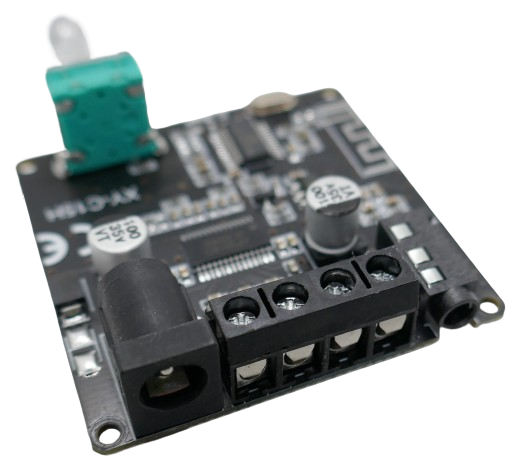
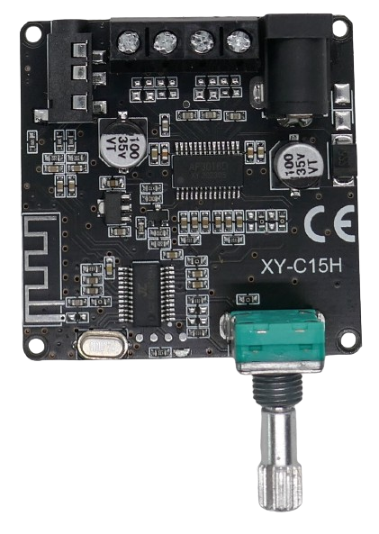
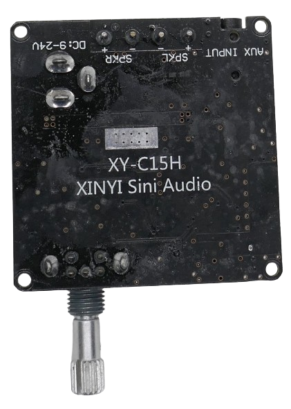

# XY-C15H (20W)

> 8-24V 15W Stereo Amplifier With Bluetooth 5.0

This small breakout board combines *Bluetooth* reception with a digital 20W stereo amplifier and can be used to power a bluetooth sound box.

The board comes with a pre-soldered rotary encoder:

* **Volume:** turn the rotary encoder to the left or right to adjust the output *volume*.
* **Play/Pause:** short-press the encoder knob
* **On/Off:** long-press the encoder knob

## Technical Data

| Item               | Description                                  |
| ------------------ | -------------------------------------------- |
| Power Supply       | 9-24V                                        |
| Speaker Impedance  | 4-16 Ohm                                     |
| Amplifier              | 2x20W |
| Chip  | *AP3016D* | 
| Audio Input  | via Bluetooth and auxiliary 3.5mm cinch connector |
| Audio Output | 2x speaker terminals, 3.5mm cinch headphone jack  |
| Bluetooth Distance | <15 Meter                                    |
| Chip  |  *AC23C0* from *JL* ([Zuhai Jie Li](https://www.zh-jieli.com/))|
| Size               | 47x67x18mm                              |

> [!CAUTION]
> When using *4Ohm* speakers, input voltage must not exceed *12V*.

### Amplifier

This board uses the *Chinese AP3016D* amplifier chip. As often with these chips, no datasheet is available.

Typically, *cloned amplifiers* rebuild the features of well-known amplifier chips, i.e. *TPA31110* from *Texas Instruments*.

## Power Supply

Due to its amplifier power, the board cannot be directly powered by *USB*. It requires a voltage in the range of *9-24V* (for *4Ohm* speakers *9-12V*). 

> [!CAUTION]
> Make sure your power supply is capable of driving the board. It should at least be able to provide *6A*.

## Speaker

Two speakers can be connected to screw terminals. 

> [!CAUTION]
> Due to the relatively high amplifier output, make sure you connect speakers capable of delivering the audio, or keep the volume low.

## Bluetooth Connectivity

After power on, the board is in *bluetooth pairing mode* and visible for bluetooth devices such as your smartphone. 

There is no pairing code or button press required for pairing. Once paired, the paired device can play music through the amplifier.

> [!TIP]
> All *Bluetooth* functionality is provided by a *AC...* chip manufactured by [Zuhai Jie Li](https://www.zh-jieli.com/). This company produces cheap chips for a wide variety of consumer products.

## Heat Sink

The board comes with no heat sinks. For extended operation at high volume levels, a *heat sink* may be required on the *back side* of the board. There is a designated silver-colored area on the back, close to the amplifier chip. This is where to place the *heat sink*.

## Operation

A half-round operation wheel controls *volume* and *pause/play*:

* **Volume:** turn the half-wheel to the right or left to control volume.
* **Play/Pause:** press the half-wheel to toggle between *play* and *pause*.

The screw terminals are labeled on the backside:

> Tags: Audio, 15W, Amplifier, Stereo, Bluetooth, XY-P15W, TPA3110, AC23C0

[Visit Page on Website](https://done.land/components/audio/amplifier/bluetooth/xy-c15h(20w)?328947041122242123) - created 2024-04-21 - last edited 2024-04-21
