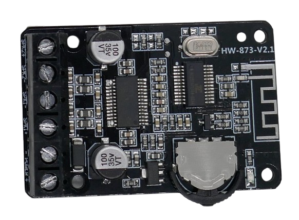

# XY-P15W (15W)

> 8-24V 15W Stereo Amplifier With Bluetooth

This small breakout board combines *Bluetooth* reception with a digital 15W stereo amplifier and can be used to power a bluetooth sound box.

## Technical Data

| Item               | Description                                  |
| ------------------ | -------------------------------------------- |
| Power Supply       | 8-24V                                        |
| Speaker Impedance  | 4-16 Ohm                                     |
| Amplifier              | 10W/15W/20W models available |
| Chip  | *TPA3110* from *Texas Instruments* | 
| Bluetooth Distance | <15 Meter                                    |
| Chip  |  *AC23C0* from *JL* ([Zuhai Jie Li](https://www.zh-jieli.com/))|
| Size               | 50x33x12mm                                   |

The amplifier power depends both on supplied input voltage and speaker impedance:

| Speaker Impedance (Ohms) | Supply Voltage (V) | Power |
| --- | --- | --- |
| 4 | 12 | 2x16W |
| 8 | 12 | 2x10W |
| 4 | 16V | 2x15W |
| 4 | 20V | 2x20W |
| 4 | 24V | 2x30W |

> [!CAUTION]
> At output levels of *>20W*, additional *heat sinks* must be added.

## Power Supply

Due to its amplifier power, the board cannot be directly powered by *USB*. It requires a voltage in the range of *8-24V*. Input voltages *>26V* will destroy the audio amplifier.

> [!CAUTION]
> Make sure your power supply is capable of driving the board. It should at least be able to provide *30W*.

## Speaker

Two speakers can be connected to screw terminals. There is no headphone jack as this is a powerful amplifier board designed for external speakers only.

> [!CAUTION]
> Due to the relatively high amplifier output, make sure you connect speakers capable of delivering the audio, or keep the volume low.

## Bluetooth Connectivity

After power on, the board is in *bluetooth pairing mode* and visible for bluetooth devices such as your smartphone. The board is advertised as *XY-P15W*.

There is no pairing code or button press required for pairing. Once paired, the paired device can play music through the amplifier.

> [!TIP]
> All *Bluetooth* functionality is provided by a *AC...* chip manufactured by [Zuhai Jie Li](https://www.zh-jieli.com/). This company produces cheap chips for a wide variety of consumer products.

## Operation

A half-round operation wheel controls *volume* and *pause/play*:

* **Volume:** turn the half-wheel to the right or left to control volume.
* **Play/Pause:** press the half-wheel to toggle between *play* and *pause*.

The screw terminals are labeled on the backside:

## Data Sheets
[TPA3110 Amplifier](materials/tpa3110_datasheet.pdf)

> Tags: Audio, 15W, Amplifier, Stereo, Bluetooth, XY-P15W, TPA3110, AC23C0

[Visit Page on Website](https://done.land/components/audio/amplifier/bluetooth/xy-p15w(15w)?803539041113245750) - created 2024-04-08 - last edited 2024-04-13
