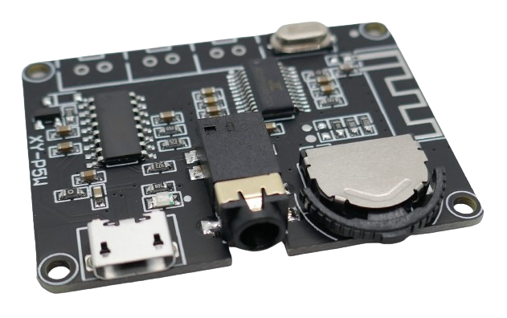
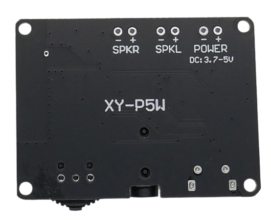
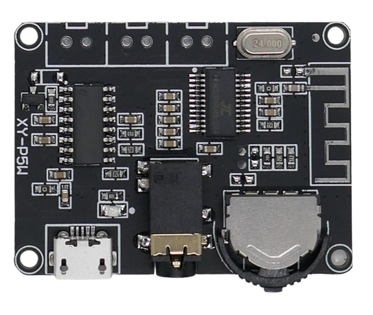
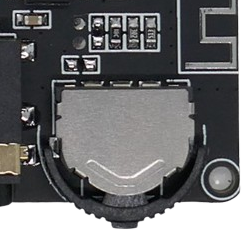

# XY-P5W (5W)

> 3.7-5V 5W Stereo Amplifier With Bluetooth Connectivity

This small breakout board combines *Bluetooth 5.0* reception with a digital 2x5W stereo amplifier. It is based on the **5W** *PAM8406* digital power amplifier module.

> [!NOTE]
> There are  *many variations* of this board available with subtle differences in board design and functionality. Some even ship with separate external remote control.

## Where To Use

This board comes with everything needed to built a small bluetooth-ready sound box. The output volume is moderate but sufficient (2x5W). 

## Technical Data

| Item               | Description                                  |
| ------------------ | -------------------------------------------- |
| Power Supply       | Micro USB, one lithium cell, external 3.7-5V supply |
| Audio Amplifier              | 2x5W @ 2Ohm Speakers |
| Speakers | 2x 2-8Ohm |
| Speaker Impedance  | 2-8 Ohm (5W@2Ohm, 3W@4Ohm, 2W@8Ohm)           |
| Audio In           | Headphone Jack 3.5mm                         |
| Audio Frequency | 20-20kHz |
| Bluetooth Distance | <15 Meter, SNR >= 90dB                       |
| Size               | 43x33x5mm                                   |

## Power Supply

The board can be supplied with power in many ways due to its wide voltage range:

* **Micro-USB:** connect a common smartphone charger via USB (2A or better)
* **Lithium battery:** power the board with one common LiIon or LiPo cell (4A)
* **External:** connect to car voltage or any other power supply (3.7-5V)

Insufficient power supplies negatively affect sound quality.

### Using Lithium Battery

The board power can be supplied by a single *LiIon* or *LiPo* battery. The board automatically turns off when the input voltage drops below *3.3V*, protecting lithium batteries from over-discharge.

Once over-discharge protection has kicked in and automatically turned off the board, after recharging the battery power on the board again. To *unlock* the protection, it may be necessary to connect the *on* pins for at least *2 seconds* (if you connected an *on/off* push button to this port, press the button for >2sec.)

> [!TIP]
> When you power this board via battery, and the battery is approaching its empty state, the voltage falls to a level where the board starts making "sizzling" noises. This can be used as an indicator to recharge batteries before over-discharge protection kicks in.

The lithium battery can be directly charged via the *Micro USB* connection.

> [!TIP]
> Never operate lithium batteries without *battery protection board* (BMS): check your battery to find out whether it has a built-in *BMS*.

## Audio Out

Audio can be played to headphones via 3.5mm headphone jack, or by connecting two speakers with common ground to the speaker pins.

Volume is controlled by a half-rounded switch:

* **Volume:** turn switch towards the USB connector to lower volume, and turn it to the other direction to raise it.
* **Play/Pause:** press the button to toggle *play* and *pause*.

> [!TIP]
> Behind the volume control switch, the breakout board comes with two solder pads. Connecting these pads for >2s toggles between *on* and *off*.

## Bluetooth Connect

After supplying power, a *blue LED* starts blinking. The device is now in bluetooth *pairing mode* and can be detected by i.e. your smartphone.

Once a bluetooth connection is made and the board is coupled, the *blue LED* stops blinking and lights constantly.

When music is played back, the *blue LED* flashes slowly.

> [!TIP]
> All *Bluetooth* functionality is provided by a *AC...* chip manufactured by [Zuhai Jie Li](https://www.zh-jieli.com/). This company produces cheap chips for a wide variety of consumer products.

## Data Sheet

[PAM8406 5W Audio Amplifier](materials/pam8406_datasheet.pdf)

> Tags: Audio, 5W, Amplifier, Stereo, Bluetooth, XY-P5W, PAM8406

[Visit Page on Website](https://done.land/components/audio/amplifier/bluetooth/xy-p5w(5w)?582406041613240005) - created 2024-04-04 - last edited 2024-04-13
