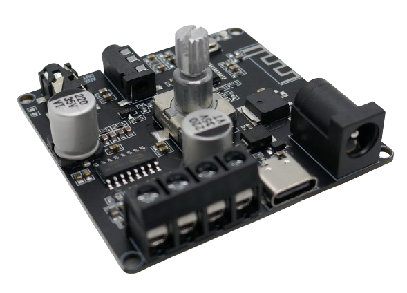
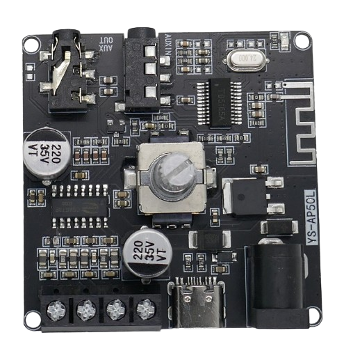

# XS-AP50L (50W)

> 12-24V 50W Stereo Bluetooth Audio Receiver Board

This board is a *Bluetooth* audio receiver with a powerful stereo audio amplifier that can deliver up to *2x50W* (at *24V* and with *4 Ohm* speakers).

At *12V* and with *8 Ohm* speakers, the board delivers *2x15W*.

> [!TIP]
> Audio can also be supplied via 3.5mm analog in and via *USB C*. There is a app available from the vendor that can optionally be used to control the device.

## Technical Data

| Item               | Description                                  |
| ------------------ | -------------------------------------------- |
| Power Supply       | 12-24V, 60W |
| Audio Amplifier     | 2x50W |
| Amplifier Chip | CS8673 (similar to TPA3116) |
| Speaker Impedance  | 4-16 Ohm, 30-200W           |
| Audio In           | Headphone Jack 3.5mm                         |
| Bluetooth Standard | 5.1 |
| Bluetooth Distance | <15 Meter                       |
| Size               | 52x52x20                                   |

The board comes with *power reverse connection protection*, *short circuit protection*, and self recovery after overheating.

> [!CAUTION]
> If the supplied power is less than *60W*, you may still use it for low volume settings. When power supply becomes insufficient, audio quality will deteriorate.

### Amplifier

The amplifier used is the *CS8673* which seems to be a clone of the *TPA3116* but with similar specs.

The original datasheet is available in *Chinese* only.

### Audio Power

The actual maximum audio power depends on supply voltage and speaker impedance:

| Voltage (V) | Impedance (Ohm) | Max Power (W) |
| --- | --- | --- |
| 12 | 8 | 2x15W |
| 12 | 4 | 2x20W |
| 15 | 8 | 2x18W |
| 15 | 4 | 2x30W |
| 19 | 8 | 2x32W |
| 19 | 4 | 2x45W |
| 24 | 8 | 2x40W |
| 24 | 4 | 2x50W |

## Power Supply

Power is supplied via a male cinch connector (12-24V).

## Audio In

Typically, this board receives audio information wireless over the air via *Bluetooth 5.0*.

Audio can also be fed into the board either using the 3.5mm jack marked *AUX IN*, or via the *USB C*-connector (that can be used to supply (*U Disk* or *USB Sound Card*).

## Audio Out

One of the 3.5mm jacks on the board is labeled *AUX OUT* and can be used to connect headphones.

Screw terminals are provided to connect two speakers (left and right).

## Volume Control

In the center of the board, a *rotary encoder* can be used to adjust volume.

The rotary encoder can also be pressed:

* **Play/Pause:** short press the rotary encoder
* **On/Off:** long press the rotary encoder

> [!TIP]
> This board can also be controlled via the *YS Audio App*.

## Bluetooth Connect

After supplying power, the device is in bluetooth *pairing mode* and can be detected by smartphone etc.

> Tags: Audio, Amplifier, 50W, Stereo, Bluetooth, Receiver, YS-AP50L

[Visit Page on Website](https://done.land/components/audio/amplifier/bluetooth/ys-ap50l(50w)?251746041214242743) - created 2024-04-14 - last edited 2024-04-14
