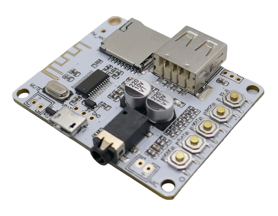
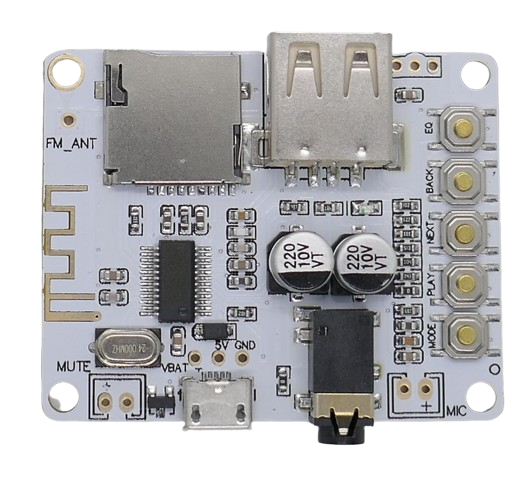
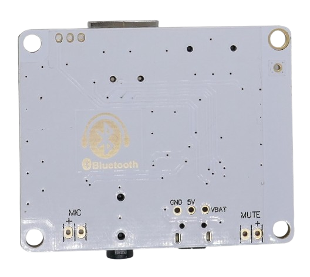

# YTX888 (0W)

> 5V Bluetooth Audio Receiver Board With SD-Card Reader And FM Radio Reception

This board is a pure *Bluetooth 2.1* audio receiver and comes without an audio amplifier. Optionally, it can be fitted with an *infrared receptor* and controlled by an external remote control.

Use it with the headphone jacks, or connect the stereo output to a dedicated external audio amplifier.

This module can be found by the names **YTX888** and **A7-004**.

> [!CAUTION]
> This board apparently uses a very old bluetooth 2.1 standard with limited RF power (1mW) and a distance of 1m indoor and 10m outdoor at 2.1MBit/s. Current bluetooth 5 standards send with up to 100mW and distances of 40m indoor and 200m outdoor at 50MBit/s. There may be board versions available that updated the bluetooth standard, however documentation does not tell.

## Where To Use

This board handles *Bluetooth* audio reception and comes with built-in SD Card Reader slot. Since it is using the old *Bluetooth 2.1* standard, the wireless distance is low, especially indoors. Use it only if you keep the sending bluetooth device (coupled smartphone) in immediate proximity (1-2m).

It can serve well in *DIY Bluetooth Sound Boxes* where you choose to use a separate dedicated *audio amplifier*.

## Where To Avoid

If you are looking for a one-stop solution to creating a simple *Bluetooth* sound box, go get the integrated boards that come with *2x5W* or *2x15W* audio amplifiers on-board (*XY-P5W* or *XY-P15W*).

If you need to bridge larger distances, get a board with *Bluetooth 5* standard.

## Technical Data

| Item               | Description                                  |
| ------------------ | -------------------------------------------- |
| Power Supply       | Micro USB or *5V*, when *VBAT* pin present, also 3.7-4.2V |
| Audio Amplifier              | no amplifier |
| Speaker Impedance  | no speaker connections, just pins to connect to external amplifier           |
| Audio In           | Headphone Jack 3.5mm                         |
| Bluetooth Distance | <10m                       |
| Supported Sound File Formats | MP3, WMA, WAV, FLAC, APE |
| Size               | 40x50x10mm with M3 mounting holes           |

## Power Supply

The board can be supplied with power via *Micro USB* or by supplying *5V* to the power pins on the backside of the board.

Newer boards have a third solder pad labeled *VBAT* that can be used to directly power the board from a single *LiIon* or *LiPo* battery (3.7-4.2V).

## Audio In

The board supports three different audio input souces:

* **Bluetooth:** pair the board with your smartphone or other source of audio
* **SD Card:** insert a SD Card into the built-in *SD Card Reader* (*Micro-SD* card format)
* **USB Stick:** use a *USB-A Stick*

## Audio Out

Audio can be played to headphones via 3.5mm headphone jack, or by connecting the stereo output to an *external amplifier*.

> [!CAUTION]
> You cannot directly connect speakers to this board as it does not have a built-in audio amplifier.

## Operation

The board comes with five labeled buttons:

* **MODE:** Selects the audio source
* **PLAY:** Toggles *play* and *pause*
* **NEXT:** Short press: *next title* or *next radio station*. Long press *increase volume*
* **BACK:** Short press: *previous title* or *next radio station*. Long press *decrease volume*
* **EQ:** Equalizer: *Classic*, *Jazz*, *Rock*, *Bass*, *Pop*, *Normal*

### FM Radio Reception

To use the built-in FM Radio receiver, make sure you added a wire to *FM_ANT* to serve as antenna. Without antenna, only very strong local FM stations can be received.

> [!TIP]
> When a headphone is connected, its wire serves as antenna.

To set up FM radio reception, switch to *radio mode* and press *PLAY* for auto-tuning. Press *EQ* to store stations.

## Additional Connectors

There are additional solder pads marked:

* **MIC:** connect a microphone as additional audio source
* **MUTE:** this port is low when no audio is played back and can be used to place external amplifiers into standby mode
* **FM_ANT:** connect a wire to serve as dedicated *FM Radio Reception* antenna
* Unmarked next to *USB A*: three pin connector can connect *infrared diode* (some packages ship with external IR remote control)

## 3D-Print

[Casing](https://www.thingiverse.com/thing:4462115)

> Tags: Audio, Stereo, Bluetooth, Receiver, A7-004

