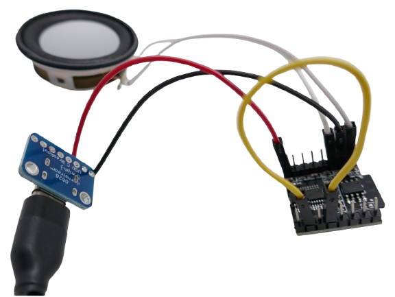
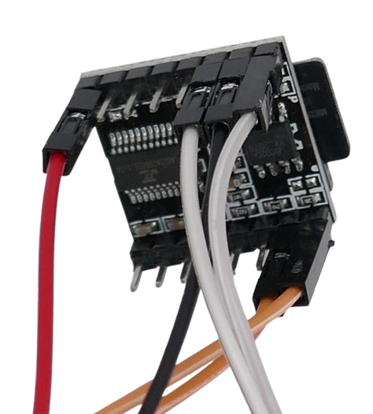
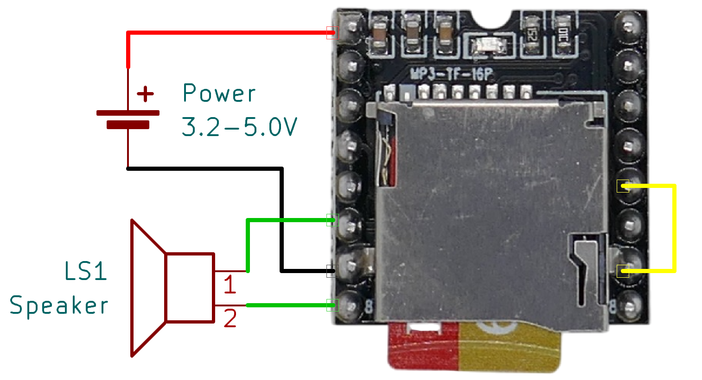
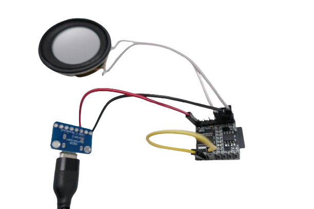
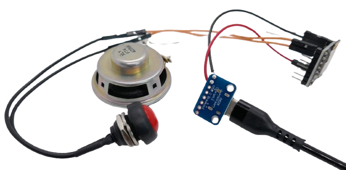
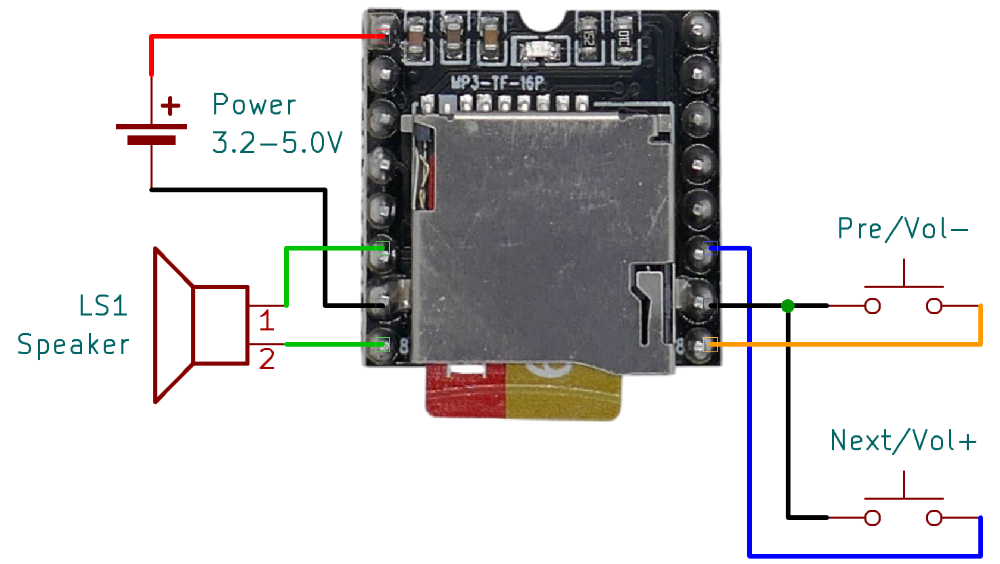
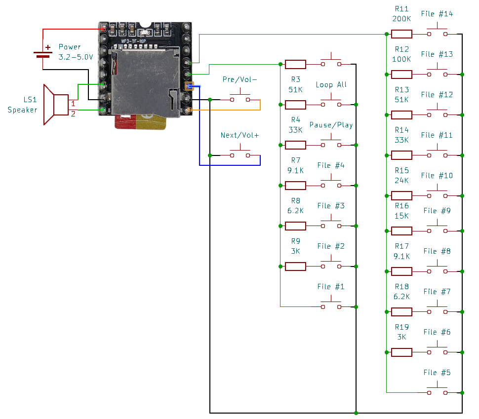

# Manually Controlling DFPlayer Mini

> Controlling DFPlayer Mini with Push Buttons and No Microcontroller

You don't need a microcontroller to use *DFPlayer Mini*. A simple wire is enough to get started: when you connect `KEY_1` to `GND`, *DFPlayer Mini* will automatically play and seamlessly loop the first audio file copied to your SD card.

Adding one or more push buttons to the four exposed GPIOs provides increasing control. At most, you can directly play, autoplay, or loop up to 14 audio files or sound effects.

If **GPIO Mode** isn't sufficient for your needs, you can switch to **UART Mode**, which allows a microcontroller to send more complex commands to *DFPlayer Mini*.

## Overview

*DFPlayer Mini* supports two control modes:

- **GPIO Mode:**     
  Uses four GPIOs (`IO_1`, `IO_2`, `KEY_1`, and `KEY_2`) that can be connected to `GND` to trigger actions.  
    - `IO_1` and `IO_2` are *digital* inputs and respond to both *short* and *long* presses.  
    - `KEY_1` and `KEY_2` are *analog* inputs that recognize up to 10 different resistance values, allowing multiple button functions on a single pin.      

  In this mode, you need no micro controller and other external components.

- **UART Mode:**    
  Uses a *serial interface* (`RX` and `TX`) to send commands from a microcontroller, enabling more advanced control. The `BUSY` pin provides feedback on whether a track is currently playing or paused.

This guide focuses on **GPIO Mode**, demonstrating how to use simple wires, push buttons, and resistors to control *DFPlayer Mini*.

Understanding how *DFPlayer Mini* identifies audio files in **GPIO Mode** is crucial because it works differently from **UART Mode**, affecting playback sequence, autoplay, and direct file access.

### How DFPlayer Identifies Audio Files

In **GPIO Mode**, *DFPlayer Mini* relies on the **FAT (File Allocation Table)** to assign ID numbers to audio files. When powered on, *DFPlayer Mini* scans the FAT structure of the microSD card and assigns track IDs based on the order in which the files appear in the table.

This means that **playback order and direct track selection are determined solely by the order in which files were copied to the SD card**. The file name and storage location (root folder or subfolder) have no effect in **GPIO Mode**.

For example, `0001.wav` will not necessarily play first **unless it was the first file copied** to the SD card.

## AutoPlay Loop Mode

*DFPlayer Mini* supports a little-known but highly useful **loop mode** that **automatically starts playback** and then **seamlessly repeats** an audio file.

**This mode is available only for the first file copied onto your microSD card.**

To activate this mode, connect `KEY_1` to `GND`:

Once powered on, *DFPlayer Mini* will automatically start playing the file in a continuous loop.

> [!TIP]  
> In this special loop mode, the audio file loops **seamlessly**, without any noticeable gap—perfect for sound effects.

## Single Button Mode

For more control, add a push button between `IO_1` and `GND`:

This enables the following controls:

- **Short Press:** Play the next audio file  
- **Long Press:** Decrease volume  

## Two-Button Mode  

Adding a second push button between `IO_2` and `GND` introduces reverse functionalities:

- **Short Press:** Play the previous audio file  
- **Long Press:** Increase volume  

## Full-Control Mode  

Using `KEY_1` and `KEY_2` allows direct access to one of the first 14 audio files copied to your SD card. Additional features like *play/pause* and *loop all* become available.

### Important Considerations  

- **Analog Inputs:** `KEY_1` and `KEY_2` are **analog** inputs that can differentiate **10 different resistance values**. To use multiple buttons on a single pin, you must connect resistors in series with each button.  
- **Firmware Differences:** Various *DFPlayer Mini* versions exist, often with different firmware. This means that key assignments (and required resistor values) may vary between versions. Testing is recommended to confirm the correct functionality for your specific module.

### Maximum Button Control  

Here’s the **full control setup** using **22 push buttons and 18 resistors** (as tested on my version of *DFPlayer Mini*):  

You'll notice some overlapping functionalities, and some features are rarely needed (such as selecting input mode). You don’t have to use all available options. In my setup, I omitted redundant buttons and those for selecting the audio source or play mode:

With this setup:  

- **14 push buttons** allow direct access to the first 14 audio files on the SD card.  
- The remaining **4 buttons** handle volume control, track navigation (*next/previous*), *pause*, and *loop all* mode.  

> [!TIP]  
> To loop a specific file, simply keep the assigned button pressed for that file.

> Tags: Push Button, Loop, Audio File, Playback

[Visit Page on Website](https://done.land/components/audio/playback/dfplayermini/manualcontrol?127538021515254741) - created 2025-02-14 - last edited 2025-02-14
