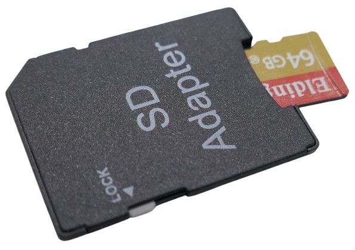
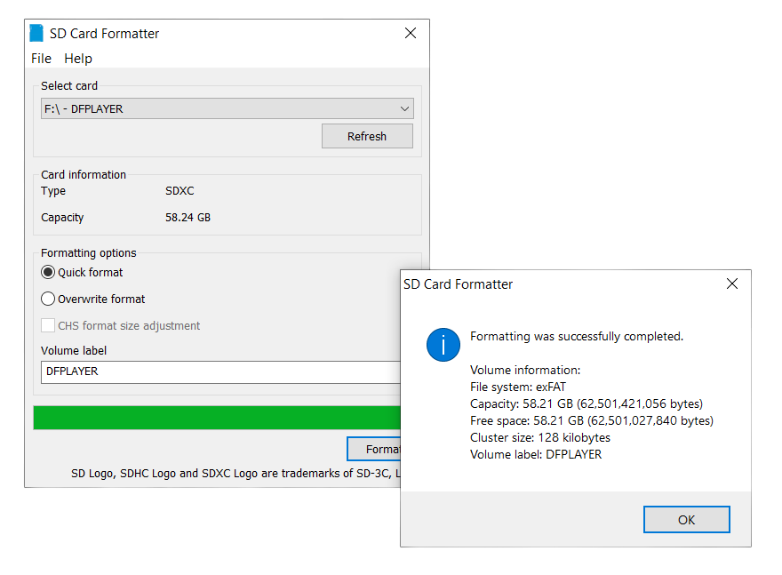
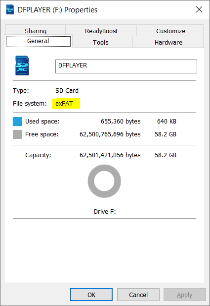
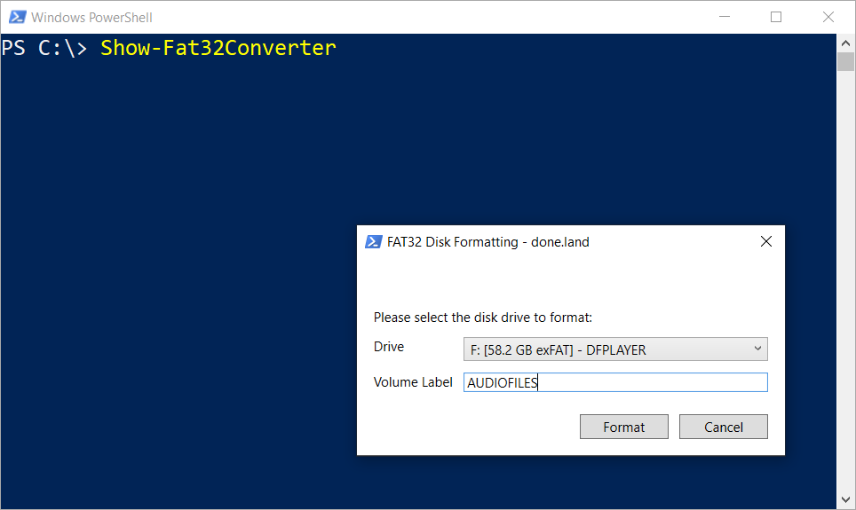

# Preparing SD Card for DFPlayer Mini

> Format the SD Card and Add Audio Files in a DFPlayer Mini-Compliant Structure

The first step in using the *DFPlayer Mini* is preparing an SD card that can be read by the module.


By the end of this article, you will have a *compliant* SD card with audio files on it, ready to be recognized by the *DFPlayer Mini*.

## Overview

The primary audio source for the *DFPlayer Mini* is its internal SD card reader. The Micro SD card inserted into the reader must meet a few requirements for the *DFPlayer Mini* to recognize it:

* **Size:** *DFPlayer Mini* supports Micro SD cards with a maximum capacity of *32GB*. If your SD card is larger than that, *DFPlayer Mini* cannot read it.
* **Format:** The Micro SD card must use the `FAT16` or `FAT32` file system. If the card is formatted with a different file system, such as the popular `exFAT`, *DFPlayer Mini* won’t be able to read it.
* **Audio Format:** *DFPlayer Mini* supports three audio file formats: `MP3`, `WAV`, and `WMA`. However, your audio files must also use the correct bit rates and encodings. Otherwise, *DFPlayer Mini* will not be able to process the audio files.
* **Structure:** Audio files must be organized in a specific folder structure on the Micro SD card. If this structure is not followed, *DFPlayer Mini* may fail to find your audio files or may not play the correct files.

## 1. Health-Checking the SD Card

If you purchased a brand-new Micro SD card, chances are you are already set to go: most Micro SD cards come pre-formatted with `FAT32`.

However, if your SD card has been used before in other projects, it may be configured in a way that prevents *DFPlayer Mini* from recognizing it. It could be using an incompatible file system, or its storage space may have been partitioned into multiple separate drives.

To reset an SD card to factory defaults, follow these steps:

1. Insert the Micro SD card into your PC. If the Micro SD card doesn't fit, use an SD card adapter. If your PC doesn't have an SD card reader slot, you can use an external SD adapter connected via USB.

    

2. Open *Windows Explorer* and identify the drive corresponding to your SD card.

    

### Remove Partitions

If you see *multiple* new drives after inserting the SD card into your PC, the card has been *partitioned*. Even if you see just one drive, additional (hidden) partitions might still exist.

One simple way to ensure there are no partitions on your SD card is to use the free [SD Card Formatter](https://www.sdcard.org/downloads/formatter/sd-memory-card-formatter-for-windows-download/) from the *SD Card Consortium*.

> [!NOTE]  
> This tool is legitimate and comes from a trusted authority, but it lacks a valid digital signature and requires a full *Windows Installer* installation.

  

> [!NOTE]  
> Changing drive partition configuration requires *Administrator* privileges.

Once the *SD Card Formatter* has formatted the drive, it will contain just a single partition. However, the *SD Card Formatter* won’t let you choose the file system it uses. On SD cards larger than *4GB*, it defaults to `exFAT`, which is unsuitable for *DFPlayer Mini*.

### Switch to `FAT32` File System

To check the current file system used by your SD card, right-click its drive icon in *Windows Explorer* and choose `Properties`.



Verify that the SD card is using the *FAT32* file system. If it shows *exFAT* (like in the picture), you need to reformat the SD card with the `FAT32` file system. *DFPlayer Mini* (like most DIY components) cannot read `exFAT`.

#### SD Cards Up to 4GB

SD cards up to a size of *4GB* can be directly converted to `FAT32` using the built-in tools in *Windows*:

1. Open *Windows Explorer*. Identify the drive that represents your SD card. Right-click on the SD card drive in *File Explorer* and select `Format...`:

    

2. Select `FAT32` as the *File system*, check the box for `Quick Format`, and then click `Start`. The formatting begins, and after a few seconds, the SD card is initialized with the `FAT32` file system.

#### SD Cards Larger Than 4GB

SD cards with a capacity greater than *4GB* [cannot be converted to `FAT32`](https://done.land/components/data/storage/permanent/onsdcards/#converting-sd-card-media-to-fat32) using the native *Windows* system tools. You are then limited to the options `exFAT` and `NTFS`.

There is no technical reason for this limitation, so you can work around it with third-party tools (e.g., [fat32format](http://ridgecrop.co.uk/index.htm?guiformat.htm)). In my tests, however, all tools I found were unreliable and did not work on my machine. I was unable to find the reason.

As a solution, I created a new PowerShell command named `Show-Fat32Converter` that opens a graphical dialog and lets you quickly format any removable drive of any size with the `FAT32` file system in just a few seconds:


1. **Get DoneLandTools:**    
   [Download](https://done.land/tools/powershell/#install-donelandtools) the free *PowerShell* module [DoneLandTools](https://www.powershellgallery.com/packages/DoneLandTools/1.3.5):     
   ````
   Install-Module -Name DoneLandTools -Scope CurrentUser
   ````
2. **Re-Format SD Card:**    
    Open a *PowerShell* console, then run this command:    
    ````
    Show-Fat32Converter
    `````
    This opens a dialog that lets you [convert any SD card media](https://done.land/tools/powershell/#formatting-sd-cards) to `FAT32`.
    


   

3. *DoneLandTools* can be removed as easily as it was added:    
    ````
    Uninstall-Module -Name DoneLandTools
    ````
### Testing SD Card

The final step should be a quick test to ensure it works correctly. This test is important: SD cards can wear out over time, and it is not uncommon for older or low-quality SD cards to malfunction.

1. On your PC, copy a number of files (e.g., images, videos, or audio files) onto your SD card.
2. Eject the SD card, wait a moment, and then re-insert it.
3. Copy the files from your SD card into a temporary folder. Open the files to ensure they are intact.

## 2. Copying Audio Files Onto the SD Card

Next, copy the audio files you want *DFPlayer Mini* to play to your Micro SD card. You have several options for naming and organizing them.

### File Naming

Audio file names must start with a three- or four-digit number:

* **Prefix:** *DFPlayer Mini* only looks at the file name *prefix*, which must be numerical. The remainder of the file name is ignored.
* **Number of Digits:** *DFPlayer Mini* expects either **three** or **four** digits, depending on *where* you store the file.
* **Extension:** *DFPlayer Mini* automatically looks for the file extensions *mp3*, *wav*, and *wma*. So, a file can be named `0001.mp3`, `0023.wav`, `1097 my song.mp3`, `0345 another song.wma`, and so on.

<details><summary>8.3 Filenames</summary><br/>

Using a number as the sole file name ensures that your files will always stick to the required *8.3* naming scheme: *DFPlayer Mini* can only work with file names no longer than 8 characters (plus 3 characters for the file extension).

You *can* add additional information after the prefixing number, but this most likely extends the file name beyond 8 characters. Here is an example of an SD card with a few sound effects in the subfolder `\MP3`:


````
PS C:\> dir f:\ -Recurse -File


    Directory: F:\MP3


Mode                 LastWriteTime         Length Name
----                 -------------         ------ ----
-a----          9/6/2022   2:30 AM        2415454 0001_fir1.wav
-a----         3/22/2024   3:41 AM         243488 0002_pressluft.wav
-a----         3/22/2024   3:41 AM         285662 0003 624 Land.wav
-a----         3/22/2024   3:41 AM         286826 0004 624 Stadt.wav
````

The file `0003 624 Land.wav` is longer than 8 characters, which is perfectly fine: the `FAT32` file system automatically generates short *8.3-compliant* file names in the background. If you use long file names, always ensure the *short 8.3 file names* still adhere to the strict numbering scheme *DFPlayer Mini* requires:


````powershell
$sfs = New-Object -ComObject Scripting.FileSystemObject

Get-ChildItem -Path f:\ -Recurse -File | 
ForEach-Object {
  [PSCustomObject]@{
    'Long Name' = $_.Name
    '8.3 Name' = $sfs.GetFile($_.FullName).ShortPath | Split-Path -Leaf
  }
}
````

When you run this code (assuming your SD Card is drive `F:\`), this is the result:

````
Long Name          8.3 Name    
---------          --------    
0001_fir1.wav      0001_F~1.WAV
0002_pressluft.wav 0002_P~1.WAV
0003 624 Land.wav  000362~1.WAV
0004 624 Stadt.wav 000462~1.WAV
````
*DFPlayer Mini* sees the name in the column *8.3 Name*, while you can work with the long name on your PC.

</details>

Files can be stored at these locations on your SD Card:

| Location        | File Numbering     | Example            | Remarks                          | 
|-----------------|--------------------|--------------------|----------------------------------|
| Root Directory  | `0001.mpg`-`3000.mpg` | `play(1)`         | files are played in the sequence they were copied. | 
| `\MP3`          | `0001.mpg`-`3000.mpg` | `playMp3Folder(19)` | Simple setup                    | 
| `01`-`99`       | `001.mpg`-`255.mpg` | `playFolder(8, 12)`  | Allows categories               | 
| `\ADVERT`       | `0001.mpg`-`3000.mpg` | `playAdvertisement(1)` | Only for playing announcements/effects | 

In a nutshell:

* use the folder `\MP3` by default if you plan to control *DFPlayer Mini* via microcontroller and UART. 
* switch to numbered subfolders ( `\00`-`\99`) if you have a large number of files that you'd like to better organize into categories.

When you use push buttons to control *DFPlayer Mini* directly (without microcontroller), the folder structure is irrelevant. The buttons play *all* audio files - regardless of storage location - in the order in which they were originally copied to the SD card.


<details><summary>How DFPlayer Mini Searches For Audio Files On SD Cards</summary><br/>

In the root directory of your SD Card, you can store up to 3000 audio files. Their names must start with a *four-digit number*.

* **File Sequence:** *DFPlayer Mini* reads file entries in the order they appear in the file allocation table (FAT), so the playback order is determined by the order **in which you copied the files to the SD card**. Therefore, you must copy the files in the exact order in which you later want to play them back.
* **Direct Access:** You cannot reliably access individual files, i.e., ask *DFPlayer Mini* to play a *specific file* in this folder, because *DFPlayer Mini* uses the file allocation table and not the file name to identify it. So, when you ask *DFPlayer Mini* to play file number *5* (`play(5)`), it plays the fifth file that was copied to the SD Card, not the file named `0005.mp3`.

#### Workaround

The strange internal file index that *DFPlayer Mini* uses for files in the root folder is no problem when you adhere to these rules:

* Make sure your audio file naming starts at `0001`. You don't need to copy 3000 files, but the files you do copy need to use consecutive numbers.
* Sort the files by name, then copy the files in this order to your SD Card

This way, the file names and the copy order match, and you can later reliably select and play files by their name.

Here is a quick suggestion on how you can perform the copy job in *PowerShell*:


````powershell
Get-ChildItem -Path c:\path_to_audio_files -File |
  Sort-Object -Property Name |
  Copy-Item -Path e:\  # adjust drive letter of SD Card
````
### Subfolder `/MP3` (3000 Files)
When you create a subfolder named precisely `MP3`, this subfolder works exactly like the root folder and can hold up to 3000 files, however with this folder, you do not need to care about the copy order: *DFPlayer Mini* directly uses the file names for indexing, and when you later issue a `play(10)` command, it will play file `0010.mp3` (or `0010.wav` or `0010.wma`)

So the folder `MP3` is not limited to *.mp3* files despite its name.

### Numeric Folders (`/01` - `/99`, 255 Files each)
If you need to organize more than 999 audio files, or have special needs, you may use additional subfolders named `00`-`99`. 

Each subfolder can contain *3000* more files, however only the files `001` - `255` can be played directly (the UART commands use a *byte* to specify the file name).

The audio file names inside these subfolders must start with *three digits*, i.e. `001.mpg`, `002.wav`, `003 my song.mp3`, etc.

`playFolder(1, 5)` would play file `005.mp3` in folder `01`: `E:\01\005.mp3`.

### Effects Folder `/ADVERT`
The subfolder `/ADVERT` is a special-purpose folder that can be used for special effects, announcements, or advertisements (which coined the folder name): `playAdvertisement(1)` interrupts the currently playing track, plays the specified audio file from the `ADVERT` folder, **and then resumes** the original track.


</details>

## 3. Verifying Audio File Formats
With the SD Card prepared and audio files copied onto it, you are ready to test-drive *DFPlayer Mini*. 

Before you do, you may want to ensure that the audio files on your SD Card are using supported codecs and formats. 

### Supported Audio Formats

*DFPlayer Mini* can play back audio files in the formats *MP3*, *WAV*, and *WMA* **provided they are encoded in the correct way**:

| Format | Codec  | Bit Rate | Sample Rate | Channels | File Extension |
|--------|--------|----------|-------------|----------|---------------|
| **MP3**    | MPEG-1 Audio Layer III | 8 - 320 kbps | 8 kHz - 48 kHz | Mono, Stereo | `.mp3` |
| **WAV**    | ADPCM (IMA, Microsoft) | 32 - 384 kbps | 8 kHz - 48 kHz | Mono, Stereo | `.wav` |
| **WMA**    | Windows Media Audio | 32 - 192 kbps | 8 kHz - 48 kHz | Mono, Stereo | `.wma` |

So it is **not sufficient** to just select **any** *.mp3*, *.wav*, or *.wma* audio file. You **must** also ensure it uses the correct codec and is within supported bit rates.

This is especially important with *.wav* audio files: most use *uncompressed PCM* which is not supported by *DFPlayer Mini* due to its small buffer and the large audio file sizes. *.wav* files must use `ADPCM` which is a *compressed* format that reduces *16-bit uncompressed PCM* to *4-bit compressed* files, conveniently cutting down file sizes to *25%*.

### Examining Audio File Format

To ensure your audio files match the appropriate formats, you can use `Get-AudioFileInfo` from the PowerShell module *DoneLandTools* (see above). This tool internally uses the free open-source `ffprobe.exe` utility. On Windows, this utility is automatically downloaded if it is missing. On other operating systems, you can [download it manually](https://ffbinaries.com/downloads).

Here is PowerShell code which tests all your audio files on your SD Card (assuming the SD card is using drive letter `F:`):


````powershell
Get-ChildItem -Path f:\ -Recurse -File | 
  Get-AudioFileInfo | 
  Select-Object -Property Name, CodecDisplayName, SampleRate, BitsPerSample, SizeKB |
  Format-Table
````
 The result may look similar to this:

 ````
Name                      CodecDisplayName                SampleRate BitsPerSample SizeKB
----                      ----------------                ---------- ------------- ------
0006 AIRHORN_EQD.wav      PCM signed 16-bit little-endian      44100            16   10.4
0005 POLICE_WARNING.wav   PCM signed 16-bit little-endian      44100            16   40.7
0004 SIREN_PA20A_WAIL.wav PCM signed 16-bit little-endian      44100            16  411.6
0001 624 Stadt.wav        PCM signed 16-bit little-endian      48000            16  280.1
0002 624 Land.wav         PCM signed 16-bit little-endian      48000            16    279
0003 SIREN_2.wav          PCM signed 16-bit little-endian      44100            16   58.6
````
The result reveals that the audio files that I copied to my SD Card would not play in *DFPlayer Mini*: the *.wav* files use the uncompressed *PCM signed 16-bit little-endian* codec.

### Converting Audio File Format
If you come across audio files that are incompatible with *DFPlayer Mini*, you can use tools to convert audio files to a more appropriate format. 

For *.wav* files, for example, you can convert *PCM signed 16-bit little-endian* to *ADPCM IMA WAV*: while the sound quality remains the same, the now-compressed files require just 25% of their original storage space and can be played back in *DFPlayer Mini*.

Here is the new PowerShell command `Convert-AudioWavFile` from *DoneLandTools* that automatically converts all *.wav* audio files for you:


````powershell
Get-ChildItem -Path f:\ -Recurse -File | 
  Convert-AudioWavFile 
````
This command internally uses the free open-source utility `ffmpeg.exe`. On Windows, this utility is automatically downloaded if it is missing. On other operating systems, you can [download it manually](https://ffbinaries.com/downloads).

> [!IMPORTANT]
> **WARNING:** `Convert-AudioWavFile` is **very powerful** and performs an *in-place conversion*: any *.wav* files you select will be *replaced* with the new format. The old file is lost. If you'd like to keep the original file, add the parameter `-OutPath`,  and specify a new file name.

<details><summary>Batch-Converting Audio Files w/o Overwriting Original Files</summary><br/>

Here is a quick example that illustrates how you can batch-convert a large number of audio files without overwriting the original files.

In this scenario, I have copied the original audio files to a folder named `Audio`:


````
F:\
└───Audio
        0002 624 Land.wav
        0003 SIREN_2.wav
        0004 SIREN_PA20A_WAIL.wav
        0005 POLICE_WARNING.wav
        0006 AIRHORN_EQD.wav
        0001 624 Stadt.wav
````

This PowerShell code converts each file and places a *copy* in the new folder `MP3`, leaving the original files untouched:

````powershell
Get-ChildItem -Path f:\Audio -Recurse -File | 
Convert-AudioWavFile -OutPath {
  $parentFolder = $_.Directory.Parent.FullName
  $filename = $_.Name
  "$parentFolder\MP3\$filename".Replace('\\','\')
} 
````

And this is the result:

````
F:\
├───Audio
│       0002 624 Land.wav
│       0003 SIREN_2.wav
│       0004 SIREN_PA20A_WAIL.wav
│       0005 POLICE_WARNING.wav
│       0006 AIRHORN_EQD.wav
│       0001 624 Stadt.wav
│
└───MP3
        0002 624 Land.wav
        0003 SIREN_2.wav
        0004 SIREN_PA20A_WAIL.wav
        0005 POLICE_WARNING.wav
        0006 AIRHORN_EQD.wav
        0001 624 Stadt.wav
````

</details>
Once the conversion is complete, you can recheck the audio files to confirm that the codec has been changed successfully. As a bonus, the file sizes will have been significantly reduced — typically to about a quarter of their original size due to the compression process, making it more efficient for playback with *DFPlayer Mini*.


````
Name                      CodecDisplayName SampleRate BitsPerSample SizeKB
----                      ---------------- ---------- ------------- ------
0006 AIRHORN_EQD.wav      ADPCM IMA WAV         44100             4    3.1
0005 POLICE_WARNING.wav   ADPCM IMA WAV         44100             4   11.1
0004 SIREN_PA20A_WAIL.wav ADPCM IMA WAV         44100             4  104.1
0001 624 Stadt.wav        ADPCM IMA WAV         44100             4   65.1
0002 624 Land.wav         ADPCM IMA WAV         44100             4   65.1
0003 SIREN_2.wav          ADPCM IMA WAV         44100             4   15.1
````


> Tags: Audio, 3W, Amplifier, Mono, SD Card, MP3, WAV, WMA, Uart, FAT32, 8.3 File Name, ffmpeg, ffprobe, Audio Conversion, PCM, ADPCM

[Visit Page on Website](https://done.land/components/audio/playback/dfplayermini/preparesdcard?552913021514253708) - created 2025-02-13 - last edited 2025-02-13
