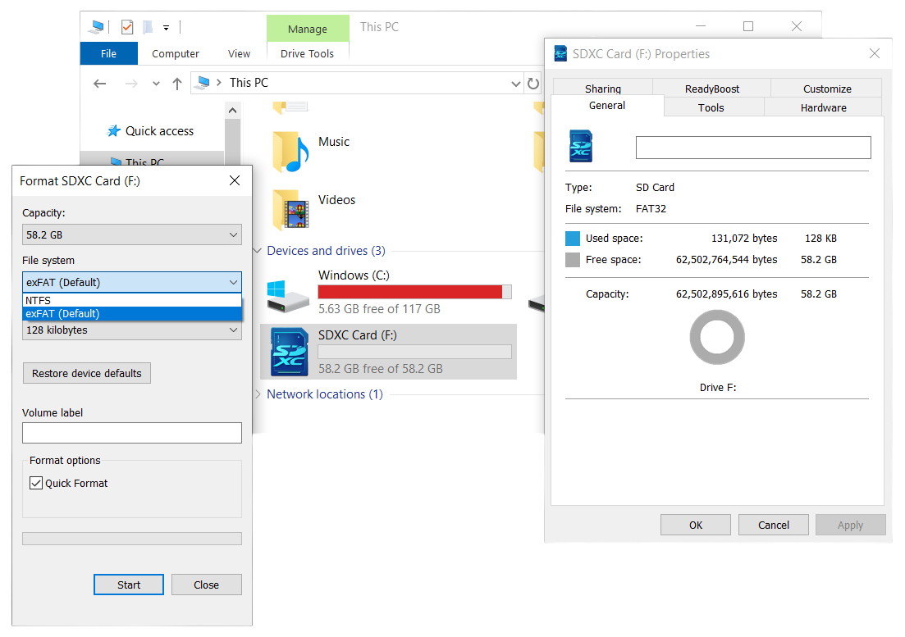
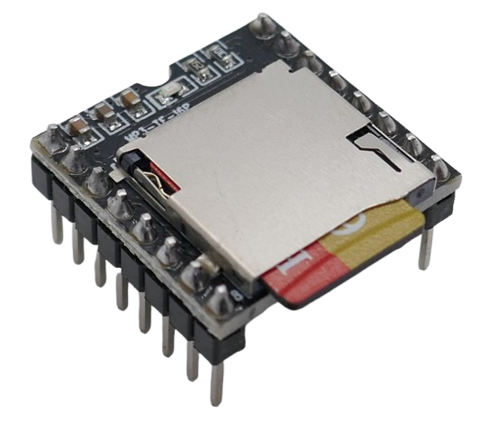

# DFPlayer Mini

> MP3 and WAV File MicroSD Playback Module with 3W Amplifier (3.2–5V)

The *DFPlayer Mini* is a compact, low-cost audio player module(*MP3*, *WAV*, *WMA*)  with an integrated microSD card slot and built-in *3W* mono amplifier, designed for standalone operation or microcontroller integration (e.g., with an ESP32 or Arduino).

It supports *UART* (serial) communication and button-based control, enabling easy playback of *MP3*, *WAV*, and *WMA* files at a *48kHz* sampling rate, stored on a microSD card.

> [!IMPORTANT]
> Many different variations of this board exist. If you plan to use a microcontroller to control this board via *UART*, make sure the version you order uses chips that are supported by your software libraries (see below for details).

## Overview

This module adds audio playback capability and can be operated stand-alone, or controlled by a microcontroller via *UART* (serial interface). 

The audio files can be conveniently stored on a Micro SD card (*FAT16* or *FAT32* file system, no *exFAT32* or others).

Its wide voltage range (*3.2V* - *5V*) lets you use this module with *3.3V* and *5V* microcontrollers. You can also power it with a *1S LiIon* (single cell).

| Item | Description |
| --- | --- |
| **Operating Voltage** | *3.2V–5V* |
| **Standby Current** | *~20mA* |
| **Max Current** | *~200mA* (*~50mA* when not using the built-in amplifier) |
| **Audio Formats** | *MP3, WAV, WMA* |
| **SD Card Support** | *MicroSD card, up to 32GB* |
| **File System** | *FAT16, FAT32* |
| **Audio File Limit** | *Up to 100 folders, 255 audio files per folder* |
| **Sampling Rate** | *8 / 11.025 / 12 / 16 / 22.05 / 24 / 32 / 44.1 / 48 kHz* |
| **DAC** | *24-bit (dynamic range 90dB, SNR 85dB)* |
| **Amplifier** | *3W mono* |
| **Stereo Support** | *Only in some module variants* |
| **Volume Control** | *30 levels* |
| **Equalizer Settings** | *6 presets* |
| **Standalone Control** | *Yes, via GPIO buttons* |
| **Microcontroller Support** | *Yes, via UART (default baud rate: 9600 bps)* |
| **ESPHome Support** | *Yes, see the **[dfplayer](https://esphome.io/components/dfplayer.html)** component* |

### Mono Amplifier
It includes a *3W mono amplifier* based on the *YX5200*, *8002*, or *MH2024K-24SS* chip, allowing directly connecting **one** small speaker with an impedance of *4Ω or 8Ω* and a rating of *3W* or higher.

The speaker output (`SPK1` and `SPK2`) is *bridge-tied load (BTL) mono*, meaning it combines left and right channels into a single mixed mono output.
### Stereo Output
*DFPlayer Mini* is designed for *mono audio*, although it can decode *MP3* and *WMA* audio formats in stereo.

The module provides separate `DAC_R` and `DAC_L` outputs, but these are intended for connecting external *stereo* amplifiers or headphones. However, both channels still output a duplicated mono signal rather than true stereo.

If you require *stereo* output, consider using a different module, such as the *DFPlayer* **Pro**.

### Audio Formats
*DFPlayer Mini* supports *MP3*, *WAV*, and *WMA* audio formats, but with certain restrictions:

| Format | Bit Depth | Sample Rate (kHz) | Encoding | Extension |
| --- | --- | --- | --- | --- |
| MP3 | 8-320 kbps | 44.1, 32, 24, 22.05, 16, 12, 11.025, 8 | CBR, VBR | *.mp3* |
| WAV | 16-bit | 32, 24, 22.05, 16, 12, 11.025, 8 | PCM *(uncompressed)* | *.wav* |
| WMA | 32-192 kbps | 8-48 | CBR | *.wma* |

Advanced audio formats such as *FLAC*, *AAC*, *OGG*, or *M4A* are not supported, and streaming audio is not an option.
## First Steps
To get started with the *DFPlayer Mini*, follow these steps:

1. **Wiring:** Familiarize yourself with the pinout and wiring options, then connect the hardware to a microcontroller.
2. **SD Card Media:** Prepare an SD card with test audio files. Ensure you follow the required file naming and folder structure. Also, confirm that your audio files are in a supported format. If unsure, use a tool like [Audacity](https://www.audacityteam.org/) to convert them.
3. **Test Device:** Since different board variants exist with subtle differences, use [this test code](https://github.com/ghmartin77/DFPlayerAnalyzer) to verify your wiring and test *DFPlayer Mini* features.

Once you can hear sound, evaluate the audio quality. If you notice noise, try improving it with the following steps:

1. **Review Power Supply:**  
   - **3.3V:** If running *DFPlayer Mini* at *3.3V*, try using the **5V** pin of your microcontroller instead. If doing so with a *3.3V* microcontroller, add a *1KΩ* resistor in series with the `TX` pin of *DFPlayer Mini*.  
   - **AC Adapter:** If using an *AC USB power supply*, try switching to a power bank. If this reduces noise, your adapter introduces interference. In this case, consider using a *USB isolator* or another method to prevent noise from affecting *DFPlayer Mini*.

2. **Enable Auto Mute:** If your *DFPlayer Mini PCB* supports it, bridge the solder pads to enable *auto mute* (see below for details).

3. **Add a Decoupling Capacitor:** Insert a large electrolytic capacitor in series with the speaker output, ensuring correct polarity.
## SD Card Setup
Before using the *DFPlayer Mini*, you need a properly prepared *Micro SD Card*:

* **Filesystem:**  
  The *Micro SD Card* must be formatted with either *FAT16* or *FAT32*. The *exFAT* filesystem **is not supported**.

* **Root Level Folders (00-99):**  
  The SD card must contain folders at the root level, not individual files. Folder names must be **two-digit numbers** (e.g., `01`, `02`, etc.). You can create up to *99* folders.

* **Audio Files (001-255):**  
  Each folder can contain up to *255* audio files. Every file must have a **three-digit numerical prefix** followed by the appropriate file extension (e.g., `001.mp3`, `002.wav`, `008 my song.mp3`, `198 another song.wma`, `255.wav`, etc.). If a file name includes a title, *DFPlayer Mini* will only recognize the first three characters, which must be a number between `001` and `255`.
### Using an SD Card Adapter

The *DFPlayer Mini* requires a *Micro SD Card*. Many PCs have built-in *Micro SD Card* slots, but if yours does not, you have a few options:

* If your PC has a *full-sized* SD Card slot, use a standard SD Card adapter. Many *Micro SD Cards* are sold with one included.
* If your PC lacks an SD Card reader entirely, you will need an external USB SD Card reader.

### Formatting the SD Card

Before use, the *Micro SD Card* must be formatted with the *FAT32* file system. To do this in *Windows*, right-click on the SD card drive in *File Explorer* and select `Format...`:

Ensure you select `FAT32` as the *File system*.

The *DFPlayer Mini* includes a built-in *Micro SD Card* reader, but it only supports *FAT16* and *FAT32* file systems. The *exFAT* file system and others are **not compatible**.

If your PC has a standard SD Card reader, you can use a simple *SD Card Adapter* to transfer audio files from your computer to the *Micro SD Card*:

### FAT32 File System

While the *DFPlayer Mini* supports SD cards with a capacity of up to *32GB*, formatting large SD cards with the required `FAT32` file system can be difficult.

On *Windows*, for example, the operating system [forces the use of the `exFAT` file system](https://done.land/components/data/storage/permanent/onsdcards/#converting-sd-card-media-to-fat32) for media larger than *4GB*. Although there is no technical reason for this limitation, the built-in tools do not allow the use of `FAT32` on larger SD cards.

To work around this, you can [download and install](https://done.land/tools/powershell/#install-donelandtools) the free *PowerShell* module called *DoneLandTools*. This open-source module does not require installation and can be easily removed later by simply deleting the downloaded files.

After adding *DoneLandTools*, you can use the new PowerShell command `Show-Fat32Converter` to easily convert any SD card media to *FAT32*.

### File Structure

The module supports up to *100* folders, with each folder containing up to *255* audio files, for a total of *25,500* audio files.

- **Folder Names:** Folders should be named with two digits: *00* to *99*.
- **Audio File Names:** Audio files should be named with three digits: *001* to *255*. For example: `012.mp3`.

> [!NOTE]
> The naming scheme is based on how file playback is controlled via UART commands. For instance, the UART command to play the file `99.mp3` in folder `99` would be `7E FF 06 0F 00 63 FF xx xx EF`, where the hexadecimal value `63` represents folder `99` and `FF` selects the file `99.mp3`.

### Advanced Features
If you'd like to use some of the advanced *DFPlayer Mini* features, you can add these structures to your *SD Card*:

* **Sequential Playback:**    
  Create a root folder named `mp3`. The audio files inside of it can use any supported format and must start with **four-digit numbers**, e.g., `0001.mp3`, `0002 my song.wav`. These files can then be played back in sequence using the `play` command. You can use up to *3000* audio files (`0001.mpg` - `3000.mpg`).

* **Sound Effects:**     
  Create a root folder named `advert`. The audio files inside of it can use any supported format and must start with **four-digit numbers**, e.g., `0001 effect1.mp3`, `0002 bang.wav`. These files can then be *inserted* on demand into playing audio via `playAdvertisement(index)`. You can use up to *1000* sound effect files (`0001.mpg` - `1000.mpg`).

## Pinout

This is the *DFPlayer Mini* pin-out:

| Pin   | Description                     | Notes |
|-------|---------------------------------|-------|
| **VCC**  | Power supply (*3.2V–5.0V*) | |
| **RX**   | UART serial input | For external playback control |
| **TX**   | UART serial output | For receiving audio status feedback |
| **DAC_R** | Native audio output (right)  | Both DAC channels duplicate the mono signal |
| **DAC_L** | Native audio output (left)  | Both DAC channels duplicate the mono signal |
| **SPK2**  | Mono speaker (+) | |
| **GND**   | Ground | |
| **SPK1**  | Mono speaker (-) | |
| **IO1**   | Trigger port #1 | Short press: *play previous* Long press: *decrease volume* |
| **GND**   | Ground | |
| **IO2**   | Trigger port #2 | Short press: *play next* Long press: *increase volume* |
| **KEY1**  | AD port #1 | Functionality depends on resistor (see below) |
| **KEY2**  | AD port #2 | Functionality depends on resistor (see below) |
| **USB+**  | USB+ DP | |
| **USB-**  | USB- DP | |
| **BUSY**  | Current status indicator | Low: *playing* High: *idle/standby/pause* |

## Power Supply

The *DFPlayer Mini* supports a voltage range of *3.2V–5V*, making it compatible with both *3.3V* and *5V* microcontrollers as well as *LiIon* batteries (*1S*, single cell).

The most important consideration here is to provide *enough* power and isolate *noise*.

* **Power Consumption:** *DFPlayer Mini* can consume as much as *200mA* when using its internal *3W amplifier*. Since your microcontroller and potentially other components like displays also require energy, this can quickly exceed *500mA*. Many development boards use cheap voltage regulators that often have a maximum current capacity of *500mA*, some even considerably less.
* **Noise:** when powering your setup from an *AC USB power adapter*, you are likely introducing considerable noise. Try using a powerbank for comparison, and if it improves the sound quality **and** you must use AC power, add a *USB isolator*.

### 3.3V or 5V?
The most robust setup is feeding *5V USB power* directly to *DFPlayer Mini*, bypassing any voltage regulator on your microcontroller development board.

Since it is trivial to change the wiring from *3.3V* to *5V* (and vice versa), when using a *3.3V* microcontroller you could start with supplying *3.3V*, and if the results are not satisfactory, switch *DFPlayer Mini* to *5V*.

#### Powering with 3.3V (ESP32 Example)

If the voltage regulator on your *3.3V microcontroller board* can handle *>500mA*, you drive *DFPLayer Mini* directly off the `3V3` pin:

> [!TIP]
> *5V Arduinos* connect the red power line to their `5V` output pin instead.

#### Powering with 5V (ESP32 Example)

The *3.3V* setup above may or may not work for you, depending primarily on two factors:

* **Voltage Regulator:** if the voltage regulator on your microcontroller board is too weak, you may experience instability, noise, clicking sounds, or resets. 
* **Audio Chip:** *DFPlayer Mini Clones* use many different audio chips, some of which do not work well with *3.3V*. 

It is very simple to transition the *3.3V* setup to a *5V* setup:

* **Power Line:** switch the red power line from the `3V3` pin to the `5V` pin, effectively bypassing the internal voltage regulator. *DFPlayer Mini* is now directly supplied by the *USB power input*.
* **Resistor:** it is recommended to add a protective *1kΩ* resistor to the *DFPlayer Mini* `TX` line to prevent damage from *5V* logic levels.

## Microcontroller Control

*DFPlayer Mini* can be controlled via *UART* (serial). As usual with the serial interface, make sure you connect *DFPlayer Mini* `RX` to your microcontrollers' `TX` pin, and vice versa.

Also make sure you use appropriate *GPIOs* for the serial interface. Some microcontrollers allow remapping to any *GPIO* while others require you to use designated *GPIOs*.

- Connect `RX` to the microcontroller's `TX` pin to send *UART* commands to the *DFPlayer Mini*.
- Connect `TX` to the microcontroller's `RX` pin to receive status feedback. This feedback line isn't strictly required, however many libraries do wait for acknowledge messages and might hang without it.

### Protective Resistor
If the voltage levels differ between the *DFPlayer Mini* and the microcontroller, use a *1kΩ* protective resistor on the *DFPlayer Mini* `TX` line.

### Start By Test Driving
The subtle differences in *DFPlayer Mini* boards can have a significant impact on the supported UART commands, and on the file structure the module expects to find on the SD card media.

That's why you should start by testing your *DFPlayer Mini* with 
[this test code](https://github.com/ghmartin77/DFPlayerAnalyzer). It tests the basic functionality and makes sure you can isolate issues.

## Physical Control (Standalone Mode)

The *DFPlayer Mini* does not require a microcontroller and can be controlled directly with push buttons:

- **Digital Input:**  
  Use push buttons on `IO1` and `IO2` for simple *previous/next* control. These inputs function as standard digital inputs.
- **Analog Input:**  
  For more control options, use `KEY1` and `KEY2` with a resistor-based push button matrix. These inputs function as analog inputs, where each button press corresponds to a unique resistance value.

## Hardware Variations, Clones, Knock-Offs
*DFPlayer Mini* is so popular that meanwhile a large number of clones and knock-offs exist that all look-alike and are pin-compatible.

Subtle differences in the chip types used, and the PCB design, can cause significant differences that may be relevant to your project (see below). 

### Audio Decoder
When you look at the bottom part of the module, you discover two chips:

* **MP3 Player:** the (larger 16- or 24-pin) audio decoder chip is typically a *MH2024K-24SS* or one of the many compatible alternatives like *MH2024K-***16***SS*, *YX5200-24SS*, or clones like the *AB23...*, *AB24...*, *AF24...* series from Chinese manufacturers like *Jieli Technology (JL)*.
* **Audio Amplifier:** the (smaller 8-pin) audio amplifier is typically a *8002D* knock-off: a simple *2W* or *3W* mono audio amplifier.

### Stand-Alone Operation
As long as you plan to use the board *stand-alone*, and control it via push buttons only, the differences may not terribly affect you, although noticeable differences exist (see below). 

However, once you intend to use a microcontroller to control the module via *UART*, the chips used by your module must be compatible with your software libraries.

Most of the chips found on *DFPlayer Mini* modules come from generic Chinese manufacturers, may have no markings or use non-public numbering, and if you do find a data sheet, it is most likely written in Chinese.

Below are findings compiled from the community. Please note that these findings may be *subjective*, may be due to a *combination* of chip types and PCB design, may have been coincidence, may have been fixed by today, etc. pp. 

Use them with a grain of salt, and test for yourself before you purchase in bulk.

| Chip | 3.3V | 5V | Library Support | Remarks |
| --- | --- | --- | --- | --- |
| MH2024K-16SS | humming | ok | needs tweaking  | red LED, respond differently to IO actions |
| MH2024K-24SS narrow chip | humming | ok | yes | red LED |
| MH2024K-24SS wider chip | ok | ok | yes | blue LED |
| JL AB23xxx |  ok | ok | yes | blue LED |
| JL AB24xxx ||
| JL AF24xxx ||

### Optional: Auto-Mute

Some PCBs feature a solder bridge that can be moved to the opposite side (marked with red arrows in the illustration). 

By default, a *0R* bridge is mounted at the solder bridge marked `P`. It can be removed and instead mounted to another solder bridge on the opposite side.

This controls the built-in audio amplifier and can considerably improve sound quality:

* **Always On (Default):** by default, the audio amplifier *mute* pin is permanently grounded, so it is always on, even if no audio is playing. This can amplify noise like humming and cracking noises.
* **Auto-Mute:** when switching the solder bridge to the other side, the mute pin is set to *high* by default (muted). Only when *DFPlayer Mini* plays audio and its `BUSY` pin goes *low* will the audio amplifier be turned on.

There are additional subtle differences marked by the green arrows: aside from different chips, the number of capacitors is different, and there is a solder bridge marked `A` on some boards with unknown purpose.

> Tags: Audio, 3W, Amplifier, Mono, SD Card, MP3, WAV, WMA, Uart

[Visit Page on Website](https://done.land/components/audio/playback/dfplayermini?833367021909255401) - created 2025-02-08 - last edited 2025-02-09
