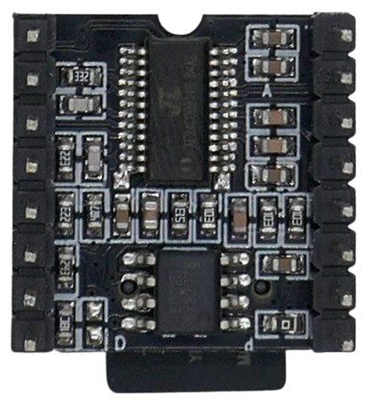

# DFPlayer Mini

> MP3 and WAV File MicroSD Playback Module with 3W Amplifier (3.2–5V)

The *DFPlayer Mini* is a compact, low-cost MP3 player module with an integrated microSD card slot, designed for standalone operation or microcontroller integration (e.g., with an ESP32 or Arduino).

It supports *UART* (serial) communication and button-based control, enabling easy playback of *MP3*, *WAV*, and *WMA* files at a *48kHz* sampling rate, stored on a microSD card.

## Overview

This module operates on *3.2V–5V* and can be controlled by a microcontroller via *UART* or used independently via physical push buttons.

It includes a *3W mono amplifier*, allowing direct connection to a small speaker.

| Item | Description |
| --- | --- |
| **Operating Voltage** | *3.2V–5V* |
| **Standby Current** | *~20mA* |
| **Max Current** | *~200mA* (*~50mA* when not using the built-in amplifier) |
| **Audio Formats** | *MP3, WAV, WMA* |
| **SD Card Support** | *MicroSD card, up to 32GB* |
| **File System** | *FAT16, FAT32* |
| **Audio File Limit** | *Up to 100 folders, 255 audio files per folder* |
| **Sampling Rate** | *8 / 11.025 / 12 / 16 / 22.05 / 24 / 32 / 44.1 / 48 kHz* |
| **DAC** | *24-bit (dynamic range 90dB, SNR 85dB)* |
| **Amplifier** | *3W mono* |
| **Stereo Support** | *Only in some module variants* |
| **Volume Control** | *30 levels* |
| **Equalizer Settings** | *6 presets* |
| **Standalone Control** | *Yes, via GPIO buttons* |
| **Microcontroller Support** | *Yes, via UART (default baud rate: 9600 bps)* |
| **ESPHome Support** | *Yes, see the **[dfplayer](https://esphome.io/components/dfplayer.html)** component* |

### Stereo Versions

The *DFPlayer Mini* is manufactured by multiple vendors and comes in different versions. The original version does **not** support *stereo playback*. However, some variants from third-party manufacturers do provide stereo output.

The module includes `DAC_R` and `DAC_L` outputs, which can be used to connect it to an external stereo amplifier or headphones. In the original design, the *DFPlayer Mini* duplicates the mono signal to both output channels.

## Pinout

| Pin   | Description                     | Notes |
|-------|---------------------------------|-------|
| **VCC**  | Power supply (*3.2V–5.0V*) | |
| **RX**   | UART serial input | For external playback control |
| **TX**   | UART serial output | For receiving audio status feedback |
| **DAC_R** | Native audio output (right)  | Both DAC channels duplicate the mono signal |
| **DAC_L** | Native audio output (left)  | Both DAC channels duplicate the mono signal |
| **SPK2**  | Mono speaker (+) | |
| **GND**   | Ground | |
| **SPK1**  | Mono speaker (-) | |
| **IO1**   | Trigger port #1 | Short press: *play previous* Long press: *decrease volume* |
| **GND**   | Ground | |
| **IO2**   | Trigger port #2 | Short press: *play next* Long press: *increase volume* |
| **KEY1**  | AD port #1 | Functionality depends on resistor (see below) |
| **KEY2**  | AD port #2 | Functionality depends on resistor (see below) |
| **USB+**  | USB+ DP | |
| **USB-**  | USB- DP | |
| **BUSY**  | Current status indicator | Low: *playing* High: *idle/standby/pause* |

## Microcontroller Control

- Connect `RX` to the microcontroller's `TX` pin to send *UART* commands to the *DFPlayer Mini*.
- Connect `TX` to the microcontroller's `RX` pin to receive status feedback (optional). If the voltage levels differ between the *DFPlayer Mini* and the microcontroller, use a *1kΩ* protective resistor on this line.

## Physical Control (Standalone Mode)

The *DFPlayer Mini* does not require a microcontroller and can be controlled directly with push buttons:

- **Digital Input:**  
  Use push buttons on `IO1` and `IO2` for simple *previous/next* control. These inputs function as standard digital inputs.
- **Analog Input:**  
  For more control options, use `KEY1` and `KEY2` with a resistor-based push button matrix. These inputs function as analog inputs, where each button press corresponds to a unique resistance value.

## Power Supply

The *DFPlayer Mini* supports a voltage range of *3.2V–5V*, making it compatible with both *3.3V* and *5V* microcontrollers.

### Powering from 3.3V (ESP32 Example)

When using a *3.3V* microcontroller like the *ESP32-C3 SuperMini*, the *DFPlayer Mini* can be powered directly from *3.3V*, while UART control is handled via the microcontroller’s `TX/RX` pins:

For *5V Arduinos*, connect the red power line to the *5V* output pin instead.

### Bypassing Voltage Regulators

Some microcontroller voltage regulators may not supply enough current. The *DFPlayer Mini* can draw up to *200mA*, and a WiFi-enabled *ESP32* can consume over *500mA*, exceeding the capabilities of many built-in regulators.

#### Symptoms of Insufficient Power:
- No audio playback
- Distorted sound
- Microcontroller instability, brownouts, or unexpected resets

### Running *DFPlayer Mini* on 5V

To avoid power issues, the *DFPlayer Mini* can be powered directly from the *5V USB* line instead of relying on the onboard voltage regulator. This is suitable for *5V* microcontrollers such as basic *Arduino* boards.

For *3.3V* microcontrollers, a protective *1kΩ* resistor is recommended on the `TX` line to prevent damage from *5V* logic levels:

### Choosing the Right Power Configuration

| Microcontroller | Recommended Power Supply | Notes |
|----------------|-------------------------|-------|
| **5V Microcontroller**  | Run *DFPlayer Mini* at **5V** | Direct connection |
| **3.3V Microcontroller**  | **If regulator < 500mA:** Run *DFPlayer Mini* at **5V**  | Use **1kΩ** protective resistor on `DFPlayer TX` → `MCU RX` |
| **3.3V Microcontroller**  | **If regulator > 500mA:** Run *DFPlayer Mini* at **3.3V** | Safe direct connection |

## SD Card
The module is equipped with a *Mini SD Card* reader, and the SD card must be formatted with a *FAT16* or *FAT32* file system. *exFAT* or other file systems are not compatible.

You can use a simple *SD Card Adapter* if your PC has a standard size SD Card reader, and you would like to transfer audio files from your PC to the card:

### FAT32 File System

While the *DFPlayer Mini* supports SD cards with a capacity of up to *32GB*, formatting large SD cards with the required *FAT32* file system can be difficult.

On *Windows*, for example, the operating system [forces the use of the *exFAT* file system](https://done.land/components/data/storage/permanent/onsdcards/#converting-sd-card-media-to-fat32) for media larger than *4GB*. Although there is no technical reason for this limitation, the built-in tools do not allow the use of *FAT32* on larger SD cards.

To work around this, you can [download and install](https://done.land/tools/powershell/#install-donelandtools) the free *PowerShell* module called *DoneLandTools*. This open-source module does not require installation and can be easily removed by simply deleting the downloaded files.

After adding *DoneLandTools*, you can use the new PowerShell command `Show-Fat32Converter` to easily convert any SD card media to *FAT32*.

### File Structure

The module supports up to *100* folders, with each folder containing up to *255* audio files, for a total of *25,500* audio files.

- **Folder Names:** Folders should be named with two digits: *00* to *99*.
- **Audio File Names:** Audio files should be named with three digits: *001* to *255*. For example: `012.mp3`.

> [!NOTE]
> The naming scheme is based on how file playback is controlled via UART commands. For instance, the UART command to play the file `99.mp3` in folder `99` would be `7E FF 06 0F 00 63 FF xx xx EF`, where the hexadecimal value `63` represents folder `99` and `FF` selects the file `99.mp3`.

> Tags: Audio, 3W, Amplifier, Mono, SD Card, MP3, WAV, WMA, Uart
