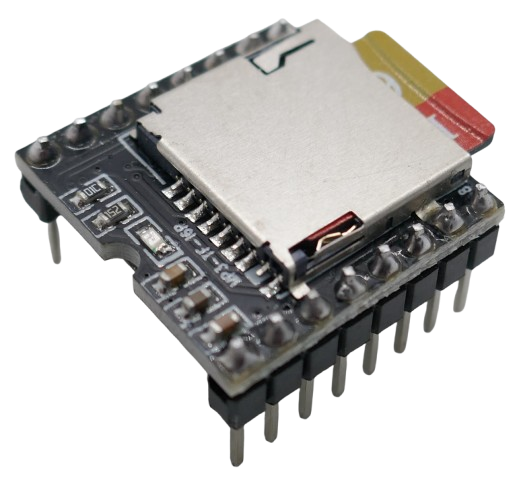
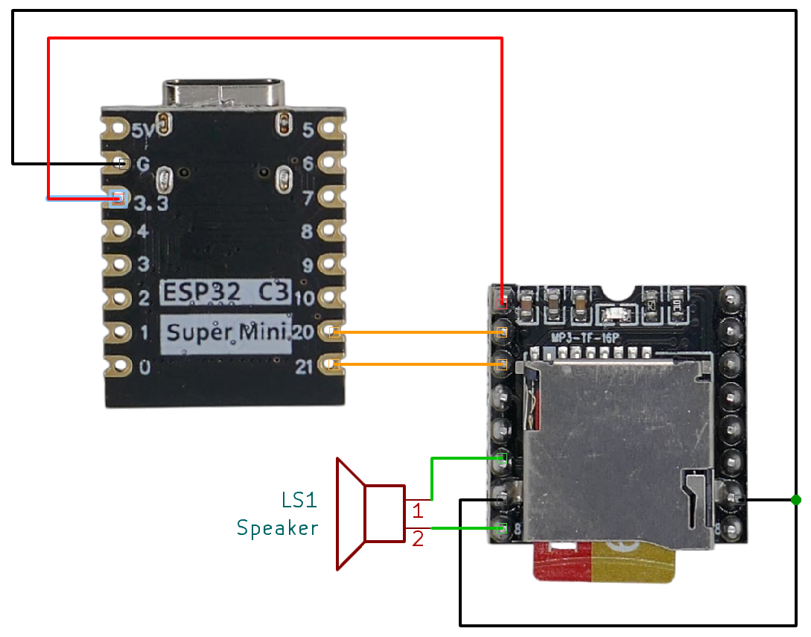
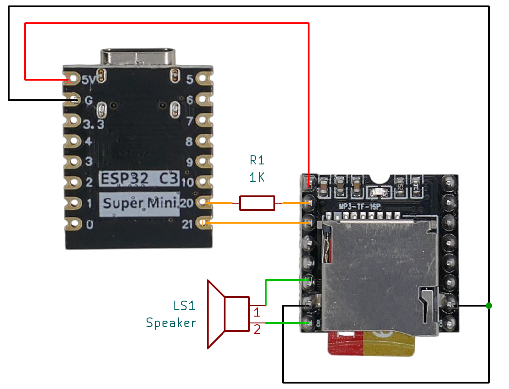
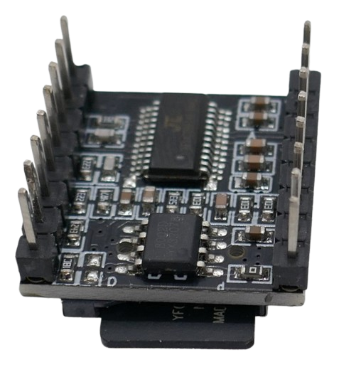
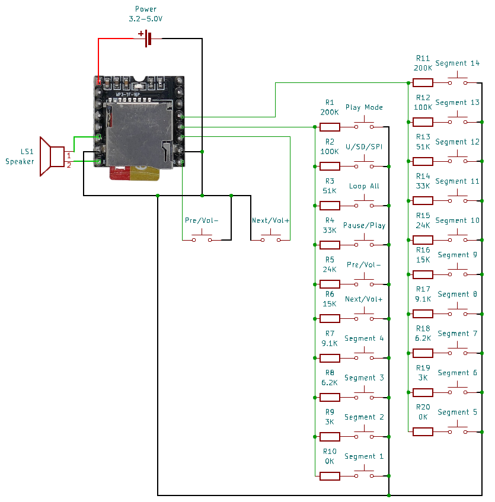
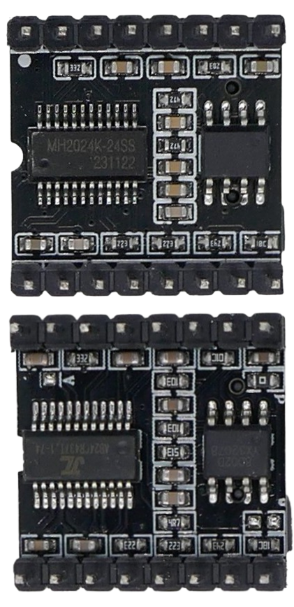
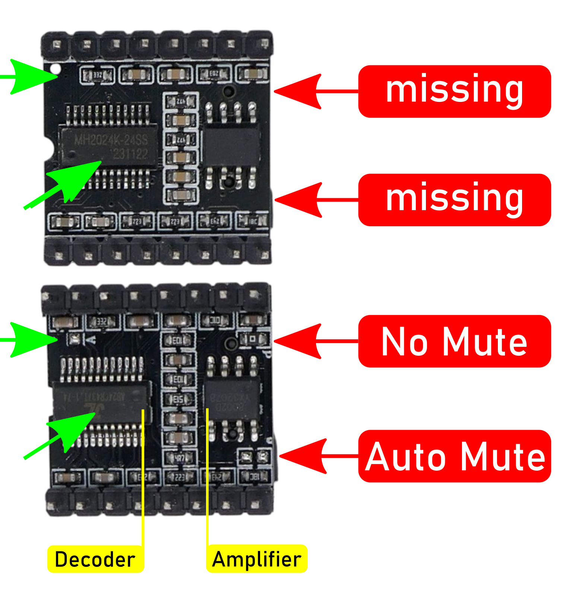

# DFPlayer Mini

> MP3 and WAV File MicroSD Playback Module with 3W Amplifier (3.2–5V)

The *DFPlayer Mini* is a compact and low-cost audio player module that supports *MP3*, *WAV*, and *WMA* formats. It includes an integrated microSD card slot and a built-in *3W* mono amplifier, making it suitable for both standalone operation and microcontroller integration (e.g., with an ESP32 or Arduino).

This module supports *UART* (serial) communication and button-based control, enabling easy playback of *MP3*, *WAV*, and *WMA* files at a *48kHz* sampling rate. These files are stored on a microSD card.

> [!IMPORTANT]  
> There are various versions of this board available. If you plan to use a microcontroller to control the module via *UART*, ensure that the version you order is compatible with your software libraries (see below for more details).

## Overview

The *DFPlayer Mini* adds audio playback capabilities to your project and can be operated either standalone or controlled by a microcontroller via *UART* (serial interface). It has a wide voltage range (*3.2V* - *5V*), making it compatible with both *3.3V* and *5V* microcontrollers, as well as single *Li-ion* batteries.

Audio files can be stored on a microSD card with a maximum capacity of *32GB*.

| Item | Description |
| --- | --- |
| **Operating Voltage** | *3.2V–5V* |
| **Standby Current** | *~20mA* |
| **Max Current** | *~200mA* (*~50mA* when not using the built-in amplifier) |
| **Audio Formats** | *MP3, WAV, WMA* |
| **SD Card Support** | *MicroSD card, up to 32GB* |
| **File System** | *FAT16, FAT32* |
| **Audio File Limit** | *Up to 100 folders, 255 audio files per folder* |
| **Sampling Rate** | *8 / 11.025 / 12 / 16 / 22.05 / 24 / 32 / 44.1 / 48 kHz* |
| **DAC** | *24-bit (dynamic range 90dB, SNR 85dB)* |
| **Amplifier** | *3W mono* |
| **Stereo Support** | *Only in some module variants* |
| **Volume Control** | *30 levels* |
| **Equalizer Settings** | *6 presets* |
| **Standalone Control** | *Yes, via GPIO buttons* |
| **Microcontroller Support** | *Yes, via UART (default baud rate: 9600 bps)* |
| **ESPHome Support** | *Yes, see the **[dfplayer](https://esphome.io/components/dfplayer.html)** component* |

### Mono Amplifier

The *DFPlayer Mini* includes a *3W mono amplifier* based on the *YX5200*, *8002*, or *MH2024K-24SS* chip. This allows you to directly connect **one** small speaker with an impedance of *4Ω* or *8Ω* and a power rating of *3W* or higher.

The speaker output (`SPK1` and `SPK2`) is *bridge-tied load (BTL) mono*, meaning it combines the left and right audio channels into a single mixed mono output.

Additionally, the module provides separate `DAC_R` and `DAC_L` outputs, which allow you to connect external stereo headphones or amplifiers. However, note that these pins still output a duplicated mono signal, rather than true stereo.

### Audio Formats

The *DFPlayer Mini* supports *MP3*, *WAV*, and *WMA* audio formats.

Improving Audio Quality
 

Once you are able to hear sound, evaluate the audio quality. If you notice noise or other audio issues, you can try improving the quality with the following steps:

1. **Review Power Supply:**  
   - **3.3V:** If you are running the *DFPlayer Mini* at *3.3V*, consider switching to the **5V** pin on your microcontroller instead. If you use a *3.3V* microcontroller, add a *1KΩ* resistor in series with the `TX` pin of the *DFPlayer Mini*.  
   - **AC Adapter:** If you're using an *AC USB power supply*, try switching to a power bank. If this reduces noise, it may indicate that your adapter is introducing interference. In this case, consider using a *USB isolator* or another method to prevent noise from affecting the *DFPlayer Mini*.

2. **Enable Auto Mute:** If your *DFPlayer Mini* PCB supports it, bridge the solder pads to enable the *auto mute* function (more details below).

3. **Add a Decoupling Capacitor:** Insert a large electrolytic capacitor in series with the speaker output, ensuring the correct polarity.

## Pinout

This is the *DFPlayer Mini* pin-out:

| Pin   | Description                     | Notes |
|-------|---------------------------------|-------|
| **VCC**  | Power supply (*3.2V–5.0V*) | |
| **RX**   | UART serial input | For external playback control |
| **TX**   | UART serial output | For receiving audio status feedback |
| **DAC_R** | Native audio output (right)  | Both DAC channels duplicate the mono signal |
| **DAC_L** | Native audio output (left)  | Both DAC channels duplicate the mono signal |
| **SPK2**  | Mono speaker (+) | |
| **GND**   | Ground | |
| **SPK1**  | Mono speaker (-) | |
| **IO1**   | Trigger port #1 | Short press: *play previous* Long press: *decrease volume* |
| **GND**   | Ground | |
| **IO2**   | Trigger port #2 | Short press: *play next* Long press: *increase volume* |
| **KEY1**  | AD port #1 | Functionality depends on resistor (see below) |
| **KEY2**  | AD port #2 | Functionality depends on resistor (see below) |
| **USB+**  | USB+ DP | |
| **USB-**  | USB- DP | |
| **BUSY**  | Current status indicator | Low: *playing* High: *idle/standby/pause* |

## Power Supply

The primary considerations for powering the *DFPlayer Mini* are ensuring *sufficient* power and isolating *noise*:

- **Power Consumption:** The *DFPlayer Mini* can draw up to *200mA* when using its internal *3W amplifier*. Since your microcontroller and potentially other components like displays also require power, the total current draw can quickly exceed *500mA*. Many development boards use inexpensive voltage regulators that typically have a maximum current capacity of *500mA*, with some even having a lower limit.
- **Noise:** When powering your setup from an *AC USB power adapter*, you may introduce substantial noise. If you notice this, try using a power bank instead. If this improves sound quality and you must use AC power, consider adding a *USB isolator* to prevent interference.

The most robust power setup involves directly feeding *5V USB power* to the *DFPlayer Mini*, bypassing any voltage regulator on your microcontroller development board.

Since it is easy to switch between *3.3V* and *5V* wiring, start with *3.3V* if you're using a *3.3V* microcontroller. If you encounter issues, you can switch to *5V* for improved performance.

#### Powering with 3.3V (ESP32 Example)

If the voltage regulator on your *3.3V microcontroller board* can handle more than *500mA*, you can drive the *DFPlayer Mini* directly from the `3V3` pin:

> [!TIP]  
> For *5V Arduinos*, connect the red power line to the `5V` output pin instead.

#### Powering with 5V (ESP32 Example)

The *3.3V* setup described above may or may not be suitable for your needs, depending on the following factors:

- **Voltage Regulator:** If the voltage regulator on your microcontroller board is underpowered, you may experience instability, noise, clicking sounds, or resets.
- **Audio Chip:** Some *DFPlayer Mini clones* use audio chips that are not compatible with *3.3V*.

Switching to a *5V* setup is simple:

- **Power Line:** Switch the red power line from the `3V3` pin to the `5V` pin, bypassing the internal voltage regulator. This allows the *DFPlayer Mini* to be directly powered by the *USB power input*.
- **Resistor:** To protect the *DFPlayer Mini*, add a *1kΩ* resistor in series with the *TX* line to prevent damage from the *5V* logic levels.

## Microcontroller Control

The *DFPlayer Mini* can be controlled via *UART* (serial communication). As is typical with serial interfaces, ensure you connect the *DFPlayer Mini* `RX` pin to your microcontroller's `TX` pin, and vice versa.

Additionally, make sure you use the appropriate *GPIOs* for the serial interface. Some microcontrollers allow remapping to any *GPIO*, while others require specific, designated *GPIOs*.

- Connect `RX` to the microcontroller's `TX` pin to send *UART* commands to the *DFPlayer Mini*.
- Connect `TX` to the microcontroller's `RX` pin to receive status feedback. While the feedback line isn't strictly required, many libraries wait for acknowledgment messages and may hang without it.
- If there is a voltage mismatch between the *DFPlayer Mini* and the microcontroller, use a *1kΩ* protective resistor on the *DFPlayer Mini* `TX` line.

Run an Initial Test
 

The subtle differences between *DFPlayer Mini* boards can significantly impact the supported UART commands and the file structure the module expects on the SD card.

To ensure everything is working properly, start by testing your *DFPlayer Mini* with [this test code](https://github.com/ghmartin77/DFPlayerAnalyzer). This will verify the basic functionality and help isolate any issues.

## Physical Control (Standalone Mode)

The *DFPlayer Mini* does not require a microcontroller and can be controlled directly using push buttons:

- **Digital Input:**  
  Use push buttons connected to `IO1` and `IO2` for simple *previous/next* control. These inputs function as standard digital inputs.
- **Analog Input:**  
  For more control options, use `KEY1` and `KEY2` in conjunction with a resistor-based push button matrix. These inputs function as analog inputs, where each button press corresponds to a unique resistance value.

## Hardware Variations, Clones, Knock-Offs

The *DFPlayer Mini* is so popular that numerous clones and knock-offs have been produced. These versions are often visually similar and pin-compatible, but subtle differences in chip types and PCB design can lead to significant variations that might affect your project (see below).

### Audio Decoder

When examining the bottom part of the module, you'll notice two chips:

* **MP3 Player:** The larger 16- or 24-pin audio decoder chip is usually a *MH2024K-24SS*, or one of the many compatible alternatives, such as *MH2024K-16SS*, *YX5200-24SS*, or clones like the *AB23...*, *AB24...*, *AF24...* series from Chinese manufacturers like *Jieli Technology (JL)*.
* **Audio Amplifier:** The smaller 8-pin audio amplifier is typically a *8002D* knock-off, which is a simple *2W* or *3W* mono audio amplifier.

Most chips found on *DFPlayer Mini* modules are from generic Chinese manufacturers, and may have no markings or use non-public numbering. If you do find a datasheet, it is likely to be in Chinese.

Below are some findings compiled from the community. Please note that these observations may be *subjective*, may result from a *combination* of chip types and PCB design, may have been coincidental, or may have been addressed by newer versions. Test for yourself before purchasing in bulk.

| Chip | 3.3V | 5V | Library Support | Remarks |
| --- | --- | --- | --- | --- |
| MH2024K-16SS | humming | ok | needs tweaking  | red LED, responds differently to IO actions |
| MH2024K-24SS narrow chip | humming | ok | yes | red LED, may introduce delays |
| MH2024K-24SS wider chip | ok | ok | yes | blue LED |
| JL AB23xxx | ok | ok | yes | blue LED |
| JL AB24xxx | | | | |
| JL AF24xxx | | | | |

### Use Auto-Mute (if available)

Some PCBs feature a solder bridge that can be moved to the opposite side (marked with red arrows in the illustration). 

By default, a *0Ω* bridge is mounted at the solder bridge marked `P`. This can be removed and instead mounted to another solder bridge on the opposite side.

This controls the built-in audio amplifier and can significantly improve sound quality:

* **Always On (Default):** By default, the audio amplifier *mute* pin is permanently grounded, keeping the amplifier always on, even if no audio is playing. This can amplify noise, such as humming and crackling sounds.
* **Auto-Mute:** When the solder bridge is moved to the opposite side, the mute pin is set to *high* by default (muted). The audio amplifier will only turn on when *DFPlayer Mini* plays audio and its `BUSY` pin goes *low*.

There are additional subtle differences marked by the green arrows. Aside from different chips, the number of capacitors may vary, and some boards include a solder bridge marked `A` with an unknown purpose.

> [!NOTE]
> Some users report this to improve sound quality immensely while others claim it wouldn't work. Try yourself at own risk.

> Tags: Audio, 3W, Amplifier, Mono, SD Card, MP3, WAV, WMA, Uart, FAT32

[Visit Page on Website](https://done.land/components/audio/playback/dfplayermini?833367021909255401) - created 2025-02-08 - last edited 2025-02-09
