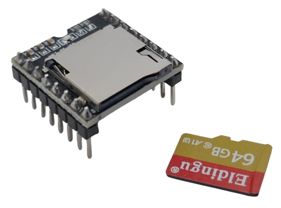
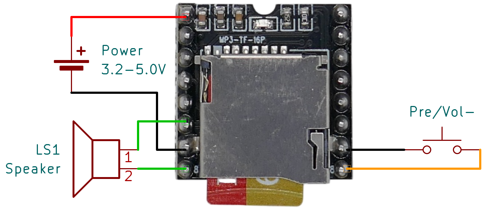

# Testing DFPlayer Mini

> Discover Which Features Your Version of DFPlayer Mini Supports

The *DFPlayer Mini* exists in multiple variations. While all modules are pin-compatible, they exhibit significant differences in behavior.



This article guides you through testing your *DFPlayer Mini* to determine which features your specific version supports.

## Overview

Although all *DFPlayer Mini* modules share the same pinout, their PCB designs and internal audio chips vary significantly. These differences impact the module's capabilities:

* **Audio Format Support:** Some modules only support *.mp3* files, while others also handle *.wav* and *.wma* formats.
* **WAV Codec Compatibility:** Some modules support both *uncompressed PCM* and *compressed ADPCM IMA*, while others are limited to *compressed ADPCM IMA*.
* **Playback Performance:** Certain versions offer minimal latency between tracks, whereas others introduce several hundred milliseconds of silence, making *seamless looping* impractical.

### Hardware Versions

I have encountered four distinct hardware versions, though many more likely exist:

| Printed Type | LED Color | Audio Chip | Auto Noise Control | Remarks |
| --- | --- | --- | --- | --- |
| MP3-TF-16P (large print) | Blue | `JL AB24...` | Configurable | Supports *.mp3*, *.wav* (PCM and ADPCM) |
| MP3-TF-16P (small print) | Blue | `JL AF24...` | Fixed | Supports *.mp3* files only |
| MP3-TF-16P V3.0 | Red | `MH2024K-24SS` | Fixed | Supports *.mp3* files only |

## Prerequisites

All tests below utilize PowerShell cmdlets from the free module *DoneLandTools*. These cmdlets allow you to generate test audio files in various formats.

These cmdlets are designed for the **Windows** operating system. If you're using a different OS or prefer not to run PowerShell commands, you can *download* pre-generated test files instead.

You'll also need a properly formatted **empty** microSD card.


### Installing DoneLandTools
Download the free *DoneLandTools* PowerShell Module:

````powershell
Install-Module -Name DoneLandTools -Scope CurrentUser
````

### Format SD Card
To enusure your SD Card is using the `FAT32` file system, run this PowerShell command:

````PowerShell
Show-Fat32Converter
````
This opens a dialog, allowing you to format your SD card in just a few seconds.

> [!IMPORTANT]  
> Before running tests, always delete all old content from the SD card before copying new test files onto it. The *DFPlayer Mini* relies heavily on the *File Allocation Table* to determine the playback order of files in many scenarios.

## Testing Supported Audio Formats

Let's first determine which audio file formats your *DFPlayer Mini* supports.

### Generating Test Audio Files

The most capable *DFPlayer Mini* modules can play **four audio file formats**:

- `MP3`
- `WAV`: both `PCM` uncompressed and `ADPCM` compressed
- `WMA`

To verify compatibility, test files in all four formats are required.

The script below generates these files and stores them in the root folder of your SD card.

<details><summary>Generating Test Audio Files with PowerShell</summary><br/>

Make sure you adjust the drive letter to match your SD card drive:


````PowerShell
#requires -Modules donelandtools


# adjust drive letter for your sd card:
[char]$SdCardDriveLetter = 'f'

# create test audio files:
Convert-TextToSpeech -Culture en-us -OutputPath "${SdCardDriveLetter}:\MP3 File.wav" -Text "1. This is MP3 playing." -PassThru -Force |
Convert-AudioWavFile -CreateMp3 -PassThru -Force

Convert-TextToSpeech -Culture en-us -OutputPath "${SdCardDriveLetter}:\WAV PCM File.wav" -Text "2. This is WAV playing in uncompressed PCM." -PassThru -Force

Convert-TextToSpeech -Culture en-us -OutputPath "${SdCardDriveLetter}:\WAV ADPCM.wav" -Text "3. This is WAV playing in compressed format." -PassThru -Force |
Convert-AudioWavFile -PassThru -Force

Convert-TextToSpeech -Culture en-us -OutputPath "${SdCardDriveLetter}:\WMA.wav" -Text "4. This is WMA playing." -PassThru -Force |
Convert-AudioWavFile -PassThru -Force

# eject sd card:
Stop-RemovableDrive -DriveLetter $SdCardDriveLetter
Write-Host "SD Card ejected, safe to remove."
````

</details>
You can also [download](materials/Audio_Format_Test_Files.zip) the audio test files. Unpack the ZIP archive and copy the files onto your SD card manually.

Keep in mind that **the order in which you copy files onto your SD card** determines the playback order.

### Performing the Test

To play back the files, run the *DFPlayer Mini* in a simple stand-alone setup:



Use the push button to toggle through the test files. If your *DFPlayer Mini* version supports all four audio formats, you should hear four different recordings.

> [!NOTE]  
> A short press on the push button triggers the *previous track* function, meaning the files will play **in reverse order**: the last file copied to the SD card will be the **first** to play.

### Conclusions

Pay close attention to which files you *can* hear. Files with *unsupported* audio formats are simply skipped.

* **Pure MP3 Players:** In my tests, *DFPlayer Mini* modules marked `MP3-TF-16P V3.0` (with a *red* LED and the `MH2024K-24SS` audio chip) could only play *.mp3* files.
* **No WMA Support:** Some versions do not support *.wma* files at all.
* **No Uncompressed WAV Support:** Certain modules only support *compressed ADPCM* and cannot play *uncompressed PCM* *.wav* files.

#### Audio Quality

The *DFPlayer Mini* is not designed for studio-quality audio, and overall sound quality is further limited by the type of speaker used.

Most likely, all four supported audio formats will sound subjectively similar. 

If you want to evaluate potential differences, modify the test script: instead of generating files with `Convert-TextToSpeech`, use your own music files and run them through `Convert-AudioWavFile` to produce different formats. Then compare the playback quality.

If no single format stands out, consider these general rules:

* **Smaller files are better:** *DFPlayer Mini* has limited internal buffers, so smaller files tend to play more reliably.
* **Uncompressed formats are better for looping:** If you need *seamless* looping, choose the format with the *fastest playback mode* and minimal buffering time.  
  - *.mp3* files are small but require time for decompression.  
  - *.wav* (PCM or ADPCM) files reduce the gap between loop iterations, enabling near-seamless playback.

## Testing Folder Structure

In the previous test, the files were placed in the SD card's root directory without specific naming rules. When using manual push buttons, *DFPlayer Mini* does not rely on file names or storage locations—it strictly follows the *File Allocation Table*, meaning **file copy order** determines playback order.

However, for more advanced use cases—such as UART control with a microcontroller—you must follow specific naming conventions and use specially named subfolders.

To test this, a more extensive set of test files is required. Below is a script that generates them.


<details><summary>Generating Test Files With PowerShell</summary><br/>
If you have already determined that your *DFPlayer Mini* does not support certain audio formats, or if you have decided to focus on a specific format, you can modify the script to remove the sections that generate unnecessary test files.


````PowerShell
# adjust drive letter for your sd card:
[char]$SdCardDriveLetter = 'f'

$startIndex = 1

# make sure the drive is empty (FAT File Allocation Table must be cleared)
$files = @(Get-ChildItem -Path "${SdCardDriveLetter}:\" -Recurse -File | Select-Object -First 1)
if ($files.Count -gt 0)
{
  Write-Warning 'SD Card must be empty! Delete all files (or format drive to FAT32), then try again.'
  return
}

# create test files for these folders:

'', 'MP3', '001', '002', 'ADVERT', 'Some Name' | 
  ForEach-Object {
    $folder = $_

    # MP3 / prefix 4 digits
    1..2 | 
    # create a consecutive sequence of numbers
    Foreach-Object { ($script:startIndex++) } | 
    # convert number to text (voice) and use a 4-digit prefix in output path
    Convert-TextToSpeech -Culture en-us -OutputPath { "{0}:{1}\{2:d4}.wav" -f $SdCardDriveLetter, $folder, $_ } -Text { "$_" } -PassThru -Force |
    # convert to mp3
    Convert-AudioWavFile -CreateMp3 -PassThru -Force

    # MP3 / prefix 3 digits
    1..2 | 
    # create a consecutive sequence of numbers
    Foreach-Object { ($script:startIndex++) } | 
    # convert number to text (voice) and use a 4-digit prefix in output path
    Convert-TextToSpeech -Culture en-us -OutputPath { "{0}:{1}\{2:d3}.wav" -f $SdCardDriveLetter, $folder, $_ } -Text { "$_" } -PassThru -Force |
    # convert to mp3
    Convert-AudioWavFile -CreateMp3 -PassThru -Force

    # MP3 / prefix 2 digits
    1..2 | 
    # create a consecutive sequence of numbers
    Foreach-Object { ($script:startIndex++) } | 
    # convert number to text (voice) and use a 4-digit prefix in output path
    Convert-TextToSpeech -Culture en-us -OutputPath { "{0}:{1}\{2:d2}.wav" -f $SdCardDriveLetter, $folder, $_ } -Text { "$_" } -PassThru -Force |
    # convert to mp3
    Convert-AudioWavFile -CreateMp3 -PassThru -Force

    # MP3 / prefix no digits
    1..2 | 
    # create a consecutive sequence of numbers
    Foreach-Object { ($script:startIndex++) } | 
    # convert number to text (voice) and use a 4-digit prefix in output path
    Convert-TextToSpeech -Culture en-us -OutputPath { "{0}:{1}\no prefix {2}.wav" -f $SdCardDriveLetter, $folder, $_ } -Text { "$_" } -PassThru -Force |
    # convert to mp3
    Convert-AudioWavFile -CreateMp3 -PassThru -Force


    # WAV PCM / prefix 4 digits
    1..2 | 
    # create a consecutive sequence of numbers
    Foreach-Object { ($script:startIndex++) } | 
    # convert number to text (voice) and use a 4-digit prefix in output path
    Convert-TextToSpeech -Culture en-us -OutputPath { "{0}:{1}\{2:d4} PCM.wav" -f $SdCardDriveLetter, $folder, $_ } -Text { "$_" } -PassThru -Force

    # WAV PCM / prefix 3 digits
    1..2 | 
    # create a consecutive sequence of numbers
    Foreach-Object { ($script:startIndex++) } | 
    # convert number to text (voice) and use a 4-digit prefix in output path
    Convert-TextToSpeech -Culture en-us -OutputPath { "{0}:{1}\{2:d3} PCM.wav" -f $SdCardDriveLetter, $folder, $_ } -Text { "$_" } -PassThru -Force

    # WAV PCM / prefix 2 digits
    1..2 | 
    # create a consecutive sequence of numbers
    Foreach-Object { ($script:startIndex++) } | 
    # convert number to text (voice) and use a 4-digit prefix in output path
    Convert-TextToSpeech -Culture en-us -OutputPath { "{0}:{1}\{2:d2} PCM.wav" -f $SdCardDriveLetter, $folder, $_ } -Text { "$_" } -PassThru -Force

    # WAV PCM / prefix no digits
    1..2 | 
    # create a consecutive sequence of numbers
    Foreach-Object { ($script:startIndex++) } | 
    # convert number to text (voice) and use a 4-digit prefix in output path
    Convert-TextToSpeech -Culture en-us -OutputPath { "{0}:{1}\no prefix {2} PCM.wav" -f $SdCardDriveLetter, $folder, $_ } -Text { "$_" } -PassThru -Force 

    # WAV ADPCM compressed / prefix 4 digits
    1..2 | 
    # create a consecutive sequence of numbers
    Foreach-Object { ($script:startIndex++) } | 
    # convert number to text (voice) and use a 4-digit prefix in output path
    Convert-TextToSpeech -Culture en-us -OutputPath { "{0}:{1}\{2:d4} ADPCM.wav" -f $SdCardDriveLetter, $folder, $_ } -Text { "$_" } -PassThru -Force |
    # convert to mp3
    Convert-AudioWavFile -PassThru -Force

    # WAV ADPCM compressed / prefix 3 digits
    1..2 | 
    # create a consecutive sequence of numbers
    Foreach-Object { ($script:startIndex++) } | 
    # convert number to text (voice) and use a 4-digit prefix in output path
    Convert-TextToSpeech -Culture en-us -OutputPath { "{0}:{1}\{2:d3} ADPCM.wav" -f $SdCardDriveLetter, $folder, $_ } -Text { "$_" } -PassThru -Force |
    # convert to mp3
    Convert-AudioWavFile -PassThru -Force

    # WAV ADPCM compressed / prefix 2 digits
    1..2 | 
    # create a consecutive sequence of numbers
    Foreach-Object { ($script:startIndex++) } | 
    # convert number to text (voice) and use a 4-digit prefix in output path
    Convert-TextToSpeech -Culture en-us -OutputPath { "{0}:{1}\{2:d2} ADPCM.wav" -f $SdCardDriveLetter, $folder, $_ } -Text { "$_" } -PassThru -Force |
    # convert to mp3
    Convert-AudioWavFile -PassThru -Force

    # WAV ADPCM compressed / prefix no digits
    1..2 | 
    # create a consecutive sequence of numbers
    Foreach-Object { ($script:startIndex++) } | 
    # convert number to text (voice) and use a 4-digit prefix in output path
    Convert-TextToSpeech -Culture en-us -OutputPath { "{0}:{1}\no prefix {2} ADPCM.wav" -f $SdCardDriveLetter, $folder, $_ } -Text { "$_" } -PassThru -Force |
    # convert to mp3
    Convert-AudioWavFile -PassThru -Force

    # WMA / prefix 4 digits
    1..2 | 
    # create a consecutive sequence of numbers
    Foreach-Object { ($script:startIndex++) } | 
    # convert number to text (voice) and use a 4-digit prefix in output path
    Convert-TextToSpeech -Culture en-us -OutputPath { "{0}:{1}\{2:d4}.wav" -f $SdCardDriveLetter, $folder, $_ } -Text { "$_" } -PassThru -Force |
    # convert to wma
    Convert-AudioWavFile -CreateWma -PassThru -Force

    # WMA / prefix 3 digits
    1..2 | 
    # create a consecutive sequence of numbers
    Foreach-Object { ($script:startIndex++) } | 
    # convert number to text (voice) and use a 4-digit prefix in output path
    Convert-TextToSpeech -Culture en-us -OutputPath { "{0}:{1}\{2:d3}.wav" -f $SdCardDriveLetter, $folder, $_ } -Text { "$_" } -PassThru -Force |
    # convert to wma
    Convert-AudioWavFile -CreateWma -PassThru -Force

    # WMA / prefix 2 digits
    1..2 | 
    # create a consecutive sequence of numbers
    Foreach-Object { ($script:startIndex++) } | 
    # convert number to text (voice) and use a 4-digit prefix in output path
    Convert-TextToSpeech -Culture en-us -OutputPath { "{0}:{1}\{2:d2}.wav" -f $SdCardDriveLetter, $folder, $_ } -Text { "$_" } -PassThru -Force |
    # convert to wma
    Convert-AudioWavFile -CreateWma -PassThru -Force

    # WMA compressed / prefix no digits
    1..2 | 
    # create a consecutive sequence of numbers
    Foreach-Object { ($script:startIndex++) } | 
    # convert number to text (voice) and use a 4-digit prefix in output path
    Convert-TextToSpeech -Culture en-us -OutputPath { "{0}:{1}\no prefix {2}.wav" -f $SdCardDriveLetter, $folder, $_ } -Text { "$_" } -PassThru -Force |
    # convert to wma
    Convert-AudioWavFile -CreateWma -PassThru -Force
  }


# eject sd card:
Stop-RemovableDrive -DriveLetter $SdCardDriveLetter
Write-Host "SD Card ejected, safe to remove."
````

</details>


You can also [download](materials/dfplayer_mini_structure_test.zip) the test files as zip archive (4MB).

The files are organized in this subfolder structure:

````
F:\
├───MP3
├───001
├───002
├───ADVERT
└───Some Name
````

The root folder and each subfolder contain a set of audio test files in various naming schemes and formats, for example:

````
(...)
│  30.wma
│   no prefix 31.wma
│   no prefix 32.wma
│
───MP3
│       0033.mp3
│       0034.mp3
│       035.mp3
│       036.mp3
│       37.mp3
│       38.mp3
│       no prefix 39.mp3
│       no prefix 40.mp3
│       0041 PCM.wav
│       0042 PCM.wav
│       043 PCM.wav
│       044 PCM.wav
│       45 PCM.wav
│       46 PCM.wav
│       no prefix 47 PCM.wav
│       no prefix 48 PCM.wav
│       0049 ADPCM.wav
│       0050 ADPCM.wav
│       051 ADPCM.wav
│       052 ADPCM.wav
│       53 ADPCM.wav
│       54 ADPCM.wav
│       no prefix 55 ADPCM.wav
│       no prefix 56 ADPCM.wav
│       0057.wma
│       0058.wma
│       059.wma
│       060.wma
│       61.wma
│       62.wma
│       no prefix 63.wma
│       no prefix 64.wma
│
├───001
│       0065.mp3
│       0066.mp3
(...)
````

> Tags: Hardware, Difference, MH2024K-24SS, JL AF24, JL AB24

[Visit Page on Website](https://done.land/components/audio/playback/dfplayermini/testdfplayermini?405392021118250657) - created 2025-02-17 - last edited 2025-02-17
