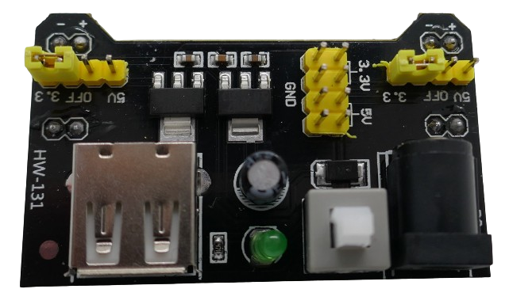
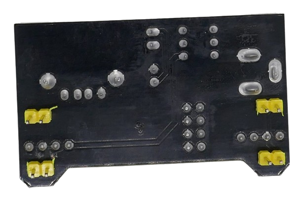

 
# HW-131

> Dedicated 3.3V/5V 700mA Breadboard Power Supply That Plugs Directly Into Power Rails

*HW-131* is a clever *buck converter* on a special breakout board that directly plugs onto most breakout boards (designed for *MB102* breadboards) and automatically supplies power to the breadboard power rails.

## Power Inputs

The board accepts input power either via a cinch power socket (6.5-12V), or via a *USB-A* connector.

## Output Power

A large latched push button can be used to turn output power *on* and *off*. When the power is turned on, a *green LED* lights up.

The board converts the input voltage to *3.3V* and *5V* simultaneously.

Both voltages are available via 2x2 pins next to the power button.

> [!CAUTION]
> The buck converter on the board is rated for a maximum output current of *700mA*. This power supply is well suited for most prototyping. If your circuit requires unusually high currents, you use a different power supply.

### Setting Rail Output Voltage

The voltage that is supplied to the breadboard rail can be flexibly set using jumpers *on each side*/*on each rail* sepately. 

> [!TIP]
> You can set the voltage to identical values on both breadboard rails, or you can set *5V* to one rail and *3.3V* to the other rail. If you remove the jumper, the rail is not receiving any power.

### Connecting Breadboard Rails

The output power that you set through the two sets of jumpers is available at pins on the board backside.

These pins directly plug into the breadboard power rails:

Make sure you place the power module on the correct *side* of the breadboard so that *+* and *-* align correctly to the power rails:

The pins marked *+* should plug into the rail marked with the *red* line, and the pins marked *-* need to go into the pins marked with the *blue* line.

> Tags: Breadboard, Power Supply, MB102

