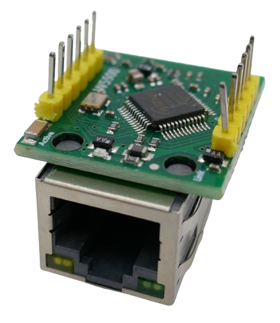
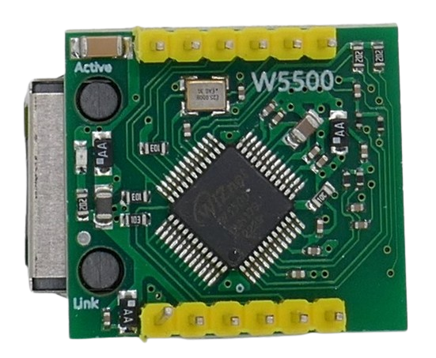
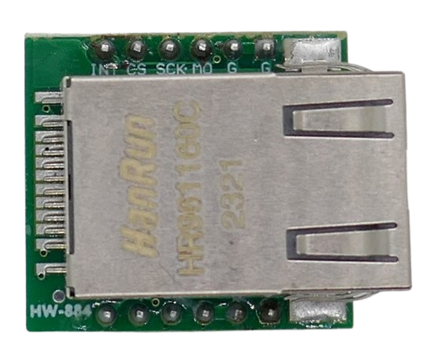
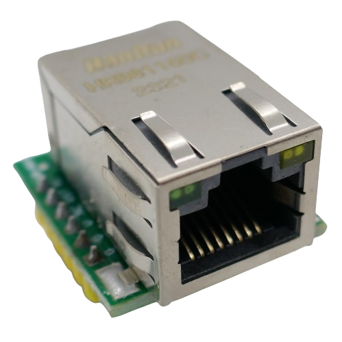

# Mini W5500 Ethernet Controller

> Miniature 3.3V 80MHz SPI-Ethernet Controller For Up To 8 Sockets 

This is the *miniature version* of the standard *W5500* breakout board. It is much smaller but lacks the voltage regulator. It must be supplied with **3.3V**. Only the *SPI* data pins are **5V** tolerant.

> [!TIP]
> This board is often marked with the label *HW-884*.

Other than that, the breakout board is fully compatible with the normal-sized breakout board as both are based on the same fast and performant *W5500* controller chip. The chip supports up to eight sockets, comes with hardware-implemented *TCP/IP*-stack and Wake-On-LAN. Like most *Ethernet* breakout boards, it supports *IPv4* only.

This board is one of the smallest available. It is also known as **W5500 Lite**.

## Operating Voltage

The operating voltage is **3.3V**.

> [!TIP]
> To operate this breakout board with a **5V** microcontroller like *Arduino*, use the **3.3V** pin on the microcontroller board for power supply. Since this board requires *200mA*, make sure the *voltage regulator* on your microcontroller board supplies enough current. The *SPI* interface is *5V* tolerant and can be directly connected with a **5V** microcontroller *SPI* interface. A dedicated level shifter is not mandatory.

## Technical Data

| Item | Value |
| --- | --- |
| Voltage | 3.3V (5V tolerant) |
| Frequency | 80MHz |
| Cache Buffer | 32KB               |
| Speed | 10/100MBps |
| Current | 200mA |
| Chip Set | W5500 |
| Sockets  | 8 |
| Protocols | TCP, UDP, ICMP, IPv4, ARP, IGMP, PPPoE |
| Interface | SPI (80MHz) |
| Size | 28.5x23.5x15mm |

The board supports *Wake on LAN* (*WOL*) via *UDP*. It does not support *IP framentation*.

## Pins

The board comes with six pins on each size, 12 pins in total.

The pins are labeled on the top of the board, next to the *Ethernet* connector.

Left side:

| Pin  | Label | Description |
| ---- | ---- | ----- |
| 1    | G  | Ground   |
| 2    | G  | Ground   |
| 3    | MO | MOSI, SPI-Interface   |
| 4    | SCK | SCLK, SPI-Interface    |
| 5    | CS   | SPI-Interface   |
| 6    | INT  | Interrupt  |

Right side:

| Pin  | Label | Description |
| ---- | ---- | ----- |
| 7    | GND  | Ground   |
| 8    | V  | +3.3V   |
| 9    | V | +3.3V   |
| 10    | NC | not connected    |
| 11   | RST   | Reset   |
| 12   | MI  | MISO, SPI-Interface  |

*RST* is the reset pin (low active). and *INT* is the *W5500* interrupt output pin.

*SPI* pins are *5V tolerant*. The *V* pins require *3.3V*.

## LED

The board comes with two *LED*:

* Activity (yellow): bright (carrier signal with physical connection), dim (just carrier signal)
* Link (green): lit when connected

## Data Sheets

* [W5500](materials/w5500_datasheet.pdf)

> Tags: Data, Network, Ethernet, W5500. Mini W5500, W5500 Lite, HW-884, WOL, Wake On LAN

[Visit Page on Website](https://done.land/components/datatransmission/wired/ethernet/miniw5500?541040041911244644) - created 2024-04-11 - last edited 2024-04-21
