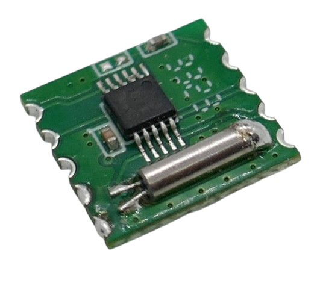
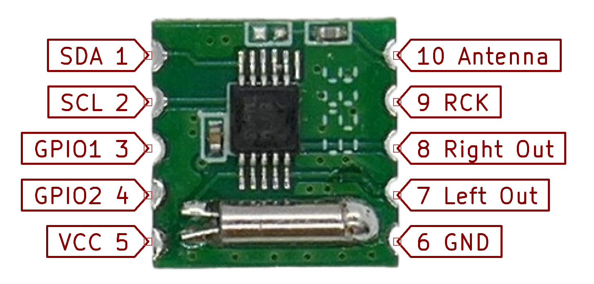

 
# RDA5807M

> Advanced Super-Tíny FM Broadcast Receiver With I2C Interface

The *RDA5807M* is a tiny breakout board around the *RDA5807* FM receiver chip with amazing capabilities and a *I2C* control interface.

Use it to build your own *FM radios* or add *FM radio reception* to your device.



Note that this is a *3.3V* device that cannot be used with *5V* directly. Use a *level shifter* if you want to use it with *Arduinos*.


> [!TIP]
> The board comes with two programmable GPIOs on pin 3 and pin 4. You could use this board as a simple 2-channel *I2C* port extender as well. But always check first whether the two GPIOs are actually exposed on the breakout board you have.

## Pins

The board comes with pre-soldered four pins labeled on the back.




### Minimum Pin Connections

These are the minimum connections required to work as a *FM receiver*:

* **Power Supply:** supply 2.7-3.6V to *pin 5*, and connect *GND* to *pin 6*.
* **I2C Interface:** connect *pin 1* (*SDA*) and *pin 2* (*SCL*) to the *I2C* pins of your microcontroller
* **Antenna:** connect a wire-antenna to *pin 10*


## Technical Data

| Item | Description |
| --- | --- |
| Voltage | 2.7-5.5V|
| Operating Current | 17.5mA at 3.3V |
| Frequency | 76-108MHz |
| Working Current | <5.3mA |
| Interface | I2C, 1.5-3.3V |
| Modulation | Wide-FM |
| Features | AGC, De-Emphasis, RSSI, Volume Control, 2 programmable GPIOs |
| Size  | 11.2x11.2x1.9mm |


## Example Code

*Example code* is taken from [this exceptional instructibles project](https://www.instructables.com/Arduino-Based-Digital-Audio-FM-Radio-Using-RDA5807/) to give an overview of how to control this breakout board via *I2C*:

```c++
#include <Wire.h>
    /* Select the frequency we want to tune to by way
     * of selecting the channel for the desired frequency 
     */
uint16_t channel = 187; 
    /*
     * assuming band starts at 87.0MHz (per settings below)
     * and channel spacing of 100kHz (0.1MHz) (per settings below)
     * then channel can be derived as follows:
     *  
     * channel = (<desired freq in MHz> - 87.0) / 0.1 
     *
     * which is the same as:
     * <10 x desired freq in MHz> - 870
     */
#define RDA5807M_ADDRESS  0b0010000 // 0x10
#define BOOT_CONFIG_LEN 12
#define TUNE_CONFIG_LEN 4
/* 
 *  These bytes set our initial configuration
 *  We don't bother to tune to a channel at this stage.
 *  But instead initiate a reset.
 */
uint8_t boot_config[] = {
  /* register 0x02 */
  0b11000001,
    /* 
     * DHIZ audio output high-z disable
     * 1 = normal operation
     *
     * DMUTE mute disable 
     * 1 = normal operation
     *
     * MONO mono select
     * 0 = stereo
     *
     * BASS bass boost
     * 0 = disabled
     *
     * RCLK NON-CALIBRATE MODE 
     * 0 = RCLK is always supplied
     *
     * RCLK DIRECT INPUT MODE 
     * 0 = ??? not certain what this does
     *
     * SEEKUP
     * 0 = seek in down direction
     *
     * SEEK
     * 0 = disable / stop seek (i.e. don't seek)
     */
  0b00000011,
    /* 
     * SKMODE seek mode: 
     * 0 = wrap at upper or lower band limit and contiue seeking
     *
     * CLK_MODE clock mode
     *  000 = 32.768kHZ clock rate (match the watch cystal on the module) 
     *
     * RDS_EN radio data system enable
     * 0 = disable radio data system
     *
     * NEW_METHOD use new demodulate method for improved sensitivity
     * 0 = presumably disabled 
     *
     * SOFT_RESET
     * 1 = perform a reset
     *
     * ENABLE power up enable: 
     * 1 = enabled
     */ 
  /* register 0x03 */
    /* Don't bother to tune to a channel at this stage*/
  0b00000000, 
    /* 
     * CHAN channel select 8 most significant bits of 10 in total
     * 0000 0000 = don't boher to program a channel at this time
     */
  0b00000000,
    /* 
     * CHAN two least significant bits of 10 in total 
     * 00 = don't bother to program a channel at this time
     *
     * DIRECT MODE used only when test
     * 0 = presumably disabled
     *
     * TUNE commence tune operation 
     * 0 = disable (i.e. don't tune to selected channel)
     *
     * BAND band select
     * 00 = select the 87-108MHz band
     *
     * SPACE channel spacing
     * 00 = select spacing of 100kHz between channels
     */    
  /* register 0x04 */
  0b00001010, 
    /* 
     * RESERVED 15
     * 0
     *
     * PRESUMABLY RESERVED 14
     * 0
     *
     * RESERVED 13:12
     * 00
     *
     * DE de-emphasis: 
     * 1 = 50us de-emphasis as used in Australia
     *
     * RESERVED
     * 0
     *
     * SOFTMUTE_EN
     * 1 = soft mute enabled
     *
     * AFCD AFC disable
     * 0 = AFC enabled
     */
  0b00000000, 
    /* 
     *  Bits 7-0 are not specified, so assume all 0's
     * 0000 0000
     */  
  /* register 0x05 */
  0b10001000, 
    /* 
     * INT_MODE
     * 1 = interrupt last until read reg 0x0C
     *
     * RESERVED 14:12 
     * 000
     *
     * SEEKTH seek signal to noise ratio threshold
     * 1000 = suggested default
     */   
  0b00001111, 
    /* 
     * PRESUMABLY RESERVED 7:6
     * 00
     *
     * RESERVED 5:4
     * 00
     *
     * VOLUME
     * 1111 = loudest volume
     */ 
  /* register 0x06 */
  0b00000000, 
    /* 
     * RESERVED 15
     * 0
     *
     * OPEN_MODE open reserved registers mode
     * 00 = suggested default
     *
     * Bits 12:8 are not specified, so assume all 0's
     * 00000
     */   
  0b00000000, 
    /* 
     *  Bits 7:0 are not specified, so assume all 0's
     *  00000000
     */    
  /* register 0x07 */
  0b01000010, 
    /* 
     *  RESERVED 15 
     * 0
     *
     * TH_SOFRBLEND threshhold for noise soft blend setting
     * 10000 = using default value
     *
     * 65M_50M MODE 
     * 1 = only applies to BAND setting of 0b11, so could probably use 0 here too
     *
     * RESERVED 8
     * 0
     */      
  0b00000010, 
    /*   
     *  SEEK_TH_OLD seek threshold for old seek mode
     * 000000
     *
     * SOFTBLEND_EN soft blend enable
     * 1 = using default value
     *
     * FREQ_MODE
     * 0 = using defualt value
     */  
};
/* After reset, we can tune the device
 * We only need program the first 4 bytes in order to do this
 */
uint8_t tune_config[] = {
  /* register 0x02 */
  0b11000000, 
    /* 
     * DHIZ audio output high-z disable
     * 1 = normal operation
     *
     * DMUTE mute disable 
     * 1 = normal operation
     *
     * MONO mono select
     * 0 = mono
     *
     * BASS bass boost
     * 0 = disabled
     *
     * RCLK NON-CALIBRATE MODE 
     * 0 = RCLK is always supplied
     *
     * RCLK DIRECT INPUT MODE 
     * 0 = ??? not certain what this does
     *
     * SEEKUP
     * 0 = seek in down direction
     *
     * SEEK
     * 0 = disable / stop seek (i.e. don't seek)
     */   
   0b00000001, 
    /* 
     * SKMODE seek mode: 
     * 0 = wrap at upper or lower band limit and contiue seeking
     *
     * CLK_MODE clock mode
     * 000 = 32.768kHZ clock rate (match the watch cystal on the module) 
     *
     * RDS_EN radio data system enable
     * 0 = disable radio data system
     *
     * NEW_METHOD use new demodulate method for improved sensitivity
     * 0 = presumably disabled 
     *
     * SOFT_RESET
     * 0 = don't reset this time around
     *
     * ENABLE power up enable: 
     * 1 = enabled
     */ 
   /* register 0x03 */
   /* Here's where we set the frequency we want to tune to */
   (channel >> 2), 
    /* CHAN channel select 8 most significant bits of 10 in total   */
   ((channel & 0b11) << 6 ) | 0b00010000
    /* 
     *  CHAN two least significant bits of 10 in total 
     *
     * DIRECT MODE used only when test
     * 0 = presumably disabled
     *
     * TUNE commence tune operation 
     * 1 = enable (i.e. tune to selected channel)
     *
     * BAND band select
     * 00 = select the 87-108MHz band
     *
     * SPACE channel spacing
     * 00 = select spacing of 100kHz between channels
     */  
};
void setup()
{
  Serial.begin(9600);
  pinMode(A0,INPUT);
  Wire.begin(); 
  Wire.beginTransmission(RDA5807M_ADDRESS);
  Wire.write(boot_config, BOOT_CONFIG_LEN);
  Wire.endTransmission();
  Wire.beginTransmission(RDA5807M_ADDRESS); 
  Wire.write(tune_config, TUNE_CONFIG_LEN); 
  Wire.endTransmission(); 
}//setup end
void loop()
{
  int channel1 =90,newA;
  static int oldA = 0; // set the oldA as HIGH
  int result = 0;
  newA = analogRead(A0);
  if ((newA - oldA) > 10 || (oldA - newA) > 10){
    Serial.println(newA);
    if(newA!= oldA){
      channel = channel1+(newA/10);
      myChangeChannel(channel);
      oldA=newA;
      }
}
  uint16_t frequency = channel+870;
  uint16_t num1 = (frequency / 1000) % 10;
  uint16_t num2 = (frequency / 100) % 10;
  uint16_t num3 = (frequency / 10) % 10;
  uint16_t num4 = frequency % 10;
  Serial.print(num1);
  Serial.print(num2);
  Serial.print(num3);
  Serial.print(num4);
  Serial.print("--");
  Serial.println(channel+870); 
}//loop end
/*
 * Function to change channel on radio RDA5807
 * Example: channel = 191 
 */
void myChangeChannel(int channel){ /* void if nothing is returned else int */
  /*
   * first write new channel to tune_config massive
   */
   tune_config[2] = (channel >> 2); 
   tune_config[3] = ((channel & 0b11) << 6 ) | 0b00010000;
      Wire.begin();
      Wire.beginTransmission(RDA5807M_ADDRESS);
      Wire.write(tune_config, TUNE_CONFIG_LEN);
      Wire.endTransmission();
  }
```


## Data Sheet
[RDA5807M Module](materials/rda5807m_datasheet.pdf)   
[RDA5807M Overview](materials/rda5807m_doc.pdf)   
[Instructions On Use](https://www.instructables.com/Arduino-Based-Digital-Audio-FM-Radio-Using-RDA5807/)

> Tags: FM, Receiver, Broadcast

[Visit Page on Website](https://done.land/components/datatransmission/wireless/fmpublicbroadcast/receiver/rda5807m?700695041020242325) - created 2024-04-19 - last edited 2024-04-19
