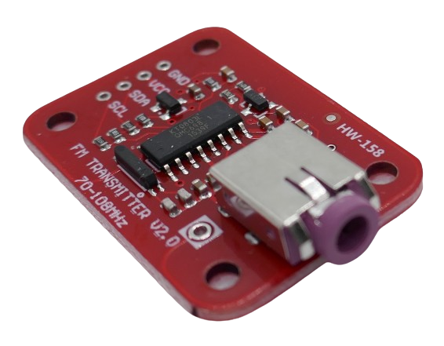
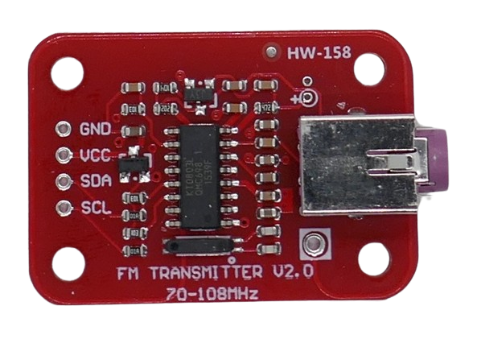

 
# HW-158

> I2C FM-Transmitter Board For Sending Audio Input To Car Radios

*HW-158* is a Wide-FM *transmitter* that can send audio input to a radio frequency in the range of public broadcasting *70-116MHz*. 

It is controlled by a *I2C* interface, uses the latest *KT0803L* "Radio-Station-on-a-Chip" and requires an external microcontroller to operate.

*Transmitting* information on public broadcast bands typically prohibited and requires a *broadcast license*. Some countries (i.e. US) allow transmissions as long as the transmitted distance is low.

Boards like *HW-158* take this into account and emit with *very low RF power* sufficient for distances of just a few meters. With these boards, external audio sources can i.e. be fed into *car radios* that have no auxiliary input:

An external audio source is connected via 3.5mm cinch plug into the *HW-158* module. The module then sends the audio to a preset VHF radio frequency that can be received by any *FM radio set* in close vicinity as if it were a public broadcasting radio station.

> [!CAUTION]
> Always make sure whether operating this board is legal in your country *before* you power it on. There may be substantial fines.

## Pins

The board comes with four solder pads labeled on the front.

| Pin | Description |
| --- | --- |
| GND | negative voltage |
| VCC | 3.0-5.0V |
| SDA | I2C Interface |
| SCL | I2C Interface |

## Technical Data

The actual *transmitter chip* used by the board requires a voltage of *1.6-3.6V*. 

The breakout board adds a *662K* (*XC6206P332MR*) *3.3V* voltage regulator that takes *1.8-6V* and converts it to *3.3V*.

| Item | Description |
| --- | --- |
| Voltage | 1.8-6V |
| Operational Current | <17mA |
| Standby Current | <3uA |
| Frequency | 70-108MHz |
| RF Power | max 1.3mW |
| Interface | I2C, 5V tolerant |
| I2C Address | 0x0111110 |
| Modulation | Wide-FM |
| Chip | KT0803L from KTMicro |
| Features | 20bit Audio ADC, DSP Core, 24dB PGA |
| Size  | 27.7x26.4x7mm |

### KT0803L

The chip that drives this board is the *KT0803L* from *KTMicro*. 

The picture below shows the main chip, and close to the *VCC* connector, you see the *662K 3.3V voltage regulator* that takes the *1.6-6.0V*  input voltage and converts it to the *3.3V* required by the chip:

> [!TIP]
> *KT0803L* is a hardware-compatible *enhanced version* of *KT0803K* and *KT0803M* which in turn base on the *KT0801*. 

These are the added features found in *KT0803L* over its predecessors:

* Software Standby
* Automatic Amplifier Power-Down On Silence
* ALC (Automatic Level Control)
* Better SNR (Stereo 66dB)
* Improved Audio Frequency Response
* Software-controlled XTAL selection

## Software Libraries

Here are a few software libraries on *github* that produce the *I2C* control messages required to set up the *transceiver chip*:

[FMTX](https://github.com/durban77/FMTX)  
[KT0803](https://github.com/RobTillaart/KT0803)  
[KT0803L](https://github.com/ccbruce0812/kt0803l)    

## Data Sheet
[KT0803K Radio-Station-on-a-Chip](materials/kt0803k_datasheet.pdf)  
[KT0803L Radio-Station-on-a-Chip](materials/kt0803l_datasheet.pdf)   
[662K 3.3V Voltage Regulator](materials/662k_datasheet.pdf)

> Tags: FM, WFM, Wide-FM, Sender, Broadcast, KT0801, KT0803L, KT0803K, KT0803M
