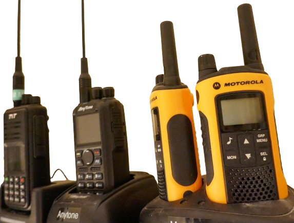
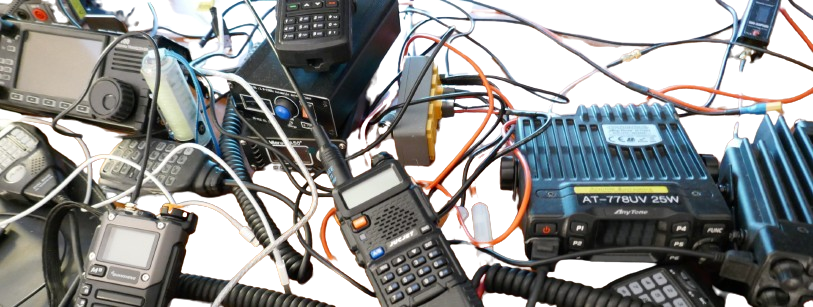

 
# Wireless Data Transmission

> Legal Frequencies, Modulations And Protocols 

*Electromagnetic* waves can invisibly transfer information through the air, and we all use this technology in *smartphones*, *WiFi*, *Walky Talkys* and often even when we grab a *Remote Control* and switch stations on the TV.

When you plan to use *radio waves* to transfer information as part of your *DIY Project*, it is important to understand the *frequencies* that are legal to use, and the schemes in which data can be sent and received.

## Frequencies

Radio waves are emissions to the *public*: anyone in the vicinity can detect and read them. So anyone can also *interfere* with anyone else in a radio spectrum.

> [!NOTE]
> Radio waves can also *harm* innocent bystanders, at least when sent with sufficient transmit power. This is why both *frequency* and *maximum emission power* is strictly regulated in all countries of the world.

### Frequency Allocations

The *ITU* (*International Telecommunications Union*) has devided the world into [three regions](https://transition.fcc.gov/oet/spectrum/ituregions.pdf) with [geographical definitions](https://www.ecfr.gov/current/title-47/chapter-I/subchapter-A/part-2/subpart-B/section-2.104).

Any government can assign national radio allocations. The two most influential agencies based on size of market they impact are the *FCC* in the US and *ETSI* in Europe.

#### Band Plans

Below are *band plans* that allocate frequency ranges for *license-free* radio communications in different regions of the world:

| Area | Band Plan |
| --- | --- |
| Europe | EU433, EU863-870, WiFi, BlueTooth
| South America | AU915-928
| North America | US902-928 |
| India | IN865-867 |
| Indonesia | AS923-925 |
| Malaysia | AS920-923 |

Some regions (like the **EU**) *harmonized* band plans among their members. Other countries regulate individually. The *Asian* region frequently uses *AS923-925* but there are exceptions. Always check for *your* country.

Likewise, *South America* typically uses *AU915-928*. Countries like *Mexico* adopted the *North American* standard *US902-928*.

> [!TIP]
> There may also be additional *national* opportunities. For example, in the **US**, *short range devices* can legally use frequencies as low as *300-390MHz* (i.e. *garage door openers*). In most other areas of the world, this band is exclusively reserved for military.

#### Allocating Frequencies To Services

How complex the actual frequency allocation within a band plan can become [illustrates the picture below](https://www.ntia.doc.gov/files/ntia/publications/2003-allochrt.pdf) (for the US):

To review the individual allocations, a [detailed list](https://transition.fcc.gov/oet/spectrum/table/fcctable.pdf) exists. [Similar lists](https://docdb.cept.org/download/4316) exists for Europe and other regions of the world.

## Freely Usable Radio Frequencies

Fortunately, picking a *legal frequency* for *DIY data transmission* is not hard, though: only a few frequency bands exist that are *free to use* and *do not require licenses* for the purpose of digital data transmission:

| Type | Frequency | Remarks |
| --- | --- | --- |
| Short Range Device (SRD) in Europe/Asia | 433MHz and 868MHz | 10mW at 433MHz/25mW at 868MHz with <1% duty cycle |
| Short Range Device (SRD) in the US | 310MHz and 915MHz (US) | up to 1W |
| Bluetooth | 2.4GHz | internationally harmonized 2-way radio, up to 100mW (depending on Bluetooth standard) |
| WiFi | 2.4GHz | 802.11b/g/n/ax, most often used in WiFi-enabled microcontrollers |
| WiFi | 5GHz | 802.11a/h/ac/ax, very infrequently used in DIY data transmission due to its expense and limited distance |

For *SRD*, complex national regulations exist that govern the maximum emission power, duty cycles and spurious emissions ([see here](https://www.analog.com/en/resources/technical-articles/fcc-and-etsi-requirements-for-shortrange-uhf-askmodulated-transmitters.html) for a technical write-up).

A [very good application note](https://ww1.microchip.com/downloads/en/Appnotes/Atmel-4907-Application-of-315-MHz-Short-Range-Devices_Application-Note.pdf) exists, explaining the *FCC* requirements for *SRD*s in various frequency ranges, including the underdocumented *315MHz* range.

> [!TIP]
> Once you *make sure you are using a legal frequency* (**not** using *315MHz* transmitters in Europe, and **not** using *433MHz* transmitters in the US), and when your transmitter **does not exceed *10mW***, you are most likely fully compliant, and more importantly: *not interfering* with anyone else.

## Use Cases

Just compare your own intended use case with the typical use cases below, and pick the same *frequency* and transmission rules.

### Remote Controls, i.e. Garage Door Openers, Homematic IP, Sensor Transmission, IoT

These are the most typical *short range devices*. They predominantly use these modulations and frequencies: 

Digital *ASK* modulation (*Amplitude-Shift-Keyed*) is commonly used for remote controls. 

* In Europe, 433.92MHz and 868.35MHz are used. The maximum transmit power is limited to *10mW* on *433MHz* (with no duty cycle), and *25mW* for *868MHz* (with a *duty cycle* of below *1%*).

* In the US, *315MHz* is used.

### LoRa - LongRange Transmission

Typically, *short range devices* have a *short range* (which is why they are called that way). However, the regulatory limitation is *low transmit power*. 

*Low transmit power* does not necessarily translate into *low transmission range*, though:

*LoRa* is a proprietary radio transmission protocol specifically designed to provide a **high** *transmission range* despite using a **low** transmission energy.
 

This paradoxon is achieved by supporting a *mesh architecture* where other *LoRa* devices can pick up and forward the signal, and by *reducing the data transmission rate* to make it more fault tolerant and resilient to noise.

* In Europe, *LoRa* typically uses *863-870MHz*, less frequenly *433MHz*. The maximum transmission power is *40mW* at a *1% duty cycle* (devices can transmit only 1% of the time).

* In the US, *LoRa* uses *902-928MHz*. The maximum transmission power is *1W* with a *400ms dwell time* (a maximum of *400ms* transmission time).

> [!CAUTION]
> This is a rough advisory, there are additional rules and requirements. The legal frequency range is for example organized in *channels* with designated *band widths*, and the use of channels may be restricted to specific tasks, i.e. *upload* or *download*, among other requirements.

### WiFi

*WiFi* is typically used to create a computer network and enable multiple devices to talk to each other. 

Since *WiFi* supports *mesh technology*, it is simple to cover a large area by using multiple *access points*.

Modern microcontroller boards like *ESP8266* and *ESP32* come with *WiFi*-functionality built-in. They can act as *access point* (setting up a new wireless network), *station mode* (joining an existing wireless network), and both modes combined.

By using *WiFi* to communicate, you are benefitting from a number of advantages:

* **Reach:** within the covered area of your *WiFi* network, reliable high speed data transmission is possible. The covered area can easily be extended by adding more meshed access points.
* **Legal:** *WiFi* is using an internationally harmonized frequency range. The typical WiFi standards are supported and legal to operate in most parts of the world.
* **Transparent Transmission:** you don't actually need to care much about implementing the data transport layer. Instead, your firmware can communicate with other devices inside your own WiFi or anywhere else on the world (provided your WiFi is connected to the Internet) simply by using http requests.

*WiFi* is *not* a premier option if you:

* want to use microcontroller boards that do not have *WiFi* built-in (i.e. *Arduino*)
* want to bridge areas not covered by your *WiFi* (i.e. sending data from your house to your neighbors house)

### Bluetooth

Bluetooth is a two-way transmission standard commonly used to exchange data between two devices. For this, the devices are *coupled* before they can communicate with each other.

Many modern microcontroller boards come with *Bluetooth* transceivers built-in. This enables you to create your own *Bluetooth* controllers or controlled devices.

In fact, you can use *Bluetooth* also *on both ends*, i.e. use a Bluetooth-enabled microcontroller board on both ends of your communication. 

Starting with *Bluetooth 5.0*, the emission power is up to *100mW*, which can gap distances of up to *40m* indoors and *200m* outdoors.

Bluetooth is using the same internationally harmonized *ISM* frequency band as WiFi (2.4GHz).

## Picking Frequencies
Picking an appropriate frequency is the initial and fundamental step in designing a *radio project*:

* **Legal:** you *must* pick a frequency that is *legal to use* in your country. Else, you may be *interfering* with other services, and may become *liable* for damages you cause. In addition, (severe) legal punishment is possible even if the risk of ham and detection *may be* low with *low emission* devices.
* **Technical:** when you have the *choice* of multiple *legal* frequencies, your *use case* determines which one to choose. The *lower* a radio frequency the better can it pass buildings (walls, doors). The *higher* a frequency the more does it need a *free line of sight*. For example, if you live in a densly populated city in *Europe*, the *433MHz* band can pass buildings better than the *815MHz* band. If you'd like to set up *data transmission* with free *line of sight* between sender and receiver, the *815MHz* band works better (because of lower interference from other services in the same band).

> [!NOTE]
> *WiFi* frequencies are largely harmonized across the world. They are the only *wireless technology* that has no fundamental regional regulations to watch out for (even though the use of *selected WiFi channels* may be limited to some regions).

## Maximum Emissions

The more radio power a transmitter emits, the greater is the distance it can gap, but also the greater is the area in which it can cause interference.

With *DIY projects*, most breakout transmitter boards use very low transmission power (typically *<10mW*). At this level, *interference* and *bodily harm* are very unlikely.

When picking hardware, transmission power can be defined in a number of units:

### Watt and +dBm
The maximum legal emission power can for example be quantified in *raw emission power* expressed either in *Watt* or in *dBm* (which is essentially the same, just *logarithmic*), i.e. *10mW/+10dBm*, *100mW/+20dBm* or *10W/+40dBm*.

Both *Watts* and *dBm* are focusing on the properties of the *sender*.

### Effective Radiated Emission (ERP)
**ERP** (*Effective Radiated Power*) is a more meaningful parameter: it views the *effective* radiated power at the *receivers side*. 

This also takes into account the kind of *antenna* the *sender* is using, and its *directivity*: When you connect a highly directional *antenna*, the total radio power is radiated in one narrow direction, just like *light* in a highly focused *flash light* or a *laser beam*. 

> [!TIP]
> If you are restricted by a certain emission threshold but *free to use* any antenna you like, then using a highly directional antenna can multiply the distance you can gap by multitudes.

### Security By Obscurity
While extending the reach through more radio power sounds great at first (*"the more the better"*), it not only extends the area in which you can *interfere* with others. It also extends the area in which others can *listen in* and *spy* on your transmissions.

A low ERP and a low maximum radio distance does not only *limit interference with others*. It also *shields you from others* and often is much more effective than *encrypting* data transmissions.

For most use cases, a high radio power is not needed and even counter-productive: your *garage door opener* in *Germany* typically does not need to be received in *Argentina*. Especially with *DIY* projects, a tiny *ERP* may be all you need to gap the few meters or 100m you need for your project.

## Free Voice Radio Frequencies

There are additional free-to-use radio frequencies designated for analog and/or digital *voice communications* (i.e. walky talkys):

| Name | Frequency | Wave Length |
| --- | --- | --- |
| CB (Citizen Band) | 27MHz | 11m |
| FreeNet | 149MHz | 2m |
| MURS (Multi-Use Radio Service) | 151-154MHz | 2m |
| LPD (Low Power Device Voice) | 433MHz | 70cm |
| PMR (Personal Mobile Radio) | 446MHz |  70cm |
| FRS (Family Radio Service) | 462-467MHz | 70cm |
| GMRS (General Mobile Radio Services) | 462-467MHz | 70cm |

> [!NOTE]
> The table presents an overview only. Additional rules exist. For example, *FreeNet* is available in *Germany* only. *PMR* is available in the *EU*. *FRS*, *GMRS*, and *MURS* are available in the *US*. *GMRS* requires an (easy to obtain) license. For *MURS*, additional regulations apply.

> [!CAUTION]
> These frequencies are *not usable* for *DIY projects* as they are *highly regulated*, require *certified devices* and prohibt the transmission of radio data other than voice.

### Amateur Radio (HAM)
Licensed *radio amateurs* are private persons that went through classes, took a test and received a certification ensuring they technically know precisely how radios work and how to not interfere with other radio services.

Radio amateurs typically are *enthusiasts* with a strong focus on radio *technology*.

Radio amateurs can use a large number of additional frequency bands, and emit radio power up to many kilowatts, but solely for *experimental purposes* related to *radio communications*. 

This includes *DIY* projects, however strictly related to *radio amateur purposes*. A *licensed radio amateur* cannot for example use his or her special privileges to transmit personal weather station data on a privileged frequency - except if this weather data is used in close relation to experiments testing radio emissions under different weather conditions.

> Tags: Frequency, Garage Door Opener,  Band Plan, WiFi, FreeNet, LPD, PMR, FRS, GMRS, MURS, 315MHz, 433MHz, 868MHz, 915MHz, LoRa, SRD

[Visit Page on Website](https://done.land/components/datatransmission/wireless?054116041215245756) - created 2024-04-15 - last edited 2024-04-15
