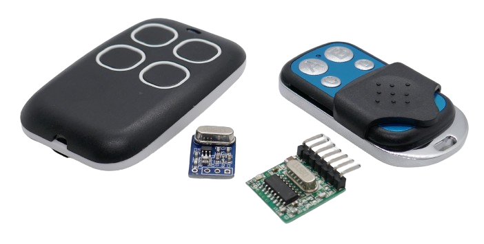

 
# 433 MHz Radio Communications

> Use Mini Senders and Receivers To Transmit Data Over The Air

In *Europe*, band plan *EU433* allows anyone to transmit data with a maximum power of *10mW* on *433MHz*. 

> [!CAUTION]
> If you live outside *Europe*, different band plans exist in your region. In North America for example, use *300MHz* devices.

> [!NOTE]
> Even though this is an article about using the *European* frequency of *433MHz*, you can easily adapt it to other regions. Just order the breakout boards in the frequency you need. All principles, sketches and code examples presented here work with breakout boards for *any* frequency.

## Senders

*Senders* actively transmit a *RF* signal on a given frequency.

In your *DIY* projects, you can build *senders* yourself using tiny *breakout boards*, or you can use *ready-to-use* senders (*RF* remote controls):

Just make sure you pick devices with the intended *RF frequency*. Typically, devices support just *one frequency range*, for example *433MHz* or *300MHz*.

## Receivers

As with the *senders*, on the receiver side you can again choose whether to pick a tiny *receiver breakout board*, or whether to use *ready-to-go* *receivers* that come with built-in *relais* to control external devices:

> [!NOTE]
> There are also breakout boards available that can act both as *sender* and as *receiver*. This way, you can implement *two-way communications*, too.

> Tags: Frequency, RF,  433MHz, 300MHz, Sender, Receiver

[Visit Page on Website](https://done.land/components/datatransmission/wireless/radio/433mhz?512393041001243228) - created 2024-04-01 - last edited 2024-04-01
