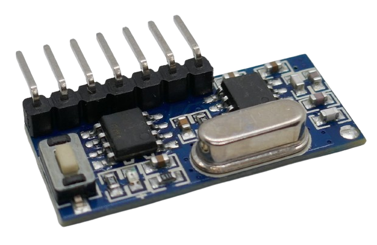
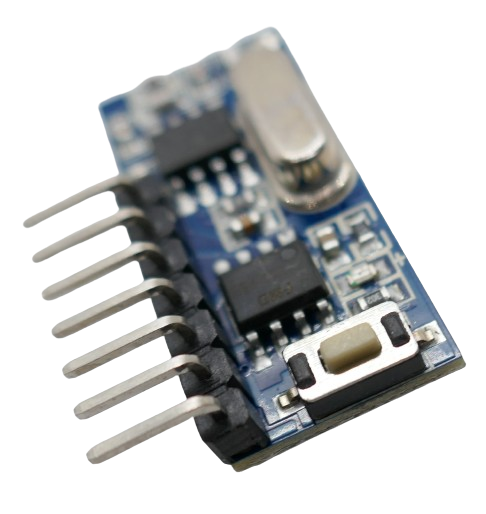

 
# RX480-E

> Self-Learning 4-Channel EV1527-Compliant Receiver With Latch- And Push-button Mode 

The *RX480-E* breakout board is a one-stop solution to add remote control capabilities to devices.

This receiver does not require any additional external components to pick up and interpret control signals sent by a *EV1527*-compliant *remote control*.

The breakout board often comes bundled with a ready-to-use *remote control*.

## Pairing

The *receiver* needs to be *paired* with the remote control that you want to use with this *receiver*.

To enter *pairing mode* (aka *learning mode*), press the button on the front side of the receiver.

Once *pairing mode* is active, the on-board *LED* is constantly on.

Now press *any button* on the remote control you want to pair. The *receiver LED* blinks three times to confirm successful pairing.

From now on, when you press a button on the remote control, the appropriate *data out pin* will switch to *HIGH*.

## Setting Latch Mode

By default, the *receiver* is in *push button mode*: the output pin is *HIGH* only for as long as the button on the *remote control* is pressed. Once the button is released, the output pin returns to *LOW* - just like a *push button* or *momentary switch* would behave.

The board can operate in three different latching modes:

* **Push button:** the selected channel is *on* only for as long as the remote control signal is received.
* **Self-Locking:** each time the board receives a code, it *toggles* from *on* to *off* and vice versa.
* **Mutual Exclusive:** like *self-locking*, but once a different channel becomes active, the channel falls back to *off*. In this mode, only *one* channel is active at any time.

### Reset Required

Before you can change the latch mode, you *must* reset the *receiver*. If you do not reset the receiver, the latch mode will stay put.

To reset the *receiver*, press the button *eight* times. The *LED* will blink four times to indicate successful reset.

### Set Latch Mode

To set a new latch mode, press the button *once*, *twice*, or *three times*:

| Mode  | Key Press | 
| --- | --- | 
| Push Button Mode | 1x  | 
| Self-Locking Mode | 2x | 
| Multually Exclusive Self-Locking | 3x  |  

This will set the latch mode and also immediately enter *pairing mode*: the *LED* lights up and waits for you to press any key on the *remote control* you want to pair. Once successfully paired, the *LED* blinks *three times*.

## Technical Data

| Item | Value |
| --- | --- |
| Voltage | 3.3-5V |
| Frequency | 433MHz *or* 315MHz |
| Operating Current | 5mA |
| Modulation Mode | AM (OOK) |
| Transmission Rate | EV1527 |
| Size | 28x12.3x5mm |

## Pins
The board comes with *seven* pins plus a solder pad for an *antenna* that is marked as *ANT* on the back side.

> [!TIP]
> For much better reach, always operate these devices *with an antenna*. If no designated antenna is at hand, use a plain *17.3cm* wire for *433MHz*, and a *23.8cm* wire for *315MHz*.

The pins are labeled on the back of the board:

| Pin | Tag | Description |
| --- | --- | --- |
| 1 | GND | negative pole |
| 2 | +V | +3.3-5V |
| 3 | D0 | high when received code 1 |
| 4 | D1 | high when received code 2 |
| 5 | D2 | high when received code 3 |
| 6 | D3 | high when received code 4 |
| 7 | VT | high when received any valid code |

> Tags: EV1527, Receiver, RF, 315MHz, 433MHz

[Visit Page on Website](https://done.land/components/datatransmission/wireless/shortrangedevice/am/ask/ev1527/receiver/rx480e-4?575872040920243620) - created 2024-04-19 - last edited 2024-04-19
