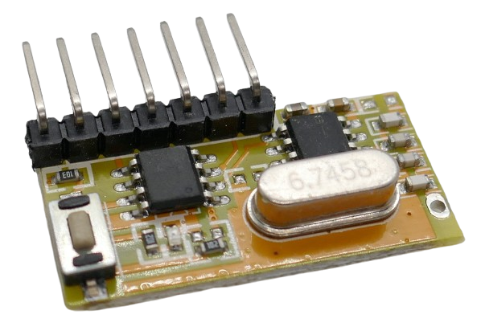
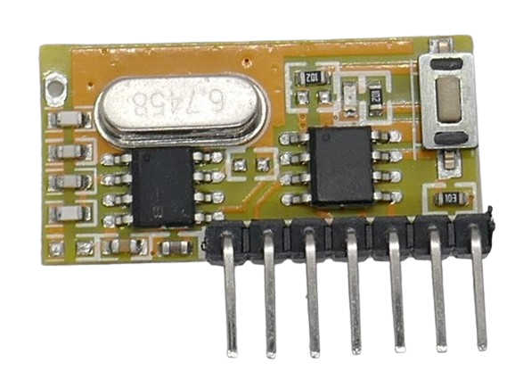

 
# RXC6

> Self-Learning 4-Channel EV1527-Compliant Receiver With Latch- And Push-button Mode 

The *RXC6* breakout board is a four-channel *EV1527*-compliant *receiver* and can be controlled with *EV1527*-compliant *remote controls* (senders).

It uses the *SYN470R* receiver chip and comes with a built-in *EV1527* decoder to decode  24-bit data packets sent by a *EV1527*-compliant remote control (*sender*).

The breakout board frequently comes bundled with a *RXB14 sender* breakout board. 

## Different Hardware Versions

*RXC6* comes in a variety of hardware versions. The old versions all have two solder bridges marked *T1* and *T2* that can be used to set the *latch* mode.

The latest hardware version (marked *V4* on the back of the board) does not have these solder bridges anymore. The latch mode is set by software instead. The documentation for older version no longer applies to this new version.

> [!NOTE]
> The latest hardware *version 4* of *RXC4* really appears to be identical to *RX480E-4*. 

## Pairing

The *receiver* needs to be *paired* with the remote control that you want to use with this *receiver*.

To enter *pairing mode* (aka *learning mode*), press the button on the front side of the receiver.

Once *pairing mode* is active, the on-board *LED* is constantly on.

Now press *any button* on the remote control you want to pair. The *receiver LED* blinks three times to confirm successful pairing.

From now on, when you press a button on the remote control, the appropriate *data out pin* will switch to *HIGH*.

## Setting Latch Mode

By default, the *receiver* is in *push button mode*: the output pin is *HIGH* only for as long as the button on the *remote control* is pressed. Once the button is released, the output pin returns to *LOW* - just like a *push button* or *momentary switch* would behave.

The board can operate in three different latching modes:

* **Push button:** the selected channel is *on* only for as long as the remote control signal is received.
* **Self-Locking:** each time the board receives a code, it *toggles* from *on* to *off* and vice versa.
* **Mutual Exclusive:** like *self-locking*, but once a different channel becomes active, the channel falls back to *off*. In this mode, only *one* channel is active at any time.

### Reset Required

Before you can change the latch mode, you *must* reset the *receiver*. If you do not reset the receiver, the latch mode will stay put.

#### Old Hardware Versions

For the old hardware versions (those with solder bridges *T1* and *T2*), press and hold the button on the *receiver* until the *LED* lights up. Keep pressing the button for a few more seconds until the *LED* turns off again.

#### New Hardware Versions (V4 and better)
Press the button *eight* times. The *LED* will blink four times to indicate successful reset.

### Setting New Latch Mode

In older hardware versions with solder bridges marked *T1* and *T2*, the latch mode is set by opening or closing these solder bridges:

| T1 | T2 | Mode |
| --- | --- | --- |
| open | open | Push Button |
| open | closed | Self-Locking |
| closed | closed | Mutual Exclusive |

In newer hardware versions (with missing *T1* and *T2* solder bridges), latch mode is set by pressing the button *once*, *twice*, or *three times*:

| Mode  | Key Press | 
| --- | --- | 
| Push Button Mode | 1x  | 
| Self-Locking Mode | 2x | 
| Multually Exclusive Self-Locking | 3x  |  

This will set the latch mode and also immediately enter *pairing mode*: the *LED* lights up and waits for you to press any key on the *remote control* you want to pair. Once successfully paired, the *LED* blinks *three times*.

> [!CAUTION]
> You **must** perform the device *reset* (as described above) in order to switch latch mode. If you do not reset the device, pressing the button any number of times will just enter the *pairing* mode but not change the *latch* mode.

## Technical Data

| Item | Value |
| --- | --- |
| Voltage | 3.3-5.5V |
| Frequency | 433MHz *or* 315MHz |
| Operating Current | <4.1mA |
| Sensitivity | -110dBm |
| Modulation Mode | AM (OOK) |
| Transmission Rate | EV1527 |
| Size | 28x12.5x5mm |

## Pins
The board comes with *seven* pins plus a solder pad for an *antenna* that is marked as *ANT* on the back side.

| Pin | Tag | Description |
| --- | --- | --- |
| 1 | GND | negative pole |
| 2 | +V | +3.3-5.5V |
| 3 | D0 | high when received code 1 |
| 4 | D1 | high when received code 2 |
| 5 | D2 | high when received code 3 |
| 6 | D3 | high when received code 4 |
| 7 | VT | high when received *any* valid code |

## Data Sheet

[SYN470R Receiver](materials/syn470r_datasheet.pdf)   
[Manual for *old* version](materials/manual.pdf)   
[YouTube Video for *old* version](https://www.youtube.com/watch?v=YsRBN86cis8)

> Tags: ASK, OOB, EV1527, Receiver, RF, Remote Control

[Visit Page on Website](https://done.land/components/datatransmission/wireless/shortrangedevice/am/ask/ev1527/receiver/rxc6?701775041521242841) - created 2024-04-20 - last edited 2024-04-20
