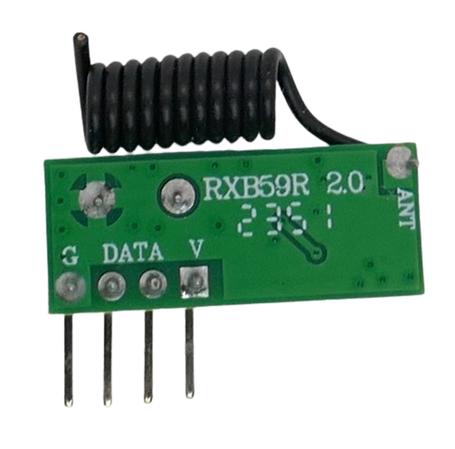

 
# AK-RXB59R

> Superheterodyne ASK (Digital AM) Receiver With Great Sensitivity

The *AK-RXB59R* is a superheterodyne *ASK receiver* based on the *CMT2220LS* receiver chip that can pick up signals sent out by *ASK senders* and most *remote controls*.

> [!NOTE]
> The receiver does not come with a dedicated *EV1527 encoder chip* on board which makes the receiver versatile (it can receive any type of *ASK-encoded* data) but requires a separate *microprocessor* to decode the received data.

The board is very small and easily integrateable into *DIY projects*.

## Frequency

The board exists both for *315MHz* (US) and *433.92MHz* (Europe, other regions). The frequency is determined by the *crystal* used. 

By looking at the top of the *crystal*, the supported frequency can be implied:

| Crystal frequency | Receiver frequency |
| --- | --- |
| 9.81563MHz | 315MHz |
| 13.52127MHz | 433.92MHz |

## Pins

The board comes with pre-soldered four pins labeled on the back.

| Pin | Label | Description |
| --- | --- | --- |
| 1 | G | GND (negative voltage) |
| 2, 3 | DATA | Data Out |
| 4 | V | 3.6-5.5V |

> [!TIP]
> Pins *2* and *3* are internally the same (inter-connected). There is just *one* data output that is *HIGH* when receiving a signal.

> [!CAUTION]
> Make sure the power supply is properly filtered and carries no exceptional noise which could interfere and distort reception.

## Antenna

The board comes with a pre-soldered coiled wire-antenna (22.6cm for 315MHz and 17cm for 433MHz).

## Technical Data

| Item | Description |
| --- | --- |
| Voltage | 3.6V-5.5V |
| RX Sensitivity | -107dBm |
| Working Current | <5.3mA |
| Modulation | ASK (AM) |
| Frequency | 315MHz or 433.92MHz |
| Chip | CMT2220LS |
| Data rate | 1-5kbps |
| Size  | 24x10x5mm |

## Data Sheet
[CMT2220LS](materials/cmt2220ls_datasheet.pdf)

> Tags: Superheterodyne,Receiver,ASK,AM

