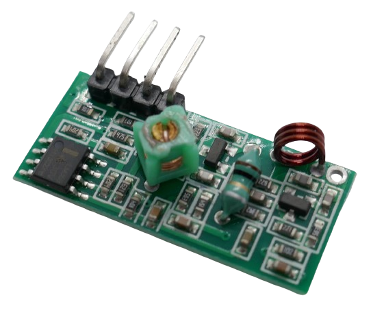
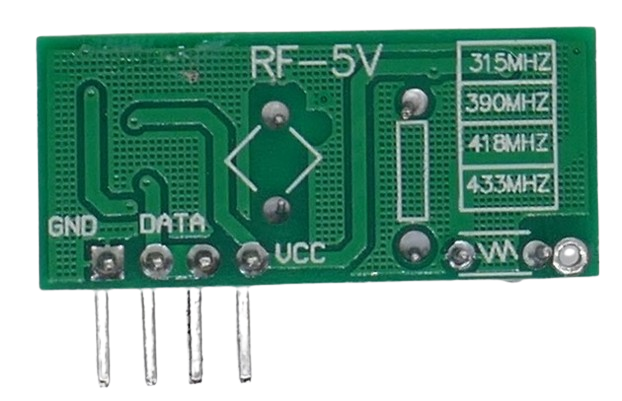
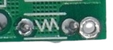

 
# MX-RM-5V / RF-5V

> Super-Regenerative ASK (Digital AM) Receiver

The *MX-RM-5V* breakout board is the European *433.92MHz* version, and the *RF-5V* is the US *315MHz* version.

It is primarily used in *remote control* solutions.

## Versions

Two versions exist:

* **315MHz (US market):** this board is marked *RF-5V* on the back side. On the front side, a big 0.5W resistor is soldered on the board.
* **433.92MHz (European market):** this board is marked *MX-RM-5V* on the back. There is no big resistor soldered on the front side.

## Pins

The board exposes four pins that are labeled on the back:

| Pin | Label | Description |
| --- | --- | --- |
| 1 | GND | negative voltage |
| 2,3 | DATA | Data Out |
| 4 | VCC | 5V |

> [!CAUTION]
> Make sure the power supply is properly filtered and carries no exceptional noise which could interfere and distort reception.

## Antenna

This receiver can be operated without an antenna (which limits reception to just a few meters). For better reception, an antenna must be soldered.

[Here is](https://www.instructables.com/433-MHz-Coil-loaded-antenna/) how to create a simple coil-loaded antenna.

The antenna needs to be soldered to the unmarked through-hole connector on the lower right edge of the board, next to the inductive loop.

> [!TIP]
> Make sure your board has a soldered copper inductive loop has *three* windings. There have been reports of partially incorrectly assembled boards that use the *eight* winding coils designed for the *transmitter board*.

## Technical Data

| Item | Description |
| --- | --- |
| Voltage | 3-8V, 5V preferred |
| Current fully operational | 4mA |
| Frequency | *315MHz* or *433.92MHz* |
| RX Sensitivity | -105dBm |
| Modulation | ASK (AM) |
| Data rate | <10kbps |
| Distance | few feet (w/o antenna), 30-50m (with antenna) |
| Size  | 30.3x13.8x7mm |

> Tags: Receiver,ASK,OOK,AM,RF-5V

