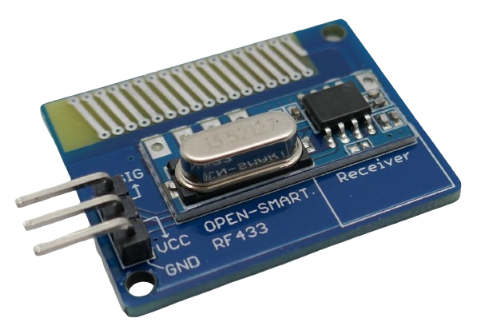
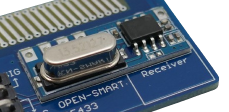
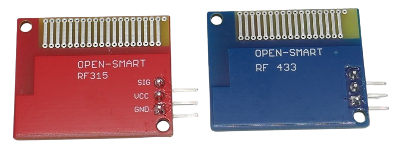

 
# OpenSmart ASK Receiver

> Questionable RF Receiver For *ASK* Modulation With PCB Antenna 

The company *OpenSmart* released this *ASK* receiver with an unmarked receiver chip and poor documentation. 

The receiver is sold as a kit together with a sender board and is available in separate versions for *315MHz* (US) and *433MHz* (Europe).

The actual *receiver* is located on a separate and much smaller board that is soldered onto a bigger bpard which only purpose apparently is to provide a *PCB antenna*.

While *PCB antennas* certainly are convenient and compact, they are not efficient, limiting the distance that can be reached. During build time and testing, make sure you *do not touch* the antenna or hold the breakout board in a way that covers the antenna.

The way how the *receiver* board is piggy-backed into a relatively huge *antenna board* makes this solution the most clumsy of all reviewed.

> [!NOTE]
> Apparently, the company *OpenSmart* uses these modules in various combinations together with other boards to make them wirelessly controllable. For example, *OpenSmart* also sells wireless joystick and sensor boards that use the same fundamental *sender* and *receiver* boards.

> [!CAUTION]
> The company *OpenSmart* advertises this board as *"Long-Range Receiver"* and even as *"LORA Board"*. This board is neither able to receive RF signals over long distances nor does it implement *LoRa* modulation. It is simply a cheap and very simple *ASK* receiver.

> [!TIP]
> The *RF frequency* of the board on is printed on the front side. The *433MHz* version uses *blue* boards, and the *315MHz* version uses *red* boards.

## Technical Data

| Item | Value |
| --- | --- |
| Voltage | 2.0-5.5V |
| Frequency | 433MHz *or* 315MHz |
| Working Current | 2mA |
| Modulation Mode | AM (OOK) |
| Transmission Rate | 2 Kbps |
| Sensitivity | -110dBm
| Transmission Distance | <50m at 5V |
| Size | 24x30x7mm |

## Pins
The board comes with *three* pins.

| Pin | Tag | Description |
| --- | --- | --- |
| 1 | SIG | Data In |
| 2 | VCC | 5V |
| 3 | GND | negative pole |

## Library

The vendor suggests to use the [VirtualWire](https://github.com/song940/VirtualWire) software library.

> Tags: ASK, OOK, Receiver, RF, 315MHz, 433MHz, 5V

