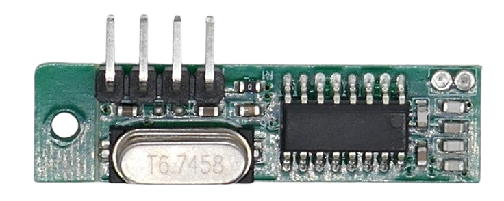

 
# RX470-4

> Small Superheterodyne RF ASK Receiver With Good Sensitivity

The *RX470-4* receiver breakout board is the successor of the *WL101-341* board with better stability and improved data transfer.

> [!NOTE]
> This *receiver* is often sold as a kit together with the *sender* *WL102-341*.

## Technical Data

| Item | Value |
| --- | --- |
| Voltage | 2.2-5.0V |
| Frequency | 433MHz *or* 315MHz |
| Operation Current | 2.1mA |
| Modulation Mode | AM (OOK) |
| Sensitivity | 110dBm, built-in LNA |
| Data transfer rates | 2-10kbps
| Distance | 20-100m  |
| Size | 30x9x1mm |

## Pins
The board comes with *four* pins labeled on the back side.

| Pin  | Description |
| --- | --- |
| - | negative voltage/GND|
| + | 2.0-4.6V |
| DAT | data in |
| EN  | enable pin, not connected |

## Antenna

The antenna needs to be soldered to the solder pad marked *ANT* (marked on the back side of the board).

> [!TIP]
> Always operate senders *with an antenna*. If no designated antenna is at hand, use a plain *17.3cm* wire for *433MHz*, and a *23.8cm* wire for *315MHz*.

## See Also

[Documentation](https://www.ozeki.hu/p_6034-information-about-433-mhz-modules.html)

> Tags: Receiver, RF, 315MHz, 433MHz, ASK, AM, Superheterodyne

