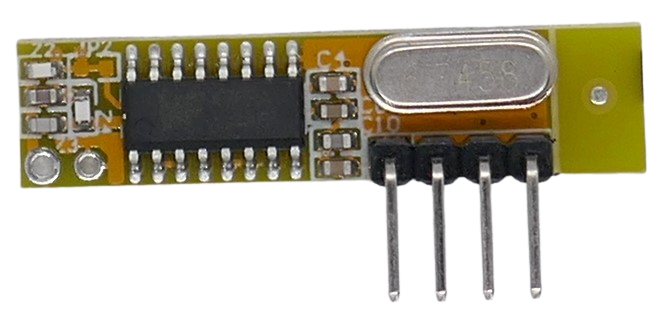

 
# RXB12

> Superheterodyne ASK (Digital AM) Receiver With Sweep Mode

The *RXB12* breakout board is based on the *SYN470R* single-chip *antenna-in to data-out* solution. 

> [!NOTE]
> The receiver does not come with a dedicated *EV1527 encoder chip* on board which makes the receiver versatile (it can receive any type of *ASK-encoded* data) but requires a separate *microprocessor* to decode the received data.

## Frequency

The *receiver chip* supports a frequency range from 300MHz to 440MHz. The fixed frequency is set via a crystal:

| Crystal frequency (MHz) | RX frequency (MHz) | Remarks |
| --- | --- | --- |
| 4.8970 | 315 | US |
| 6.0630 | 390 | |
| 6.4983 | 418 | |
| 6.7458 | 433.92 | Europe |

## Pins

The board exposes four pins that are labeled on the back:

| Pin | Label | Description |
| --- | --- | --- |
| 1 | VCC | 3.3-5.5V |
| 2 | DAT | Data Out |
| 3 | GND | negative voltage |
| 4 | ANT | Antenna |

> [!CAUTION]
> Make sure the power supply is properly filtered and carries no exceptional noise which could interfere and distort reception.

## Antenna

There is no antenna mounted. Make sure to add an antenna or else the board will have poor reception.

For example, solder a wire to the *ANT* antenna solder pad (17cm for 433MHz).

## Technical Data

| Item | Description |
| --- | --- |
| Voltage | 3.3V-5.5V |
| Current fully operational | 2.5mA @ 315MHz |
| Current polled operation | 250uA (10:1 duty cycle) |
| Current shutdown | 0.9uA |
| Frequency | 300-440MHz, breakout boards are set to one specific frequency via a crystal |
| RX Sensitivity | -107dBm @ 433MHz, -106dB @ 315MHz |
| Modulation | ASK (AM) |
| Chip | SYN480R |
| Data rate | 2.5kbps (sweep mode), 10kbps (fixed frequency) |
| Size  | 17.2x11.8x5mm |

## Data Sheet
[SYN470R](materials/syn470r_datasheet.pdf)

> Tags: Receiver,ASK,OOK,AM,SYN470R

