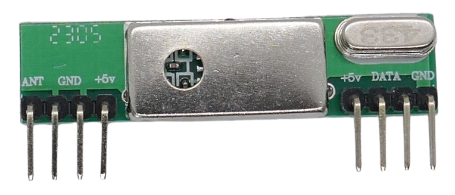

 
# RXB6

> Reliable ASK (Digital AM) Superheterodyne Receiver With Good Sensitivity 

The *RXB6* breakout board is a reliable *ASK* receiver with good sensitivity. 

## Pins

The board exposes eight pins in two groups of four pins. All pins are labeled on the front side.

| Pin | Label | Description |
| --- | --- | --- |
| 1 | ANT | Antenna |
| 2,3,8 | GND | Ground |
| 4,5 | +5V | 3.0-5.5V |
| 6,7 | DATA | Data Out |

Many pins are exposed in duplicates. As all *ASK* receivers, there are essentially just three pins to connect: power supply (*+5V* and *GND*), and data out (*DATA*).

> [!CAUTION]
> Make sure the power supply is properly filtered and carries no exceptional noise which could interfere and distort reception.

## Antenna

There is no antenna mounted. Make sure to add an antenna or else the board will have poor reception.

For example, solder a wire to the *ANT* pin (17cm for 433MHz).

## Technical Data

The receiver chip is covered under a metal shield plate.

| Item | Description |
| --- | --- |
| Voltage | 3.0V-5.5V |
| Current fully operational | 6mA |
| Frequency | 300-930MHz, breakout boards are set to one specific frequency via a crystal |
| RX Sensitivity | -110dBm |
| Modulation | ASK (AM) |
| Data rate | 10kbps |
| Size  | 43.2x12.3x5.3mm |

## Data Sheet

[RXB6 ASK Receiver](materials/rxb6_datasheet.pdf)

> Tags: Receiver,ASK,OOK,AM

