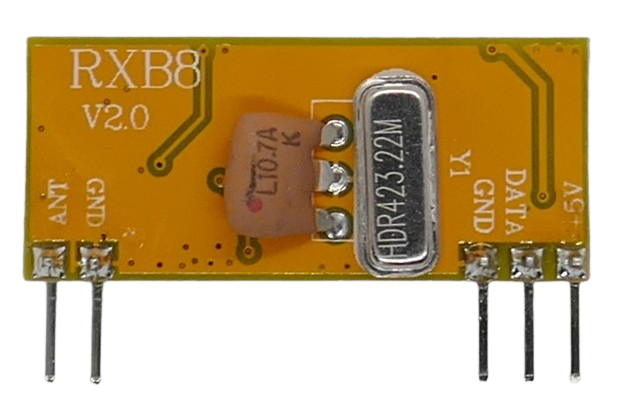
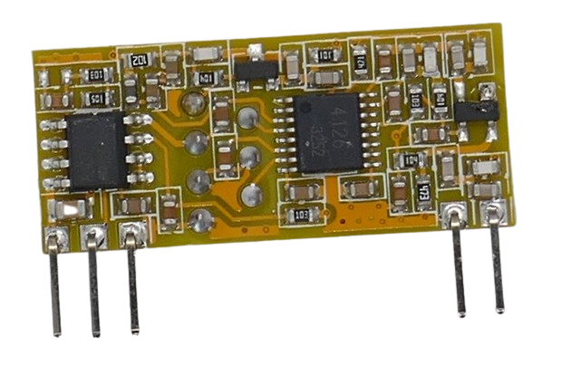

 
# RXB8

> Superheterodyne ASK (Digital AM) Receiver With Design Issues But Good Reception 

The *RXB8* breakout board is based on the *SYN4126*/*HB4126* single-chip solution. 

## Design Weaknesses

*SYN4126* seems to be out of production for a long time. No data sheets or other information about seems to be available.

What seems evident though is that this chip was originally designed to transmit in *FM* modulation. 

In this board, the *RSSI* output is used instead to decode *ASK* (*AM*) signals. 

This limits the minimum impulse widths (and thus the maximum data rate). Impulses of 350us and shorter can become accidentally widened by the way how RSSI signals are processed.

## Pins

The board exposes five pins, two on the left side and three on the right side. Pins are labeled on the front side of the board:

| Pin | Label | Description |
| --- | --- | --- |
| 1 | ANT | Antenna |
| 2 | GND | Ground |
| 3 | GND | Ground |
| 4 | DATA | Data Out |
| 5 | +5V |  4.5-5.5V |

> [!CAUTION]
> Make sure the power supply is properly filtered and carries no exceptional noise which could interfere and distort reception.

## Antenna

There is no antenna mounted. Make sure to add an antenna or else the board will have poor reception.

For example, solder a wire to the *ANT* pin (17cm for 433MHz).

## Technical Data

| Item | Description |
| --- | --- |
| Voltage | 4.5V-5.5V |
| Current fully operational | 12mA |
| Frequency | 300-440MHz, breakout boards are set to one specific frequency via a crystal |
| RX Sensitivity | -111dBm |
| Modulation | ASK (AM) |
| Chip | SYN4126 |
| Data rate | 10kbps |
| Size  | 31.5x14x7mm |

> Tags: Receiver,ASK,OOK,AM, SYN4126

