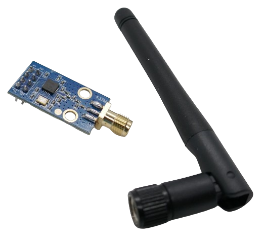
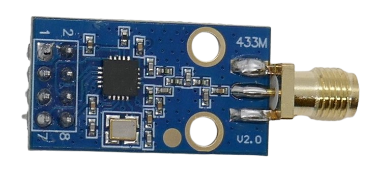

 
# E07-M1101D

> 10mW FSK Transceiver With Wide Frequency Support, SPI Interface And High Speed Data Transfer Based On CC1101

This is a transceiver module based on the *CC1101* transceiver chip from *Texas Instruments* that can be programmed via *SPI* interface and sends/receives in the 387-464MHz range. It comes with an *SMA* terminal to attach an external antenna. The theoretical distance this device can cap is estimated at *500m-700m*.

It uses *FSK* modulation which is based on *frequency modulation* (*FM*). It is incompatible with simple remote controls which use *ASK* (*AM*).

The *E07-M1101D* is a good choice when you want to design your own high speed two-way data transfer system, i.e. to send sensor data or text messages.

> [!NOTE]
> This board is also known as *AS07-M1101D* and *AS07-M1101D-SMA* 

## Frequency Range And Channels
The board can *send and receive* in a frequency range of *387-464MHz*.

Its maximum transmitting power is +10dBm/10mW, and the receiver sensitivity is good with *-112dBm*. In free *line of sight*, distances of roughly *500m* can be bridged.

## Specs

| Item | Value |
| --- | --- |
| Voltage | 1.8-3.6V |
| Frequency | 387-464MHz |
| Output Power | 10dBm / 10mW |
| Modulation | 2-FSK, GFSK, MSK |
| Standby Current |  |
| Sleep Current |  |
| Operating Current | 30mA, power supply >100mA |
| Transmission Rate | 1.2-500kbps |
| Receiver Sensitivity | -112dBm @ 1.2kps |
| Extras | RSSI signal detection, hardware CRC, carrier sense, 64-byte RX and TX buffer |
| Interface | SPI |
| Size | 15x28/38x10mm |

## Connectors

The board comes with a male 2x4 pin adapter. Pins are clearly marked on the front side:

| Pin | Tag | Description |
| --- | --- | --- |
| 1 | GND | negative voltage |
| 2 | VCC | +3.3V |
| 3 | GDO0 | I/O |
| 4 | CSN | SPI |
| 5 | SCK | SPI |
| 6 | MOSI | SPI |
| 7 | MISO | SPI |
| 8 | GDO2 | I/O |

### Antenna

There are different versions of this board available: the antenna is either fixed to the board (coil antenna), or a *SMB* connector allows connection of an external antenna.

### Interface

This board uses the *SPI* interface to communicate with a microcontroller.

### Data Sheet

[C1101 from Texas Instruments](materials/c1101_datasheet.pdf)

> Tags: CC1101, E07-M1101D, AS07-M1101D, Sender, Receiver, Transceiver, RF, 433MHz, 3.3V, SMD

