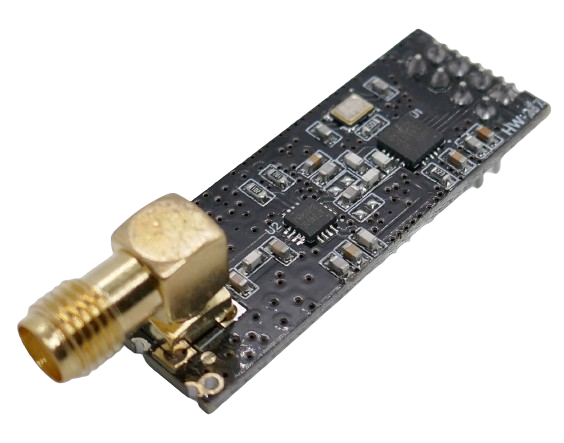
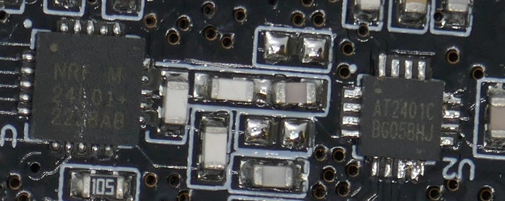
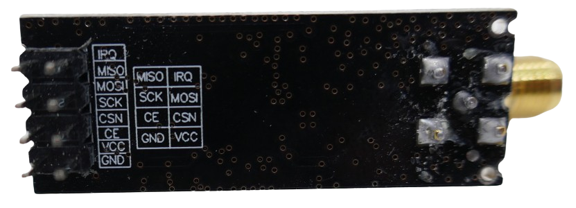
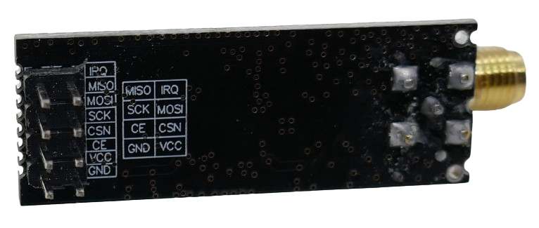

 
# HW237

> Power-Saving High Efficiency 2.4GHz GFSK Transceiver Based On Nordic NRF24L01 

The *HW237* uses the *Nordic nRF24L01+* transceiver and provides powerful *GFSK*-modulated data transmission on the *2.4GHz license-free ISM band*.



This board features an integrated programmable PA (RF amplifier) that can boost the chips' *1mW* RF output power to *100mW*. It also comes with an *LNA circuit* for better reception.

Based on data rate, the board can reach long distances of up to 1100m (at 250kbps). At the fastest data rate of 2MBps, the operating range is still around *500m* (all in open terrain/line of sight).

> [!TIP]
> The drop-in compatible *nRF24L01+* provides much improved intermodulation and wideband blocking compared to the *nRF24L01* plus additional internal RF filters to meet regulatory standards (i.e. stray emissions). 


## Board Variations

The board is available in three variations:

* **On-Board Antenna:** Antenna is printed on the board (compact), no PA, *1mW* RF power, low transmission range of <100m
* **SMA Connector:** Connector for external antenna, transmission range <500m
* **SMA + PA + LNA:** Additional power amplifier and *low-noise* amplifier (LNA), up to *100mW* RF power, transmission range of up to 1.100m

All boards have the same pin-out and are *RF*-compatible.

You can tell the difference by looking at the *SMA* antenna connector and the number of micro chips on the board: 

* when the connector is pointing upwards and there is just one micro chip on the board, then it is the version without power amplifier. 
* when the connector is pointing horizontally and there are *two* chips present, then it is the version with the power amplifier.

The picture below shows both chips: the one marked *NRF24L01+* is the *transceiver*, and the one marked *AT2401C* is the *PA/LNA*.



## Technical Data


| Item | Value |
| --- | --- |
| Voltage | 3.0-3.6V (5V-tolerant inputs) |
| Frequency | 2.4GHz |
| Channels | 126 (6 channel simultaneous receive) |
| Channel Spacing | 1MHz non-overlapping at 1MBps, 2MHz at 2MBps |
| Output Power | programmable, up to 100mW  |
| Modulation | GFSK |
| Standby Current | 26uA  |
| Sleep Current | 4.2uA |
| RX Operating Current max | 45mA |
| TX Operating Current max | 115mA |
| PA gain | 20dB |
| LNA gain | 10dB |
| Receiver Sensitivity | -104dBm @ 250kps |
| Interface | SPI |
| Size | 20.65x12.1x7mm |

## Connectors

The board comes with 2x4 connector pins that are clearly labeled on the backside.



| Pin Row 1 | Description | Pin Row 2 | Description |
| --- | --- | --- | --- |
| MISO | SPI-Interface | IRQ | Interrupt |
| SCK | SPI-Interface | MOSI | SPI-Interface |
| CE |  | CSN | |
| GND | 0V | VCC | 3.3V |


### Interface

This board uses the *SPI* interface to communicate with a microcontroller.





## Connections

Here is an example of a setup with an *Arduino Nano* and *Arduino Mega*:

| Arduino Mega | Arduino Uno/Nano | Pin Board |
| --- | --- | --- |
| 3.3V | 3.3V | VCC |
| GND | GND | GND |
| 8 | 8 | CSN |
| 7 | 7 | CE |
| 52 | 13 | SCK |
| 51 | 11 | MOSI |
| 50 | 12 | MISO |

## Library

There are many libraries available on *github* to operate the *nRFL01* transceiver. [RF24](https://github.com/nRF24/RF24) is one of them.

Here is a very simple *transmitter code* (make sure you adjust the pin numbers so they fit the *SPI* pins on your microcontroller):

```c++
/*
* Arduino Wireless Communication Tutorial
*     Example 1 - Transmitter Code
*                
* by Dejan Nedelkovski, www.HowToMechatronics.com
* 
* Library: TMRh20/RF24, https://github.com/tmrh20/RF24/
*/

#include <SPI.h>
#include <nRF24L01.h>
#include <RF24.h>

RF24 radio(7, 8); // CE, CSN

const byte address[6] = "00001";

void setup() {
  radio.begin();
  radio.openWritingPipe(address);
  radio.setPALevel(RF24_PA_MIN);
  radio.stopListening();
}

void loop() {
  const char text[] = "Hello World";
  radio.write(&text, sizeof(text));
  delay(1000);
}
```

And this would be the simplistic *receiver* code:

```c++
/*
* Arduino Wireless Communication Tutorial
*       Example 1 - Receiver Code
*                
* by Dejan Nedelkovski, www.HowToMechatronics.com
* 
* Library: TMRh20/RF24, https://github.com/tmrh20/RF24/
*/

#include <SPI.h>
#include <nRF24L01.h>
#include <RF24.h>

RF24 radio(7, 8); // CE, CSN

const byte address[6] = "00001";

void setup() {
  Serial.begin(9600);
  radio.begin();
  radio.openReadingPipe(0, address);
  radio.setPALevel(RF24_PA_MIN);
  radio.startListening();
}

void loop() {
  if (radio.available()) {
    char text[32] = "";
    radio.read(&text, sizeof(text));
    Serial.println(text);
  }
}
```

The full explanation of the code [can be found here](https://howtomechatronics.com/tutorials/arduino/arduino-wireless-communication-nrf24l01-tutorial/).

### Data Sheet

[nRF24L01](materials/nrf24l01_datasheet.pdf)   
[nRF24L01+](materials/nrf24l01p_datasheet.pdf)   
[AT2401C PA/LNA](materials/at2401c_datasheet.pdf) (*Chinese*)


> Tags: NRF24L01, AT2401C, GFSK, Transceiver, Sender, Receiver, Transceiver, RF, 2.4GHz, 3.3V, SMA, PA, LNA

[Visit Page on Website](https://done.land/components/datatransmission/wireless/shortrangedevice/fm/gfsk/transceiver/hw237?444269041718243057) - created 2024-04-17 - last edited 2024-04-17
