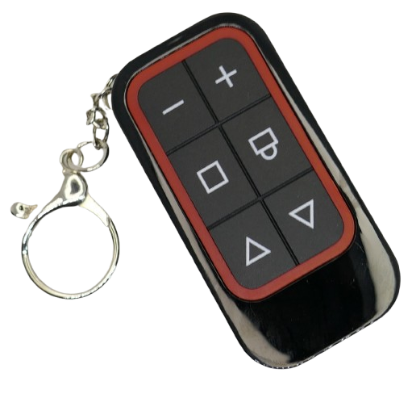
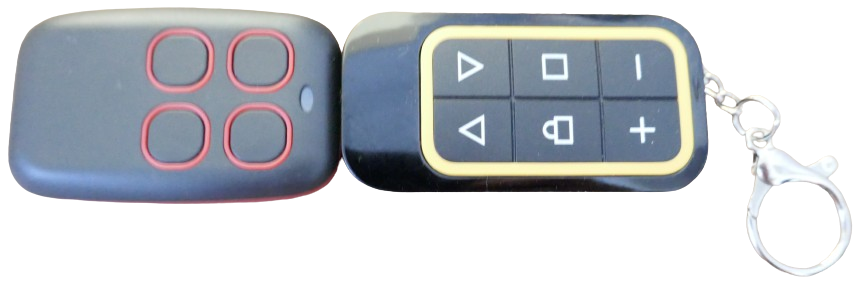
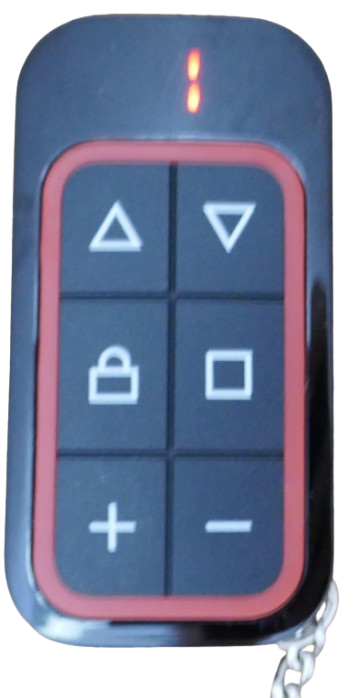
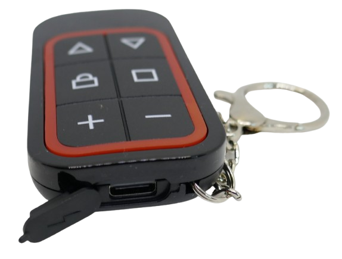
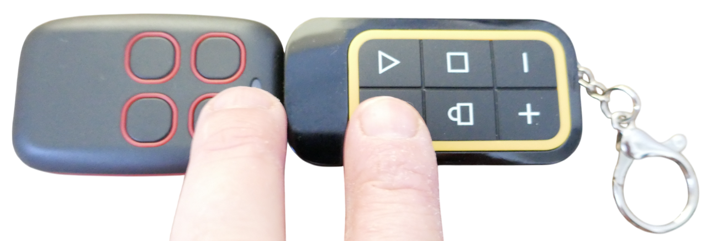

 
# 8x4-Button RF Remote Control

> Sophisticated 8x4-Button Self-Learning RF Remote Control With Rechargeable Battery

Recently, a new type of self-learning remote control surfaced that supports 8x4 buttons and features a built-in rechargeable battery that can be charged via USB-C.

It supports the full frequency range of 300-915MHz. Unfortunately, it comes with a Chinese manual only, and the instructions on the web page aren't too helpful either. Once you figure out the details, though, it is an excellent universal remote control.

## Overview
The remote control has six buttons of which the top four can be assigned radio signals.

| Item | Description |
| --- | --- |
| Frequency | 300-915MHz |
| Power Supply | 3.7V LiPo battery, USB-C charger |
| Power consumption | 30mA during sending |
| TX | 13dBm |
| Supported Codes | 8 x 4 = 32 |
| Size | 73 x 37.6 x 13mm |

This remote control has great TX power for long reach, however the RX sensitivity during learning is low, especially for 868MHz.

During learning , it may be **crucial to place both remote controls** in **direct contact**. 

### Page Concept
This remote control supports 4 programmable buttons and 8 pages, so it can be used to store up to 32 codes.

That's useful for scenario-driven use, i.e. you can use one page for the lights in the living room, and another page for the gardening devices. You get the idea.

#### Selecting Page

The **+** and **-** buttons on the bottom can be used to switch to eight different "pages". The currently selected page is shown via a 8-segment LED on top:

#### Page Lock
If you want to lock a page so you don't accidentally change the page, press the lock button and the button with the downwards triangle simultaneously. Now the buttns "+" and "-" are locked.

To remove the lock, press the lock button and the button with the rectangle simultaneously.

### USB Charging

The remote control comes with a built-in rechargeable battery that can be charged conveniantly via USB-C. While charging, a red LED turns on. Once charging is completed, the LED turns off.

### No Rolling Codes
This remote control - like any other self-learning RF remote control - does not support **rolling codes** even though the seller makes such claims.

It is the very purpose of rolling codes that attackers cannot pick up and replay codes. This obviously applies to self-learning remote controls as well.

> [!NOTE]
> You *may* sucessfully pick up and store a code from a rolling code system. However, most likely this code is time-stamped and will only work for a few hours after which you would have to re-learn a new code.

## Learning Procedure

Use the buttons "+" or "-" to navigate to the page that you want to use. 

### Clearing

Clear each page before first use.

* Clearing removes all previously recorded codes from the four buttons on the selected page. 
* Clearing only applies to the currently selected page and does not clear recorded codes from other pages.

To clear all previously recorded codes for the buttons on the currently selected page, press the two triangle buttons simultaneously and keep them pressed until the middle segment of the 8-segment LED starts blinking.

> Clearning is required only if you want to assign **new codes** to **already previously assigned** buttons. 

### Learning

To assign a new code to a button, follow this procedure:

1. Hold down the button on the original remote control.
2. Hold down the button on the self-learning remote control that you want the code to be assigned to. Note that you can only use the top four buttons. Buttons "+" and "-" cannot be assigned.
3. Keep both buttons pressed until the "page" led lights up and shows the current page.

If the learning procedure does not seem to work, try moving the two remote controls closer together. Especially with 868MHz signals, it may be necessary for both remote controls to actually touch each other. Even a few millimeter gap inbetween may seem to make a difference.

> Tags: RF Remote Control, Battery, CR2032, Kebidu, Garage Door, Multi-Frequency,

[Visit Page on Website](https://done.land/components/data/datatransmission/wireless/commercialremotecontrols/8x4button?414536081131255204) - created 2025-08-30 - last edited 2025-08-30
