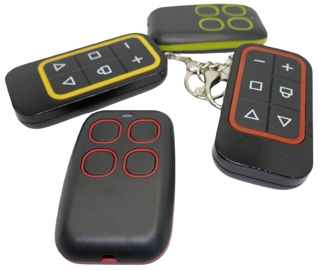
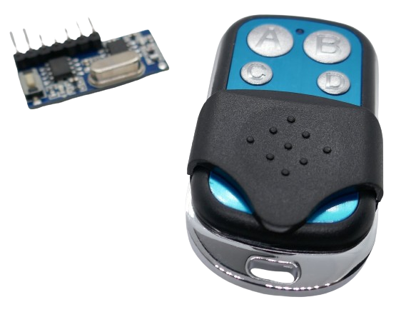
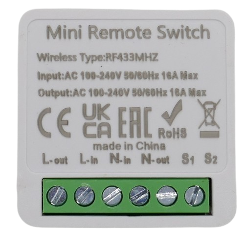
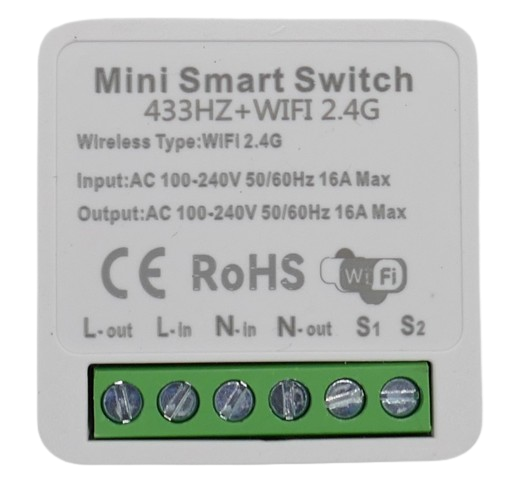
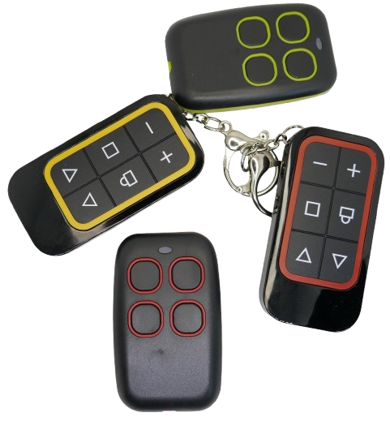
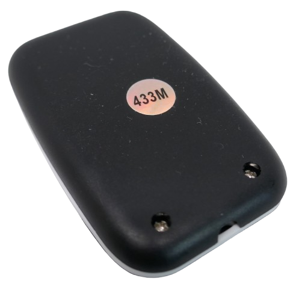

 
# Commercial RF Remote Controls

> Wireless Remote Controls For Garage Doors, Electrical Plugs, and Garden Pumps 

Simple wireless remote controls come with many devices (i.e. garage doors, lamps, toys, etc.). They use one of the [license-free radio frequencies](https://done.land/components/data/datatransmission/wireless/intro/legalfrequencies/) and transmit data one-way using simple [OOK and EV1527 encoding](https://done.land/components/data/datatransmission/wireless/intro/usingradiowaves(ook)/ev1527remotecontrols/). 

## Overview

With simple RF remote controls, there is a dedicated **sender** (the remote control), and a dedicated **receicer** (the device(s) to control). Such remote control systems use one-way communication, and there is no feedback whether the target device has received the control signal. 

This is typically no problem though since the controlled devices (i.e. garage doors) clearly indicate themselves whether or not they were invoked.

### Radio Frequencies

Since RF remote controls do not depend on infrastructure, they can operate anywhere and do not need i.e. WiFi coverage, or Internet access.

Their RF output power is limited, and the typical range is 10-100 meters. They use one of the four major [license-free bands](https://done.land/components/data/datatransmission/wireless/intro/legalfrequencies/):

| Frequency | Region | 
| --- | --- |
| 315MHz | US, Japan | 
| 433MHz | Europe, Asia | 
| 868MHz | Europe | 
| 915MHz | US, Australia, Asia | 

### Security and Rolling Codes

Since RF remote controls send radio signals, anyone in close vicinity can pick up these signals. This can be risky because hijacked (recorded) signals can be played back later. 

An attacker could record the RF signal when a garage door is opened, and later play back the signal to open the garage door for house invasion.

#### Rolling Codes Prevent Replays

For this reason, more sophisticated remote control systems use **rolling codes**: they change the valid code on every press to resist replay and cloning attacks, and add cryptography and counters so a captured transmission cannot be reused later, making them far more secure than fixed/simple codes.

In a nutshell, rolling code systems ensure that an intercepted signal cannot be used again because it has been invalidated by the receiver. 
 

#### High Risk Areas

Rolling code systems are especially important for controlling access paths, i.e. garage doors. Less security-sensitive devices that are located inside the home (i.e. lamps) do not benefit from rolling codes: their RF reception distance is low, and attackers would have to break into the house in the first place to get close enough to the device to intercept its radio signals.

> [!NOTE]
> Coincidentally, this also means *self-learning remote controls* from other vendors **never** support rolling codes, despite any claim. After all, the sole purpose of rolling codes is to **prevent** that anyone (including self-learning remote controls) can pick up and replay radio signals.   

## Use Cases

RF remote controls are used in many areas:

### Ready-Made Devices

Many commercial devices come bundled with RF remote controls. 

In addition, you can purchase DIY sets consisting of a remote control and controllable electrical outlets. This way, you can turn any regular device into a remote-controllable device by controlling its power supply.

### DIY projects / Home Automation

For DIY projects, you can purchase sets consisting of a remote control and a small PCB (receiver). The receiver PCB [can then be used in various DIY projects](https://done.land/components/data/datatransmission/wireless/intro/usingradiowaves(ook)/ev1527remotecontrols/).

The receiver PCB signals the control message when it receives it, and your project design can then decide what to do with it, i.e. control relais, SSDs, or forward the signal to [Home Assistant](https://done.land/tools/software/homeassistant/) to control any type of home automation or connected device.

There are even mini modules that are small enough to be mounted right into light switches:

> [!IMPORTANT]
> Always make sure the module supports the frequency range you intend to use. There are similar-looking modules for RF frequencies (i.e. 433MHz), for WiFi, and for both.    

### Self-Learning Remote Controls
Very affordable self-learning remote controls exist that combine a sender with a receiver. This way, such remote controls can do what attackers would do: sniff and receive the signal from any other RF remote control, then store it and play it back later.

This way, you can:

* **Consolidate:**    
  Combine multiple RF remote controls in one remote control.
* **Replace:**    
  Replace an old and/or clumsy remote control with a modern one. Often, self-learning remote controls are cheaper than the special 12V batteries used by some garage door openers, so for the price of a replacement battery you get two or three self-learning remote controls.    
* **Add:**     
  Cloning an existing remote control can be a simple way of adding a replacement or backup remote control.    

#### Caveats

Self-learning RF remote controls are great, but they can also be  frustrating. They often lack manuals/clear instructions, and prerequisites must be met:

* **Frequency:**   
  The self-learning remote control must support the frequency  used by the original remote control. Some "universal" self-learning remote controls support the entire frequency range from 300-915MHz, whereas others support just a particular band.

  

* **Other Caveats:**     
  Most self-learning RF remote controls can learn the signal from another remote control only if you place the two remote controls into direct contact.  

  

  Even when the two remote controls are just a few centimeters apart, the learning process fails. 
* **Rolling Code:**     
  If your existing RF remote system uses sophisticated rolling codes, then they don’t allow cloning of the changing encrypted payload; instead, a self‑learning rolling‑code remote must be introduced to the receiver through a secure enrollment that shares secrets or authorization, not by over‑the‑air copying of a button press.    

  So if a self-learning remote control claims to support rolling codes, this is typically wrong. While you may be able to pick up and record the signal, depending on the rolling code system you use, this signal won't work, or it works only for a short period of time, and you would have to re-learn the signal every so often.     

> Tags: Frequency, Garage Door Opener,  Band Plan, 315MHz, 433MHz, 868MHz, 915MHz

[Visit Page on Website](https://done.land/components/data/datatransmission/wireless/commercialremotecontrols?362682081131255204) - created 2025-08-30 - last edited 2025-08-30
