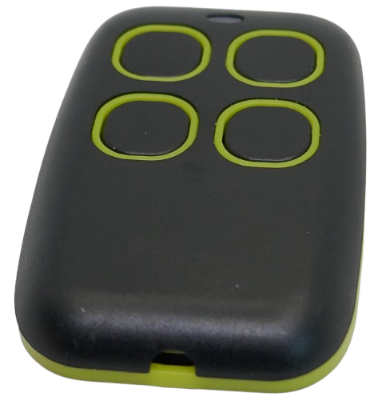
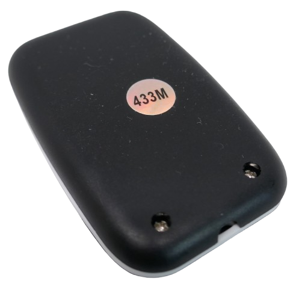
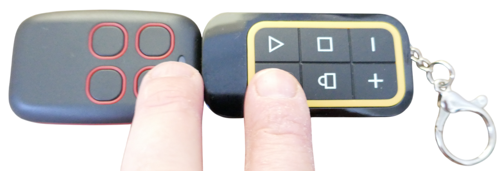
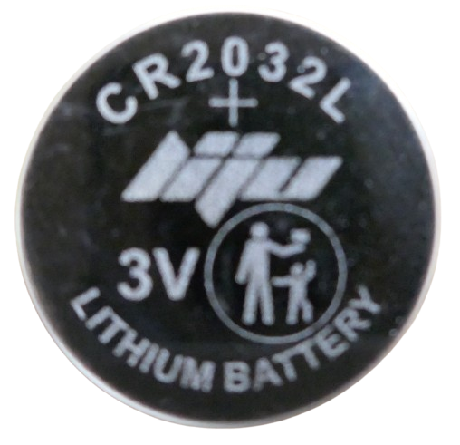
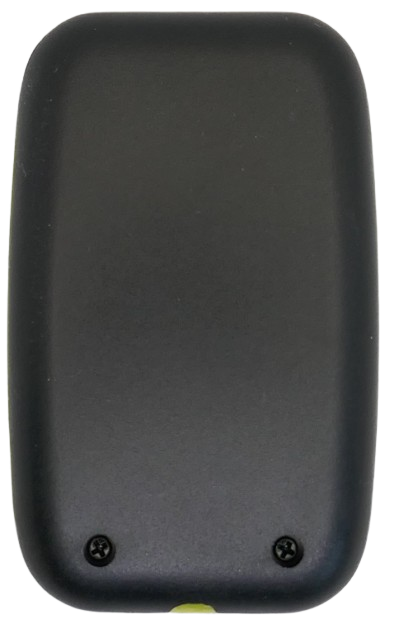
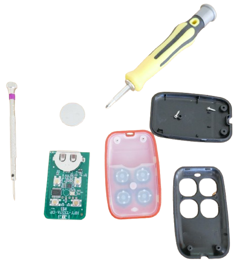

 
# 4-Button RF Remote Control

> Simple 4-Button Self-Learning RF Remote Control 

Many simple 4-button RF remote controls exist that can record and replay the signals from other remote controls.

They are operated by a built-in **CR2032** coin cell battery.

## Supported Frequency

This type of remote control exists in different versions. Some (slightly more expensive) variants support the entire 300-915MHz frequency range, whereas others are limited to only 433MHz.

Occasionally, stickers on the back provide clarity. If the remote control cannot pick up a signal from your original remote control, this, too, might be an indicator for an incompatible frequency range.

## Learning Procedure

The remote control comes with 4 push buttons, and each button can "learn" a separate signal from any other remote control. Note that self-learning remote controls **do not support rolling codes** by design.

> [!IMPORTANT]
> Place both remote controls in close distance to each other. It may be necessary for both remote controls to physically touch each other. If they are too far apart, the learning procedure may fail.        

There are different versions of this control that use different learning procedures.

### Old Version

Press the button that you want to assign. If the LED flashes only once, this button has not yet recorded a signal and can be used. If instead the LED flashes rapidly, then this button has already been assigned a signal. In this case, choose another unassigned button, or clear all recordings from all buttons.

> To clear all existing recordings from all buttons, press and keep pressed button 1+2 until the LED blinks.

To record a signal to an unassigned button, keep this button pressed while keeping the button on the original remote control pressed as well. Once the self-learning remote control picks up the signal, the LED starts to rapidly blink.

> [!TIP]
> If the self-learning remote control cannot seem to pick up the signal, try moving both remote controls closer to each other. You may have them to physically touch each other.    

### New Version

To record a new signal, hold button 1 while pressing button 2 for four times. The LED emits a flash every two seconds, indicating that learning mode is active.

Press and keep pressed the button on the remote control, then press the button on the self-learning remote control that you want to assign until the LED turns off.

## Battery Replacement

When the LED dims on signal transmit, or when the reach becomes shorter, it may be time to replace the internal CR2032 coin cell battery.

There is no separate battery compartment. To replace the battery, unscrew the two screws on the backside.

Next, gently separate the two parts of the housing with a screw driver or knife blade.

Now you see the internal parts of the remote control. The coin cell sticks in a holder and can be removed with pliers. Once you replaced the battery (do not reverse polarity!), put the parts back together and fasten the two screws again.

While a separate battery compartment would certainly be helpful, the entire described procedure is simple and takes just 5 minutes. After battery replacement, the remote control works again like a charm.

> Tags: RF Remote Control, Battery, CR2032

[Visit Page on Website](https://done.land/components/data/datatransmission/wireless/commercialremotecontrols/simple4-button?469746081131255204) - created 2025-08-30 - last edited 2025-08-30
