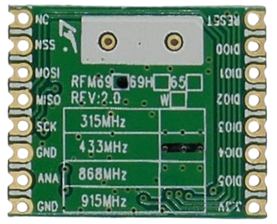

# Legal Radio Frequencies

> Picking the Appropriate Radio Frequencies for Your Devices

Components and breakout boards that transmit and/or receive radio signals are available for a variety of frequency bands.

Often, identical-looking breakout boards are tuned for different frequency ranges, and it is **essential** to order boards that match your region’s regulations. You **cannot** retune or change the supported frequency range after purchase in most cases.

## Legal Considerations

Because radio waves are a shared, public resource, their use is tightly regulated by national and international authorities. Before using any radio-based device, you must:

* Understand the applicable regulations in your country.
* Ensure that your devices comply fully with those regulations.

Many radio frequencies are already allocated to critical services such as emergency response (e.g., ambulances), military communications, and aviation systems. Unauthorized use can lead to:

* **Severe penalties and fines**
* **Interference with life-critical systems**
* **Potential civil or criminal liability**

However, there's no need to be intimidated. As long as your devices:

* **Use approved frequencies**, and
* **Stay within the allowed RF (radio frequency) power levels**,

...you will likely operate safely within the legal boundaries. While further regulations often apply (e.g., duty cycle restrictions, modulation types), adhering to these two core rules minimizes the risk of interference.

## "License-Free" Bands

There are **four** commonly used *license-free* frequency bands in the highly valuable sub-Gigahertz spectrum: **315 MHz, 433 MHz, 868 MHz, and 915 MHz**.

> [!NOTE]
> The sub-Gigahertz bands are considered "valuable" because they naturally enable long-range communication without requiring high power. In contrast, frequencies above 1 GHz tend to have limited range unless supported by satellites or complex mesh networks.

Many radio modules and breakout boards are specifically tuned to one of these four bands.

Not all frequency bands are legal in every country, so it's important to buy components that are tuned to bands that are permitted in your region.

| Frequency (MHz) | Range | Countries |
| --- | --- | --- |
| 315 | 310–318 | North America (FCC Part 15) Japan (315–316 MHz) |
| 433 | 433.05–434.79 | Europe (ETSI EN 300 220) Asia (varies by country) |
| 868 | 868.0–869.65 | Europe (ETSI EN 300 220) |
| 915 | 902–928 | USA (FCC Part 15) Australia (ACMA, 915–928 MHz) Asia (varies by country) |

Below is a summary of typical license-free bands by region:

| Region | Bands (MHz) |
| --- | --- |
| Europe | 433 and 868 |
| USA | 315 and 915 |
| Australia/NZ | 433 and 915 |
| Asia | 433 and 915 |

> [!IMPORTANT]
> Exceptions may exist. To ensure full compliance, always verify the applicable rules with your national spectrum authority or telecommunications regulator.
   

### Always Verify Device Frequency

When ordering a radio module, don’t just check if the chip *supports* your desired frequency band in theory — make sure the **entire board is tuned for it**. This distinction is critical and often misunderstood.

Here’s why it's confusing:

* **Theory:** Many breakout boards use transceiver chips that can be programmed across a wide frequency range — for example, from *420–980 MHz*.

* **Reality:** These chips require carefully tuned external components — like coils, filters, and capacitors — that resonate at specific frequencies and suppress others.

So, while you might successfully *program* a chip to use a different frequency, the board’s hardware might block or degrade that signal. You could end up with a transmitter that technically sends on the right frequency, but emits a signal too weak or distorted to be useful.

Look for frequency markings directly on the board (as shown in the previous image), which indicate the actual tuned frequency.

> **Bottom line:** Never judge a board by the datasheet of the radio chip alone. Always go by the specifications of the board as a whole.

## Gigahertz Bands

Frequencies above *1 GHz* are generally less crowded than sub-GHz bands, but they come with tradeoffs:

* **More complex:** These frequencies require advanced RF design and hardware that became widely available only in recent decades.
* **Shorter range:** Signals at these frequencies require line of sight and don’t penetrate obstacles well — making them ideal for short-range communication. However, technologies like satellites or mesh networking can help extend their effective range.

On the upside, there's **far more bandwidth** available: the Gigahertz spectrum from 1–250 GHz is *250× wider* than the entire 0–1 GHz range.

Because these bands opened up after the era of global regulation, many are standardized worldwide:

| Frequency Band     | Region / Standard             | Typical Uses                                   | Notes |
|--------------------|-------------------------------|------------------------------------------------|-------|
| 2.4–2.4835 GHz      | Worldwide ISM (ITU Regions 1–3)| Wi-Fi (802.11b/g/n), Bluetooth, Zigbee, LoRa 2.4 GHz | Most widely available license-free band |
| 5.725–5.875 GHz     | Worldwide ISM                 | Wi-Fi (802.11a/n/ac), radar, short-range links | Shared with weather radar and other services |
| 5.8 GHz (ISM subset)| Worldwide ISM                 | Point-to-point links, analog video             | Sometimes listed separately from 5.725–5.875 GHz |
| 24.0–24.25 GHz      | Europe, some other regions    | Industrial sensors, radar, SRR                 | Limited to low power; very short range |
| 57–64 GHz           | Worldwide (varies slightly)   | 60 GHz WiGig (802.11ad/ay), ultra-fast links   | Very short range; affected by oxygen absorption |
| 122–123 GHz         | Some countries                | Experimental, imaging, radar                   | Regulated by local bodies |
| 244–246 GHz         | Some countries                | Experimental                                   | Extremely short-range; highly absorbed |

### Use Cases

You’re probably already using Gigahertz bands — technologies like *Wi-Fi*, *Bluetooth*, *Zigbee*, and automotive radars all operate here.

With modern microcontrollers like the ESP32, which include built-in Wi-Fi and Bluetooth, you might not need sub-GHz radios at all.

If you can work within the limitations of GHz frequencies — line-of-sight, limited direct range — the license-free ISM bands can be a powerful and easy-to-use alternative.

For example, *Meshtastic* — a popular public mesh network — traditionally uses sub-GHz LoRa modules. However, newer LoRa transceivers (e.g., the *SX128x* series) now operate in the 2.4 GHz band, combining long-range capability with global license-free operation.

## Maximum Power

Choosing a license-free frequency band is just the first step. The second is staying within legal transmission power limits — and it’s just as important.

Radio is a *shared* resource. You shouldn’t transmit more power than necessary to communicate reliably. Sending too far wastes spectrum, risks interference, and makes your data easier to intercept.

More importantly, even when operating in license-free bands, high-power transmissions can unintentionally interfere with other services — including emergency response, cellular networks, or aviation systems.

Why? Because transmitters — especially inexpensive ones — emit **harmonics**: multiples of the intended frequency. High-power signals mean high-power harmonics, which can disrupt unrelated bands.

So keep your RF output reasonable. Most license-free bands impose strict limits:

| Band       | Region         | Frequency Range         | Max ERP / EIRP                    | Notes |
|------------|----------------|--------------------------|-----------------------------------|-------|
| 315 MHz    | USA (FCC)      | 310–318 MHz              | 11 mV/m @ 3 m (~–19 dBm ERP)      | Very low field strength; short-range use (e.g. keyfobs) |
| 433 MHz    | Europe (ETSI)  | 433.05–434.79 MHz        | 10 mW ERP                         | 1% duty cycle unless using LBT |
|            | USA (FCC)      | 433.05–434.79 MHz        | Not officially ISM, but usable under Part 15 |
| 868 MHz    | Europe (ETSI)  | 868.0–868.6 MHz (g1)     | 25 mW ERP                         | 1% duty cycle; LoRaWAN uplink |
|            | Europe (ETSI)  | 869.4–869.65 MHz (g3)    | 500 mW ERP                        | 10% duty cycle; good for alarms |
| 915 MHz    | USA (FCC)      | 902–928 MHz              | 1 W **conducted** + 6 dBi antenna = 36 dBm EIRP | No duty cycle limit; FHSS or digital modulation required |
|            | Australia/NZ   | 915–928 MHz              | 1 W EIRP                          | Similar to US rules |

Typical legal output is limited to *10–25 mW* (10–14 dBm). Some modules push that to *100 mW* (20 dBm), which may still be tolerated, but using power amplifiers or exceeding these values can cause real problems.

> Want more range? Don’t just increase power. Use a better antenna, elevate your node, improve line-of-sight, or switch to long-range modulation like *LoRa* and mesh networks like *Meshtastic*.

## Additional Regulations

Beyond frequency and power, national laws may impose other constraints, such as:

* **Antenna limits:** Directional antennas effectively increase output power and may be restricted.
* **Use case restrictions:** Some bands may only allow specific modulation types or transmission formats (e.g., digital only).
* **Duty cycle:** Many sub-GHz bands limit how much time a device can actively transmit to avoid congestion.

For simple applications like sensors, switches, or short-range control, these regulations are unlikely to be a concern.

However, if you’re using more advanced systems — like LoRaWAN or Meshtastic — the software typically enforces these rules automatically, so you stay compliant without manual tuning.

> Tags: RF, Frequency, Regulations, License-Free, ISM

[Visit Page on Website](https://done.land/components/data/datatransmission/wireless/intro/legalfrequencies?902785051808250749) - created 2025-03-07 - last edited 2025-05-07
