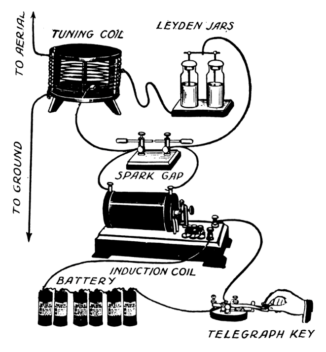

 
# Introduction to Wireless Data Transmission

> How Wireless Data Trasmission Via Radio Waves Works

When starting to look into using radio waves, there is initially an overwhelming number of moving parts: frequencies, RF power, transmitter, receiver, modulations, legal regulations, and more. In this section, you'll learn the basics of using radio waves.

## Overview
*Electromagnetic waves* carry energy through space without the need for physical wires. They oscillate at certain frequencies and can travel long distances at the speed of light. The distance they can bridge depends on their frequency and power.

Which raises the question: what exactly *are* "radio waves"?

### Spark-Gap Transmitters
Initially, it was discovered that **sparks** emit electromagnetic waves, and the first radio transmitters were [spark-gap transmitters](https://en.wikipedia.org/wiki/Spark-gap_transmitter). 

This is the Hertzian spark oscillator from 1902:


Coincidentally, the German physicist [Heinrich Rudolf Hertz (1857-1894)](https://en.wikipedia.org/wiki/Heinrich_Hertz) influenced the research of radio waves so significantly that the unit for *frequencies* was named after him: [Hertz (Hz)](https://en.wikipedia.org/wiki/Hertz) specifies the *cycles per second*, and today, radio frequencies are specified in *Hertz*, *Mega-Hertz (MHz)*, and *Giga-Hertz (GHz)*. For example, license-free radios in Europe often operate at *433MHz*, and *Wifi* uses *2.4GHz* and *5GHz*.

Soon, the commercial value of radio waves was discovered: [Guglielmo Marconi](https://en.wikipedia.org/wiki/Guglielmo_Marconi) created radiotelegraphy communication on the basis of them which played a crucial role 1912 in the maritime rescue of the RMS Titanic disaster.





### Oscillating Circuit
It is not the spark itself however that produces the radio waves. The spark just serves as a fast acting switch to excite oscillating electric currents. 

The oscillating conductors - **any** oscillating conductor - radiate energy as radio waves. Or put differently, whenever you abruptly change the flow of currents, you produce radio waves - on purpose or on accident.


## Modern Radio Wave Generators
Modern radio wave generators (and receivers) have much improved, mainly due to two factors:

* **Transistor:** there are much better *fast-acting switches* than sparks. For a while, vacuum tubes were used, and then largely replaced by semiconductors like transistors.
* **Crystal:** Uses a piezoelectric crystal (i.e. quartz) that oscillates at a highly stable frequency. Unlike classic LC circuits, the frequency is determined by the physical properties of the crystal, and does not depend on the values of the inductor and capacitor, which in turn are affected by temperature, humidity, and aging.

*Spark gap transmitters* are no longer used except [for experimental reasons](https://hackaday.com/2024/04/07/a-spark-gap-transmitter-characterized/). Oscillarors today typically use *transistors* to keep them oscillating.


### Crystals
The original *spark gap oscillator* oscillated at frequencies determined by its capacitance and other physical aspects of the components used. *L-C circuits* consisting of a coil and a capacitor are today the closest resemblence. 

Simple [L-C circuits](https://en.wikipedia.org/wiki/Electronic_oscillator) share the fate that their oscillating frequency is not stable and can be influenced by the materials used, temperature, humidity, material aging, and many other factors.

[Crystal Oscillators](https://en.wikipedia.org/wiki/Crystal_oscillator) are much more precise because they use a *quartz resonator* that has a resonant frequency that is not affected by environmental variables such as temperature or production differences in the materials used.

Manufacturers have difficulty producing crystals thin enough to produce fundamental frequencies over 30 MHz, though. Modern electronics operate at much higher frequencies. Using [frequency dividers](https://en.wikipedia.org/wiki/Frequency_divider), [frequency multipliers](https://en.wikipedia.org/wiki/Frequency_multiplier) and [phase-locked loop (PLL)](https://en.wikipedia.org/wiki/Phase-locked_loop) circuits, a much wider range of frequencies can be generated from one reference frequency.

> [!TIP]
> **Transmitters** use almost always crystals as *sending* at a wrong frequency can cause severe interferences and harm to other services. **Receivers** benefit from crystals, too, however very cheap receivers, for example in toy remote controls, occasionally skip crystals for a less expensive design. Harm is limited on the receiver side: Should the receiver frequency be off, i.e. due to a sunny day with high temperatures, then the worst case scenario is a toy car that isn't responding well anymore.


#### EMI (Electromagnetic Interference)
Since fast-acting switches are everywhere today - thanks to cheap transistors - the long abandoned "spark gap transmitter" is back in new shapes and forms. After all, physics hasn't changed: any abruptly changing current generates radio waves. 

Many modern electronics - switching power supplies as an example - switch currents in high frequency and produce unwanted radio waves which are then called **EMI** ([Electromagnetic Interference](https://en.wikipedia.org/wiki/Electromagnetic_interference)).

That's why it is important to enclose such devices in RF-tight housings ([Faraday Cage](https://en.wikipedia.org/wiki/Faraday_cage)) and/or *smoothen* the switching process in an effort to not create abrupt current changes.


## Modern RF Receivers
Radio waves serve as carrier for the information, so at the receiving end, there needs to be a device that re-converts the radio waves back into electrical impulses.

Today, there are three widely used designs for receivers:


* **Superregenerative:** uses positive feedback to amplify weak RF signals. This is simple and cheap, but it also doesn't work reliably. Superregenerative receivers can be found in toys, and occasionally they are also bundled with decent RF sender boards (i.e. [MX-RM-5V](https://done.land/components/data/datatransmission/wireless/shortrangedevice/am/ask/ookgeneric/receiver/mx-rm-5v/)). Try and avoid superregenerative receivers as they often don't work, and they are just a few cents cheaper than decent superheterodyne receivers anyway.
* **Superheterodyne:** Converts RF signals to an intermediate frequency (IF) for better filtering and amplification. This is how most professional transceivers and walky-talkys work, too, and there are plenty of superheterodyne receiver modules available (i.e. [AK-RXB59R](https://done.land/components/data/datatransmission/wireless/shortrangedevice/am/ask/ookgeneric/receiver/ak-rxb59r/), [RX470-4](https://done.land/components/data/datatransmission/wireless/shortrangedevice/am/ask/ookgeneric/receiver/rx470-4/), [SYN480R](https://done.land/components/data/datatransmission/wireless/shortrangedevice/am/ask/ookgeneric/receiver/syn480r/), [RXB*xxx*](https://done.land/components/data/datatransmission/wireless/shortrangedevice/am/ask/ookgeneric/receiver/rxb8/)).
* **SDR:** *Software Defined Radio* uses digital signal processing (DSP) to handle RF signals, replacing many analog components. SDR does not target data transmission in IoT devices but *complements* it for *analyzing* RF signals. SDR can monitor an entire frequency range, visualize signals in waterfall diagrams, and examine modulations and bandwidths.

It is important to know about the major differences so you can pick the best receiver circuit for your use case.

### Super-Regenerative vs. Superheterodyne Receivers

| Feature                | Super-Regenerative                          | Superheterodyne                         |
|------------------------|--------------------------------------------|-----------------------------------------|
| **Principle of Operation** | Uses positive feedback in short bursts to amplify weak signals | Converts RF signals to a lower intermediate frequency (IF) for improved processing |
| **Selectivity**        | Poor, easily affected by interference      | Excellent, sharp filtering at IF stage |
| **Sensitivity**        | High but inconsistent                      | High and stable                        |
| **Frequency Range**    | Low to Medium (kHz - MHz)                  | Wide (kHz - GHz)                        |
| **Stability**         | Poor, prone to drift                        | Very stable due to fixed IF filtering  |
| **Complexity**         | Very simple, few components                | Complex, requires mixers, IF amplifiers, and filters |
| **Cost**              | Very cheap                                  | More expensive due to additional components |
| **Power Consumption**  | Very low                                    | Higher, due to multiple amplification stages |
| **Typical Applications** | Toy radios, low-cost wireless receivers  | AM/FM radio, TV tuners, radar, communication receivers |
| **Modern Relevance**   | Mostly obsolete, used in niche applications | Still widely used in many RF systems |

### Conclusions
In a nutshell, *superregenerative* receivers are dirt cheap but can cause a lot of issues. They are suitable for very simple scenarios like short-range remote controls at best.

*Superheterodyne* receivers cost only little more but provide a much better performance. Always opt for a *superheterodyne receiver* if you can.

## Antenna
For an electromagnetic wave to be radiated into space (i.e., to transmit), or picked up again and converted to an electric signal (i.e., to receive), the resonant circuit should be connected to an antenna. 


The antenna *optimizes* the radiation of electromagnetic waves, and a good antenna can radiate the majority of the electrical energy. Without an antenna - or when using a *mismatched* antenna - most of the electrical energy stays within the circuit and is converted to heat which can eventually damage the circuit, especially when using high power (which is why *RF power amplifiers* are so susceptible to permanent damage when the antenna is bad or missing).


### Omnidirectional and Unidirectional
In its most basic form, an antenna is simply a piece of wire. In this case, electromagnetic waves are emitted equally in all directions ([omnidirectional antenna](https://en.wikipedia.org/wiki/Omnidirectional_antenna)). 

More sophisticated [(uni)directional antennas](https://en.wikipedia.org/wiki/Directional_antenna) can *focus* electromagnetic waves in a particular direction, strengthening the signal considerably in this direction (and weakening it in all other directions).

### Antenna Matching
Whichever antenna type you prefer, the antenna must **match** the desired frequency. In the case of a simple omnidirectional wire, it must have exactly the right **length** so that the oscillating currents can *resonate*. Here is how this works:

#### Wavelength (λ)
Any radio signal has a *frequency* (cycles per second). Any *frequency* has a *wavelength* (distance a single cycle travels). This is not as complicated as it initially sounds:

Radio waves travel with the speed of light. When you divide the speed of light by the frequency, you get the *wavelength* in meters: the distance that a single cycle travels:

````
λ (wavelength) = speed of light / frequency
````

#### Calculating Wavelengths
Lets put the theory at work and calculate antenna lengths.

In Europe, many license-free transmitters work at *433.92 MHz*. How long needs a good antenna wire be to resonate at this frequency?

Put the values into the formula:

````
λ (wavelength) = 29979.2458 / 433.92 
               = 69.0893385877581
````

The wavelength for radio waves at a frequency of *433.92 MHz* turns out to be *69.1 cm*. If you need the wavelength for other frequencies, just change the frequency in *Mhz*.

> [!NOTE]
> When you use `29979.2458` as the speed of light, you can divide it directly with a frequency specified in *MHz* and get back the wavelength in *centimeters*. Using the scientific default base units (meter, Hertz), the formula would be `299792458/433920000` and return the wavelength in *meters* instead of *centimeters*.

#### Antenna Length

For a *433.92 MHz* transmitter, a *full-λ* antenna would have a length of *69.1 cm*. That's pretty long, and often too long to be handled.

To keep antennas practical, you can...

* **Fractions:** ...use *fractions* of the wavelength λ: a quarter-wave (around 17 cm) or half-wave (around 34.5 cm) antenna may fit better into your device, at the expense of reduced efficiency.
* **Coil:** ...wind up the wire to a coil (as long as the wire is insulated). 


#### Coil Antennas (Space Constraints)
*Coil* antennas are very space efficient and often found in rubberduck-style antennas or DIY devices that have space constraints (including smartphones). 

Coil antennas are less efficient due to the increased resistive losses in the wire, mismatched impedance, and the reduced radiation efficiency caused by the compressed geometry.

So if you have the space, a *whip* antenna (or a simple stretched out wire) produces much stronger signals. Geometry beats length: even a *half-wave* antenna wound up as a coil is less efficient than a *quarter-wave* antenna at full length.


> Tags: RF, Radio, Wave, Crystal, Spark, Wireless, Transmission, Lambda, Wavelength, Spark, Oscillator

[Visit Page on Website](https://done.land/components/data/datatransmission/wireless/intro?580633031316254246) - created 2024-01-15 - last edited 2025-03-15
