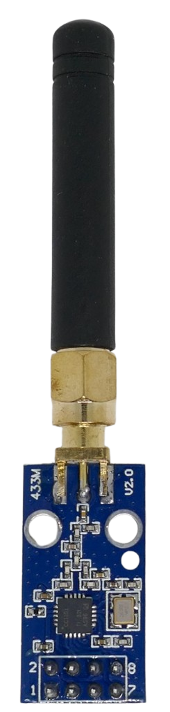
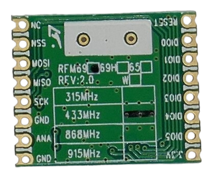
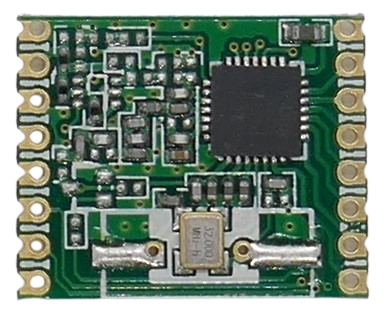

 
# Using FM Transceivers

> Reliable Data Transfer at High Speeds Using FM Modulation

In the early days of radio communication, sophisticated data protocols were impossible due to the lack of semiconductors and microcontrollers. As a result, simple *OOK* and *AM* modulations dominated.

This changed with the advent of transistors, specialized chips, and microcontrollers, making signal processing more affordable. Today, almost all professional radio transmissions use *FM*.

> [!NOTE]
> Aviation radio is one of the last domains where amplitude modulation (*AM*) is still in use, primarily for historical reasons. Even public broadcasting has long since switched from *AM* to *FM*, moving away from shortwave frequencies (*SW*/*MW*) to modern *VHF* frequencies.

Whenever you need to reliably transmit large amounts of data at high speeds, frequency modulation (*FM*) is the preferred choice.

Modern *FM breakout boards* are only slightly more expensive than simple *OOK* transmitters and receivers and are available for various frequency bands.

## Overview

Simple *OOK* is the most basic way to transmit radio signals: the transmitter is turned on and off at intervals to send signals—that's it. With encodings like [EV1527](https://done.land/components/data/datatransmission/wireless/intro/usingradiowaves%28ook%29/ev1527remotecontrols/), this is sufficient for transmitting small chunks of data, such as the *24-bit IDs* used in remote controls.

However, when higher data rates, longer transmission distances, and lower power consumption are required, more advanced modulations like *FM* (*Frequency Modulation*) become necessary.

Specialized radio chips such as *CC1101*, *SI4463*, *nRF24L01*, and *SX1231* handle much of the complexity introduced by *FM modulation*.

### Transceivers

Most *FM* chips on breakout boards are **transceivers**, meaning they can both **transmit** and **receive**. Unlike *OOK* modules, which require separate sender and receiver boards, *FM* transceivers allow two-way communication.

Two-way communication is crucial for robust data transfer:

- A *sender* can transmit data and then switch to **receiver mode** to listen for an acknowledgment from the receiver, ensuring the data was received correctly.
- The **receiver** can switch to **sender mode** to report back whether the data was received correctly or if a retransmission is needed.

Most modern communication protocols rely on this continuous switching between sending and receiving to ensure data integrity.

### Microcontroller Required

Most *FM* breakout boards require a microcontroller to operate. While these modules handle signal processing, they require an external microcontroller to program them, setting the desired modulation, speed, RF power, and data encoding. Standard microcontroller interfaces are used, such as:

- *UART (serial)*
- [I2C](https://done.land/fundamentals/interface/i2c/)
- [SPI](https://done.land/fundamentals/interface/spi/)

Occasionally, FM radio chips are integrated into specialized boards designed for very specific use cases, in which case no external microcontroller or programming is required. 

A common example is *wireless serial* modules, which automatically transmit serial data wirelessly:

1. Connect your serial **RX** and **TX** pins to the corresponding pins on the module.
2. Connect **RX** and **TX** of another (paired) module elsewhere.

Once paired, the modules transmit serial data wirelessly at a predefined baud rate—eliminating the need for expensive cables or custom programming.

## Frequency Modulation (FM)

**FM** encodes information by subtly shifting the frequency. This process, known as *frequency modulation*, allows for more reliable signal transmission compared to amplitude-based methods: 

* Improved noise immunity
* Btter signal clarity
* Resistance to amplitude-based interference.

### Multipath Fading

To better understand why *FM* transmits information more reliably and with less power, let's examine a phenomenon called *multipath fading*, which weakens *OOK* and *AM* signals.

*Multipath fading* occurs when a transmitted signal takes multiple paths to reach the receiver due to reflections, diffractions, and scattering caused by obstacles like walls, buildings, mountains, and even vehicles. Nearly all radio communication is affected by *multipath* in some way.

Radio wave behavior is similar to the ripples you see when you throw a stone into a lake. When reflected waves intersect, their amplitudes either strengthen or cancel out, depending on their phase shift (timing).  

Any modulation that relies on **amplitude variations**—such as *OOK* and *AM*—is therefore highly susceptible to *multipath fading*.  

In contrast, *FM* encodes information using **frequency shifts** rather than **amplitude changes**, making it inherently more resistant to signal degradation.  

Additionally, in *FM*, the strongest received signal dominates, reducing the impact of weaker multipath components. As a result, *FM* signals are far less affected by natural radio noise and interference from other sources.

### Speed and Power Efficiency

But *FM* has even more advantages: it requires less bandwidth to transmit the same amount of information, allowing for faster data transfer.  

Faster (and therefore shorter) transmissions consume less power, which is a significant benefit for battery- or solar-powered projects.

## Digital FM Modes
## Digital FM Modes

*FM* was originally designed for **analog** signals. While it's possible to transmit **digital** data using *analog FM*, the process is highly inefficient and slow—as anyone who used an [acoustic coupler](https://en.wikipedia.org/wiki/Acoustic_coupler) in the early days of the Internet can attest.  

To address this, *FM radio boards* use specialized FM modulations optimized for **digital** data transmission, similar to [ASK](https://done.land/components/data/datatransmission/wireless/shortrangedevice/am/ask/) (*Amplitude Shift Keying*) on **AM**.

> [!TIP]
> While digital FM modulations can no longer transfer analog signals directly, you can still build a walkie-talkie: use an *ADC* (analog-to-digital converter) to digitize the microphone's amplitudes. On the receiver side, run the bits through a *DAC* (digital-to-analog converter) to drive a speaker. Alternatively, you can use a *digital microphone* and *digital amplifiers* directly (e.g., using *I2S*).

### FSK (Frequency Shift Keying)

In [FSK](https://done.land/components/data/datatransmission/wireless/shortrangedevice/fm/fsk/), binary data (`0` and `1`) is represented by two distinct frequency shifts.

Different variations of *FSK* exist to meet additional requirements:

- **GFSK (*Gaussian Frequency Shift Keying*)**  
  *Bluetooth* operates with high RF emissions. To meet regulatory standards and minimize spurious emissions, it uses *GFSK*.  

  *GFSK* applies a *Gaussian low-pass filter* to smooth out frequency transitions, reducing high-frequency components that cause spectral spreading and interference.  

  However, this smoothing makes demodulation more complex. The receiver must precisely detect frequency deviations, as noise, Doppler shifts, or oscillator drift can introduce bit errors—especially at low signal-to-noise ratios (*SNR*).  

  *GFSK* is widely used in *Bluetooth Classic*, *DECT* (cordless phones), and many radio breakout boards.  

- **MSK (*Minimum Shift Keying*)**  
  The Gaussian filter in *GFSK* spreads frequency shifts over time, potentially causing overlapping transitions between bits. At higher data rates, this leads to *inter-symbol interference* (*ISI*).  

  *MSK* reduces *ISI* while maintaining spectral efficiency, improving data integrity.  

- **GMSK (*Gaussian Minimum Shift Keying*)**  
  A filtered version of *MSK* that further enhances spectral efficiency. It is commonly used in *GSM* mobile networks.  

Each modulation has distinct advantages and disadvantages and are not just evolutionary steps: the more sophisticated *GFSK* is not automatically superior to basic *FSK*:

| Modulation | Key Advantages |
| --- | --- |
| FSK | Simpler implementation, lower energy consumption |
| GFSK | Reduced spurious emissions at high RF power, more bandwidth-efficient |
| MSK | High speed, narrow bandwidth, constant envelope (useful in non-linear amplifiers) |
| GMSK | Reduced spurious emissions, bandwidth-efficient, better suited for regulatory environments |

*FM boards* often support some or all of these modulations. Depending on your project and use case, pick the modulation that suits you best.

## Beyond FM  

The evolution of digital radio transmission does not stop with *FM*. As industry and consumers demand **higher speeds**, available frequency bands become increasingly scarce and overcrowded.  

New transmission techniques aim to address three key objectives:  

- **Speed & Bandwidth Efficiency**  
  Reduce bandwidth requirements to enable either **higher data transfer rates** or **more simultaneous communication channels**.  
- **Minimizing RF Power**  
  Reduce the energy required to transmit a signal over a given distance, lowering power consumption and interference.  
- **Security & Resilience**  
  Make it harder for adversaries to **detect, eavesdrop, or jam** radio communication.  

Modern approaches tackle these objectives using **phase shift modulation** and **spread spectrum techniques**, both of which became feasible only recently due to affordable signal processing and fast-switching transceivers. These methods are now widely used in *Wi-Fi*, *Bluetooth*, *smartphones*, and *DIY radio transceiver boards*.  

### Phase Shift  

While *AM* encodes information in **amplitude**, and *FM* in **frequency shifts**, *phase modulation* (*PM*) encodes information in **timing shifts** or in changes relative to previously transmitted signals (*differential approaches*).  

This method is highly complex and was not technologically feasible until recently. Today, however, powerful and inexpensive chips handle this modulation in devices such as modern smartphones and Bluetooth transceivers.  

#### **PSK (Phase Shift Keying)**  

*PSK* uses **phase shifts** instead of **frequency shifts**, making it more bandwidth-efficient than *FSK*, though it requires more complex receivers.  

While *Bluetooth Classic* originally used *GFSK*, it later adopted *π/4-DQPSK* and *8-DPSK* in its *Enhanced Data Rate* (*EDR*) modes, tripling speed from *1 Mbps* to up to *3 Mbps*.  

- **π/4-DQPSK (*π/4-Differential Quadrature Phase Shift Keying*)**  
  A type of *QPSK* (*Quadrature Phase Shift Keying*) where the phase shifts by π/4 (45°) or -3π/4 (-135°) for each symbol. This reduces large phase jumps, improving noise resistance.  

  Since *DQPSK* encodes information in phase changes rather than absolute values, it is less sensitive to phase noise.  

- **8-DPSK (*8-level Differential Phase Shift Keying*)**  
  Uses 8 different phase shifts instead of 4 (*QPSK*), allowing each symbol to carry 3 bits. This increases data rates (up to *3 Mbps* in *Bluetooth EDR*), but also makes it more susceptible to noise.  

| Modulation  | Bits per Symbol | Data Rate (Bluetooth) | Noise Sensitivity | Complexity |
|------------|---------------|----------------------|----------------|------------|
| **GFSK**   | 1             | 1 Mbps               | Low (resistant to amplitude noise) | Low (simple demodulation) |
| **π/4-DQPSK** | 2         | 2 Mbps               | Moderate (phase noise is a factor) | Medium |
| **8-DPSK**  | 3             | 3 Mbps               | High (phase noise affects decoding) | High |

### Spread Spectrum  

*Spread Spectrum* is a different approach that distributes a signal over a **wider frequency range** to improve resistance against **interference, jamming, and multipath fading**.  

Since spread spectrum requires rapid frequency changes within microseconds, it relies on modern transceivers capable of fast frequency switching.  

- **DSSS (*Direct Sequence Spread Spectrum*)**  
  Spreads data over a wide bandwidth using a *pseudo-random noise (PN) sequence*. This makes it highly resistant to narrowband interference (e.g., a single-tone jammer).  
  - Used in older *Wi-Fi (802.11b)*, *Zigbee*, and *GPS*.  

- **FHSS (*Frequency Hopping Spread Spectrum*)**  
  Rapidly switches between frequencies in a pseudo-random pattern, reducing susceptibility to interference and eavesdropping.  
  - Lower complexity than *DSSS*, but also lower data rates.  
  - Used in *Bluetooth Classic* and older cordless phones.  

- **OFDM (*Orthogonal Frequency Division Multiplexing*)**  
  Divides the signal into multiple **subcarriers**, each modulated with *QPSK*, *16-QAM*, or *64-QAM*.  
  - Highly resistant to **multipath fading** and interference, making it ideal for urban environments.  
  - Supports extremely high data rates but requires precise synchronization.  
  - Used in *Wi-Fi (802.11a/g/n/ac)*, *LTE*, and *Bluetooth LE Audio*.  

- **CSS (*Chirp Spread Spectrum*)**  
  Optimized for **long range and low power**, sacrificing speed.  
  - Uses "chirps" that **gradually sweep up or down in frequency**, increasing resistance to noise and jamming.  
  - Allows signals to be received **even below the noise floor**, making it ideal for noisy environments.  
  - Enables communication over **tens of kilometers** at ultra-low power, allowing devices to run for years on a coin cell battery.  
  - Used in *LoRa*, IoT sensors, metering, and tracking.  

| Feature        | GFSK | π/4-DQPSK | 8-DPSK | DSSS | FHSS | OFDM | LoRa |
|---------------|------|----------|--------|------|------|------|--------|
| **Modulation Type** | Frequency | Phase | Phase | Spread Spectrum | Spread Spectrum | Multi-carrier | Chirp Spread Spectrum |
| **Bandwidth Efficiency** | Low | Medium | High | Low | Low | Very High | Very Low |
| **Noise Immunity** | High | Moderate | Low | Very High | High | Very High | Extremely High |
| **Interference Resistance** | Medium | Medium | Low | High | Very High | Very High | Extremely High |
| **Range** | Short | Short | Short | Medium | Medium | Medium | Very Long (10+ km) |
| **Power Consumption** | Low | Medium | High | Medium | Medium | High | Very Low |
| **Data Rate** | ~1 Mbps | ~2 Mbps | ~3 Mbps | ~11 Mbps | ~1 Mbps | ~600 Mbps | <50 kbps |
| **Use Cases** | Bluetooth 1.x | Bluetooth EDR | Bluetooth EDR | Wi-Fi 802.11b, Zigbee | Bluetooth Classic | Wi-Fi 802.11a/n/ac, LTE | **LoRaWAN, IoT, Smart Cities** |

## Programming

As mentioned, most *FM boards* require an external microcontroller to operate.

* **UART/Serial:**  
  Some modules use built-in microcontrollers and communicate via *UART/serial* and simple commands. Such commands can be easily sent via *Serial* and do not require specialized external libraries (e.g., the *HC-12* board using *SI4463* or the less performant *SI4438*). 
  
  [Here](https://wolles-elektronikkiste.de/hc-12-funkmodul) is an extensive tutorial on using the *HC-12 board* (in German, use Google Translate).

* **SPI:**  
  More cost-effective radio boards do not have built-in microcontrollers. Instead, they implement interfaces such as *SPI* and provide direct access to the radio chip (e.g., most boards using the *CC1101*). This requires a specialized library for such modules.

| Radio Chip       | Arduino Library | platformio.ini                                                       |
|------------------|-----------------|----------------------------------------------------------------------|
| CC1101           | [SmartRC-CC1101-Driver-Lib](https://docs.arduino.cc/libraries/smartrc-cc1101-driver-lib/) | [`lsatan/SmartRC-CC1101-Driver-Lib@^2.5.7`](https://registry.platformio.org/libraries/lsatan/SmartRC-CC1101-Driver-Lib) |
| SI4438/SI4463    | UART            | UART                                                                |
| nRF24L01         | [NRFLite](https://docs.arduino.cc/libraries/nrflite/) | [`dparson55/NRFLite@^3.0.5`](https://registry.platformio.org/libraries/dparson55/NRFLite) |

### Universal Libraries

In an effort to *abstract* commands from particular radio hardware, a few projects/libraries have evolved that target a wide range of radio boards, including those with UART interfaces:

* [RadioLib](https://github.com/jgromes/RadioLib):  
  An actively maintained library that integrates many different wireless communication modules, protocols, and digital modes into a single consistent system. It [supports modules](https://github.com/jgromes/RadioLib?tab=readme-ov-file) based on *CC1101*, *LLCC68*, *LR11x0*, *RF69*, *RFM2x*, *RFM9x*, *Si443x*, *STM32WL*, *SX126x*, *SX127x*, *Sx128x*, and *Sx123x*.

* [RadioHead](https://www.airspayce.com/mikem/arduino/RadioHead/):  
  An older and still popular library, though it does not seem to be actively maintained anymore. The last significant updates appear to date back to 2018. [Here](https://github.com/adafruit/RadioHead) is a version on GitHub polished by [Adafruit](https://www.adafruit.com/).
### ESPHome

[ESPHome](https://done.land/components/data/datatransmission/wireless/intro/usingradiowaves%28ook%29/sniffingrfremotes/#esphome) does not natively support *FM radio*. 

*ESPHome* has built-in components like [`remote_receiver`](https://esphome.io/components/remote_receiver.html) and [`remote_transmitter`](https://esphome.io/components/remote_transmitter.html), but these are designed for simple *OOK*/*EV1527* communications, typically used in the context of remote controls.

## Conclusion

*FSK* (based on *FM*) offers a reliable and efficient way of transmitting data at high speeds. Affordable breakout boards are available but require a microcontroller for operation. There is good community support for the most commonly used radio chips.

To transfer *digital* data, *FSK* (*Frequency Shift Keying*) or one of its derivatives is commonly used:

| Modulation | Use Case |
| --- | --- |
| FSK | Fast and reliable data transfer |
| GFSK | Reduces unwanted spurious emissions with higher RF power |
| MSK | Supports even higher data transfer speeds at the expense of increased complexity. Typically not supported by simple breakout boards |
| GMSK | Reduces spurious emissions with higher RF power. Also typically not supported by simple breakout boards |

> Tags: FM, FSK, GFSK, O-QPSK, OFDM, Frequency Modulation, Wireless Communication, Digital Modulation, Data Transmission, Two-Way Communication, Wi-Fi, Bluetooth, Zigbee, ISM Bands, CC1101,LLCC68,LR11x0,RF69,RFM2x,RFM9x,Si443x,STM32WL,SX126x,SX127x,Sx128x,Sx123x

[Visit Page on Website](https://done.land/components/data/datatransmission/wireless/intro/usingfm?835237031322255935) - created 2025-03-21 - last edited 2025-03-24
