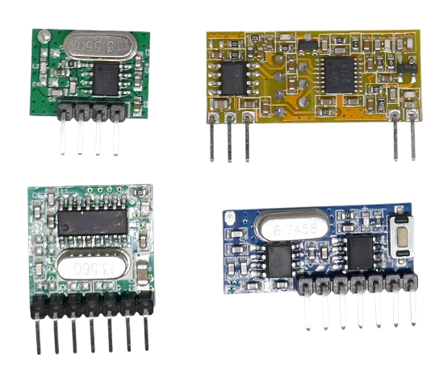
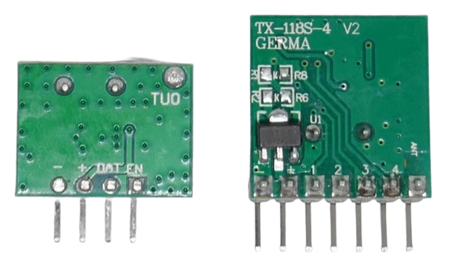
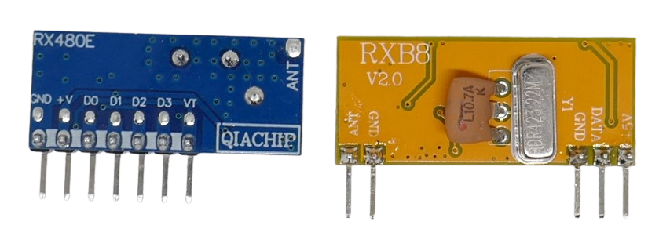

 
# EV1527 Remote Controls

> Creating Simple Remote Controls Based on EV1527 Encoding and OOK

Simple *OOK* (*On-Off Keying*) serves as the fundamental *physical layer* for wireless data transmission. However, as explored [previously](https://done.land/components/data/datatransmission/wireless/intro/usingradiowaves(ook)/sniffingrfremotes/), *OOK* alone is insufficient. A **logical layer** is required to structure and interpret the raw transmitted signals into meaningful data.

This is why a [microcontroller was necessary](https://done.land/components/data/datatransmission/wireless/intro/usingradiowaves(ook)/sniffingrfremotes/) to process incoming signals and filter out environmental noise.

To simplify this process and enable cost-effective remote controls, **EV1527** was introduced. It defines an encoding standard that transmits *24-bit ID numbers* via *OOK*.

To utilize this standard, you need [EV1527-compliant](https://done.land/components/data/datatransmission/wireless/shortrangedevice/am/ask/ev1527/) transmitters and receivers. These modules handle all the necessary logic to send and receive *EV1527*-encoded ID numbers—eliminating the need for complex microcontrollers.

## Overview

The *EV1527* is an encoder integrated circuit (IC) originally developed by [Silvan Chip Electronics Tech. Co., Ltd.](http://www.sc-tech.cn/en/contacten.htm) in Shenzhen, China. 

Due to its widespread adoption in affordable remote controls, the *EV1527* encoding scheme became a de facto standard. Today, many manufacturers produce chips capable of encoding and decoding *EV1527*-compatible data, including well-known suppliers like [Utmel](https://www.utmel.com/components/ev1527-encoder-ic-datasheet-pdf-equivalent-and-circuit?id=865).

In many cases, generic unmarked chips on budget-friendly PCBs also implement *EV1527* functionality.

### EV1527 Chip

By integrating an *EV1527*-compatible chip with a basic *OOK* transmitter or receiver, you offload the complex signal processing typically required for wireless communication.

*EV1527* encodes and decodes 24-bit numbers, converting them into signal bursts suitable for transmission via *OOK*.

The encoding scheme is detailed in one of the few available [datasheets](materials/silvan_ev1527.pdf).

The original *EV1527* chip includes four data pins, supporting remote controls with up to four distinct ID codes (channels). These four data pins define the structure of the *24-bit* ID number:

- **Sender ID:** The first *20 bits* represent a unique identifier assigned by the manufacturer. This fixed number differentiates each remote control.
- **Channels:** The remaining *4 bits* correspond to the state of the four available channels (remote control buttons).

### RF Transmitter and Receiver

*EV1527* exclusively handles signal processing and remains independent of the transport layer.

In theory, *EV1527*-encoded signals could be transmitted over various mediums. For example, it would be possible to modulate a laser beam using *EV1527*-encoded signals.

In practice, *EV1527* is almost always used with license-free RF ISM bands (*315MHz* in the US and *433MHz* in Europe and Asia). As a result, *EV1527*-compliant PCBs generally pair the *EV1527* encoder chip with an *OOK* transmitter or receiver. This design similarity often makes *OOK* and *EV1527* boards appear nearly identical.

The upper section of the image below displays an *OOK transmitter* (left) and an *OOK receiver* (right):

In contrast, the lower section features an *EV1527 transmitter* (left) and an *EV1527 receiver* (right).

The RF circuitry remains identical in both setups—both transmitters send signal bursts, and both receivers pick them up. Consequently, all boards include *crystals* tuned to a specific RF frequency.

The key distinction is that *EV1527*-compliant boards incorporate additional signal-processing capabilities. 

### Basic Operation

Here's how *EV1527* works:

- **Channels:** Each transmitter (remote control) and receiver (base station) supports multiple *channels*, corresponding to the number of devices that can be controlled. A four-channel transmitter can operate four separate devices, typically represented as four buttons on a remote.
- **ID Numbers:** The manufacturer assigns each transmitter a unique 24-bit ID number. This ID is factory-programmed and cannot be changed.
- **Pairing:** Before communication can occur, the receiver must enter pairing mode. The transmitter then sends a channel code, which the receiver stores. In future transmissions, when the receiver detects this code again, it activates the associated channel (e.g., turning a device on). If the receiver supports multiple channels, the pairing process is repeated for each one.

In practice, pairing is as simple as placing the receiver into pairing mode and pressing a button on the remote. This step is repeated for any additional buttons.

### Simpler but More Limited

While *EV1527* makes remote control implementation easier, it also introduces constraints—you are locked into *EV1527*-compatible devices. In contrast, basic *OOK* transmitters and receivers can function with any encoding scheme.

This means *EV1527* is not always superior to raw *OOK*. For instance, if you aim to integrate remote controls into *Home Assistant*, using a generic OOK receiver with *ESPHome* (as demonstrated [here](https://done.land/components/data/datatransmission/wireless/intro/usingradiowaves(ook)/sniffingrfremotes/#esphome)) might be a better approach. Since *ESPHome* already utilizes a microcontroller, it can handle the signal decoding internally.

By relying on an *ESPHome*-controlled microcontroller, you retain the flexibility to support *any* encoding scheme. This allows integration of remote controls from various manufacturers, such as *Samsung* or *Panasonic*, rather than being restricted to *EV1527*-compliant devices.

In summary, *EV1527*-compliant hardware is an excellent choice when no microcontroller is available and a simple, plug-and-play remote control solution is required.
## EV1527 Senders
*OOK* and *EV1527* sender boards look very simple but have subtle differences when you look more closely.

While *OOK senders* have just three or four pins, *EV1527 senders* feature many more. 

That's because a basic *OOK sender* like the [TX-WL102](https://done.land/components/data/datatransmission/wireless/shortrangedevice/am/ask/ookgeneric/sender/tx-wl102/) (on the left side) sends whatever (and how long) you want: 

* **OOK Sender Pins:**    
  * **Power:** two pins supply power (TX-WL102: *2.0-3.6V*). 
  * **Data:** When the **DATA** (or **DAT**) is *high*, then the sender starts sending, and when it is *low*, it stops sending. The *EN* pin is not connected.
  * **Antenna:** the antenna pin is located on the opposite side of the PCB. 

A *EV1527*-compliant sender like the [TX118SA](https://done.land/components/data/datatransmission/wireless/shortrangedevice/am/ask/ev1527/sender/tx118sa/) (right side) won't let you control the RF signal at all. 

It waits for your command to send a *24-bit ID numbers*, encoded to *EV1527* standard. You have no direct access to the RF part anymore.

* **EV1527 Sender Pins:**    
  * **Power:** two pins supply power (TX118SA: *3-24V*)
  * **Antenna:** one pin to connect an antenna
  * **Channels:** once you connect one of these pins to ground, the board starts to automatically send a *EV1527*-encoded ID number as a burst of short signals, almost like a digital morse telegraphist.

So this particular *EV1527 sender* is a *4-channel sender* and can remote-control up to four different devices.

> [!NOTE]
> Most *EV1527 senders* are tailored to ease-of-use. That's why they often come with voltage regulators that support a wide voltage range (TX118SA: 3-24V). *OOK senders* on the contrary may lack voltage regulation and require the specific voltage that the transmitter chip needs (TX-WL102: 2.0-3.6V).  

## EV1527 Receivers
The *receiver board* is the configurable part that can be matched to a particular sender. Let's again start by examining the differences.

The *OOK receiver* like the [RXB8](https://done.land/components/data/datatransmission/wireless/shortrangedevice/am/ask/ookgeneric/receiver/rxb8/) (in the picture below on the right) works similar to the *OOK sender*: 

* **OOK Receiver Pins:**    
  * **Power:** two pins supply power
  * **Antenna:** one pin connects the antenna
  * **Data:** *high* when the receiver receives a signal from the sender.

> [!NOTE]
> As you [have seen](https://done.land/components/data/datatransmission/wireless/intro/usingradiowaves%28ook%29/), in reality it is not as simple as that: the receiver **DATA** pin does not appear as a digital *high*/*low* but rather seems to be a fluctuating voltage, even if your sender is not operating. That's because the *OOK receiver* resembles just the pure physical layer and reports any signal it picks up. There are constant noise signals that make **DATA** go *high* all the time, and your true signals are embedded in the noise. It took [considerable filtering](https://done.land/components/data/datatransmission/wireless/intro/usingradiowaves(ook)/sniffingrfremotes/#source-code) on your part to reliably extract the data from the noise.  

The *EV1527 receiver* like the [RX480E](https://done.land/components/data/datatransmission/wireless/shortrangedevice/am/ask/ev1527/receiver/rx480e-4/) (on the left in the picture) has more pins **plus a push button**:

* **EV1527 Receiver Pins:**    
  * **Power:** two pins supply power
  * **Antenna:** one pin connects the antenna
  * **Channels:** *high* when the receiver receives the corresponding EV1527-encoded 24-bit ID number that was previously assigned to the channel (pairing)

## Latch Modes

*EV1527*-compliant receivers are highly sophisticated devices: they take care of all the filtering required to make sense of the incoming RF signals. When you [look at the effort](https://github.com/sui77/rc-switch) it took the [rc-switch](https://github.com/sui77/rc-switch) library to do the signal processing, then it is quite amazing to see what these *EV1527* receivers do out of the box.

And they support even different *latch modes*:

* **Push Button:** this is typically the default. The receiver channel pin is *high* for as long as the sender (remote control) keeps sending the ID number, mimicking a push button. This way, you could move blinds up or down for as long as you keep the button pressed. Many devices like garage door openers expect a quick push as well to trigger opening or closing a garage door.
* **Self-Locking:** the receiver *toggles* the channel pin, mimicking a latching switch. When the receiver receives the ID number for the particular channel, it toggles the pin from *high* to *low* and vice versa. This way, you could control a relais (or lamp), and turn it on and off.
* **Mutual Exclusive:** Like *self-locking*, however only one channel can be active. Once you press a different button on the remote control, the previously active channel goes to *low*, and the new channel changes to *high*.

Since a *EV1527 receiver* has just a single push button to interact, most receivers support a particular scheme how you can define the latch mode. 

The latch mode definition used by the [RX480E-4](https://done.land/components/data/datatransmission/wireless/shortrangedevice/am/ask/ev1527/receiver/rx480e-4/#setting-operating-mode-latch-mode) is used by many other *EV1527 receivers* as well. If in doubt, look up the manual for the *EV1527 receiver* you use.

> Tags: OOK, EV1527, Remote Control, Sender, Receiver

