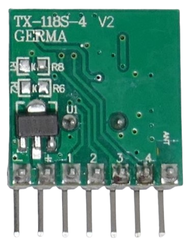
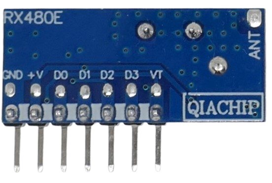
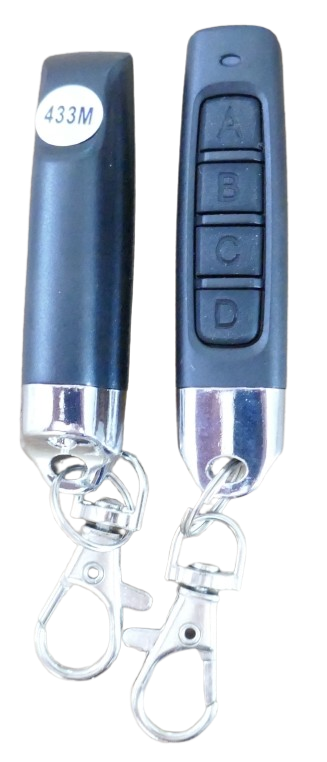
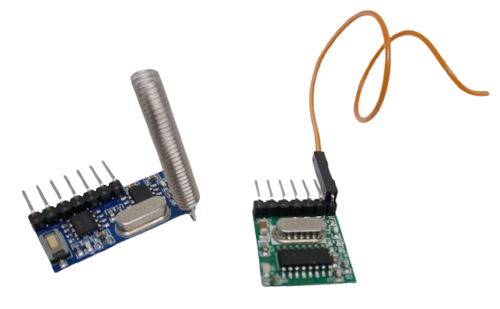
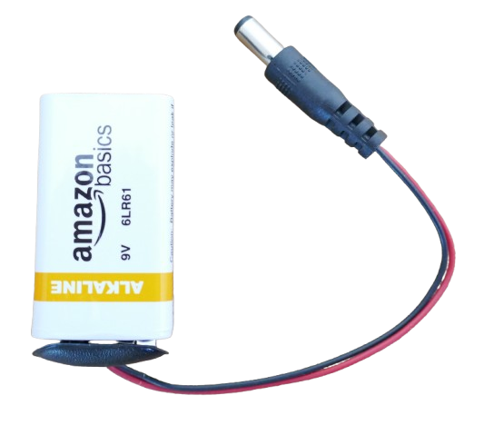
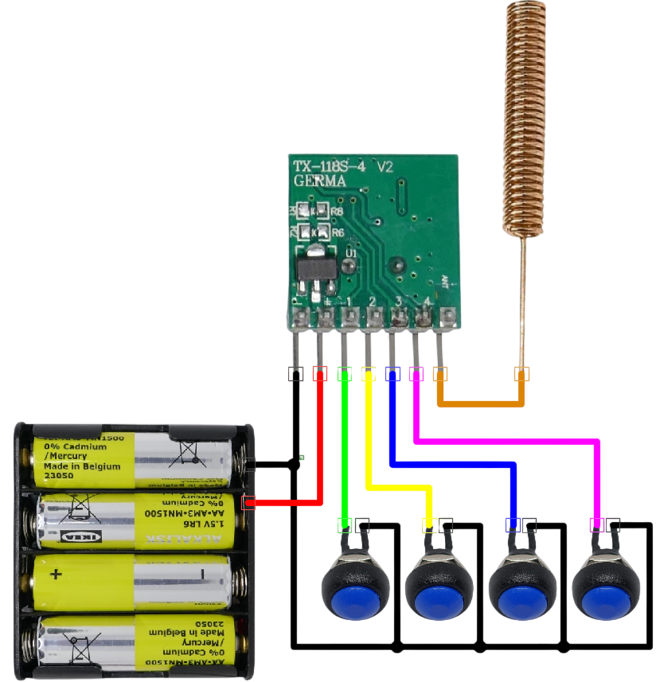
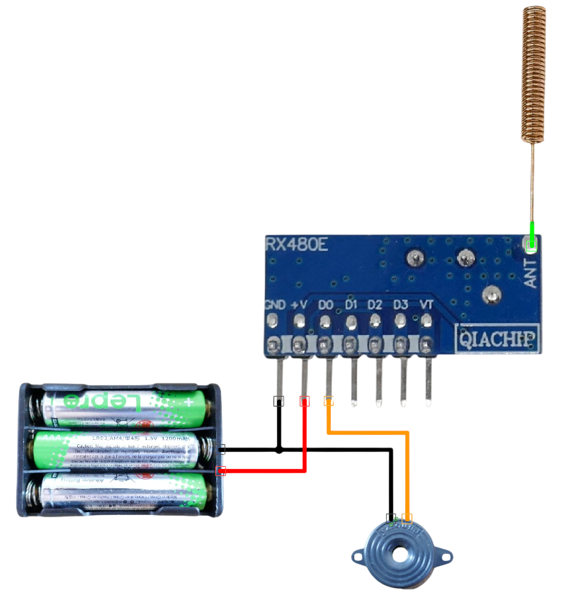
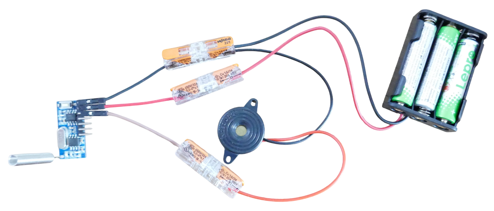

 
# EV1527 Remote Control  

> Building a Simple EV1527-Compliant Remote Control  

With *EV1527*-compliant sender and receiver breakout boards, it is very easy to create simple remote control solutions.  

  

## Overview  

In this project, we are building a simple remote control based on *EV1527*-encoded messages sent via radio waves.  

*EV1527*-compliant sender boards use the license-free ISM frequencies. The legal transmission limit of *10mW* is sufficient to send signals over a distance of a few hundred meters. Since radio transmissions do not require any infrastructure (such as a WiFi network), they work anywhere.  

### Equipment  

Use any available [*EV1527*-compliant senders and receivers](https://done.land/components/data/datatransmission/wireless/shortrangedevice/am/ask/ev1527/) for this project. These boards are very affordable, but **prices vary greatly**.  

Most of these boards are manufactured at the same Chinese plants, regardless of where you purchase them. Buying from local resellers or national platforms such as *Amazon* and *eBay* can be roughly 10× more expensive than purchasing from *AliExpress*, where you bypass many intermediaries.  

This is the equipment used in this article:  

- **Sender (Remote Control):**  
  [TX118SA](https://done.land/components/data/datatransmission/wireless/shortrangedevice/am/ask/ev1527/sender/tx118sa/) operating on *433.92 MHz* (legal in Europe). In the US, you may want to use the *315.0 MHz* variant.  
    

- **Receiver (Base Station controlling devices):**  
  [RX480-E](https://done.land/components/data/datatransmission/wireless/shortrangedevice/am/ask/ev1527/receiver/rx480e-4/) on the same frequency.  
    

Below, the sender is on the left and the receiver is on the right. Both are not yet connected to an antenna:  

  

### Commercial Remote Controls  

As an alternative, you can replace the *sender* with a ready-to-use *EV1527*-compliant remote control. They exist in many shapes and forms.  

  

Just make sure the remote control uses the same frequency as your *receiver board*. Often, there is a sticker on the back of remote controls.

  


Inside, these remote controls use the same sender chips and already include an antenna, battery, buttons, and a well-designed housing.  

> [!TIP]  
> A cost-effective strategy is to purchase a commercial remote control, then repurposing its internal components. You can i.e. 3D-print your own radical housing, or use microcontroller GPIO outputs instead of physical push buttons. 


### Frequency

Because signals are transmitted via radio waves, both sender and receiver must operate on the same frequency. Most *EV1527*-compliant devices use license-free ISM bands in the sub-GHz range:

- **315 MHz:** Common in the U.S.
- **433 MHz:** Common in Europe and Asia
- **868 MHz:** Less common for EV1527 but legal in Europe/Asia
- **915 MHz:** Rarely used for EV1527 but legal in the U.S.

> [!IMPORTANT]  
> Always verify the legal frequency regulations for your location. Additional rules, such as maximum RF transmission power, may apply.

## Attaching an Antenna  

Most sender and receiver breakout boards are not shipped with an attached antenna. You **must** connect a suitable antenna before use:  

- **Sender:**  
  Operating a sender without an antenna or with a poorly tuned antenna can damage it. Without an antenna, the RF energy cannot be emitted, causing it to convert into heat and potentially destroy the sender chip.  

- **Receiver:**  
  A receiver can function without an antenna without risk of damage. However, it may struggle to pick up signals, and the effective transmission range will be severely reduced.  

Some breakout boards include a separate *coil antenna*, particularly those with a dedicated solder pad for the antenna. In this case, the coil antenna must be soldered onto the pad.  

Coil antennas are compact and perform well. For added durability, you can cover the coil with a colorful piece of shrink tubing. This enhances appearance, prevents accidental short circuits when handling the coil, and offers some protection from moisture.  

  

### Building Your Own Antenna  

If you don’t have a suitable antenna, you can easily make one by using a wire of the correct length. For *433 MHz* devices, the wire should be exactly *17.3 cm* long.  

For breakout boards that require an external antenna connection via a pin, a standard *DuPont* wire with a female connector works well. Simply cut it to the required length.  

<details><summary>Calculating Antenna Length</summary><br/>  

You can calculate the optimal antenna length for a given frequency using the following formula:  


  ````
  Length for λ/4-Antenna:
  =======================
  7495 / frequency (MHz) = antenna length (cm)
  
  433 MHz devices:
  ================
  7495 / 433.25 =  17.3 cm
  
  315 MHz devices:
  ================
  7495 / 315.00 =  23.8 cm
  ````


</details>


## Sender (Remote Control)  

If you are using a ready-to-use commercial RF remote control, you can skip this section.  

### Pinout  

Sender breakout boards typically have the following pins: 

  

| Pin Label  | Description  |
|------------|-------------|
| **ANT**, **OUT**, **A**  | A pin or solder pad for the antenna connection. Attach an appropriate antenna here. |
| **+**, **V**  | Positive voltage input. Check the board specifications for voltage range. The [TX118-SA](https://done.land/components/data/datatransmission/wireless/shortrangedevice/am/ask/ev1527/sender/tx118sa/) operates on *3-24V*. A higher voltage increases RF output power. |
| **-**, **G**  | Ground connection. |
| **1**, **2**, **3**, **4**  | Each pin corresponds to a channel (similar to the buttons on commercial remote controls).<br/><br/>Depending on the board, connecting a pin to either *ground* or *VCC* triggers transmission of the corresponding channel’s code. The board continuously sends this code until the pin is disconnected. |

> [!NOTE]  
> If your board does not have pins labeled `1`, `2`, etc., but instead has a `DAT` or `DATA` pin, you have a generic [OOK sender board](https://done.land/components/data/datatransmission/wireless/shortrangedevice/am/ask/ookgeneric/sender/) rather than an [EV1527 sender board](https://done.land/components/data/datatransmission/wireless/shortrangedevice/am/ask/ev1527/).  

### Wiring  

- **Power:** Connect the power supply pins to an appropriate power source. The [TX118-SA](https://done.land/components/data/datatransmission/wireless/shortrangedevice/am/ask/ev1527/sender/tx118sa/) supports *3-24V*, but typically requires at least *5V* for a reasonable RF output. I use a *4×AAA* battery pack (*1.5V × 4 = 6V*). For stronger transmission, a *9V battery* is a good option.  

    

- **Antenna:** Always connect an antenna! Running a sender board without one, or with an improperly matched antenna, can permanently damage it.  

- **Buttons:** Connect each channel pin to a push button. Connect the other side of the button to *ground* (some sender boards may require pulling the channel pins *up* instead of *down*).  

    

## Testing  

Some breakout boards lack an indicator LED. To verify that the sender is working, you can test it using a multimeter or the [Remote Control Sniffer](https://done.land/components/data/datatransmission/wireless/intro/usingradiowaves%28ook%29/sniffingrfremotes/#id-code-numeric-format) from this article series.  

- **Multimeter Test:**  
  1. Connect the multimeter *in series* with the power supply.  
  2. Set it to measure *current*.  
  3. When you press a push button, the *EV1527* sender should begin transmitting, drawing *20-80mA*.  
  4. Upon release, power consumption should drop to nearly zero.  

- **Remote Control Sniffer Test:**  
  - If you built the [Remote Control Sniffer](https://done.land/components/data/datatransmission/wireless/intro/usingradiowaves%28ook%29/sniffingrfremotes/#id-code-numeric-format), it should display a unique *24-bit* code whenever you press a button.  
  - Each button should always transmit the same ID code when pressed and stop when released.  

    

## Receiver  

Receiver boards have similar pin functions to sender boards:  

 

- **Power:**  
  - Provide the appropriate voltage as per the board specifications.  
  - *Receiver* boards may require different voltages than *sender* boards.  
  - The [RX480-E](https://done.land/components/data/datatransmission/wireless/shortrangedevice/am/ask/ev1527/receiver/rx480e-4/) operates on *3.3-5V* and **cannot** be powered with the *4×AA* battery pack used for the sender. Instead, use a *3×AAA* pack (4.5V).  

- **Antenna:**  
  - Connect a suitable antenna for reliable operation.  
  - Without an antenna, the receiver must be placed very close to the sender, significantly reducing performance.  

- **Channel Outputs:**  
  - Each channel pin is *low* by default.  
  - It goes *high* when an *EV1527* ID matching that channel is received.  

To simplify testing, connect a small load (such as an active buzzer or an LED with a series resistor) to **one** output channel, leaving the others unconnected for now:  

    

### Output Pins  

- Each channel has an individual output pin, which provides a *logic level signal*.  
- These outputs can only source or sink small currents. **Do not connect high-power devices (e.g., relays or motors) directly.**  
- To control larger loads (e.g., lamps, fans, garage doors), use a **MOSFET**, **SSR relay**, or **relay board** that supplies power separately.  

### Additional Pins (e.g., `VT`)  

- Some receiver boards include an extra pin, often labeled `VT` (*RX480-E* uses this label, but others may differ).  
- This pin goes *high* whenever **any** valid code for **any** channel is received.  
- Regardless of latch mode, `VT` remains *high* **only while** a valid code is being received.


## Pairing  

Once your *sender* and *receiver* are operational, the final step is to *pair* them.  

### How Pairing Works  

*EV1527* senders have built-in unique codes assigned by the manufacturer. When you activate a channel on your sender, it transmits its predefined code.  

For the *receiver* to recognize and respond to this code, it must first *learn* it through the pairing process. Most *EV1527* receiver boards have a built-in push button for pairing control.  

A detailed step-by-step pairing guide for the [RX480-E receiver board](https://done.land/components/data/datatransmission/wireless/shortrangedevice/am/ask/ev1527/receiver/rx480e-4/#pairing) is available. Since most receivers use the *EV1527* chip (or a clone), the pairing process is nearly identical across different models.  

Below is a short version to get you started.  


## Pairing Process  

Before you begin, connect both the *sender* and *receiver* boards to power. Then, follow these steps:  

### 1. Reset the Receiver  

1. Press the pairing button on the receiver **eight times**.  
2. Each press should cause the onboard LED to light up.  
3. After the eighth press, the LED will blink **four times** after a brief delay.  
4. The receiver has now erased all previously stored pairings.  

### 2. Pairing  

1. Press the pairing button on the receiver **once**.  
2. After a short delay, the LED will stay on, indicating that the receiver is in *learning mode*.  
3. Press a button on your *remote control* or on the *sender board*. This will cause the sender to transmit one of its fixed ID codes.  
4. If pairing is successful, the receiver’s LED will blink **three times**.  
5. The receiver is now programmed to respond to the sender button that was pressed.  

To pair additional buttons, repeat **Step 2** for each one.  


## Testing  

Once at least one channel has been paired, test your setup:  

1. Connect a **LED** or an **active buzzer** (one that emits sound automatically when powered) to the first channel’s output pin:  

     

2. Press the paired button on your *remote control* or *sender board*.  
3. The buzzer should emit a beep for as long as the button is held down.  

> [!TIP]  
> If your receiver does not respond, try connecting the buzzer to another channel pin. The button-to-channel assignment may vary and is not always sequential.  


## Findings  

Your simple setup is actually working like the *Marconi Morse Code Transmitter* that I wanted to build with [simple OOK senders and receivers](https://done.land/components/data/datatransmission/wireless/shortrangedevice/am/ask/ookgeneric/) but [failed](https://done.land/components/data/datatransmission/wireless/intro/usingradiowaves%28ook%29/#experience-failure-using-ook-wrongly).  

With [EV1527-encoded OOK](https://done.land/components/data/datatransmission/wireless/shortrangedevice/am/ask/ev1527/) this suddenly works, and it wasn't hard at all.  

You now know why: transmitting information via radio waves requires a *logical layer* (*EV1527*) on top of the *physical layer* (*OOK*). The logical layer filters out natural noise that is omnipresent and interprets the radio signals in a meaningful way.  

### Understanding EV1527  

*EV1527* senders and receivers are still not the perfect *Marconi Morse Code Transmitter* because they work only for *very slow* telegraphists.  

Once you press a button on your remote control just for a very short period of time, the buzzer won't respond.  

That's because one of the strategies *EV1527* employs to fight noise and transmission errors is the requirement that the channel code must be repeated a few times. That takes time and explains both the latency you see (or *hear*) when you press a button on the remote control, plus the minimum duration you need to press a button before the receiver accepts it.  

### Latching (Operating Modes)  

Most receiver boards can be programmed to use different operating modes. By default, they work as *push buttons*, so the channel pin is *high* for as long as the receiver keeps receiving the channel code. Once you release the button on the remote control, the buzzer stops.  

There are [six different latching modes](https://done.land/components/data/datatransmission/wireless/shortrangedevice/am/ask/ev1527/receiver/rx480e-4/#setting-operating-mode-latch-mode) you can use, and you can, for example, teach the receiver to switch from *push button* to *latched switch* mode: now each press on the remote control button **toggles** the channel pin—ideal for turning a light or fan *on* and *off*.  

In a nutshell, to switch to a new operating mode, you repeat the pairing from scratch:  

- **Completely reset** the receiver with **eight button presses**.  
- Then, initiate the pairing not with **one** button press, but instead use **two presses** (for self-locking switch mode) or [one of the other options](https://done.land/components/data/datatransmission/wireless/shortrangedevice/am/ask/ev1527/receiver/rx480e-4/#setting-operating-mode-latch-mode).  

All subsequent pairings now use the self-locking mode. The operating mode can only be set **once** after you have reset the receiver.  

## Conclusions  

*EV1527* remote controls are trivial to set up and work great for simple remote control scenarios.  

They are *one-way transmission* by nature, meaning you work with a distinct sender (the remote control) and a distinct receiver.  

There is no back channel, so the sender cannot know the current state of the devices you are controlling, and there is also no feedback ensuring that the receiver actually picked up the sent signal.  

*EV1527*-encoded remote controls are ideal for devices that provide *natural* feedback. For example:  

- **Garage doors:** You can **see** whether they are open or closed and **hear** the motor when activated.  
- **Fans, air conditioners, lights:** These provide immediate visual or auditory confirmation when turned on or off.  

### Legal Ramifications  

Since radio waves are public and can interfere with other signals, their use is strictly regulated in most countries. In addition to frequency restrictions, the transmission power is also legally limited.  

*EV1527* is designed for short-range applications, such as remote controls within personal property. The typical operating range is a few hundred meters, and the RF power is limited to low values, i.e., **10mW (10dBm)** in Europe.  

### Boosting RF Power  

Exceeding the legal RF power limit is not just **illegal** but generally unnecessary and not helpful:  

- **Interference:** Higher power increases the risk of jamming nearby remote controls. While *EV1527* uses unique ID codes to prevent accidental interference, excessive RF power can disrupt other devices.  
- **Battery Life:** Higher transmission power drains battery-operated devices faster without offering any real benefit if your receiver is already within range.  
- **Security Risks:** Stronger signals allow attackers to capture and replay remote control messages from a greater distance.  

> [!TIP]  
> If your remote control isn't working over the required distance, increasing RF power is rarely the solution. The most common issue is a missing or improperly tuned antenna (wrong length, shielded by metal housings, etc.). Antennas are just as important as transmission power for ensuring reliable signal reception.  

### Illegal Boards  

Some breakout boards exceed the **10mW** limit, especially when operating them with voltages close to their maximum. This is strictly speaking illegal, even though enforcement is rare: the exceeding RF power is still low enough to typically not cause significant interference or complaints that would trigger investigations.  

Still, you may want to experiment with the sender’s supply voltage and choose the lowest voltage that still reliably controls your devices. For battery-powered devices, this lowers power consumption, extends battery life, and makes it harder for attackers to pick up and abuse your signals.  

One way of adjusting the sender’s supply voltage is to choose appropriate batteries (or battery holders): instead of using a 12V battery (provided your sender accepts this voltage), try using a Li-Ion cell at 4V or a 3xAAA battery holder at 4.5V.  

> Tags: OOK, EV1527, Remote Control, Sender, Receiver, Marconi, Morse Code, RX480-E, TX118-SA, TX118-S-V4

[Visit Page on Website](https://done.land/components/data/datatransmission/wireless/intro/usingradiowaves(ook)/ev1527remotecontrols/remotecontrol?971770031620254455) - created 2025-03-19 - last edited 2025-03-20
