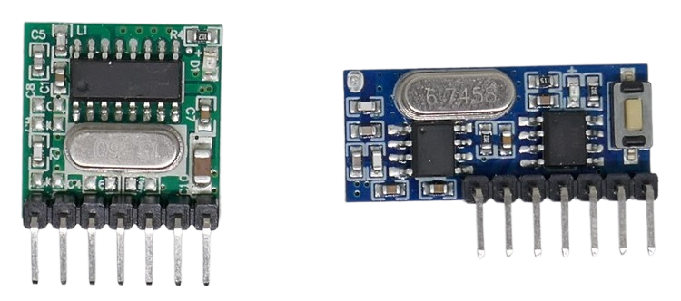
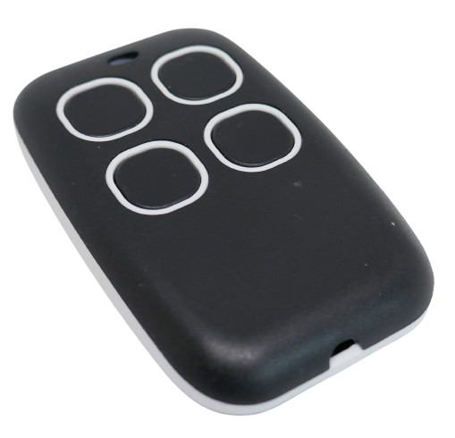

 
# EV1527 Remote Control

> Building a Simple EV1527-Compliant Remote Control

With *EV1527*-compliant sender and receiver breakout boards, it is easy to create simple remote control solutions.

## Overview

[*EV1527*-compliant senders and receivers](https://done.land/components/data/datatransmission/wireless/shortrangedevice/am/ask/ev1527/) are essentially a combination of basic [OOK (On-Off Keying) transmitters and receivers](https://done.land/components/data/datatransmission/wireless/shortrangedevice/am/ask/ookgeneric/) paired with an [EV1527 encoder chip](https://done.land/components/data/datatransmission/wireless/intro/usingradiowaves%28ook%29/ev1527remotecontrols/).

In the image below, the *EV1527*-compliant *sender* is shown on the left ([TX118SA](https://done.land/components/data/datatransmission/wireless/shortrangedevice/am/ask/ev1527/sender/tx118sa/)), and a matching receiver is on the right ([RX480-E](https://done.land/components/data/datatransmission/wireless/shortrangedevice/am/ask/ev1527/receiver/rx480e-4/)):

Another type of sender you can use are commercially available *EV1527*-compliant remote controls. Internally, these contain the same sender chips, plus a few ready-to-use buttons, a battery, and a nice housing.

Maybe you have some of these remote controly laying around somewhere in your house gathering dust, and can reuse them in this project.

## Overview

In this project, we'll wirelessly control devices using radio waves and *EV1527 encoding*.

This setup uses *one-way transmission*, meaning you need both a *sender* and a *receiver*.

### No Feedback Mechanism

Since communication is one-way, the sender has no way of verifying whether the receiver received the signal. It is also unable to determine the current status of the controlled device.

So this type of remote control is ideal for devices that provide *natural* feedback. For example:

- **Garage doors:** You can see whether they are open or closed and hear the motor when activated.
- **Fans, air conditioners, lights:** These provide immediate visual or auditory confirmation when turned on or off.

### Frequency

Because signals are transmitted via radio waves, both sender and receiver must operate on the same frequency. Most *EV1527*-compliant devices use license-free ISM bands in the sub-GHz range:

- **315 MHz:** Common in the U.S.
- **433 MHz:** Common in Europe and Asia
- **868 MHz:** Less common for EV1527 but legal in Europe/Asia
- **915 MHz:** Rarely used for EV1527 but legal in the U.S.

> [!IMPORTANT]  
> Always verify the legal frequency regulations for your location. Additional rules, such as maximum RF transmission power or duty cycles, may apply.

### RF Transmission Power and Range

Since radio waves are public and can interfere with other signals, their use is strictly regulated in most countries. In addition to frequency restrictions, the transmission power is also legally limited.

*EV1527* is designed for short-range applications, such as remote controls within personal property. The typical operating range is a few hundred meters, and the RF power is limited to low values, i.e. **10mW (10dBm)** in Europe.

Exceeding this limit is not just illegal but generally unnecessary and can have drawbacks:

- **Interference:** Higher power increases the risk of jamming nearby remote controls. While *EV1527* uses unique ID codes to prevent accidental interference, excessive RF power can disrupt other devices.
- **Battery Life:** Higher transmission power drains battery-operated devices faster without offering any real benefit if your receiver is already within range.
- **Security Risks:** Stronger signals allow attackers to capture and replay remote control messages from a greater distance.

Some breakout boards exceed the **10mW** limit, which may be illegal in some regions. While enforcement is rare, it is still advisable to keep transmission power within legal limits in your personal interest.

> [!TIP]  
> If your remote control isn't working over short distances, increasing RF power is rarely the solution. The most common issue is a missing or improperly tuned antenna. Antennas are just as important as transmission power for ensuring reliable signal reception.

## Required Items

- **EV1527 Receiver:**  
  - A [breakout board](https://done.land/components/data/datatransmission/wireless/shortrangedevice/am/ask/ev1527/sender/), preferrably a receiver of type **superheterodyne**. Try and avoid receivers of type **superregenerative** as they are less reliable and *can* cause frustration. If you already have a *superregenerative receiver*, try it out. It may work perfectly well for you. If not, switch it out against a *superheterodyne*.    

    I am using a [RX480-E](https://done.land/components/data/datatransmission/wireless/shortrangedevice/am/ask/ev1527/receiver/rx480e-4/). Most *EV1527* receivers are wired very similarly.

- **EV1527 Sender:**  
  - A [breakout board](https://done.land/components/data/datatransmission/wireless/shortrangedevice/am/ask/ev1527/sender/) **-or-**  
  - A [*EV1527*-compliant RF remote control](https://www.google.com/search?q=ev1527+remote+control)    
      
      I am using a [TX118SA](https://done.land/components/data/datatransmission/wireless/shortrangedevice/am/ask/ev1527/sender/tx118sa/) and a commercially available ready-to-use remote control.

### Cost
The required items are very inexpensive; however, prices can vary substantially depending on *where* you shop. I ordered the boards from *AliExpress* for less than 1-2€ per piece.

**Identical** boards can cost nearly 10 times as much when ordered from a local retailer, *Amazon*, or *eBay*. Just google around, and compare a bit.

As is almost always the case with such microelectronics, the higher prices are mainly due to the many additional intermediaries. The boards typically come from the same Chinese manufacturer anyway, regardless of where you purchase them.

> Tags: OOK, EV1527, Remote Control, Sender, Receiver

