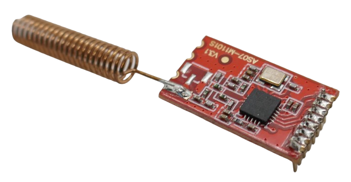

 
# Using FM Transceivers

> Reliable Data Transfer At High Speeds Using FM Modulation

Whenever you need to *reliably* transfer larger amounts of data at high rates of speed, simple *OOK* transmission quickly reaches its limits. 

**FM** (*Frequency Modulation*) requires more complex receiver circuits than *OOK*, which is why *OOK* remains popular for very low-cost and low-power applications like simple remote controls. Thanks to technological progress, *FM breakout boards* today aren't more expensive than *OOK* senders and receivers, though. 

They exist in many shapes and forms and work on different frequency bands.

## Overview

Simple *OOK* is the technically most basic way of sending radio waves: the sender is turned on and off in intervals to transmit signals. 

With encodings like *EV1527*, this is sufficient to transmit simple chunks of data, i.e. *24bit IDs* for remote controls. However, this is neither reliable, efficient nor fast.

*OOK* is still widely used because of its technical simplicity, and low-cost applications like remote controls continue to use it. 

Once you need to transfer more data over longer distances in higher speeds, or with less power consumption, then more technical cleverness is necessary to make better use of radio waves.

### Transceiver
Most *FM*-based breakout boards are *transceivers*: they can both *send* and *receive*, meaing you don't need distinct *sender boards* and *receiver boards* like in *OOK* and *EV1527*.

Being able to *send* **and** *receive* enables *two-way communication* which is important for *robust* data transfer: 

A *sender* can **send** data and then switch to **receiver** mode to listen for an acknowledgement from the receiver, ensuring that the transmission was received correctly. Likewise, the **receiver** switches to **sender mode** once it received data and reports back whether the data was received ok, or whether a re-transmission is needed.

Most modern communication protocols use this constant switch in *sending* and *receiving* to ensure data integrity.

### Microcontroller Required

Even though *FM breakout boards* do all the heavy lifting for you, they typically require a microcontroller to program them. 

Depending on type of board, commands can be issued using the common interfaces ( *UART (serial)*, [I2C](https://done.land/fundamentals/interface/i2c/), [SPI](https://done.land/fundamentals/interface/spi/)).

#### Specialized Modules
Most *FM* breakout boards are *generic* and leave it up to you how you'd like to use them: you can choose modulation, speed, RF power, and submit any data in any encoding you wish. 

*Specialized FM modules* exist that are already tailored for a specific use case and require no external microcontroller or programming. 

I am not focusing on these types of *specialized modules* here, but would like to quickly illustrate what they are: one particularly popular type handles *wireless serial*, often bi-directional:

1. Connect **RX** and **TX** to such a module.
2. Connect **RX** and **TX** of another (paired) module somewhere else.

Both modules now transfer any serial data wirelessly at a defined baud rate. No need for expensive cables.

## Frequency Modulation (FM)

Once signal processing became more affordable thanks to transistors, specialized chips, and microcontrollers, *FM modulation* gained traction, and today, most professional radio transmissions use *FM*.

> [!NOTE]
> Aviation radio is one of the last domains where amplitude modulation (*AM*) is still in  use, primarily for historical reasons. Even public broadcast has long ago switched from *AM* to *FM* with the move away from short wave frequencies (*SW*/*MW*) to the modern *VHF* frequencies. 

*FM* sends radio waves *continuously*, so the sender can operate efficiently and with more stability. The information payload is *modulated* onto the radio waves by slightly shifting the frequency.

> [!NOTE]
> *FM modulation* is so efficient that it is used in public broadcast transmissions. That's why sometimes *FM* is used as a synonyme for public broadcast. *FM* however is just a *modulation technique* and can be used with any frequency, including the license-free ISM bands that are used in DIY projects.   

## FM Advantages

In a nutshell, *FM* can transmit information more reliably and with less energy at higher speeds, and is less affected by noise and competing signals.

### Multipath Fading
*Multipath fading* is the reason why amplitude-modulated signals (including *OOK*) is severely affected by radio while *FM* is immune against it.

*Multipath fading* occurs when a transmitted signal takes multiple paths to reach the receiver due to reflections, diffractions, and scattering caused by obstacles like walls, buildings, mountains, and even vehicles.

*Amplitudes* are like the small waves you see when you throw a stone into a lake, and when reflected amplitudes hit other amplitudes, depending on their phase shift (timing), they either grow or diminish. 

Any modulation that relies on *amplitude height* is therefore severley affected by this. *FM* encodes information in frequency shifts rather than amplitude changes, so it is inherently less affected by amplitude fading.

In addition, in *FM*, the strongest received signal dominates, reducing the impact of weaker multipath components.

### Speed and Data Efficiency
*FM* can transmit data in a much more efficient way compared to *OOK*, so it can leverage the available radio frequencies and bandwidths better. 

The practical result is increased speed: within the same bandwidth (radio frequency range), *FM* can transfer *more data* per second than *OOK* and *AM*.

### Power Efficiency
In DIY projects, devices are often battery- or solar-powered, so power consumption and efficiency often is an important consideration.

*FM*-based digital transmission schemes like *Gaussian Minimum Shift Keying* (*GMSK*) offer better power efficiency than *OOK*.

## Digital FM Modes

*FM* is an **analog** modulation technique, and the carrier frequency varies according to the input signal amplitude. 

That's great for its early use cases: walky talkys or public broadcasts can hook up a microphone, transfer its amplitudes via *FM* (frequency shifts), and that's it.

Today, transferring **digital** information has become much more important than transferring **analog** information: 

Computers, smartphones, microcontrollers, *WiFi*, *Bluetooth*, *Zigbee*, etc. all use or transmit **digital** information.

> [!NOTE]
> You *can* transfer *digital* information via *FM*. However, anyone who ever used an [acoustinc coupler](https://en.wikipedia.org/wiki/Acoustic_coupler) in the early days of the Internet knows the disadvantages: the grossly inefficient overhead allows for only very slow speeds.

### Digital FM Modulation

Similar to [ASK](https://done.land/components/data/datatransmission/wireless/shortrangedevice/am/ask/) (*Analog Shift Keying*) on **AM**, [FSK](https://done.land/components/data/datatransmission/wireless/shortrangedevice/fm/fsk/) (*Frequency Shift Keying*) is the fundamental modulation on **FM** to efficiently transfer *digital* data: binary data (`0` and `1`) is represented by two different frequency shifts.

*FSK* has been revised and improved over time to improve efficiency and reliably. Today a number of *digital FM modulations* are available, including but not limited to these:

* **Gaussian Frequency Shift Keying (GFSK):**    
  Refined version of *FSK* that smooths transitions between frequency shifts using a Gaussian filter, reducing bandwidth and spectral splatter.

* **Minimum Shift Keying (MSK):**    
  Special case of *FSK* where the frequency deviation is minimized to maintain continuous phase transitions.

* **Gaussian Minimum Shift Keying (GMSK):**    
  Filtered version of *MSK* that further improves spectral efficiency and is used in standards like *GSM*.

> [!NOTE]
> On top of all of this, *spread spectrum methods* were invented that **dramatically** increase transmission distances at the expense of speed, especially with low RF power. *LoRa* (**lo**ng **ra**nge) is a popular use case. Spread Spectrumn is a topic for another day, but many FM breakout boards already support it.

How do WiFi, Bluetooth, Zigbee, and Matter fit into the picture?
 

We all use digital transmissions all the time and almost everywhere:

| Technology  | Primary Use Case | Range | Power Consumption |
|-------------|----------------|-------|------------------|
| **Wi-Fi** | High-speed data, internet | Medium (~50m indoors) | High |
| **Bluetooth Classic** | Audio, peripherals | Short (~10m) | Moderate |
| **Bluetooth Low Energy (BLE)** | IoT, sensors, wearables | Short (~50m) | Low |
| **Zigbee (and Thread)** | Smart home, industrial IoT | Medium (~100m) | Very low |
| **Matter** | Smart home interoperability | Varies (depends on transport) | Varies |

These are all based on the same simple [OOK principles](https://done.land/components/data/datatransmission/wireless/intro/usingradiowaves%28ook%29/) that *any* digital transmission uses. All of them resemble just clever *wireless communication protocols* that are implemented on top of the physical *OOK* layer (the physical and raw transmission of radio waves).

- **Bluetooth and BLE use GFSK**, a direct descendant of FM that optimizes frequency-based modulation for digital communication.
- **Zigbee (Thread uses the same PHY layer) uses O-QPSK**, which, while not directly FM-based, still benefits from frequency domain processing for noise immunity.
- **Wi-Fi uses OFDM**, which is a multicarrier modulation method that is significantly more complex than FM but still leverages frequency shifts in subcarriers for data transmission.

| Technology  | Modulation Scheme | Notes |
|-------------|------------------|-------|
| **Wi-Fi (802.11)** | **OFDM (Orthogonal Frequency-Division Multiplexing)** | Uses multiple frequency subcarriers to improve spectral efficiency and reduce interference. |
| **Bluetooth (Classic)** | **GFSK (Gaussian Frequency Shift Keying)** | Reduces spectral splatter and improves power efficiency. |
| **Bluetooth Low Energy (BLE)** | **GFSK** | Optimized for low-power applications with a narrower bandwidth than Classic Bluetooth. |
| **Zigbee (IEEE 802.15.4)** | **O-QPSK (Offset Quadrature Phase Shift Keying) with DSSS (Direct Sequence Spread Spectrum)** | Improves noise resistance and reduces interference in the 2.4 GHz band. |
| **Matter (over Thread or Wi-Fi)** | **Depends on underlying protocol (Thread = O-QPSK, Wi-Fi = OFDM)** | Matter itself is an application-layer protocol that operates over existing transport technologies like Thread (Zigbee-based) or Wi-Fi. |

> [!TIP]
> While digital FM modulations cannot transfer analog signals anymore, you can still build a walky talky: use a *ADC* (analog-digital-converter) to digitize your microphone amplitudes, and on the receiver side, run the bits through a *DAC* (*digital-analog-converter*) to drive a speaker. Or, use a *digital microphone* and *digital amplifiers* right away (i.e. using *I2S*)

> Tags: FM, FSK, GFSK, Amplitude, Noise