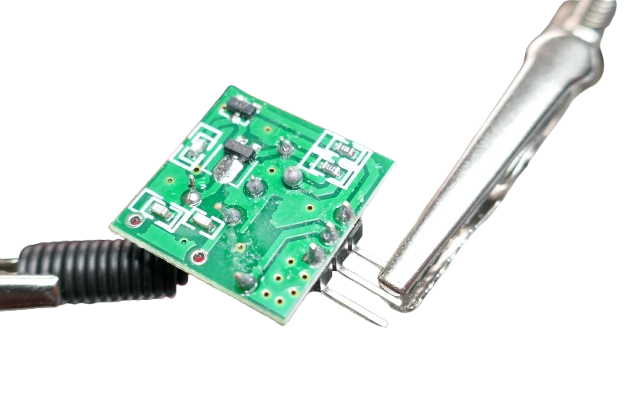
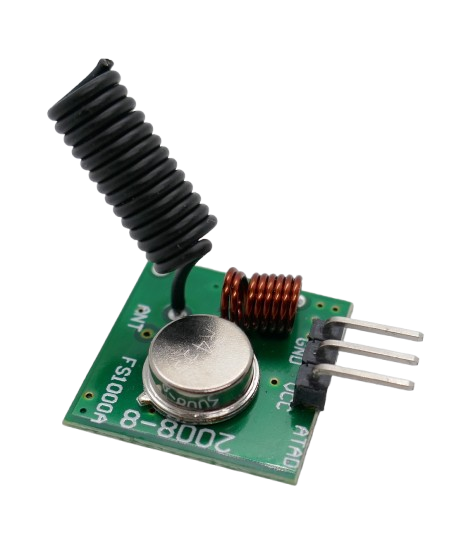
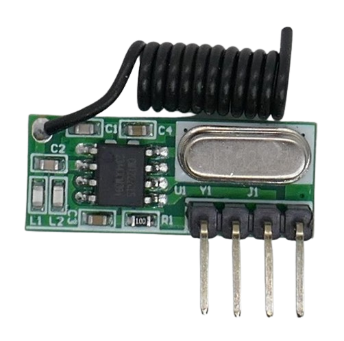

 
# Sending And Receiving Radio Waves

> Creating, Emitting, Sending, And Receiving Radio Waves

*OOK* (*On-Off-Keying*) is the modern name for the basic principle of an early *Marconi Morse Code Transmitter*, and it is basis of RF remote controls as well as the foundation of all modern digital transmission modulations (including *WiFi* and *Bluetooth*).

Since *OOK senders and receivers* are dirt cheap, it's the perfect place to start getting your hands dirty.

## Overview

*OOK* (*On-Off-Keying*) is essentially describing a transmitter that can be **turned on** and **turned off** - that's it. 

There is no sophosticated overhead such as *modulation* (*AM*, *FM*, etc.), and *OOK* is the closest resemblence of an ancient *morse code transmitter*, similar to the one that was used in 1912 to try and save the *RMS Titanic*.

*OOK* transmitters don't care about *what kind of information* you want to transmit. It is your responsibility to *encode* the information in a series of *high* (sender *on*) and *low* (sender *off*) pulses.

That's why in theory, you could use *OOK* senders to transmit audio or even video. However, *OOK* is typically usable for signals in the range of *1-5kHz*, so the data transmission speed is very low. Transmitting a picture or video would be entirely possible, however it would take forever to transmit. 

> [!TIP]
> *HAM Radio Amatuers* created [Slow Scan Television (SSTV)](https://en.wikipedia.org/wiki/Slow-scan_television) in 1957 to transmit pictures at a rate of seconds to minutes to transmit a single picture.

## OOK Transmitter

*OOK senders* are available as ready-to-use breakout board, transmitting on one of the license-free ISM bands (such as *433.95MHz*). The [FS1000A](https://done.land/components/data/datatransmission/wireless/shortrangedevice/am/ask/ookgeneric/sender/fs1000a/) is a popular example.

Pick any **OOK** sender board at your discretion as long as 

* it is transmitting on a frequency [legal to operate](https://done.land/components/data/datatransmission/wireless/) in your region
* does not exceed the maximum transmission power
* and is indeed a *OOK sender* with nothing else implemented.

There are more sophisticated RF sender boards that add additional features:

* **EV1527 Remote Controls:** [EV1527](https://done.land/components/data/datatransmission/wireless/shortrangedevice/am/ask/ev1527/)-compliant senders are ready to send *24-bit remote control IDs*. They are perfect when you want to create your own simple remote controls, however these senders cannot send anything else anymore - just 24bit bursts using the *EV1527* standard.
* **Microcontroller-based:** Sophisticated [FM transceivers](https://done.land/components/data/datatransmission/wireless/shortrangedevice/fm/fsk/) use microcontrollers or specialized chips to handle digital data packets and modulations. They are perfect when you intend to transmit complex information. However, they too cannot send pure and unmodulated radio waves anymore.

These boards are great - often much better suited than simple *OOK* boards - but for the moment (and the objective of this article), *OOK* is best as it lets us focus on the fundamentals, and the easiest start is to get yourself a dedicated **OOK sender** and a dedicated **OOK receiver** board.

> [!NOTE]
> Remote controls are very simple *one-way transmissions* which is why you use dedicated *senders* (**transmitters**) and **receivers**. Modern microcontroller-based boards (i.e. **CC1101**) target much more sophisticated transmission protocols including *two-way communications* which is why these boards are **transceivers** (**trans**mitter and re**ceiver**) and can be programmed to act as *sender* **or** *receiver*. Many support the basic *OOK* mode, too, so you *could* use two such sophisticated boards and "downgrade" them to become **OOK sender** and **OOK receiver**. Programming the boards to act that way would be considerable overhead but proves that *OOK* is in fact the foundation of any digital transmission technique used today.

### Pins
*OOK senders* have just three pins: 

* **Power Supply:**     
  **GND** and **VCC** supply the board with power. Senders typically support a wide voltage range (*5-12V* for the [FS1000A](https://done.land/components/data/datatransmission/wireless/shortrangedevice/am/ask/ookgeneric/sender/fs1000a/)). 
  
  The higher the voltage, the more powerful is the radio signal. When you supply the full *12V*, the *FS1000A* most likely generates a radio signal significantly over the legal limit of *10mW*. Start with *5V* for testing low-range scenarios without causing too much interference for others or worse, violate regulations.
* **Data:**     
  A **DATA** pin can be *high* or *low*. *High* turns the sender on, and *low* turns it off. On the *FS1000A* board, **DATA** was printed in reverse by accident: **ATAD**.
  
  
  

### Board Design
*OOK senders* are simple: made of a LC circuit and a crystal. The coil on the board **is not the antenna**. You typically need to add an external antenna yourself. With the *FS1000A*, solder it to the through-hole solder pad marked **ANT**.

Often, these modules come with coil antennas (that you may want to wrap in some shrink tube for better optics and insulation). 

Or you use a simple wire of appropriate length as discussed above.

## OOK Receiver
To successfully test a radio transmission, you need a *OOK receiver* to pick up the radio waves sent by the *OOK transceiver*. 

### Superheterodyne is better
Often, the *FS1000A sender* comes bundled with a receiver module called [MX-RM-5V](https://done.land/components/data/datatransmission/wireless/shortrangedevice/am/ask/ookgeneric/receiver/mx-rm-5v/).

As you lerned before, receivers can use different designs, and the *MX-RM-5V* is of type *superregenerative*: cheap, unreliable, and often severely affected by noise.

If you can, use a *superheterodyne receiver* like the [AK-RXB59R](https://done.land/components/data/datatransmission/wireless/shortrangedevice/am/ask/ookgeneric/receiver/ak-rxb59r/) or the many similar models available.

> [!IMPORTANT]
> *Senders* and *receivers* may have **different voltage requirements**: while most *senders* support a wide voltage range up to *12V*, *receivers* typically need *5V* - not more, but also not less. They often cannot be operated with *3.3V*.Look up the data sheet for the receiver you are using.   

### Antenna

The *receiver* should be equipped with an antenna, just like the *sender*. Without an antenna, the receiver most likely won't be able to receive any signals. Fortunately, most *OOK receiver boards* come with a simple coil antenna presoldered.

### Pins

The *receiver* also has *three pins*, just like the *sender*, and they work quite similar: **V** (5V) and **G** (ground) supply the power, and **DATA** returns the received signal.

The **DATA** pin on receivers often does not work exactly like the **DATA** pin on the *sender*:

* **DATA on Sender:** *high* starts sending a signal, *low* stops sending a signal
* **DATA on Receiver:** strength of received signal (voltage anywhere between *low* and *high*)

So on receivers, the **DATA** pin isn't necessarily a true *digital signal*. It may fluctuate over the entire voltage range. That's surprisingly because *OOK receivers* are optimized for receiving digital signals.

## Understanding OOK Data

To successfully use **OOK**, it is important to understand how **OOK receivers** work: 

* **Sender:**     
  A **OOK** sender works pretty much like an ancient *Marconi morse code transmitter* and sends a signal for as long as you wish.     
  
  *OOK senders* may not be designed for extended continuous transmissions and may get hot or even become damaged when operating them at higher voltages for extended periods of time.
* **Receiver:**      
  designed to work with *bursts of signals* in the range of *1-5 kHz*.  Signals of much longer duration are treat as noise and can produce *AGC drift*, [flooding the receiver with noise](https://youtu.be/bmLJvkIA__I?si=DmeE1JSHZeUn8-di) and producing unexpected **DATA** states. 

To successfully use *OOK receivers*, your signals must be in the range of 200–1000 µs.

### Duration Of Valid Emissions

Sending bits of data at speeds of *1-5 kHz* translates to the following signal durations:

| **Transmission Frequency** | **Bit Duration (Period)** |
|---------------------------|--------------------------|
| **1 kHz** | **1 ms (1000 µs)** |
| **2 kHz** | **0.5 ms (500 µs)** |
| **3 kHz** | **333 µs** |
| **4 kHz** | **250 µs** |
| **5 kHz** | **200 µs** |

> [!NOTE]
> Sending bits at these speeds is still the *Morse Code principle*, only the information is sent **much** faster than any human telegraphist could do. 

Many common OOK receivers work best with 200–1000 µs per bit.
Too fast (e.g., 50–100 µs) might get filtered, while too slow (>10 ms) may trigger AGC drift.

That's because most affordable RF remote controls adhere to the *EV1527* standard and use *OOK* for transmission:

#### EV1527 Pulse Widths

At a typical **transmission frequency of ~3 kHz**, the pulse durations are approximately:

| **Bit Type**    | **High Duration (µs)** | **Low Duration (µs)** | **Total Bit Duration (µs)** |
|-----------------|------------------------|-----------------------|----------------------------|
| **"0" bit**     | **350 µs**             | **1050 µs**           | **1400 µs**                |
| **"1" bit**     | **1050 µs**            | **350 µs**            | **1400 µs**                |
| **Sync Bit**    | **350 µs**             | **10,500 µs**         | **10,850 µs**              |

The total bit time is **1400 µs**, corresponding to **~714 Hz transmission rate**. The **sync pulse** (start frame) has a much longer **low duration (10.5 ms)** to mark the beginning of a new frame. 

Each frame is transmitted multiple times to improve reception reliability.

### Uncontrollable Noise (AGC Drift)

**Abusing OOK** to transmit morse code signals at "human speeds" is doomed:

A *duh* and *dah* signal typically lasts between *1-2 seconds*. The *OOK sender* can send such signals just fine. But the *OOK receiver* cannot interpret such signals since they are roughly *1000x* longer than the signals it is listening for.

The *OOK receiver* isn't simply ignoring such signals. Many superheterodyne receivers continuously adjust their gain based on signal strength in an effort to pick up even weak signals. 

This is called *AGC* (Automatic Gain Control). When you send super-long signals, that's for the *OOK receiver* as good as not sending *any* signals, and it cranks up its *gain*. Even though you are sending a very strong signal, the receiver increases its sensitivity and eventually gets totally overloaded, by your signal, and when you stop sending, by any noise floor that exists almost everywhere.

As a result, the receiver **DATA** pin outputs a solid *high* when you send, and all kinds of random *highs* when you don't.

### Conclusions

*OOK* is **not** the resurrection of the ancient Marconi Morse Code transmitter. It is a *modern* form of morse code transmitter operating at much higher speeds. It cannot be used for slow *human morse code transmissions*.

That's coincidentally why basic **OOK** senders and receivers are typically designed to be *plugged into microcontroller-based* solutions. They are not intended to be operated directly. Microcontrollers can easily supply digital signals at the supported rate of *1-5 kHz*.

You can still create a great "human" morse code transmitter using **OOK**: just don't send all the time. Instead, design a digital *start* and *stop* signal sequence with signals lasting *1ms* or so. Your receiver would need to be "intelligent" and recognize your signal patterns to start and stop the audio tone, respectively.

That's essentially how any other digital service (meter readings, remote controls, sensors) work. And it is much more efficient, too:

Sending "brute force" continuous signals may be rude at best and illegal at worst. Your signal is eating up the valuable duty cycles that are shared among the many other users (and devices) that share the same ISM band with you.  

## Getting Practical: Operating OOK Transmitter

You can experiment and apply the theory from above now:

* **Sending Signal:** set **DATA** to *high* on the *sender* board. The sender starts sending out a continuous radio wave
* **Receiving Signal:** the receivers' **DATA** pin turns *high* when it receives the signal from the sender.

Now you can test *OOK* yourself and better understand why some users can't get **OOK** to work, while others happily use it to transmit sensor data or control devices.

### Setting Up Sender

Connect the [FS1000A](https://done.land/components/data/datatransmission/wireless/shortrangedevice/am/ask/ookgeneric/sender/fs1000a/) like this:

| Pin | Connection |
| --- | --- |
| VCC | 5-12V |
| GND | Ground |
| DATA | Morse button, other end of button to *VCC* |

### Setting Up Receiver

Connect the [AK-RXB59R](https://done.land/components/data/datatransmission/wireless/shortrangedevice/am/ask/ookgeneric/receiver/ak-rxb59r/) (or any other superheterodyne reciever you picked) like this:

| Pin | Connection |
| --- | --- |
| V | 3.6-5V |
| G | Ground |
| DATA | connect LED or buzzer anode |

## Experience Failure: Using OOK wrongly

Observe what happens when you *manually* send "morse code" with invalid signal lengths. 

### Observations
the *receiver* seems to return random *high* signals, and when you attach a *LED* or *buzzer* to **DATA**, the *LED* will flicker, and the buzzer will emit random sounds.

Once you transmit your "morse signal" (a long transmission), **DATA** on the receiver side will go all the way to *VDD*. A *LED* lights up in full brightness and a buzzer emits a strong signal.

> [!NOTE]
> You may even see the *LED* turn **off** when you transmit, indicating that it now draws more energy than the receiver **DATA** pin can deliver.

In a nutshell, while you can see some response on the *receiver side* when you send a signal, the received signal is unusable as it is embedded in a very high noise floor.

## Experience Success: Using OOK correctly

Attach a *digital signal* in the range of *1-5 kHz* to the *senders* **DATA** pin:

* **Custom Signal:**     
  use `tone()` on Arduinos, or create a *PWM* signal on *ESP32*, and send it to a *GPIO* that you connect to **DATA** on the sender.
* **Real Remote Control Signals:**    
  use the [rc-switch](https://github.com/sui77/rc-switch) library to emit real remote-control signals (or decode existing remote control signals).    

  * *your *sender* can act like a real *remote control* or even mimick an existing one    
  * your *receiver* can pick up signals from *real remote controls* and decode their ids
  * by *combining* your *sender* and your *receiver*, you can create *self-learning* remote controls that first pick up the signals from real remote controls, then play them back.
* **ESPHome:** use the components [remote_receiver](https://esphome.io/components/remote_receiver.html) and [remote_transmitter](https://esphome.io/components/remote_transmitter.html) to control your *OOK receiver* and *OOK sender*. Both components internally use the [rc-switch](https://github.com/sui77/rc-switch) library.

> Tags: OOK, EV1527, ESPHome, Remote_Receiver, Remote_Transmitter, rc-switch, rx_mx-rm-5v, AK-RXB59R, FS1000A, Morse Code, Duty Cycle

[Visit Page on Website](https://done.land/components/data/datatransmission/wireless/intro/usingradiowaves(ook)?213600031517253848) - created 2025-03-16 - last edited 2025-03-16
