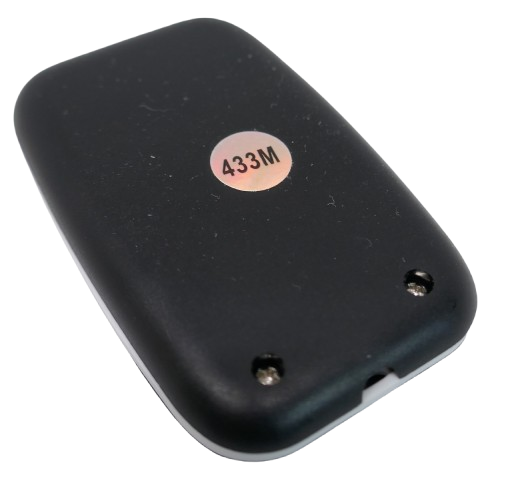
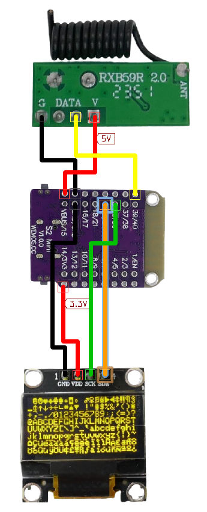
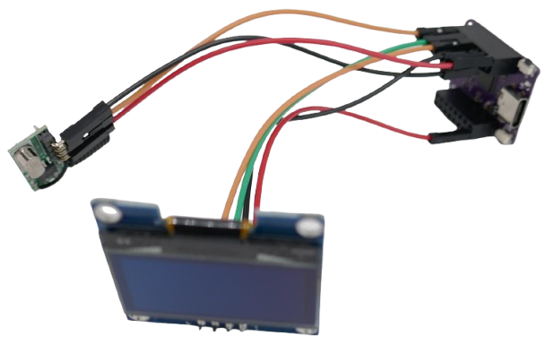
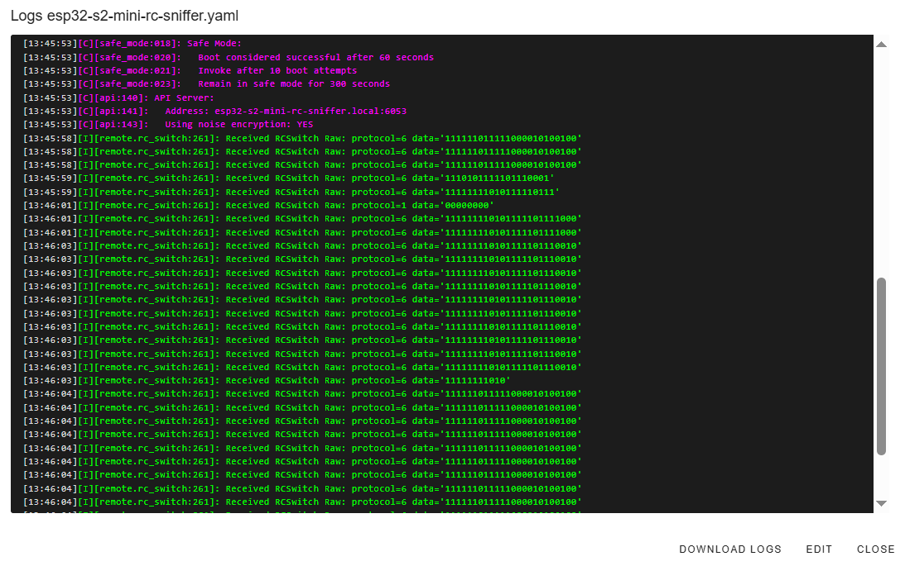
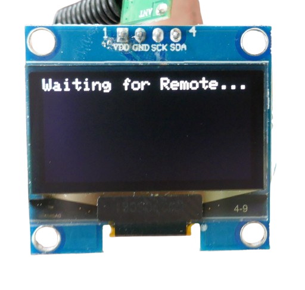
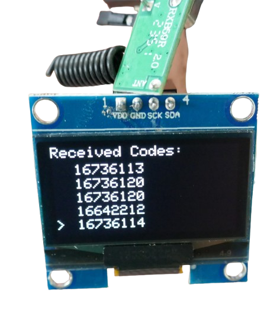

 
# Sniffing RF Remote Controls

> Using Simple OOK Receivers to Sniff ID Codes from RF Remote Controls

[Previously](https://done.land/components/data/datatransmission/wireless/intro/usingradiowaves(ook)/), you learned that simple *OOK receivers* are specialized for receiving short bursts of signals in the range of *1-5kHz*. These receivers are *not well-suited* for longer transmissions. 

Bursts of short signals form the foundation of digital data transmission. Since *OOK receivers* do not interpret the bursts they receive, they make ideal *sniffing devices* that can capture *any form of transmission*, including signals from unknown remote controls.


## Overview

*OOK receivers* are effective for receiving *digital data transmissions*, but the responsibility to interpret the signals falls on you. 

Here are some ideal uses for *OOK receivers*:

* **Remote Control Tester:** Use an OOK receiver to capture signals from an unknown RF remote control, then analyze the codes sent when pressing different buttons.
* **Remote Control Receiver:** Employ the OOK receiver to capture specific remote control signals and respond to them. For example, you can create an extension for *Home Assistant* that lets you control devices with an old TV remote.
* **Security:** For sensitive remote controls, like a garage door opener, place an OOK receiver in your garage. It will capture the same code your opener uses, allowing you to receive an alert whenever the remote is used.
* **Self-Learning Remote:** Combine an OOK receiver with an OOK transmitter. The receiver learns codes from a remote control, and the transmitter can play them back. This setup can create a universal remote that combines multiple remote controls or duplicates an existing one.
* **Remote Control Range Extender:** Place an OOK receiver in one room and connect it to *Home Assistant*. Then place an OOK transmitter in another room to replay the signals captured by the receiver, effectively extending the range of your RF remote control.

### Library Support

To decode the signals that an OOK receiver captures, you’ll need a microcontroller. The microcontroller analyzes the signal pattern and reports back an ID.

Fortunately, you don't have to decode the signals yourself, thanks to excellent library support:

* **ESPHome:** Use the [remote_receiver](https://esphome.io/components/remote_receiver.html) component if you'd like a simple solution with [ESPHome](https://done.land/tools/software/esphome/introduction/).
* **C++:** Use [rc-switch](https://github.com/sui77/rc-switch) if you prefer to program the firmware yourself with *ArduinoIDE* or *PlatformIO*.

## Remote Control Sniffer

To build a simple RF remote control sniffer capable of picking up signals from any RF remote, you'll need the following parts:

* **OOK Receiver:** Use any generic OOK receiver that works on the frequency band of your remote control (the frequency is often printed on the back of the remote). *Superheterodyne* receivers offer better performance than *superregenerative* ones, especially with weak signals or noisy environments.

  

* **Microcontroller:** Any [microcontroller](https://done.land/components/microcontroller/) development board will suffice. All you need is one digital input *GPIO*. I chose an [ESP32-S2 Mini](https://done.land/components/microcontroller/families/esp/esp32/developmentboards/esp32-s2/s2mini/) because it was available and inexpensive.
* **OLED Display:** You can use any inexpensive *128x64* OLED display to show the received codes. I used a [SH1106 1.3" I2C OLED display](https://done.land/components/humaninterface/display/oled/sh1106/). If you prefer, you can skip the display and output the codes to the serial monitor.

### Hardware Setup

Here’s how you connect the components:



* **OOK Receiver:**  
  Most receivers require a *5V* supply voltage.
  * **Power:** Connect the `V` pin to *5V* and the `G` pin to ground.
  * **Data:** Connect the `DATA` pin to the input GPIO of your microcontroller (I used `GPIO39`).
* **OLED Display:**  
  Most OLED displays work with both *5V* and *3.3V* power.
  * **Power:** Connect `VDD` to *3.3V* and `GND` to ground.
  * **I2C:** Connect `SCK` and `SDA` to the designated I2C pins of your microcontroller. On the *ESP32-S2 Mini*, `SDA` connects to `GPIO33`, and `SCL` connects to `GPIO35`. On other [ESP32](https://done.land/components/microcontroller/families/esp/esp32/developmentboards/esp32s/#i2c) boards, these are typically `GPIO21` and `GPIO22`, respectively.


## ESPHome

*ESPHome* is designed for home automation, and while it provides excellent support for receiving remote control codes — including unknown ones — it does not include built-in functionality to directly display these codes.

Instead, *ESPHome* provides a built-in *RF remote control sniffer* via its logs. This means you don't need the OLED display for this part of the setup, although it will still be useful later.

### Sniff Codes

Start by using the following basic *configuration* to set up your microcontroller:


````
# Enable logging
logger:
  level: DEBUG

i2c:
  scl: GPIO35  # adjust to I2C pins for your microcontroller
  sda: GPIO33  # adjust to I2C pins for your microcontroller
  scan: True

remote_receiver:
  pin: 
    number: GPIO39 # adjust to GPIO that you connected OOK receiver
    inverted: true
  dump:
    - rc_switch    # let rc-switch do the signal parsing
  tolerance: 60%
  filter: 4us
  idle: 4ms
````
Once you upload this configuration to your microcontroller, go to *ESPHome*, click *LOGS* > *Wirelessly* to view the log. When you press a button on the remote control, the log will capture its signature:



Note that most remote controls continuously repeat the transmission until you release the button. As a result, the remote control stops transmitting immediately after you let go. This is why you'll see aborted codes in the log:


````
[13:50:47][C][api:143]:   Using noise encryption: YES
[13:50:51][I][remote.rc_switch:261]: Received RCSwitch Raw: protocol=6 data='111111011111000010100100'
[13:50:51][I][remote.rc_switch:261]: Received RCSwitch Raw: protocol=6 data='111111011111000010100100'
[13:50:53][I][remote.rc_switch:261]: Received RCSwitch Raw: protocol=6 data='111000010100100'
[13:50:53][I][remote.rc_switch:261]: Received RCSwitch Raw: protocol=6 data='111111011111000010100100'
[13:50:53][I][remote.rc_switch:261]: Received RCSwitch Raw: protocol=6 data='111111011111000010100100'
[13:50:53][I][remote.rc_switch:261]: Received RCSwitch Raw: protocol=6 data='111111011111000010100100'
[13:50:53][I][remote.rc_switch:261]: Received RCSwitch Raw: protocol=6 data='111111011111000010100100'
[13:50:53][I][remote.rc_switch:261]: Received RCSwitch Raw: protocol=6 data='111111011111000010100100'
[13:50:53][I][remote.rc_switch:261]: Received RCSwitch Raw: protocol=6 data='111111011111000010100100'
[13:50:53][I][remote.rc_switch:261]: Received RCSwitch Raw: protocol=6 data='111111011111000010100100'
[13:50:53][I][remote.rc_switch:261]: Received RCSwitch Raw: protocol=6 data='11111101111'
````
### Responding to RC Code

Once you've identified the code that a button on your remote control emits, you can tie an action to it.

In the example above, the remote control button I used displayed something like: *Received RCSwitch Raw: protocol=6 data='111111011111000010100100'*. This translates to:

* **Signal:** `111111011111000010100100`
* **Protocol:** `6`

To have *ESPHome* respond to a remote control button press, add a `binary_sensor` with the remote control button's signature:


````
binary_sensor:
  ...
  - platform: remote_receiver
    name: RF Button Keyfob1
    rc_switch_raw:
      protocol: 6
      code: "111111011111000010100100"
    filters:
      - delayed_off: 100ms
    on_press:
      then:
        - switch.toggle: switch_1
  ...
````
Here is a sample configuration that responds **specifically** to the remote control button you defined. While the button is pressed, the OLED display will show "Button pressed!", and when the button is not pressed, it will display "Waiting...":


````
# Enable logging
logger:
  level: DEBUG

i2c:
  scl: GPIO35
  sda: GPIO33
  scan: True

remote_receiver:
  pin: 
    number: GPIO39
    inverted: true
  dump:
    - rc_switch
  tolerance: 60%
  filter: 4us
  idle: 4ms

binary_sensor:
  - platform: remote_receiver
    name: RF Button Keyfob1
    rc_switch_raw:
      protocol: 6
      code: "111111011111000010100100"
    filters:  # "debouncing", so stay pressed while the remote control keeps sending codes
      - delayed_off: 100ms
    on_press:
      then:
        - lambda: |-
            id(oled1).clear();
            id(oled1).print(0, 10, id(roboto), "Button pressed!");
    on_release: 
      then:
        - lambda: |-
            id(oled1).clear();
            id(oled1).print(0, 10, id(roboto), "Waiting...");
            
display:
  - platform: ssd1306_i2c
    model: SH1106_128x64
    address: 0x3C
    id: oled1
    

font:
  - file: "gfonts://Roboto"
    id: roboto
    size: 10
````
Of course, the OLED display is just for illustration. The key takeaway is that `remote_receiver` can implement a `binary_sensor`, allowing you to tie actions to both a remote control *key press* and *key release*, just like any other physical button.

## platformio

When writing your own firmware, you have a lot more flexibility. Use [platformio](https://platformio.org/) or [ArduinoIDE](https://www.arduino.cc/en/software).

Since it's now up to you which methods and capabilities of the [rc-switch](https://github.com/sui77/rc-switch) you'd like to use, you can create things that aren't (easily) doable in *ESPHome*.

Let's create a *Remote Control Sniffer* (essentially what *ESPHome* does automatically in its logs, but displayed on our OLED screen).

With access to any remote control code that is picked up, you can expand on it and, for example, design your own *self-learning universal remote control* — something not feasible with *ESPHome*, which targets *automation* and requires pre-configured remote control codes to be embedded in your setup.

### platformio.ini
In *platformio*, this is the `platformio.ini` I used for the *ESP32-S2 Mini*:


````
[env:lolin_s2_mini]
platform = espressif32
board = lolin_s2_mini

framework = arduino
monitor_filters = send_on_enter
monitor_echo = yes
upload_speed = 115200
monitor_speed = 115200
lib_deps =
    RC-Switch
    adafruit/Adafruit SH110X@^2.1.12
````
Replace the `board=` line to use a different microcontroller. Once you save the file, *platformio* will automatically download and install the required libraries.

### Source Code

Here is the source code to paste into `src\main.cpp`:

````c++
#include <Arduino.h>
#include <RCSwitch.h>
#include <SPI.h>
#include <Wire.h>
#include <Adafruit_GFX.h>
#include <Adafruit_SH110X.h>

#define OOK_PIN  39  // Pin for OOK receiver
#define i2c_Address 0x3c // I2C address for OLED display
#define SCREEN_WIDTH 128
#define SCREEN_HEIGHT 64
#define OLED_RESET -1

Adafruit_SH1106G display = Adafruit_SH1106G(SCREEN_WIDTH, SCREEN_HEIGHT, &Wire, OLED_RESET);

RCSwitch mySwitch;

const int LINE_HEIGHT = 10; // Space per line (fixed to prevent cutoff)
const int MAX_ENTRIES = (SCREEN_HEIGHT - 10) / LINE_HEIGHT; // Max number of lines
String receivedCodes[MAX_ENTRIES]; // Store received codes
int numEntries = 0; // Current number of displayed entries

void setup() {
  Serial.begin(115200);
  delay(250); 
  display.begin(i2c_Address, true); 
  
  display.clearDisplay();
  display.setTextSize(1);
  display.setTextColor(SH110X_WHITE);
  display.setCursor(0, 0);
  display.print("Init Receiver...");
  display.display();

  mySwitch.enableReceive(digitalPinToInterrupt(OOK_PIN));

  display.setCursor(0, 0);
  display.clearDisplay();
  display.print("Waiting for Remote...");
  display.display();
}

void loop() {
  if (mySwitch.available()) {
    String newCode = String(mySwitch.getReceivedValue());
    Serial.println("Received Code: " + newCode);

    // Shift entries up if full
    if (numEntries >= MAX_ENTRIES) {
      for (int i = 0; i < MAX_ENTRIES - 1; i++) {
        receivedCodes[i] = receivedCodes[i + 1];
      }
      receivedCodes[MAX_ENTRIES - 1] = newCode;
    } else {
      receivedCodes[numEntries] = newCode;
      numEntries++;
    }

    // Clear display and redraw all entries
    display.clearDisplay();
    display.setCursor(0, 0);
    display.print("Received Codes:");

    for (int i = 0; i < numEntries; i++) {
      int yPos = 12 + (i * LINE_HEIGHT);
      display.setCursor(15, yPos);

      if (i == numEntries - 1) {
        display.setCursor(0, yPos); 
        display.print(">");
        display.setCursor(15, yPos); 
        display.print(receivedCodes[i]);
      } else {
        // Older entries: Normal text
        display.print(receivedCodes[i]);
      }
    }

    display.display();
    mySwitch.resetAvailable();
  }
}
````
### Uploading

You may need to manually place the *ESP32-S2 Mini* into firmware update mode by holding down button `0` while briefly pressing the `RST` button.

Next, in *PlatformIO*, choose *Upload*. 

After the upload completes, you might see a benign error message indicating that you need to manually press `RST` again to exit firmware update mode and run the new firmware.

### Testing

Once the new firmware is running, the OLED display should show the text *Waiting for remote...*.



When you press a button on the remote control, the display will show the received ID number. Different buttons will result in different ID numbers, but the same button will always send the same ID.



Now that you have the codes, you can use them in more advanced firmware:

- You could check the received code and, when it matches, trigger specific actions. This way, each button on the remote control can be assigned a specific task.
- You could store the received code(s), add an *OOK sender*, and turn your project into a remote control duplicator: whatever the original remote control could control can now be operated by your microcontroller. Simply *send* the code you previously received.
#### Troubleshooting

* **Scrambled Display:**     
  * Check the wiring to ensure you didn't swap `SDA` and `SCL`.
  * Your display might use a different OLED driver, likely the older **SSD1306**. In that case, you'll need to adjust the code to use the *Adafruit library* for the SSD1306 OLED driver. Keep in mind that *ESPHome* is more flexible and supports both displays with the *same* component.

* **No Response From Remote:**      
  * Make sure the remote is using the same frequency band as your *OOK receiver*. In Europe, both *433MHz* and *838MHz* are license-free, so remote controls might use either of these frequencies.
  * Ensure that your remote is actually an *RF* remote sending out *radio waves*. Infrared remote controls will not work with an *RF receiver*. Infrared remotes typically have a transparent *LED*-like IR transmitter.

## Final Thoughts

As you experiment with remote control sniffing and integration, remember to prioritize safety when handling RF components, especially when dealing with antennas and potential interference. 

Keep in mind that the range of your *OOK receiver* can be affected by environmental factors like walls, metal objects, or even the type of receiver you are using, so testing in different environments can help optimize performance. 


> Tags: OOK, EV1527, ESPHome, Remote_Receiver, Remote_Transmitter, rc-switch, Sniffer, Remote Control, Receive

[Visit Page on Website](https://done.land/components/data/datatransmission/wireless/intro/usingradiowaves(ook)/sniffingrfremotes?815916031418250333) - created 2025-03-17 - last edited 2025-03-17
