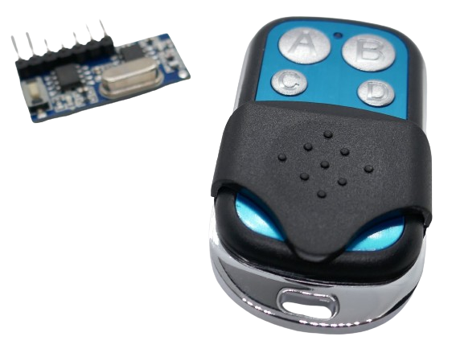
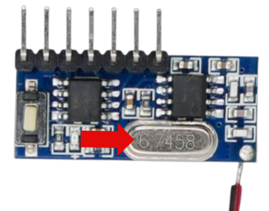
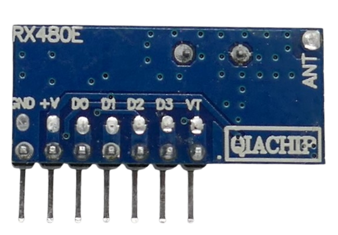
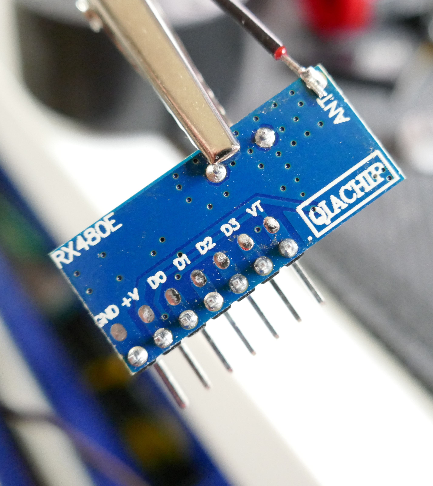
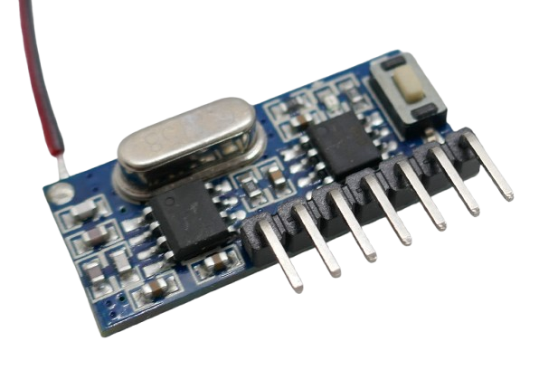
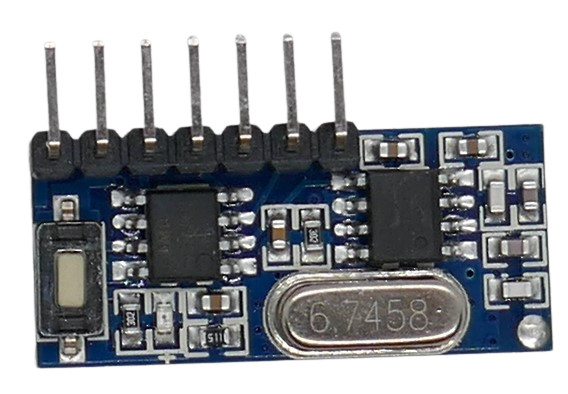

# RX480-E

> Self-Learning 4-Channel EV1527-Compliant Receiver with Latch and Momentary Modes

The *RX480-E* breakout board provides an easy way to add remote control functionality to your devices.

This receiver operates without requiring additional external components, allowing it to receive and decode signals from an *EV1527*-compliant remote control.

## Overview

The *RX480-E* is a compact breakout board designed to receive *EV1527*-compliant signals from remote controls. It can distinguish up to four unique signals, enabling control of up to four different functions.

The breakout board is often sold with a compatible *remote control*, but any *EV1527*-compliant remote control will work.

### Frequency

The board is available in two primary frequency versions: **433 MHz** (commonly used in Europe) and **315 MHz** (used in the US and parts of Asia). The frequency is determined by a fixed crystal oscillator and **cannot be changed**.

Ensure that you select the correct version for your region and that your remote control operates at the same frequency.

| Frequency (MHz) | Crystal Frequency (MHz) | Region |
| --- | --- | --- |
| 315.00 | 10.245 (factor 30) or 12.000 (factor 26) | US, Asia |
| 433.92 | 6.7458 (factor 64) or 13.225 (factor 32) | Europe |
| 868.35 | 26.000 (factor 33), or 32.768 (factor 27) | Rarely used |

If you are unsure about your board's frequency, check the crystal, which typically has its frequency **laser-engraved** on the housing. 
The crystal frequency is multiplied by a **Phase-Locked Loop (PLL)** circuit (typically by a factor of *32*) to achieve the final transmission frequency.

> [!NOTE]
> Cheap remote controls often use readily available industry-standard crystals. The multiplication factor may not exactly result in the desired frequency. Deviations around *1MHz* can be tolerated, though, and *PLL* can further adjust the final reception frequency.

## Pins and Wiring

The board features **seven pins** plus a solder pad for an **antenna**, labeled *ANT* on the back.

### Adding an Antenna

Always operate the receiver **with an antenna**. If no designated antenna is available, you can use a simple **17.3 cm** wire for **433 MHz** or a **23.8 cm** wire for **315 MHz**.

Most boards come without an antenna pre-soldered. Without one, reception is poor, and the receiver may not detect signals from the remote control at all.

### Pinout

The pins are labeled on the back of the board:

| Pin | Label | Description |
| --- | --- | --- |
| 1 | GND | Ground (negative pole) |
| 2 | +V | Power supply (3.3V–5V) |
| 3 | D0 | High when channel 1 is enabled |
| 4 | D1 | High when channel 2 is enabled |
| 5 | D2 | High when channel 3 is enabled |
| 6 | D3 | High when channel 4 is enabled |
| 7 | VT | High when receiving any valid code |

Note that in default *Push* mode, **D0**-**D3** and **VT** behave similarly and are *high* for as long as a signal is received. Once you switch to a different latching mode, though, **D0-D3** and **VT** can differ considerably: now, **D0-D3** represent the channels' *state* (in *self-locking* latch mode, this can be *high* even though *no* signal is received anymore), whereas **VT** is always *high* for as long as *any* valid signal *is being received*.

Note also that the receiver may assign buttons to the pins **D0-D3** not in the order in which they have been paired. 

#### Connecting Power

Connect **GND** and **+V** to a **3.3V–5V** power source. The onboard red LED will blink once, then turn off.

#### Understanding the Output Pins

The pins **D0** through **D3** correspond to four unique codes sent by the remote control. When the receiver detects a signal for a specific code, the corresponding pin goes **high**.

The **VT (Valid Transmission)** pin serves as an indicator:  
- It turns **high** whenever *any* valid remote code is received.  
- It remains **high only while the signal is being received**.  
- If the receiver is set to **latch mode**, **VT will not reflect the output state**.

### Pairing the Receiver

Before the receiver can respond to remote control button presses, it must be **paired** with the remote. During this process, the receiver "learns" and stores the unique codes transmitted by the remote control.

> [!TIP]  
> If the receiver was previously used, consider **resetting** it to factory defaults to clear any stored codes before pairing a new remote.
## Factory Reset

Before working with the receiver, it's recommended to **reset** it to factory defaults. This ensures no previously stored settings interfere with operation.

To reset the **receiver**, press the button **eight times**. Each time the button is pressed, the red onboard LED lights up. After the eighth press, the LED will blink **four times** after a brief delay, confirming a successful reset.

## Pairing

The **receiver** must be *paired* with the remote control before use.

The pairing process applies to **one remote control button at a time**, so if you want to pair multiple buttons (up to four), repeat the process for each one.

### Pairing Process

1. Press and hold the **receiver's button** for **one second**, then release it. The onboard LED will turn on after a short delay.
2. Press the **desired button** on the remote control. The receiver LED will blink **three times**, confirming successful pairing. The receiver then returns to normal receiving mode.

Now, press the paired button on the remote again—the receiver LED will light up as long as you hold the button.

Repeat this process for up to **three additional buttons**.

> [!TIP]  
> The receiver **stores new button codes without erasing existing ones** until all four memory slots are full. If you're pairing a new remote control or changing the latching mode, **reset** the receiver first to clear previous codes.

## Troubleshooting

* **Cannot Pair Remote Control**    
  - **Check frequency compatibility:** Ensure the receiver and remote control operate on the same frequency (e.g., **433 MHz** or **315 MHz**). If in doubt, check the crystal oscillator.
  - **Antenna required:** Attach an antenna to the receiver. Without one, signal reception is significantly reduced.
  - **Check remote control batteries:** Weak or dead batteries can prevent proper signal transmission.

* **No LED Response When Pressing Remote Control Button**   
  - **Ensure proper pairing:** If the receiver LED does not light up, try **resetting** the receiver and re-pairing the button.
  - **Check antenna connection:** Without an antenna, the receiver may not detect signals from the remote control.

* **No Signal on D0–D3 Pins:**    
  If pressing a paired button does not produce a **high** signal on any **D0–D3** pin:
    - **Try a different pin:** The receiver may not assign button codes in the exact order they were paired. Test all **D0–D3** outputs.

### Identifying the Problem: Receiver vs. Remote Control

* **Receiver Diagnostics**
  - **Perform a reset:** Does the **red LED blink four times** after resetting? If not, the receiver may be faulty.
  - **Verify power connection:** Ensure the receiver is properly powered (3.3V–5V).

* **Remote Control (Sender) Diagnostics**
  - **Check antenna & range:** If possible, attach an antenna to the remote. Move the remote closer to the receiver to rule out range issues.
  - **Repeat the pairing process:** Confirm that the receiver LED reacts to button presses.
  - **Test with another remote:** If available, try pairing a different **EV1527-compatible** remote control (e.g., garage door remotes) to confirm if the issue lies with the remote.

### Optimizing Signal Range

Once pairing is successful, test the **signal range** by moving further from the receiver. If the range is too short:
- **Ensure both receiver and remote control have proper antennas.**
- **Check for signal interference** from nearby electronics or other RF devices.

With proper setup and tuning, the receiver should reliably detect remote control signals over a long distance.

## Setting Operating Mode (Latch Mode)  

By default, the *receiver* operates in *push button mode*: the output pin remains *high* for as long as the button on the *remote control* is pressed. Once released, the output pin returns to *LOW*—just like a *push button* or *momentary switch*. This mode is ideal for *toggle actions* such as *garage doors* or *Home Assistant*, where only a brief *impulse* is required.  

Depending on your needs, the board supports many alternative latching modes:  

| Mode | Number of Button Presses | Description |  
| --- | --- | --- |  
| **Push Button** | 1 | *(Default)* The selected channel stays *on* only while the remote control signal is received. |  
| **Self-Locking** | 2 | Each button press *toggles* the state between *on* and *off*. |  
| **Mutual Exclusive** | 3 | Similar to *self-locking*, but activating one channel automatically turns the previous one *off*. Only *one* channel can be active at a time. So if *Channel 1* is on and you activate *Channel 2*, *Channel 1* turns off automatically. |  
| **2xPush & 2xSelf-Locking** | 4 | Two channels operate in *push button mode*, while the other two use *self-locking mode*. |  
| **2xPush & 2xMutual Exclusive** | 5 | Two channels function in *push button mode*, and two in *mutual exclusive mode*. |  
| **2xSelf-Locking & 2xMutual Exclusive** | 6 | Two channels work in *self-locking mode*, while the remaining two use *mutual exclusive mode*. |  

### Changing Operation Mode  

A new operation mode can only be set when the receiver is in factory default mode, so you must **reset** it first:  

Press the button *eight times*. The LED blinks *four times* to confirm the reset was successful. 

  

Now, to set a new operation mode, press the button the number of times corresponding to the desired mode (see table above).  

For example:  
- To set all four buttons to *self-locking mode*, press the button *twice*.  
- To configure two buttons as *push mode* and two as *mutual exclusive*, press it *five times*.  

After setting the latch mode, the receiver immediately enters *pairing mode* for the first remote control button. The red *LED* lights up, indicating it is ready to pair. Press the desired button on the *remote control* to complete pairing. If successful, the *LED* blinks *three times*.  

Repeat the pairing process for up to three additional remote control buttons by pressing the button again and repeating the pairing steps.  

> [!IMPORTANT]  
> The built-in LED lights up only when a paired remote control button is pressed. It does not indicate whether a channel remains on or off after the signal is received.

## Technical Data  

| Item | Value |  
| --- | --- |  
| Voltage | 3.3-5V |  
| Frequency | 433MHz *or* 315MHz |  
| Operating Current | 5mA |  
| Modulation Mode | AM (OOK) |  
| Transmission Rate | EV1527 |  
| Size | 28x12.3x5mm |  

> Tags: EV1527, Receiver, RF, 315MHz, 433MHz

[Visit Page on Website](https://done.land/components/data/datatransmission/wireless/shortrangedevice/am/ask/ev1527/receiver/rx480e-4?575872040920243620) - created 2024-04-19 - last edited 2025-03-08
