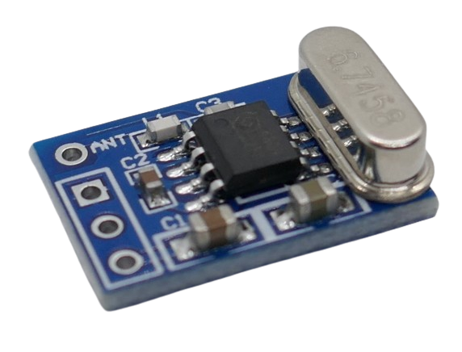
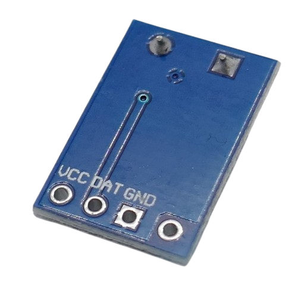

 
# SYN480R

> Superheterodyne ASK (Digital AM) Receiver With Sweep Mode

The *SYN480R* breakout board is based on the *SYN480R* single-chip *antenna-in to data-out* solution. 

It is primarily used in *remote control* solutions and in *automotive keyless entries*.

> [!NOTE]
> The receiver does not come with a dedicated *EV1527 encoder chip* on board which makes the receiver versatile (it can receive any type of *ASK-encoded* data) but requires a separate *microprocessor* to decode the received data.

## Frequency

The *receiver chip* supports a frequency range from 300MHz to 440MHz. The fixed frequency is set via a crystal:

| Crystal frequency (MHz) | RX frequency (MHz) | Remarks |
| --- | --- | --- |
| 4.8970 | 315 | US |
| 6.0630 | 390 | |
| 6.4983 | 418 | |
| 6.7458 | 433.92 | Europe |

## Extra Features

The chip offers extra features (not implemented in this breakout board, can be wired manually):

* **Shutdown/Wakeup:** a distinct pin can be used to shut the receiver off.
* **Wake-Up:** Output flag indicating presence of a RF signal. This can be used to wake up an attached microcontroller.

## Sweep Mode

The receiver offers two operating modes: a classic *fixed frequency* mode, and a *sweep* mode. 

In *sweep* mode, the receiver sweeps a wider frequency spectrum which can be beneficial when used with low-cost imprecise *senders* that may be off frequency a bit.

> [!NOTE]
> *Fixed mode* provides better selectivity and sensitivity performance and should be preferred unless the sender frequency is imprecise.

## Extra Features

The chip offers extra features (not implemented in this breakout board, can be wired manually):

* **Shutdown/Wakeup:** a distinct pin can be used to shut the receiver off.
* **Wake-Up:** Output flag indicating presence of a RF signal. This can be used to wake up an attached microcontroller.

## Sweep Mode

The receiver offers two operating modes: a classic *fixed frequency* mode, and a *sweep* mode. 

In *sweep* mode, the receiver sweeps a wider frequency spectrum which can be beneficial when used with low-cost imprecise *senders* that may be off frequency a bit.

> [!NOTE]
> *Fixed mode* provides better selectivity and sensitivity performance and should be preferred unless the sender frequency is imprecise.

## Pins

The board exposes four pins that are labeled on the back:

| Pin | Label | Description |
| --- | --- | --- |
| 1 | VCC | 3.3-5.5V |
| 2 | DAT | Data Out |
| 3 | GND | negative voltage |
| 4 | ANT | Antenna |

> [!CAUTION]
> Make sure the power supply is properly filtered and carries no exceptional noise which could interfere and distort reception.

## Antenna

There is no antenna mounted. Make sure to add an antenna or else the board will have poor reception.

For example, solder a wire to the *ANT* antenna solder pad (17cm for 433MHz).

## Technical Data

| Item | Description |
| --- | --- |
| Voltage | 3.3V-5.5V |
| Current fully operational | 2.5mA |
| Current polled operation | 250uA (10:1 duty cycle) |
| Current shutdown | 0.9uA |
| Frequency | 300-440MHz, breakout boards are set to one specific frequency via a crystal |
| RX Sensitivity | -107dBm |
| Modulation | ASK (AM) |
| Chip | SYN480R |
| Data rate | 2.5kbps (sweep mode), 10kbps (fixed frequency) |
| Size  | 17.2x11.8x5mm |

## Data Sheet
[SYN480R](materials/syn480r_datasheet.pdf)

> Tags: Receiver,ASK,OOK,AM,Sweep

[Visit Page on Website](https://done.land/components/data/datatransmission/wireless/shortrangedevice/am/ask/ookgeneric/receiver/syn480r?461642041019241813) - created 2024-04-18 - last edited 2024-04-18
