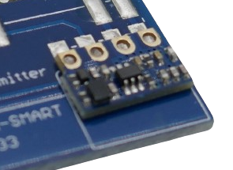
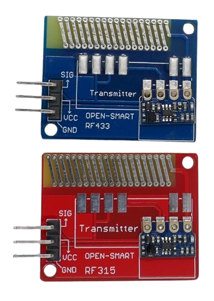
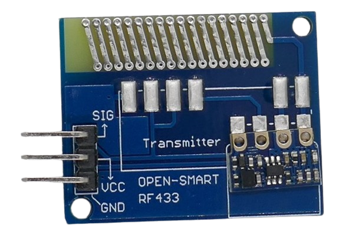
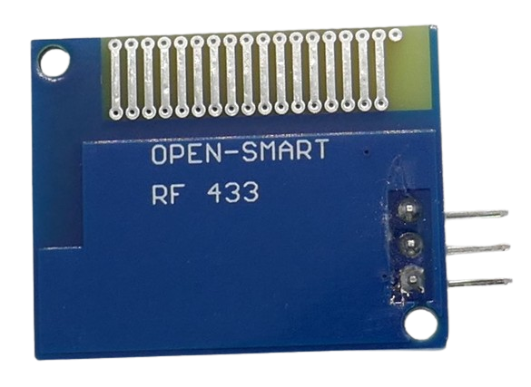

 
# OpenSmart ASK Sender

> Questionable RF Sender For *ASK* Modulation With PCB Antenna 

The company *OpenSmart* released this *ASK* sender with an unmarked transmitter chip and poor documentation. 

The sender is sold as a kit together with a receiver board and is available in separate versions for *315MHz* (US) and *433MHz* (Europe).

The actual *sender* is located on a separate and much smaller board that is soldered onto a bigger bpard which only purpose apparently is to provide a *PCB antenna*.

While *PCB antennas* certainly are convenient and compact, they are not efficient, limiting the distance that can be reached. During build time and testing, make sure you *do not touch* the antenna or hold the breakout board in a way that covers the antenna.

The way how the *transmitter* board is piggy-backed into a relatively huge *antenna board* makes this solution the most clumsy of all reviewed.

> [!NOTE]
> Apparently, the company *OpenSmart* uses these modules in various combinations together with other boards to make them wirelessly controllable. For example, *OpenSmart* also sells wireless joystick and sensor boards that use the same fundamental *sender* and *receiver* boards.

> [!CAUTION]
> The company *OpenSmart* advertises this board as *"Long-Range Transmitter"* and even as *"LORA Board"*. This board is neither able to transmit RF signals over long distances nor does it implement *LoRa* modulation. It is simply a cheap and very simple *ASK* transmitter.

> [!TIP]
> The *RF frequency* of the board on is printed on the front side. The *433MHz* version uses *blue* boards, and the *315MHz* version uses *red* boards.

## Technical Data

| Item | Value |
| --- | --- |
| Voltage | 4-12V |
| Frequency | 433MHz *or* 315MHz |
| Working Current | 40mA |
| Output Power | 27dBm/500mW at 12V |
| Modulation Mode | AM (OOK) |
| Transmission Rate | <4.8 Kbps |
| Transmission Distance | <50m at 5V |
| Size | 24x30x7mm |

> [!CAUTION]
> With input voltages below *5V*, the data transmission becomes unreliable. When powered with *12V*, the claimed output power of *27dBm*/*500mW* seems to be unrealistically high and demands further testing.

## Pins
The board comes with *three* pins.

| Pin | Tag | Description |
| --- | --- | --- |
| 1 | SIG | Data In |
| 2 | VCC | 5V |
| 3 | GND | negative pole |

## Library

The vendor suggests to use the [VirtualWire](https://github.com/song940/VirtualWire) software library.

> Tags: ASK, OOK, Sender, RF, 315MHz, 433MHz

[Visit Page on Website](https://done.land/components/data/datatransmission/wireless/shortrangedevice/am/ask/ookgeneric/sender/opensmart?277296041819244602) - created 2024-04-18 - last edited 2024-04-18
