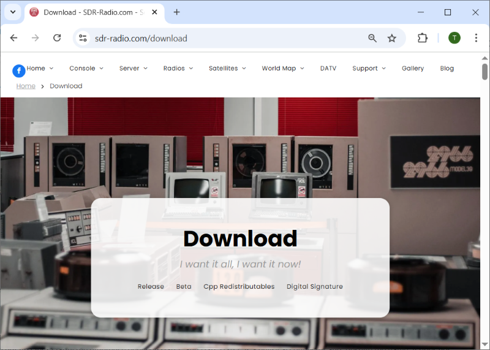
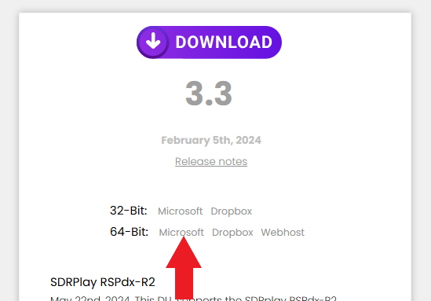
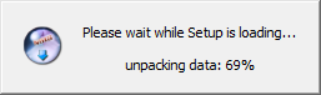
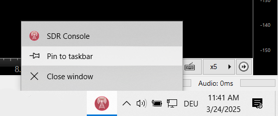
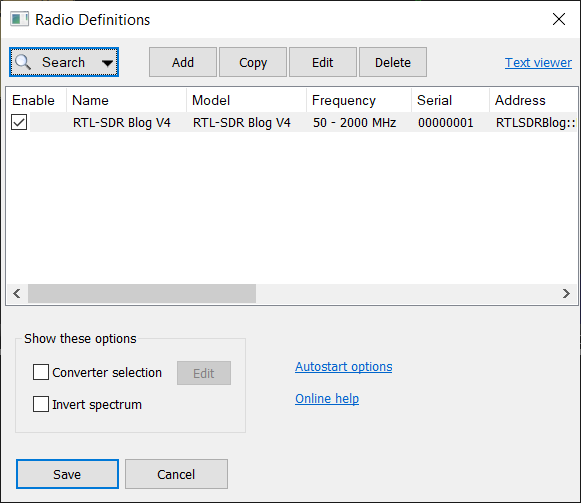
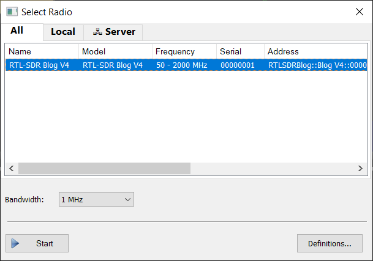
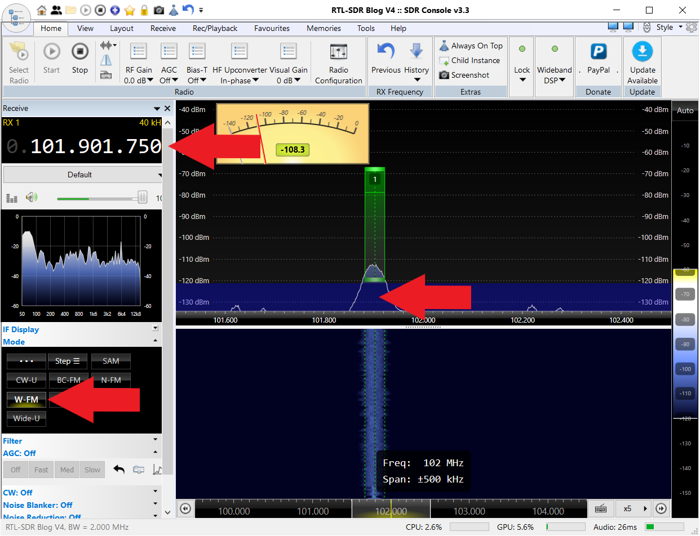
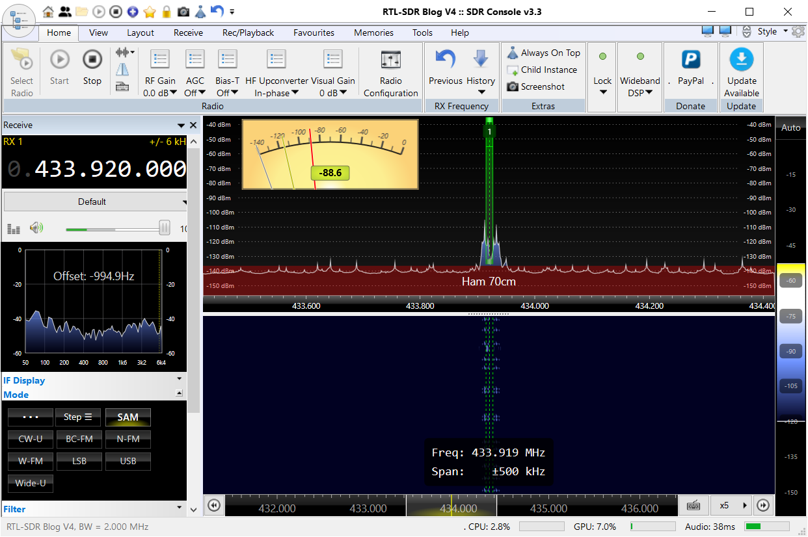

 
# SDR (Software Defined Radio)

> Very affordable universal receivers let you monitor wide frequency spectrums and visualize radio emissions

Classic receivers are tuned to a particular frequency, so you can monitor just this one frequency. You would have to exactly tune a receiver to a given frequency to monitor it.

*SDR Receivers* work much differently: they pick up an entire frequency range, and modern signal analysis performed by a computer can visualize the entire frequency range.

This is extremely useful for analyzing an debugging RF devices because you no longer need to know frequencies ahead of time. If for example you suspect that the frequency of a particular RF device is off, you tune the SDR roughly to the frequency range of your device and can immediately see the actual frequency the device is using.

> [!TIP]
> SDR is a wide topic, and HAM radio amateurs and enthusiasts use it to listen to radio stations around the world. That's why SDR receivers exist in a wide quality (and price) range. I am focusing on using SDR as a lab tool. For this, a simple SDR USB stick for around €20 is absolutely sufficient.

## Overview

Radio waves are invisible, so tools are needed to visualize them in order to understand and also debug RF components.

For example, when you have issues connecting two RF boards, you may want to know whether both components in fact use the same radio frequency and modulation. 

Likewise, radio waves are heavily regulated, and many restrictions apply. To stay within regulatory limits and not interfere with other services, you may want to know the actual RF power your devices emit, and whether they have unwanted spurious emissions in other frequency ranges.

Finally, to optimize your wireless transmissions, you may want to examine your antennas to see how good they actually are, and whether they are really suitable for the frequencies you use.

### SDR Receivers
SDR receivers are fairly simple circuits because they offload most of the work to a computer. It is the computer processor that applies complex signal analysis to visualize the signals present in a given frequency range. 

That's why you can start with very simple and affordable SDR receivers, but you should have a fairly powerful PC. 

Depending on frequency range and quality, the SDR receiver sends massive amounts of raw data to the computer. That's why you also need a fast USB connection (at least USB 2.0, better yet USB 3.0) and high-quality USB cables.

### Software

In SDR (***Software*** *Defined Radio*), *software* is key. 

Most SDR software products are open-source and free (for private use). Almost all SDR software products are of remarkable quality. 

These applications are free, meaning they are often no commercial-grade products and can have limitations. For example, depending on the personal preferences of the software author, the software may be available on a certain operating system only.

So depending on *your* preferences, pick a *SDR software* that works on your favorite operating system. Whichever you choose, they typically all support the same basic features.

Below, [SDR Console](https://www.sdr-radio.com/) is used which requires a *Windows PC*. It it sometimes referred to as *sdr-radio* as well.

### SDR Radio Devices

There are zillions of *SDR radio devices* available: affordable USB dongles as well as sophisticated high performance devices that may cost three- or four-digit numbers. Most popular brands and models are also available as [*cloned* devices](https://www.rtl-sdr.com/rtl-sdr-quick-start-guide/) that may work just as well, or may not work at all.

Picking a brand SDR radio can be important because *hardware drivers* are the most challenging part during installation. Brand products often provide [quick start guides](https://www.rtl-sdr.com/rtl-sdr-quick-start-guide/) with helpful information and downloads.

Clones and devices from unknown sources often lack support and documentation, and you may eventually not get these devices to work at all, regardless of how affordable they were.

## SDR Console (Software) Installation

[SDR Console](https://www.sdr-radio.com/) is a particularly well-made SDR software. It runs on *Windows PC* only.

### Downloading

Downloading *SDR Console* is **a challenge** (at the time of this writing), and you cannot but notice that this is a passionate **hobbyist** project: 

On the overloaded and confusing website, multiple clicks are necessary to eventually find the private cloud storage on *OneDrive* or *DropBox* where the author made the software available for download. 

Without these instructions, most people probably struggle to find the download:

1. Navigate to [sdr-radio.com](https://www.sdr-radio.com/). On the *Home* page, scroll down a little bit until you see the button *Download SDR Console*. Or directly navigate to [https://www.sdr-radio.com/download#Release](https://www.sdr-radio.com/download#Release) in which case you can directly proceed to step **4**.

    

2. On the download page, in the upper section click *Release*:

    

3. This just scrolls you down on the same page until you see the actual downloads:

    

4. However, clicking on *DOWNLOAD* does nothing. A final intelligence test is waiting for you: click on one of the download options listed after *32-Bit* or *64-Bit*. For example, to download the *64-bit version* off a *Microsoft OneDrive*, click *Microsoft* right of *64-Bit:*:

    

5. This finally brings you to the actual download page which may look different, based on the download method you clicked in the previous step. Click *Download* to launch the download.

    

### Installation

Unfortunately, *sdr-radio* is not a portable app and requires prior installation.

1. The downloaded installer file is an executable and requires local *Administrator* privileges. Launch it to invoke the installation process, and click *Yes* to activate *Administrator* privileges.

    

2. The installer now unpacks the MSI installation file which takes a few seconds. A tiny window can be seen during this process.

    

3. Now, the actual installer takes over. Click *Next*, and follow the instructions.

    

4. At some point, the installer confirms the installation location which defaults to your primary hard drive. This is your chance to install the software elsewhere, i.e. on a secondary hard drive, in case the free space on your primary drive is limited.

    

5. During the installation process, missing components will be installed as well, i.e. *C++ redistributables*. This may occur a number of times for different components, and always launches a separate installer. Make sure you click *OK* each time when prompted.

    

6. Eventually, the software is installed. Click *Next*, then check *Start the program now*, and click *Finish*.

    

This closes the installer, and immediately launches *sdr-radio*. Its red round icon with an antenna appears in your task bar at the bottom of the screen.

 
 
Make sure you right-click this icon and choose *Pin to taskbar* so you can always easily find and launch *sdr-radio* in the future.

### Adding SDR Radio Device (Hardware)
SDR software like *sdr-radio* needs at least one physical *SDR Radio Receiver*, else it can't receive any RF signals. That's why *sdr-radio* opens a dialog on first launch:

To add your SDR receiver to the software, follow these steps:

1. Plug in your SDR receiver so that the software can find it.
2. In the dialog that opened automatically, choose *Search*. A drop-down menu opens. Select the SDR receiver you are using, i.e. `RTL Donge`/`USB`. *sdr-radio* starts searching for your *SDR radio device*.

    

4. Once the device is found, click *Add*. *sdr-radio* adds all the specific technical details for your *SDR radio*, and your radio appears in the list of available devices.

    

5. Don't forget to click *Save* when you are done. Now your *SDR Radio device* is permanently added to the list, and whenever you launch *sdr-radio*, you can select it by double-clicking in the list.

Likewise, you can add additional *SDR Radio device* if you like.

### Hardware Not Detected

If *SDR Console* cannot find your SDR hardware (SDR receiver, i.e. SDR USB Dongle), and you have verified that it is connected, and that you chose the correct model in the *Search* drop down menu, then typically there is an issue with *USB device discovery*.

Here are the steps to fix this on a *Windows PC*:

1. Plug the SDR stick into a USB-A port of your *Windows* computer. You should hear the typical sound of a newly recognized USB device. Press `WIN`+`R`, and launch the device manager by entering `devmgmt.msc`.

2. In device manager, check to see whether you discover *unknown* devices, or devices with a strange name such as *Other devices*/*Bulk-In*. If so, your SDR radio may have a USB driver issue and cannot work correctly.

     

3. To fix this, install [Zadig](https://zadig.akeo.ie/). Launch it, and select the unknown device in the drop-down box. For example, select *Bulk-In, Interface (Interface 0)*.

     

4. In the *Driver* field, you see whether a driver was present for this device. If no driver was present, choose *WinUSB* in the drop-down list to the right, then click *Install Driver*. This may take up to a minute.

Now, with a USB driver installed, switch back to *rc-radio*, and try and search again for your SDR radio device. Now it should be discovered within a few seconds.

## SDR Console - First Steps
Once you have installed *SDR Console* and added your *SDR Radio Device* to it, let's walk through the first steps:

1. If you pinned *SDR Console* to your taskbar, click its icon. Else, navigate to the installation folder, and look for the application *SDR Console.exe*. Launch it.

2. A *Select Radio* dialog opens and lists all SDR receivers you have previously added to the software (see above). Select the one you want to use.

3. In the lower part of the dialog, you can select the *bandwith*. This is the frequency range that can be monitored at the same time in a spectrum. The available bandwidths depend on the quality and performance of your SDR receiver. The higher the bandwidth the more demanding the calculations and the higher the data transfer rates. Start with a low bandwidth, i.e. *1 MHz*. Then click *Start*.

     

4. After a few seconds, *SDR Console* starts emitting sound, most probably static. The software defaults to *7.1 MHz*. 

### Listening to Public Broadcast
Now tune in to the radio frequency range **and** modulation type you want to examine. As a first test, let's tune in *VHF public broadcast*:

1. **Frequency:**    
    Click on the frequency meter in the upper left corner. On each digit, there is a square above and below when you move with the mouse over it. Clicking the square increases/decreases the digit. Tune in your favorite *VHF* radio station, or tune in a frequency in the range of `88-108 MHz`.
2. **Spectrum and Waterfall:**
    The spectrum display now shows any signals that can be picked up in the selected *bandwidth* around the frequency you set. So if you dialled in `100.000.000 MHz` (*100 MHz*), since we defined a *1 MHz* bandwidth when we launched the software, the spectrum shows all signals in the range `99.5-100.5 MHz`.

    So even if you don't know a particular sender frequency, within the monitored spectrum you can now *discover* signals. Simply click on a signal displayed in the spectrum. This tunes the frequency to the one you clicked.
3.  **Modulation:**
    To actually *hear* the public broadcast transmission, you need to instruct *sdr-radio* to demodularize the signal with the appropriate modulation. 

    For this, on the left side click *Mode*, and in the drop-down select `W-FM` (*wideband FM*). Done: provided you tuned in to a radio station and cranked up the volume, you can now hear music or news.

### Testing RF Remote Controls

Next, lets target a more practical example: you may have found an old RF remote control and would now like to figure out which frequency it uses.

1. Tune *SDR Console* to the first suspected frequency range, i.e. `433.920.000` (*433.92 MHz*).

    

2. Listen for a while. You may pick up all kinds of license-free ISM band transmissions, from short bursts of remote controls to regular intervals from digital data transmissions. The waterfall display shows the signals over time, and if indeed working on license-free bands, the signals should center around *433.92 MHz*.

3. Now press the unknown remote control, and test whether it also emits in this spectrum. Of course, it should produce much more intense signals since it is much closer located to your receiver.

#### Findings

Your remote control may be within the monitored range, but its transmission frequency may or may not be slightly off. 

The weak signals in the middle of the waterfall are from unknown sources at precisely the center frequency *433.92 MHz*, whereas the tested remote control transmitted at around *433.78 MHz*.

> [!TIP]
> The default waterfall speed is 40 lines per second. To adjust speed: `View`/ `Speed`. With the vertical bar on its right side you set the sensitivity. Click `Auto` on its top to auto-tune the waterfall to best sensitivity.

You found out that your remote control:

* works
* is a *433 MHz* version
* is slightly off (±150 kHz is normal for cheap RF remote controls)

If your remote control did not produce signals in the monitored spectrum, you could switch to other typical frequency ranges, i.e. *315.0 MHz*, and test there again.

## Conclusions

The example test case illustrates the value of *bandwidths*: if a *SDR receiver* was capable of *200 MHz bandwidths*, it could monitor the full frequency range from i.e. *300-500 MHz*, picking up remote controls from both ISM bands. 

Such bandwidths however are beyond the reach of affordable SDR receivers:

| SDR Model            | Max Bandwidth (MHz) |
|----------------------|--------------------|
| RTL-SDR (RTL2832U)  | ~2.4 (practical ~2.0) |
| HackRF One         | 20 |
| LimeSDR Mini      | 30 |
| LimeSDR USB       | 61.44 |
| USRP B200         | 56 |
| USRP B210         | 61.44 |
| Airspy R2         | 10 |
| Airspy Mini       | 6 |
| SDRplay RSPdx     | 10 |

So with these, you need to manually switch the frequency range when signals are outside the monitored bandwidth. Some *high-performance* SDR receivers however can easily achieve broad monitoring:

| SDR Model              | Max Bandwidth (MHz) |
|------------------------|--------------------|
| Ettus USRP X310        | 160                |
| Ettus USRP N320/N321   | 200                |
| Ettus USRP N210        | 25                 |
| Per Vices Cyan         | 1,600              |
| Per Vices Crimson TNG  | 960                |
| Per Vices Chestnut     | 500                |
| NI/Ettus USRP X410     | 400                |
| Analog Devices AD9361  | 56                 |
| Analog Devices AD9371  | 100                |
| FlexRadio 6700         | 14 (per receiver, 7 receivers) |
| RFSpace NetSDR         | 1.6                |
| Signal Hound SM200B    | 160                |
| R&S PR100             | 10                 |
| R&S EB500             | 20                 |

This in turn illustrates why you should always stick to legal regulations, and not transmit on frequencies outside the legal ranges. 

As you have seen, regulators use *SDR technology* as well, and can easily spot when signals appear in frequency ranges where they should not be.

> Tags: Radio, RF, Tools, SDR, Bandwidth, Modulation, SDR Console, SDR Dongle, Zadig, USB Driver

