# SDR (Software Defined Radio)

> Affordable universal receivers allow you to monitor wide frequency spectrums and visualize radio emissions.

Traditional receivers tune into a *specific* frequency which is ok if you want to communicate with someone. However, if you want to *monitor* and *diagnose RF devices*, it is much more important to view an entire frequency spectrum. This is what *SDR* does.

For example, a 433MHz radio remote control was suspected to not work properly. By tuning a SDR receiver to the 433.9MHz frequency range, it was simple and straight-forward to verify that the remote control indeed sent out a RF signal on the proper frequency:

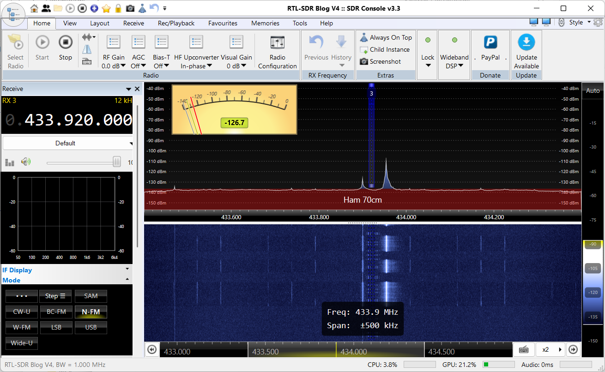

*SDR (Software Defined Radio) receivers* capture a wide frequency range, and modern signal analysis software running on a computer can visualize all the signals within that range simultaneously.

## Overview

To get started with *SDR*, you need two things: 

* **Hardware (SDR Receiver):**     
A device that picks up the radio frequencies. Cheap and highly useful devices start at well below €50 but you can also invest in the range of €300-800 that can monitor wider frequency spectrums.    

* **Software:**      
The signal analysis is done on a capable computer, i.e. a Windows notebook. There is a variety of free SDR software available. Some require a specific operating system, others work cross-platform.

### SDR Receivers

A wide variety of *SDR radio devices* are available, ranging from affordable USB dongles to high-end, professional models that can cost hundreds or even thousands of dollars.     

Many popular models are also available as [*cloned* devices](https://www.rtl-sdr.com/rtl-sdr-quick-start-guide/), which may work just as well, or may not work at all.

The most challenging part about SDR receivers often is making sure that your computer properly recognizes it. 

* Brand-name products typically come with [quick start guides](https://www.rtl-sdr.com/rtl-sdr-quick-start-guide/) that provide helpful information and links to necessary drivers. 

* Cloned and cheap SDR receivers are frequently not recognized by your computer at first, and you need tools like [Zadig](https://zadig.akeo.ie/) to work around this issue and ensure that the SDR receiver is recognized by your operating system.

> [!NOTE]
> When you upgrade your operating system - i.e. migrate from Windows 10 to Windows 11 - you may have to run *Zadig* again since new installations reset the cheats that *Zadig* installed for your SDR receiver.   

### Software

Most SDR software is open-source and free for personal use. Applications are generally of very high quality, but as with many free tools, they may have limitations. 

For instance, some software may only be available on certain operating systems, depending on the preferences of the software's creator, or support only certain SDR receivers. So make sure the software you pick matches your requirements.   

## Software Installation

In this guide, I will use [SDR Console](https://www.sdr-radio.com/), which runs on *Windows PCs*. It is sometimes referred to as *sdr-radio* and comes with support for many popular SDR receivers.

### Downloading

Downloading *SDR Console* can be a bit challenging (as of this writing). The website is overloaded and confusing, requiring several clicks to access the download link on *OneDrive* or *Dropbox*, where the software is hosted.

Follow these steps to download the software:

1. Navigate to [sdr-radio.com](https://www.sdr-radio.com/). Scroll down a bit on the *Home* page until you see the button *Download SDR Console*. Alternatively, you can directly visit [this link](https://www.sdr-radio.com/download#Release) to proceed directly to the download section.

    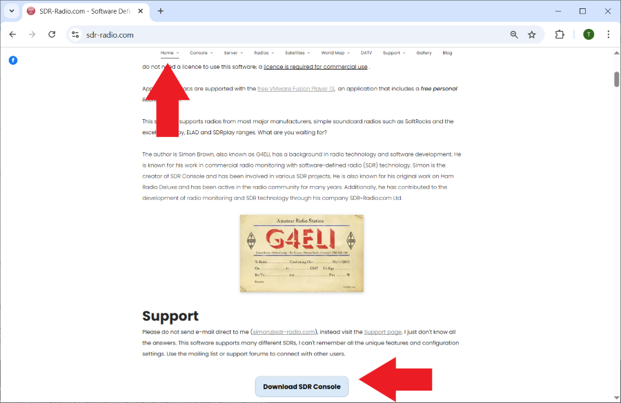

2. On the download page, in the upper section, click *Release*:

    

3. This will scroll you down to the actual download options:

    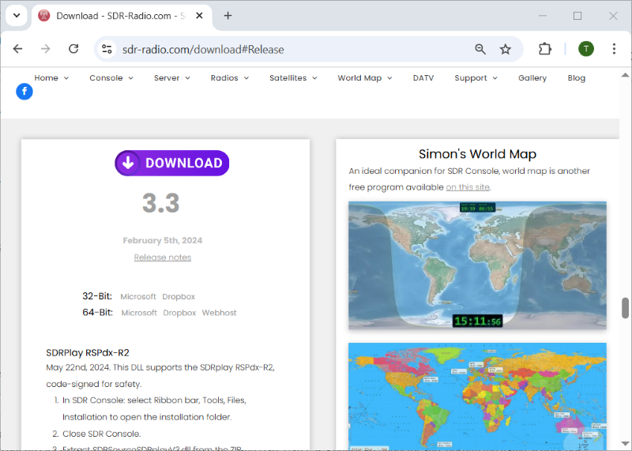

4. Clicking *DOWNLOAD* will not take you to the download immediately. Instead, click on either the *32-Bit* or *64-Bit* version listed, for example, to download the *64-bit version* from *Microsoft OneDrive*.

    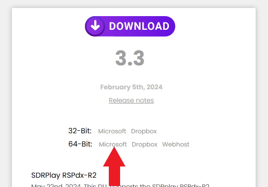

5. This will lead you to the actual download page. From there, click *Download* to begin the download process.

    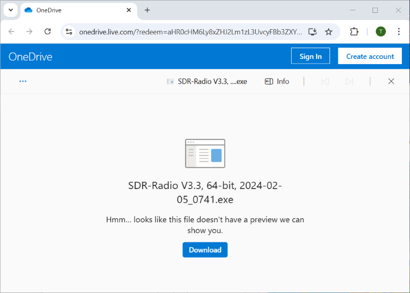

### Installation

*SDR Console* is not a portable app and requires installation.

1. Run the downloaded executable file. You will be prompted to provide *Administrator* privileges. Click *Yes* to proceed.

    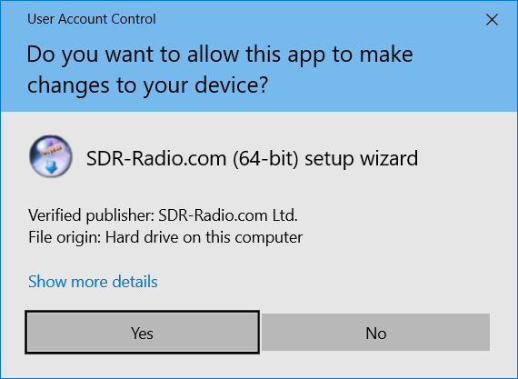

2. The installer unpacks the necessary files. This process should only take a few seconds.

    

3. The actual installation process begins. Click *Next* and follow the on-screen instructions.

    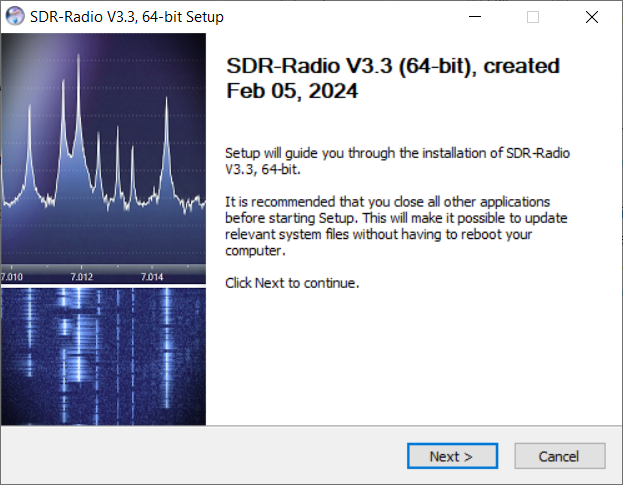

4. The installer will confirm the installation directory, which defaults to your primary hard drive. If space is limited, you can select a different drive.

    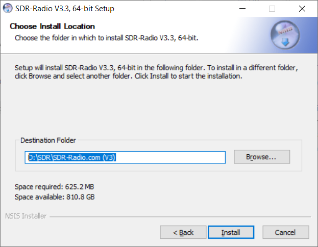

5. During installation, any missing components (e.g., *C++ redistributables*) will be installed. Each component will launch a separate installer, so be sure to click *OK* when prompted.

    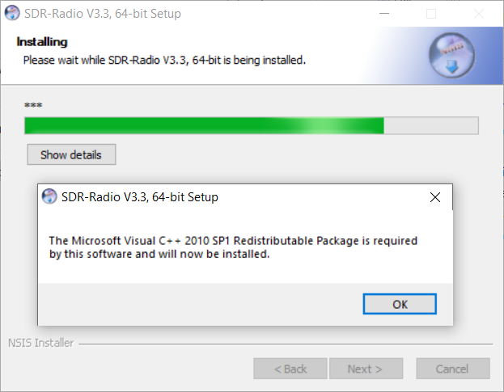

6. Once the installation is complete, click *Next*, check the box to *Start the program now*, and click *Finish*.

    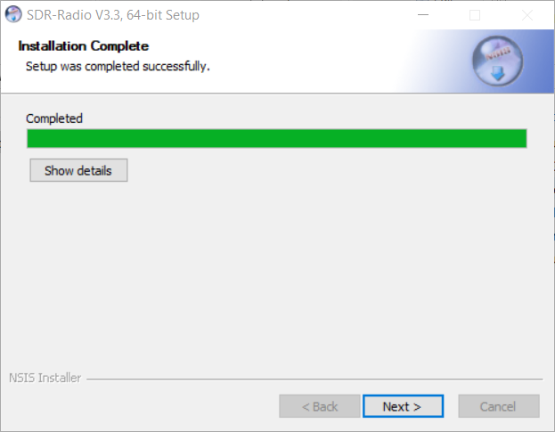

This will close the installer and launch *SDR Console*. The program's red round icon with an antenna will appear in your taskbar.

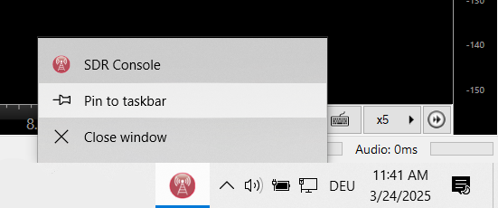

Be sure to right-click this icon and choose *Pin to taskbar* for easy access in the future.

For *SDR Console* to work, it needs at least one physical *SDR Radio Receiver*. On the first launch of the software, a dialog box will prompt you to add your SDR receiver.

## Hardware

In this example, I am using a very affordable *RTL-SDR.COM V4* SDR receiver. It actually seems to be a cheap clone. 

The software comes with a long list of supported SDR radios. Make sure you select the one you are intending to use.

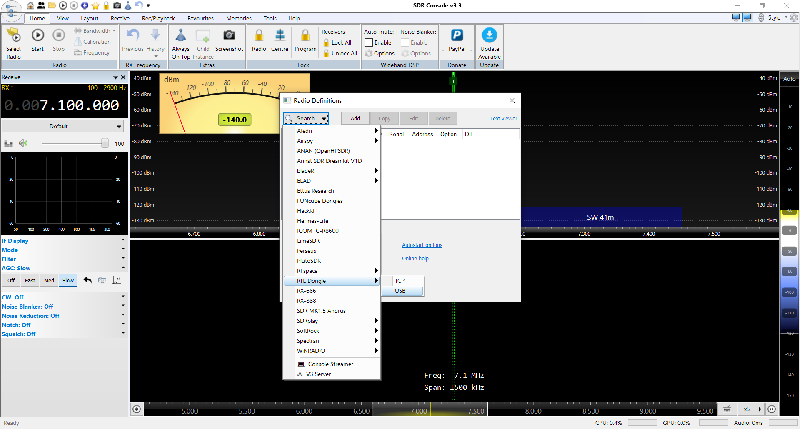

Follow these steps to add your SDR receiver:

1. Plug in your SDR receiver, so the software can detect it. 

    *If your SDR receiver is not detected by the operating system, or if you are encountering difficulties in the process lined out below, visit the next section to ensure that your SDR receiver is properly recognized.*

2. In the dialog box that opens, click *Search*. A drop-down menu will appear. Select your SDR device (e.g., `RTL Dongle`/`USB`). *SDR Console* will search for your device.

    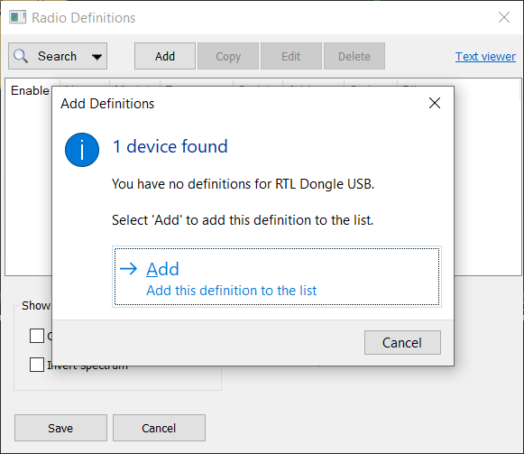

4. Once the device is detected, click *Add*. The software will automatically populate the technical details of your device, and it will appear in the list of available devices.

    

5. Don't forget to click *Save* to keep the device in your list. From now on, you can simply double-click it to select it whenever you launch *SDR Console*.

You can also add additional SDR devices if desired.

### Hardware Not Detected

If *SDR Console* fails to detect your SDR receiver, and you've confirmed that it's connected and the correct model was selected in the *Search* menu, the issue might be related to *USB device discovery*.

On my Windows PC, the properly recognized SDR receiver shows up in *Device Manager* as **Blog V4** under **Other Devices**:

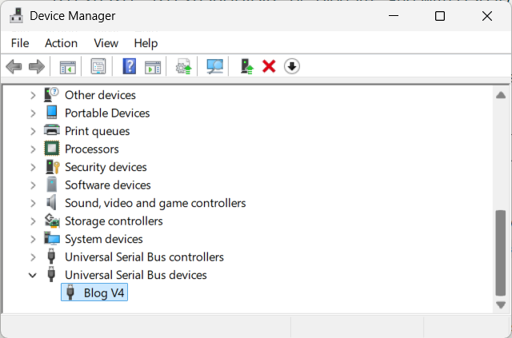

If it instead displays with a warning icon, labeled as **Bulk-In** device, it is most probably still lacking a proper driver, and you need to follow the steps below to fix it.

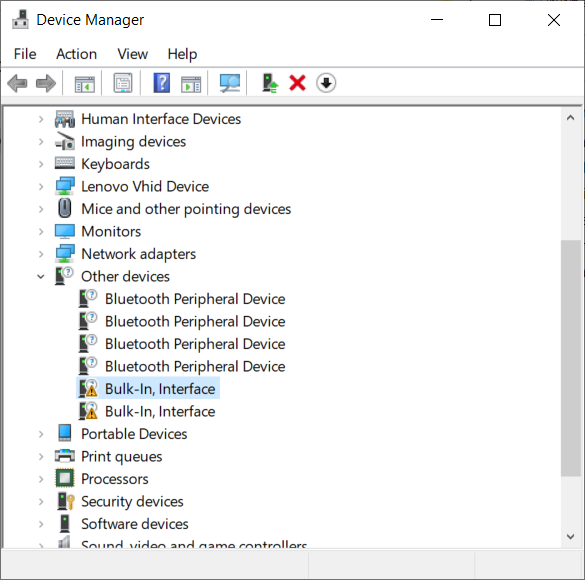

Here's how to fix a warning icon in device manager on a *Windows PC*:

1. Plug your SDR stick into a USB-A port. You should hear the sound indicating that a new device was recognized. Press `WIN`+`R` and type `devmgmt.msc` to open the Device Manager.

2. In Device Manager, check for any *unknown* devices or devices with strange names such as *Other devices*/*Bulk-In*. If you see one, the SDR device may have a USB driver issue.

    

3. Install [Zadig](https://zadig.akeo.ie/), launch it, and select the unknown device from the drop-down list (e.g., *Bulk-In, Interface 0*).      
  
    It is **crucial** that you do this only for the device that has issues. If you accidentally select a different USB device that is properly working, you may mess up its configuration. 

    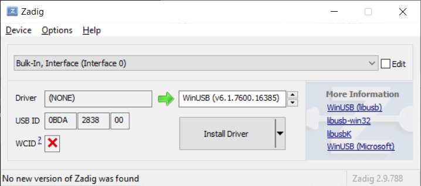

4. In the *Driver* field, check whether a driver is installed. If no driver is present, select *WinUSB* from the drop-down menu and click *Install Driver*. This process may take up to a minute.

After installing the correct USB driver, return to *SDR Console* and try searching for your SDR device again. It should be detected within a few seconds.

## SDR Console - First Steps

Once you have installed *SDR Console* and added your *SDR Radio Device* to it, let's walk through the first steps:

1. **Launch SDR Console**  
   If you pinned *SDR Console* to your taskbar, click its icon. Otherwise, navigate to the installation folder and find *SDR Console.exe*. Launch it.

2. **Select Radio**  
   A *Select Radio* dialog will open, listing all SDR receivers you've previously added. Select the one you want to use.

3. **Set Bandwidth**  
   In the lower part of the dialog, you can select the *bandwidth*. This refers to the frequency range that can be monitored simultaneously in the spectrum. The available bandwidths depend on your SDR receiver's quality and performance. A higher bandwidth requires more computational power and higher data transfer rates. Start with a low bandwidth, such as *1 MHz*, then click *Start*.

     

4. **Start Listening**  
   After a few seconds, *SDR Console* will start emitting sound, most likely static. By default, it will tune to *7.1 MHz*.

### Listening to Public Broadcast

Now, let's tune into the radio frequency range and modulation type you want to examine. As a first test, tune into *VHF public broadcast*:

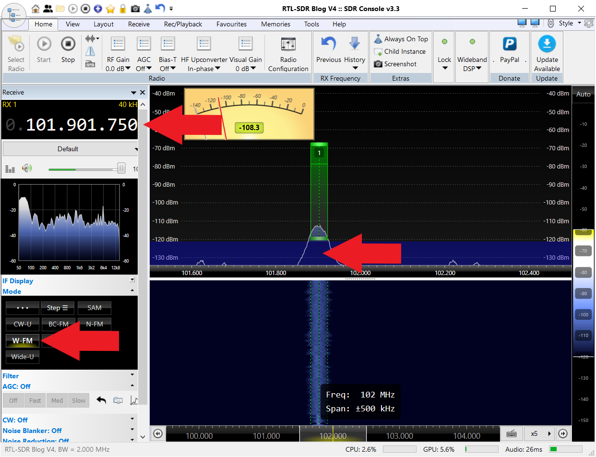

1. **Set Frequency**  
   Click on the frequency meter in the upper left corner. On each digit, there is a square above and below when you hover the mouse over it. Clicking the square increases/decreases the digit. Tune in your favorite *VHF* radio station, or tune in a frequency in the range of `88-108 MHz`.

2. **Spectrum and Waterfall**  
   The spectrum display will now show any signals that can be picked up in the selected *bandwidth* around the frequency you set. So if you dialed in `100.000.000 MHz` (*100 MHz*), and defined a *1 MHz* bandwidth when launching the software, the spectrum will show all signals in the range `99.5-100.5 MHz`.

   Even if you don't know a particular station's frequency, you can *discover* signals within the monitored spectrum. Simply click on a signal in the spectrum to tune to it.

3. **Modulation**  
   To actually *hear* the public broadcast transmission, you need to set the modulation type to the appropriate one. 

   On the left side, click *Mode*, and from the drop-down, select `W-FM` (*wideband FM*). Done! Now, if you’ve tuned into a radio station and cranked up the volume, you should be able to hear music or news.

### Testing RF Remote Controls

Now let’s try something more practical: You may have found an old RF remote control and want to figure out which frequency it uses.

1. **Tune to Suspected Frequency**  
   Set *SDR Console* to the first suspected frequency range, such as `433.920.000` (*433.92 MHz*).

   

2. **Listen for Signals**  
   Listen for a while. You may pick up various ISM band transmissions, from short bursts from remote controls to regular intervals from digital data transmissions. The waterfall display shows signals over time. If the transmission is on a license-free band, the signals should be centered around *433.92 MHz*.

3. **Test the Remote Control**  
   Press the unknown remote control and check whether it emits a signal in this spectrum. It should produce a much stronger signal, as it is much closer to the receiver.

#### Findings

Your remote control may be within the monitored range, but its transmission frequency might be slightly off.

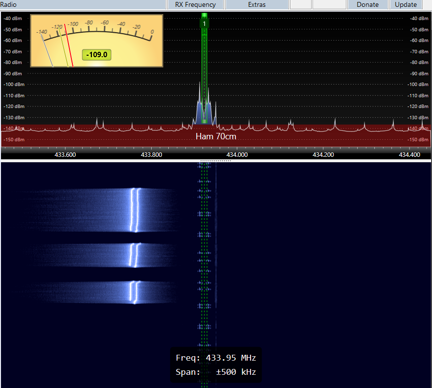

The weak signals in the middle of the waterfall come from unknown sources at precisely the center frequency *433.92 MHz*, while the tested remote control transmits around *433.78 MHz*.

> [!TIP]  
> The default waterfall speed is 40 lines per second. To adjust the speed, go to `View` > `Speed`. With the vertical bar on the right side, you can set the sensitivity. Click `Auto` on top to auto-tune the waterfall to the best sensitivity.

You found that your remote control:

* Works
* Uses the *433 MHz* frequency range
* Is slightly off (±150 kHz is typical for inexpensive RF remote controls)

If your remote control didn’t produce signals within the monitored spectrum, try switching to other common frequency ranges, such as *315.0 MHz*, and test again.

## Conclusions

The example test cases illustrate the value of *SDR bandwidth*: if an *SDR receiver* were capable of i.e. *200 MHz bandwidth*, it could monitor the full frequency range from, e.g., *300-500 MHz*, picking up remote controls from both ISM bands in one sweep. 

However, such bandwidths are beyond the reach of most affordable SDR receivers:

| SDR Model            | Max Bandwidth (MHz) |
|----------------------|--------------------|
| RTL-SDR (RTL2832U)   | ~2.4 (practical ~2.0) |
| HackRF One           | 20                 |
| LimeSDR Mini         | 30                 |
| LimeSDR USB          | 61.44              |
| USRP B200            | 56                 |
| USRP B210            | 61.44              |
| Airspy R2            | 10                 |
| Airspy Mini          | 6                  |
| SDRplay RSPdx        | 10                 |

With these SDR models, you need to manually switch frequency range once signals fall outside the monitored bandwidth. That's perfectly acceptable, and even a *2 MHz* bandwidth often is overkill for typical RF test scenarios.

*High-performance* SDR receivers, however, can easily achieve broad monitoring:

| SDR Model              | Max Bandwidth (MHz) |
|------------------------|---------------------|
| Ettus USRP X310        | 160                 |
| Ettus USRP N320/N321   | 200                 |
| Ettus USRP N210        | 25                  |
| Per Vices Cyan         | 1,600               |
| Per Vices Crimson TNG  | 960                 |
| Per Vices Chestnut     | 500                 |
| NI/Ettus USRP X410     | 400                 |
| Analog Devices AD9361  | 56                  |
| Analog Devices AD9371  | 100                 |
| FlexRadio 6700         | 14 (per receiver, 7 receivers) |
| RFSpace NetSDR         | 1.6                 |
| Signal Hound SM200B    | 160                 |
| R&S PR100              | 10                  |
| R&S EB500              | 20                  |

Regulators also use SDR technology, albeit a bit more powerful [(more similar to this)](https://www.pervices.com/cyan/). That enables easy monitoring and detecting of suspicious RF signals that should not be present in unauthorized frequency ranges.

Another reason why these days you should definitely adhere to legal regulations, and not transmit on frequencies outside legal ranges or with excessive RF power. 

> Tags: Radio, RF, Tools, SDR, Bandwidth, Modulation, SDR Console, SDR Dongle, Zadig, USB Driver

[Visit Page on Website](https://done.land/components/data/datatransmission/wireless/tools/sdr-analyzingradiowaves?312657031324253356) - created 2025-03-23 - last edited 2025-12-11
