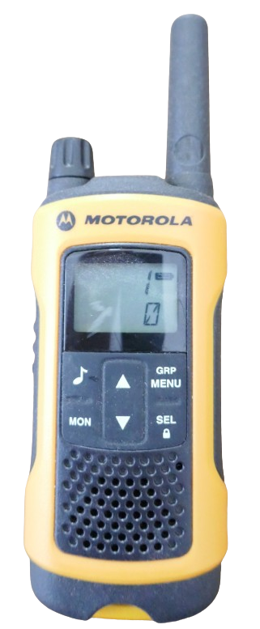
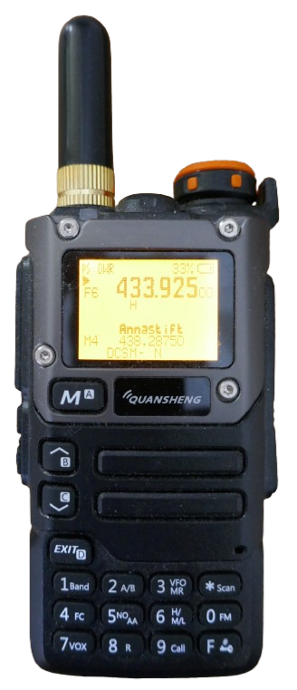

 
# Voice Transmission

> Technical and Legal Requirements for Wireless Voice Transmission

Almost everyone today uses smartphones to wirelessly transmit voice. Hobbyists use CB radios, parents use baby phones, on the beach you may be using a wireless bluetooth beat box, licensed HAM radio amateurs experiment with long range radio transmissions, and many professions use their own radio networks, i.e. policy, emergency services, airplanes, and businesses.

So what are the common fundamentals: the technical *and* legal requirements to transmit voice wirelessly? And what are your options to transmit voice wirelessly via radio waves?

## Overview
Originally, voice transmission exclusively used *analog* technology. *Digital* transmission has meanwhile become increasingly affordable and popular.

> [!IMPORTANT]
> Whether you can use *analog* or *digital* transmission depends on the legal restrictions and frequencies you want to use. Keep in mind that analog and digital transmissions are **incompatible**, so a digital radio can only talk to other digital radios. 

Most public license-free services still use *analog* devices.

## Voice-Only Radio Services

There are a number of license-free frequency ranges for voice transmission that anyone can use. Just make sure you purchase a compliant radio.

> [!IMPORTANT]
> Regulations may vary from country to country. The table below lists *typical* regulations. Always make sure you understand the specific regulations that apply to **you** in your **current location**.   

| Service/Device      | Analog/Digital         | Typical Frequency Range         | Max Power (Legal)            | Legal Requirements/Notes                    |
|---------------------|-----------------------|---------------------------------|------------------------------|---------------------------------------------|
| [CB (Citizens Band)](https://en.wikipedia.org/wiki/Citizens_band_radio)  | Analog (AM/FM/SSB)    | 26.965–27.405 MHz               | 4 W (AM/FM), 12 W (SSB)      | License-free |
| [Air Band](https://en.wikipedia.org/wiki/Airband)            | Analog (AM)           | 108–137 MHz                     | Varies (typically 5–25 W)    | aviation license, strict regulation|
| [2m Ham Band](https://en.wikipedia.org/wiki/2-meter_band)               | Analog & Digital      | 144–148 MHz (US), 144–146 MHz (EU)         | Up to 1.5 kW (US, licensed)             | Amateur radio license required |
| [Freenet](https://en.wikipedia.org/wiki/Freenet_(radio))    | Analog & Digital      | 149.0125–149.125 MHz            | 0.5 W (handheld only)        | License-free, Germany only |
| [MURS (Multi Use Radio Service)](https://en.wikipedia.org/wiki/Multi-Use_Radio_Service)           | Analog (NFM)          | 151.820–154.600 MHz             | 2 W                          | License-free (US)  |
| [70cm Ham Band](https://en.wikipedia.org/wiki/70-centimeter_band)             | Analog & Digital      | 420–450 MHz (US), 430–440 MHz (EU)         | Up to 1.5 kW (US, licensed)             | Amateur radio license required |
| [LPD433 (Low Power Device)](https://en.wikipedia.org/wiki/LPD433)   | Analog FM             | 433.075–434.775 MHz                        | 10 mW                                   | License-free in the EU |
| [PMR446 (Private Mobile Radio)](https://en.wikipedia.org/wiki/PMR446)      | Analog FM & Digital (DMR) | 446.0–446.2 MHz               | 0.5 W ERP                    | License-free, EU/Malaysia/Singapore/Norway/UAE |
| [FRS (Family Radio Service)](https://en.wikipedia.org/wiki/Family_Radio_Service)            | Analog (NBFM)         | 462.5625–467.7125 MHz           | 2 W (main ch.), 0.5 W (others)| License-free|
| [GMRS (General Mobile Radio Service)](https://en.wikipedia.org/wiki/General_Mobile_Radio_Service)           | Analog (NBFM)         | 462.5625–467.7125 MHz                     | 5 W (handheld), 50 W (base/mobile) | License required (US)  |

### Licensed Public Radio Services
Some frequency ranges require a special license:

* [Air Band:](https://en.wikipedia.org/wiki/Airband) *Radio station license* (for the equipment/airplane) and *Operator License* (for the operator/pilot)
* [HAM radio amateur:](https://en.wikipedia.org/wiki/Amateur_radio) non-commercial experimental use, large frequency ranges with high RF power, requires deep technical and legal knowledge
* [GMRS:](https://en.wikipedia.org/wiki/General_Mobile_Radio_Service) shares same frequency range with license-free [FRS](https://en.wikipedia.org/wiki/Family_Radio_Service). License allows more RF power and the use of *repeaters* which can extend range:

| Channel Range   | Frequency Range (MHz) | FRS Max Power | GMRS Max Power | Shared?       |
|-----------------|----------------------|---------------|----------------|---------------|
| 1–7             | 462.5625–462.7125    | 2 W           | 5 W            | Yes           |
| 8–14            | 467.5625–467.7125    | 0.5 W         | 0.5 W          | Yes           |
| 15–22           | 462.5500–462.7250    | 2 W           | 50 W           | Yes           |
| 15R–22R         | 467.5500–467.7250    | Prohibited    | 50 W           | GMRS only (repeaters) |

### Multi-Purpose Frequency Bands

Aside from the designated **voice-only** services, additional license-free **multi-purpose** frequency ranges exist. They *can* be used to transmit voice but are used for a range of other data as well.

| Service/Device      | Analog/Digital         | Typical Frequency Range         | Max Power (Legal)            | Legal Requirements/Notes                    |
|---------------------|-----------------------|---------------------------------|------------------------------|---------------------------------------------|
| [WiFi (IEEE 802.11)](https://en.wikipedia.org/wiki/Wi-Fi)        | Digital               | 2.4 GHz, 5 GHz, 6 GHz, 60 GHz              | 100–1000 mW (region/band dependent)     | License-free |
| [Bluetooth](https://en.wikipedia.org/wiki/Bluetooth)                 | Digital               | 2.4 GHz ISM band                           | 1–100 mW (Class 1: 100 mW, Class 2: 2.5 mW, Class 3: 1 mW) | License-free   |
| [ISM (Industrial, Scientific, Medical)](https://en.wikipedia.org/wiki/ISM_radio_band)  | Analog & Digital      | 315, 433, 868, 915 MHz (region dependent)  | 10–100 mW (typical, varies by band)     | License-free, **strict duty cycle/power limits** |

Devices like [Babyphones (Baby Monitor)](https://en.wikipedia.org/wiki/Baby_monitor), wireless *speakers*, wireless *headphones*, etc. all use one of these bands and share it with other devices such as garage door openers, sensors, and other devices that transmit data other than voice.

Most DIY projects use breakout boards with transceivers operating in one of these bands. 

While you *can* use these to design and build your own analog or digital walky talky, there are important restrictions you must know:

* **Low Power:** these bands are reserved for low-range devices, and the maximum output power is very low. Using higher-than-allowed power can easily interfere with other devices in the vicinity, and once your neighbor can no longer open the car with the key fob, you'll quickly trigger investigations by local authorities like the *FCC* or *Netzagentur*, and are subject to severe fines.
* **Duty Cycle:** since these bands are primarily used for short data transmissions like garage door opener codes or sensor data, there are **[duty cycle](https://en.wikipedia.org/wiki/Duty_cycle) restrictions** for most of these bands: you cannot send for longer periods of time. Voice communication typically requires much higher duty cycles than are legal to use.

In a nutshell, for voice transmissions **avoid these bands**. 

A much more cost-effective and simpler way is to use one of the designated voice transmission services listed above, and purchase a dedicated walky talky.

### Analog vs. Digital
Digital transmission uses much more modern techniques which results in significant advantages (better audio quality, less static, longer battery life, effective encryption, better bandwidth usage, etc.):

| Feature                          | Analog   | Digital      |
|-----------------------------------|----------------------------------------------|-----------------------------------------------|
| **Cost**                          | low | higher |
| **Audio Quality**                 | lower than digital in cheaper systems. | Clearer audio with less background noise and static|
| **Interference**                  | audible noise and signal degradation. | muting or dropout rather than noisy audio. |
| **Latency**                       | real-time transmission. | typically 3–5 ms due to digital processing |
| **Channel Efficiency**            | One conversation per channel | Multiple conversations per channel |
| **Security**                      | No effective encryption | Secure encryption possible though often illegal to use |
| **Battery Life**                  | shorter, constant transmission power needed. | Up to 40% longer battery life  |
| **Coverage**                      | more static and noise at coverage edges. | clearer audio at coverage edges due to error correction. |
| **Expandability**                 | limited | data can be incorporated into transmission (i.e. caller ID, GPS position, etc.) |

Whether or not you *can* use digital transmission depends on the radio band you are targeting:

* [CB](https://en.wikipedia.org/wiki/Citizens_band_radio), [LPD433](https://en.wikipedia.org/wiki/LPD433), [FRS](https://en.wikipedia.org/wiki/Family_Radio_Service), [GMRS](https://en.wikipedia.org/wiki/General_Mobile_Radio_Service), and [MURS](https://en.wikipedia.org/wiki/Multi-Use_Radio_Service) are all **analog only**.
* [Freenet](https://en.wikipedia.org/wiki/Freenet_(radio)) and [PMR446](https://en.wikipedia.org/wiki/PMR446) allow both analog and digital modes.  

Digital *FreeNet* and *PMR446* radios are costly, though, and the analog modes are much more popular. 

## Using Legal Radios
To *legally* operate on one of the license-free bands, you must (1) adhere to the technical restrictions **and** (2) use a **certified** radio.

### Certified Radios
Certified radios from renown brands guarantee that you operate within legal limits. Such radios work *out of the box*, and there are no confusing configurations or settings to learn.

They underwent careful design and extensive testing, and the built-in antenna is typically perfectly tuned to the frequency range you intend to use.

On the down side is *cost*: certified radios cost a multiple of the cost for uncertified radios.

## Cheap Illegal Radios
While generic Chinese radios are much more affordable and can be programmed to use the required frequencies and power levels for license-free bands, they are typically **not certified** - and thus illegal to use on one of the license-free bands in most countries.

Such radios aren't *illegal per se*. They are just illegal to use **without a proper license**. As an analogy, while you can ride a bicycle license-free, a drivers license is required for a Ducati. 

* **Certified Radios:** fool-proof to operate, no special knowledge on users end required
* **Uncertified Radios:** highly flexible, require technical understanding and programming, technical knowledge required on users end, or else such radios can easily cause severe interferences.

To legally use these, you need for example a [HAM radio amateur](https://en.wikipedia.org/wiki/Amateur_radio) license. Even such a license wouldn't allow you to use these radios on one of the license-free bands. You'd be restricted to the frequency ranges specifically assigned to HAM radio.

### Why is it illegal?

There are a number of (good) reasons why cheap and uncertified radios are illegal to use:

* **Spurious Emissions:** many radios emit so-called *spurious emissions*: when you transmit, you send not only on your own frequency, but also in parallel on higher *harmonic* frequencies (typically 2x, 3x, 4x, etc. the frequency you dialled in). Harmonics are a general problem of transceivers, yet cheap radios lack the suppression found in more expensive certified radios. Using cheap radios may therefore severely interfere with emergency and other services in other frequency ranges - without you even noticing.
* **Illegal Power:** even though most cheap Chinese radios do not reach the output power they claim, such radios often still produce more output power than allowed. For example, *PMR* allows a maximum of *0.5W*. Even low-end uncertified radios can send with 1-5W. Sending with more power does not necessarily improve your reach: you'd need to quadruple your power to double your reach. By doing so, your radio emits very high RF levels with a good chance of interfering with other services in your vicinity.
* **Antenna:** Part of many regulations is your *effective RF power* which depends on additional factors like the *antenna* you are using. That's why certified radios often come with a fixed rubber duck antenna whereas uncertified radios use a SMA adapter that lets you connect any antenna you like. By using a larger or directional antenna, you can easily exceed the legal *effective RF power*.

### Caveat: Pre-Programmed Channels

To see just how easily unlicensed users can get themselves in trouble with uncertified radios, keep in mind that such radios typically come pre-programmed on frequencies that are assigned to emergency services, military, or other non-public services.

Anyone who simply unpacks such radios and starts using them is actually transmitting on highly illegal frequencies, causing interferences and subjecting them to severe fines.

That's because most Chinese radios are not designed for a specific license-free band. Instead, they can work on multiple bands and must initially be programmed correctly.

### When High RF Power Backfires
*"Man, I got this 10W walky talky from AliExpress, that's 20x the power of your certified radio!"*

Sentences like this indicate once more why users without technical background should stick to worry-free certified radios.

* **False claims:** Regardless of what sellers of no-name radios claim: most radios use same or similar components and emit 2-5 W RF power, depending on the frequency you use. Very cheap entry-level radios emit 0.5-1W.
* **False assumptions:** To significantly increase reach, you need to increase RF power disproportionately: it takes 4x RF power to double the reach. Higher RF power comes at an expense: battery life shortens drastically, and if your antenna is not excellently tuned, the HF amplifier inside the radio may heat up and eventually gets damaged.
* **Low Receiver Sensitivity:** some no-name radios come with below-average receiver sensitivity. When the receiver is less sensitive, you need more transmit power on the other end. Investing in quality radios with excellent receiver sensitivity is just as effective as increasing RF transmit power - except this is legal and saves battery power, too.
* **Bad Antenna:** The most important caveat with no-name radios are their antennas: more often than not, the included rubber duck antenna is badly tuned, especially with multi-band radios that cover a wide frequency range. They may work great for some frequency ranges but typically not for the ones you target. It is not uncommon to see *SWR* ratios of 1:6 to 1:14: only 1/6 to 1/14 of the original RF power is actually emitted, the rest flows back into the amplifier and heats it up. 

A certified quality radio with a perfectly tuned antenna for the frequency range you are actually using can have a much higher effective RF power than an uncertified radio with "10 Watts", and combined with a better receiver sensitivity, it may even have a better reach - at much less battery consumption, and completely legal.

If on the contrary you are *brute forcing* reach by pumping up just the RF power, you waste your battery power, cause local interferences, and make your signal much more detectable.

Keep in mind that raw RF power is only one factor of many that contribute to reach. Other important factors are *receiver sensitivity* and *antenna*.

## Using Uncertified Radios

Let there be no mistake: there are a number of awesome and technically highly sophisticated uncertified Chinese radios, packed with technology at unbeatably low prices.

Take the *Radtel RT-4D* for example: it supports both *analog* and *digital* transmission with dual-band support for *2m* and *70cm* (essentially covering all VHF and UHF license-free bands) and exceptionally sensitive receiver.

It can receive almost the entire frequency range from *18MHz* to *1GHz* and even supports strong AES256 encryption in its digital mode. 

That's impressive for a price tag of less than €50.

As discussed earlier, such powerful general-purpose radios require a license to operate, primarily because operating them is not *fool-proof* and requires technical know-how.

These are some of the steps a responsible licensed HAM would take before using such a radio:

* **Code Plug:** download the configuration software for the particular radio, and create an appropriate *code plug* (radio configuration): program the channels according to the frequencies and modes that are legal to use, and upload the configuration to the radio.
* **Harmonics:** Use a tool like [Tiny SA](https://www.google.com/search?q=Tiny+SA) to analyze spurious emissions. Make sure the radio is emitting only on the designated frequency, and unwanted emissions on other frequencies are attenuated by at least *60dBc*. Make adjustments, i.e. by adding band pass filters, to ensure unwanted harmonics are adequately suppressed to not cause interferences.

## Picking Frequency

Public license-free bands use three different frequency bands: *11m*, *2m*, and *70cm* (wave length). 

These bands have fundamentally different physical aspects:

* **HF (11m):** [CB (Citizens Band)](https://en.wikipedia.org/wiki/Citizens_band_radio) uses the *11m* band/*27 MHz* short wave.
    * large antennas
    * relatively high power consumption
    * long distance over terrain and across hills
    * pricey equipment
* **VHF (2m):** [Freenet](https://en.wikipedia.org/wiki/Freenet_(radio)) and [MURS](https://en.wikipedia.org/wiki/Multi-Use_Radio_Service) use the *2m* band/*149-155 MHz* 
  * small antennas
  * good with obstacles (no free line of sight)
  * license-free use only in limited areas of the world

* **UHF (70cm):** [FRS](https://en.wikipedia.org/wiki/Family_Radio_Service), [PMR446](https://en.wikipedia.org/wiki/PMR446), and [GMRS](https://en.wikipedia.org/wiki/General_Mobile_Radio_Service) use the *70cm* band/*446-467MHz*
  * very small antennas
  * perfect for indoor communication
  * very affordable

In a nutshell: 

* **Long Range:** *11m* is ideal for long range communication, especially when there are obstacles like hills interfering with free line of sight. On the down side, *11m* requires large antennas, and the equipment is generally more costly.

* **Urban/Indoors:** *70cm* on the contrary is ideal for urban environments. Antennas can be very small, and transmission is energy-efficient. However, *70cm* may not work across hills, i.e.

* **General Purpose:** *2m* combines aspects from both: works well in urban environments *and* over terrain.

| Property                        | 11m   | 2m   | 70cm        |
|----------------------------------|----------------------------------|--------------------------------------|----------------------------------------|
| Antenna Size                    | 1–2.5 m   | 0.5–1 m   | 10–20 cm               |
| Range (indoors)                   | moderate         | good           | very good      |
| Range (urban)                   | 1–3 km                           | 1–2 km      | 0.5–1.5 km                             |
| Range (line of sight/open)      | 5–10 km | 3–5 km (if license-free)              | 2–5 km                                 |
| Propagation                     | Good over terrain | Good in open/urban | penetrates buildings well |
| Susceptibility to Interference  | High (atmospheric, man-made)     | Medium                               | Low (mainly local interference)        |
| Channel Congestion              | Medium  | Low, rare use      | Medium to High (urban areas)           |
| Power Consumption      | high  | medium  | low |
| Building Penetration            | Moderate                         | Good                                  | Very good                             |
| Equipment Availability          | Widely available  | Limited    | Very widely available      |

## Free Voice Radio Frequencies

There are additional free-to-use radio frequencies designated for analog and/or digital *voice communications* (i.e. walky talkys):

| Name | Frequency | Wave Length |
| --- | --- | --- |
| CB (Citizen Band) | 27MHz | 11m |
| FreeNet | 149MHz | 2m |
| MURS (Multi-Use Radio Service) | 151-154MHz | 2m |
| LPD (Low Power Device Voice) | 433MHz | 70cm |
| PMR (Personal Mobile Radio) | 446MHz |  70cm |
| FRS (Family Radio Service) | 462-467MHz | 70cm |
| GMRS (General Mobile Radio Services) | 462-467MHz | 70cm |

> [!NOTE]
> The table presents an overview only. Additional rules exist. For example, *FreeNet* is available in *Germany* only. *PMR* is available in the *EU*. *FRS*, *GMRS*, and *MURS* are available in the *US*. *GMRS* requires an (easy to obtain) license. For *MURS*, additional regulations apply.

> [!CAUTION]
> These frequencies are *not usable* for *DIY projects* as they are *highly regulated*, require *certified devices* and prohibt the transmission of radio data other than voice.

### Amateur Radio (HAM)
Licensed *radio amateurs* are private persons that went through classes, took a test and received a certification ensuring they technically know precisely how radios work and how to not interfere with other radio services.

Radio amateurs typically are *enthusiasts* with a strong focus on radio *technology*.

Radio amateurs can use a large number of additional frequency bands, and emit radio power up to many kilowatts, but solely for *experimental purposes* related to *radio communications*. 

This includes *DIY* projects, however strictly related to *radio amateur purposes*. A *licensed radio amateur* cannot for example use his or her special privileges to transmit personal weather station data on a privileged frequency - except if this weather data is used in close relation to experiments testing radio emissions under different weather conditions.

> Tags: Frequency, Garage Door Opener,  Band Plan, WiFi, FreeNet, LPD, PMR, FRS, GMRS, MURS, 315MHz, 433MHz, 868MHz, 915MHz, LoRa, SRD

[Visit Page on Website](https://done.land/components/data/datatransmission/wireless?054116041215245756) - created 2024-04-15 - last edited 2024-05-05
