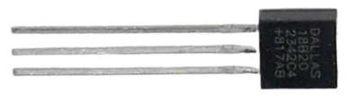
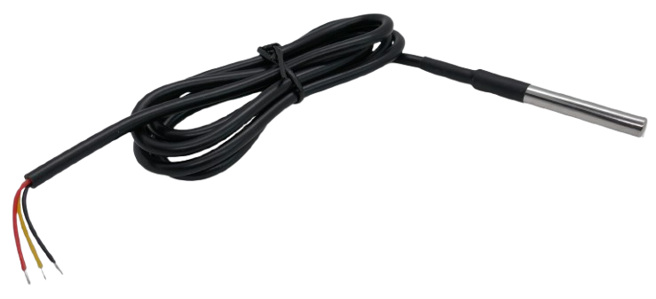
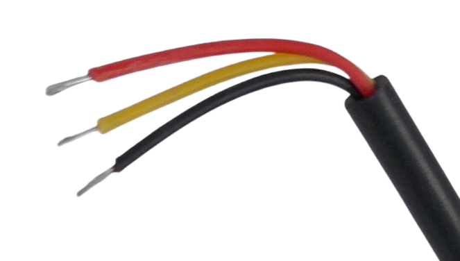
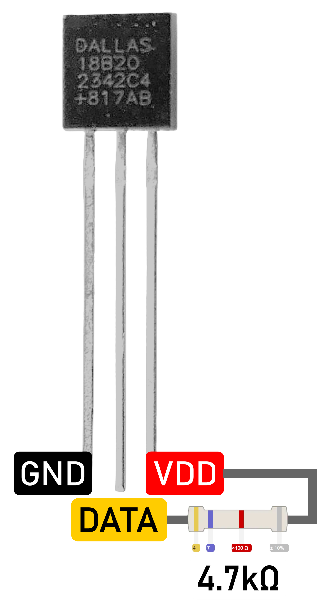
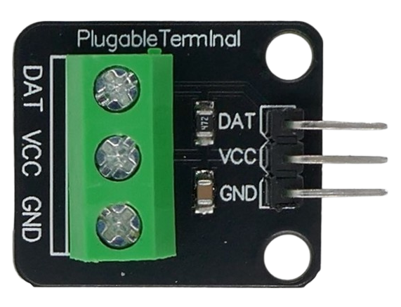
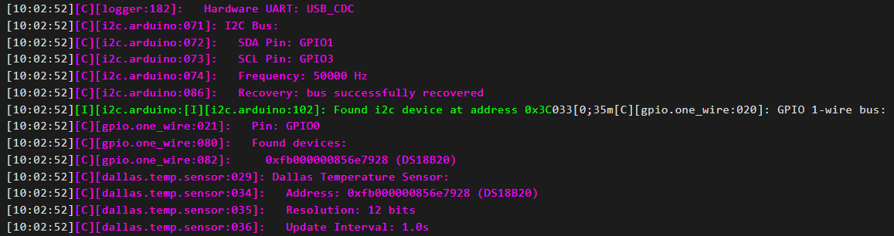
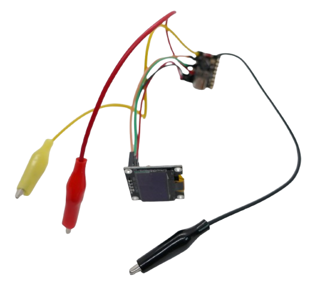
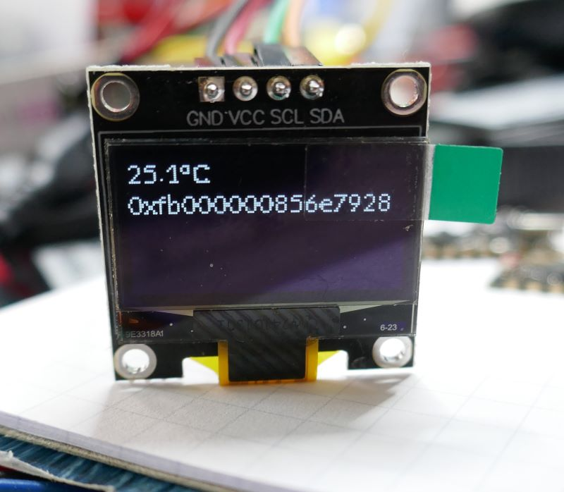
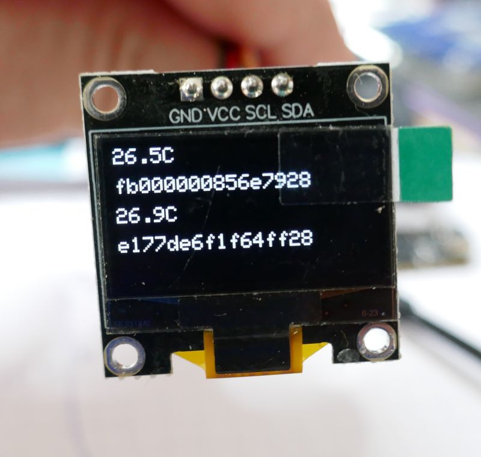

 # Dallas One-Wire Temperature Sensor

> Affordable Industrial Temperature Sensors with a One-Wire Bus for Monitoring Sensitive Devices and Environments

## Overview
*Dallas* temperature sensors are affordable and easy-to-use digital sensors that communicate via a **One-Wire Bus**. Each sensor has a **unique hard-coded ID**, allowing multiple sensors to share the same data line while remaining individually addressable. This enables **efficient wiring**, as only a **single GPIO** is needed to read from multiple sensors.



These sensors support a **wide temperature range**, making them ideal for diverse applications—from monitoring deep freezers (as low as **-55°C**) to safeguarding power supplies or chargers (up to **+125°C**).

They are highly **energy-efficient**, consuming approximately **1mA** during active measurement, with peak currents reaching **1.5mA**. This makes them suitable for **battery-powered devices** and monitoring critical components.

Dallas sensors come in various physical forms, including **three-pin TO-92 packages** and **waterproof, stainless steel-encased versions** designed for harsher environments.




### Digital Sensor

Unlike analog temperature sensors, *Dallas* sensors output a **digital signal**, requiring a **microcontroller** for processing. This offers several advantages:

- **One-Wire Protocol:**  
  Dallas sensors use the **One-Wire** communication protocol, meaning they require only a **single data line**. Multiple sensors can be connected in **parallel** on the same bus, as each sensor has a **unique 64-bit serial number** for individual addressing.

- **Selectable Resolution:**  
  All models (except the *DS18S20*) support **adjustable resolution**. Lower resolutions provide **faster response times**, while higher resolutions offer **greater accuracy**.

### Conversion Time (Latency)

The **conversion time** is the delay between requesting a temperature reading and receiving the result. It depends on the selected **resolution**:

| Resolution | Conversion Time (Latency) |
|------------|---------------------------|
| 9-bit      | 94 ms                      |
| 10-bit     | 188 ms                     |
| 11-bit     | 375 ms                     |
| 12-bit     | 750 ms                     |

For applications requiring **quick updates**, lower resolutions are preferable, while **higher resolutions** enhance **measurement precision**.


## Wiring
Each sensor has three connections:

| Pin  | Description                          | Typical Color |
|------|--------------------------------------|--------------|
| VCC  | **Power supply (3.0-5.5V)**          | Red          |
| GND  | **Ground**                           | Black        |
| DATA | **Digital data line (One-Wire Bus)** | Yellow       |

Waterproof steel-encased sensors are typically **pre-wired** with red, black, and yellow leads.



The **TO-92 package** follows the pinout illustrated below (*viewed from the flat side* of the package):



> [!NOTE]  
> The image above also illustrates the placement of the **required external pull-up resistor**. Neither the **waterproof sensor versions** nor the **TO-92 packages** include this resistor.

There are **two possible wiring methods**:

| Method      | Description |
|------------|-------------|
| **Normal Mode** | Connect **VCC** to power, **GND** to ground, and **DATA** to an input GPIO of your microcontroller. |
| **Parasitic Mode** | Connect only **GND** and **DATA**, leaving **VCC unconnected**. The sensor draws power through the **DATA line**, requiring a **strong pull-up** to function correctly. |

### Typical Setup
In a standard setup, the *Dallas* sensor is connected to a power source (**VCC** to *3.3V* or *5V*, **GND** to ground), and the **DATA** line is connected to an input GPIO.

When using a **single sensor**, you might be able to skip the external pull-up resistor. Since the sensor receives power through **VCC**, and **DATA** experiences minimal communication traffic, enabling the **internal pull-up resistor** of your microcontroller’s GPIO may suffice—or, in some cases, no pull-up resistor might be needed at all.

However, for **reliable operation**, it is strongly recommended to use an **external 4.7kΩ pull-up resistor**. The pull-up resistor ensures that the *One-Wire* bus quickly returns to its **high** state (idle state). This becomes essential when connecting **multiple sensors** to the same **DATA** line, as it helps prevent communication errors.

For convenience, simple breakout boards are available that include a **4.7kΩ pull-up resistor** and a screw terminal for easy sensor connections.




### Using Parasitic Mode
**Parasitic mode** allows the sensor to operate using only **two wires** instead of **three** by omitting **VCC**. 

In this setup, the sensor draws its power **entirely from the DATA line**. This works because **DATA** is **pulled high** most of the time, allowing the sensor to store energy internally and sustain operation during brief **low** states when communication occurs.

However, **parasitic mode has limitations** and is less reliable than using a dedicated power connection. It requires a **strong external pull-up resistor** and will not function without one. The pull-up resistor effectively provides power to all connected sensors.

**Potential issues with parasitic mode:**
- **Too many sensors:**  
  Since all sensors draw power from **DATA**, too many sensors can exceed the available power supply. Additionally, each sensor frequently pulls **DATA** *low* for communication, which can reduce the available *high* time needed for power delivery.
- **Long cables and low temperatures:**  
  Long cables introduce resistance, leading to voltage drops. Cold temperatures increase cable resistance and sensor power consumption, further reducing reliability.

For critical applications, it is best to **avoid parasitic mode** and provide a dedicated power supply via **VCC**.


### 5V or 3.3V?
Dallas sensors operate on both **3.3V** and **5V**, making them compatible with microcontrollers running at either voltage.

However, it is often beneficial to run the sensor at **5V**, even when using a **3.3V microcontroller** like the *ESP32*. This is because:
- **Long cables, low temperatures, and multiple sensors** can cause voltage drops. Using **5V** provides a more stable power supply.
- The **DATA** line is an open-drain output, meaning it requires a pull-up resistor to return to a high state. A **5V pull-up** ensures strong signal integrity over long distances.

If using a **3.3V microcontroller**, consider adding a **level shifter** to safely interface the **DATA** line. However, since *ESP32 GPIOs* are generally considered **5V-tolerant**, many users connect **DATA** directly to an *ESP32 GPIO* without a level shifter or series resistor. This approach has worked reliably in practice, but **proceed at your own risk**.

## Sensor ID
Each *Dallas* sensor has a unique internal **64-bit ID number** (address). This allows multiple sensors to share the same **DATA** line while still being individually addressable.

If you are using **only one sensor**, this ID is not needed—your microcontroller will simply communicate with the **first (and only) sensor detected**.

However, when using **multiple sensors** on the same **DATA** line, the **sensor ID becomes mandatory**. You **must** specify the correct ID to ensure you are reading from the intended sensor.

### Sensor ID Formats
The actual sensor ID is just a 64-bit value (8 bytes):

* **Family Code (8 bits/1 Byte):**    
  * `0x28` **DS18B20** (most common type)
  * `0x10` **DS18S20** (older and less capable type)
  * `0x22` **DS1822** (special purpose model)
* **Unique Identifier (48 bits/6 Bytes):**   
  Randomly generated manufacturer number
* **CRC Checksum (8 bits/1 Byte):**
  *Cyclic Redundancy Check* checksum to validate the integrity of family code and identifier.

Often, these bytes are converted to string (i.e. in *ESPHome*). When converting bytes to string, it is important to obey these two rules:

* **Correct Order:** *ESPHome* displays the *checksum* first, then the unique ID, and the *family code* **last**. This represents the *little-endian* format in which the underlying *One-Wire* protocol transmits the bytes. The code in this example converts the bytes to string in the same way (*ESPHome-compliant*). 
  
  If you need these IDs for other targets, make sure you understand and adjust the way these systems interpret the raw ID bytes.
* **Leading Zero:** when converting bytes to hex strings, make sure you produce two-digit hex values per byte (including leading zeroes). Else, you are loosing all zeroes in the middle of the ID number, and the ID may be shorter than 16 characters. Never 'fill up' the ID number with leading zeroes to pad it to 16 characters, or else you will effectively just shift all zeroes to the start of the ID number.

  

### Finding the Sensor ID
Only genuine (and less affordable) *Dallas* sensors have their ID number printed on their packages. For cheaper no-name knock-off sensors, you need to figure out the sensor ID yourself.

*ESPHome* [natively supports](https://esphome.io/components/sensor/dallas_temp.html) *Dallas* sensors and logs detected sensor IDs automatically.



In the example above, a single *Dallas* sensor was found, reporting the **64-bit ID**: `0xfb000000856e7928`. Since the ID ends with `28`, it turns out to be a `DS18B20` model.

Once identified, you can use this ID in your configuration, and in the future address this sensor directly.

## Coding
*Dallas* sensors are supported both by *C++ Arduino Libraries* and *ESPHome*:

* **ESPHome:**      
  easiest approach, very robust, certain limitations exist. Available for *ESP32* family of microcontrollers only.
* **C++ DallasTemperature Library:**    
  granular control, complex data formats, issues with robustness (requires appropriate external pullup resistors to recognize sensors). Supports a wide range of microcontrollers.


> [!IMPORTANT]
> *ESPHome* is tailored for robustness and works even when external pullup resistor are missing. The *OneWire/DallasTemperature* libraries used in *C++* are much more sensitive. They won't recognize sensors in a number of scenarios.

To illustrate both approaches, I create a *Dallas Sensor Tester* device that can test unknown *Dallas* sensors and get back their IDs and current temperature readings.

Here is the parts list:

* **Microcontroller:** any will do, if you want to use *ESPHome* make sure you use a [supported microcontroller](https://esphome.io/components/).
* **OLED Display:** a cheap *128x64* SSD1306-based monochrome OLED display to quickly display the found sensors. You can easily change the code to output to the serial interface and display the information in a terminal window instead.
* **Pullup Resistor:** a *4.7kOhm* resistor to be connected between **VCC** and **DATA**




### Dallas Sensor Tester (ESPHome)


This *ESPHome configuration* uses [ESP32-C3 SuperMini](https://done.land/components/microcontroller/families/esp/esp32/developmentboards/esp32-c3/c3supermini/). Adjust the GPIOs to match other development boards. 

````
# GPIO   Usage
# =======================================
#  1     SDA I2C
#  3     SCL I2C
#  0     Dallas Sensor Input

one_wire:
  - platform: gpio
    pin: GPIO0
    id: one_wire_bus

sensor:
  - platform: dallas_temp
    one_wire_id: one_wire_bus
    name: "Dallas Sensor"
    id: dallas_sensor
    update_interval: 1s

# Enable I2C for OLED Display
i2c:
  sda: GPIO1
  scl: GPIO3
  scan: true  

# Configure the OLED Display
display:
  - platform: ssd1306_i2c
    model: "SSD1306 128x64"
    address: 0x3C
    update_interval: 1s
    lambda: |-
      int y_offset = 0;

      it.printf(0, y_offset, id(lato_12), "%.1f°C", id(dallas_sensor).state);
      y_offset += 14;

      // Get the sensor's unique address and display it
      std::string address = id(dallas_sensor).get_address_name();  // Retrieve the unique ID of the sensor
      it.printf(0, y_offset, id(lato_12), "%s", address.c_str());
      y_offset += 14;

# Load Google Font (Lato)
font:
  - file: "gfonts://Lato"
    id: lato_12
    size: 12
````

> [!IMPORTANT]
> In 2024, *ESPHome* has [fundamentally changed](https://esphome.io/components/sensor/dallas_temp.html) its *Dallas* sensor support. This was due to an effort to abstract the underlying *One-Wire* protocol and make it accessible to other sensors as well. This change was a *breaking change*, and older configuration examples may not work anymore or need adjustments.

*ESPHome* has one significant limitation: it **must** know the ID number of any *Dallas* sensor, or else it can work with only **one** sensor. Put differently, *ESPHome* does not support working *anonymously* with more than one sensor, or dynamically scanning unknown sensors. At maximum, it scans for **exactly one** anonymous sensor.

From a practical perspective this makes much sense - once you use more than one sensor, you need to know its ID to interpret the sensor data correctly.

However, it also shows the *ESPHome* limitations for *edge cases* like the *Dallas sensor tester*: because of this, it can test a maximum of *one* sensor.

Once you connect an unknown *Dallas* sensor to the device and power it on, it displays the current sensor temperature and its sensor ID.





### Dallas Sensor Tester (C++/platformio)

The same *Dallas sensor tester* functionality is implemented a second time, this time using raw C++ and *platformio*. 

Here is the `platformui.ini`:

````
[env:esp32-c3-devkitm-1]
platform = espressif32
board = esp32-c3-devkitm-1
board_build.mcu = esp32c3
framework = arduino
build_flags =
    -D ARDUINO_USB_MODE=1
    -D ARDUINO_USB_CDC_ON_BOOT=1


monitor_speed = 115200
lib_deps =
    paulstoffregen/OneWire @ ^2.3.7
    milesburton/DallasTemperature @ ^3.9.0
    adafruit/Adafruit SSD1306 @ ^2.4.7
    adafruit/Adafruit GFX Library @ ^1.10.10
````

This `platformio.ini` uses the [ESP32-C3 SuperMini](https://done.land/components/microcontroller/families/esp/esp32/developmentboards/esp32-c3/c3supermini/). Adjust the first group of lines to use other microcontroller boards.

#### Dependencies
The remaining lines in `platformio.ini` define the dependencies (external libraries) used by the code:

* **OneWire/DallasTemperature:** Support for the *Dallas* sensors and the underlying *One-Wire* data transmission protocol.
* **Adafruit:** Support for [SSD1306 OLED display](https://done.land/components/humaninterface/display/oled/ssd1306/). Thanks to the modular nature of these *Adafruit* libraries, you can simply swap out *adafruit/Adafruit SSD1306* for a different *Adafruit display library* if you want to use a different display type. The source code remains unaffected by this.

> [!TIP]
> The libraries are *automatically downloaded* by *platfrormio* once you add them to `platformio.ini` in the `lib_deps` key. 

#### Source Code

Here is the *C++* source code for the *Dallas sensor tester device*:

````cpp
#include <Wire.h>
#include <OneWire.h>
#include <DallasTemperature.h>
#include <Adafruit_GFX.h>
#include <Adafruit_SSD1306.h>

// Pin definitions
#define ONE_WIRE_BUS 0  // GPIO0 to connect Dallas DATA pin
#define SDA_PIN 1  // OLED display
#define SCL_PIN 3  // OLED display 

// Initialize OneWire instance and DallasTemperature library
OneWire oneWire(ONE_WIRE_BUS);
DallasTemperature sensors(&oneWire);

// Initialize the OLED display
#define SCREEN_WIDTH 128
#define SCREEN_HEIGHT 64
#define OLED_RESET    -1
#define SSD1306_ADDRESS 0x3C  // Define I2C address of the SSD1306 display

Adafruit_SSD1306 display(SCREEN_WIDTH, SCREEN_HEIGHT, &Wire, OLED_RESET);

void setup() {
  // Start serial communication
  Serial.begin(115200);
  
  // Initialize the OneWire and DallasTemperature libraries
  sensors.begin();
  
  // Initialize the I2C bus with custom SDA and SCL pins
  Wire.begin(SDA_PIN, SCL_PIN);

  // Initialize the OLED display
  if (!display.begin(SSD1306_SWITCHCAPVCC, SSD1306_ADDRESS)) {
    Serial.println(F("SSD1306 allocation failed"));
    while (true);  // Infinite loop if the display fails
  }

  // Clear the display
  display.clearDisplay();
  
  // Set text properties for display
  display.setTextSize(1);
  display.setTextColor(SSD1306_WHITE);
  display.setCursor(0, 0);
  
  // Display a starting message
  display.println(F("Scanning for sensors..."));
  display.display();
  
  delay(2000); // Wait a bit for the message to show up
}

void loop() {
  // Request the sensor addresses
  sensors.requestTemperatures(); 

  // Display the found sensor data
  display.clearDisplay();
  display.setCursor(0, 0);

  // Display a message for each found sensor
  DeviceAddress sensorAddress;
  int sensorCount = sensors.getDeviceCount();
  // workaround:
  // sensorCount=0;
  // while ( sensors.getAddress(sensorAddress, sensorCount))
  // {
  //   sensorCount++;
  // }
  
  int y_offset = 0;
  if (sensorCount > 0) {
    for (int i = 0; i < sensorCount; i++) {
      if (sensors.getAddress(sensorAddress, i)) {
        float temperature = sensors.getTempC(sensorAddress);
        if (temperature == DEVICE_DISCONNECTED_C) {
          display.print("Disconnected");
        } else {
          display.setCursor(0, y_offset);
          display.printf("%.1fC", temperature);
          y_offset += 14;
          display.setCursor(0, y_offset);

          char address[17];  // 8 bytes * 2 digits + 1 for null terminator
          // Format the sensor address as a hexadecimal string
          for (uint8_t i = 0; i < 8; i++) {
            sprintf(address + i * 2, "%02x", sensorAddress[7-i]);  // %02X ensures 2 digits, with leading zeros if needed
          }
          
          display.print(address);
        }
        y_offset += 14;
        display.setCursor(0, y_offset);
      }
    }
    display.display();
  } else {
    display.println("No sensors found");
    display.display();
  }

  delay(5000);  // Wait 5 seconds before scanning again
}
````

This code is much more *low level* than the *ESPHome configuration* and requires a lot more detail work, i.e. converting the binary sensor IDs to string in the correct order.

However, the code provides you with a lot of leverage, so this time, the test device can test *any number* of connected *Dallas* sensors:



Note how both sensor IDs in this example end with `28`, effectively indicating that both connected *Dallas* sensors are of type `DS18B20`.

> [!IMPORTANT]
> The libraries used in this example are **much more sensitive** than the ones used by *ESPHome*: while *ESPHome* successfully detects *Dallas* sensors even without any connected external pullup resistor at all, the *C++* libraries report *no sensor* unless the correct pullup resistor is added.

## Sensor Models
The most popular *Dallas* sensor model is the `DS18B20`, but other models exist.

| **Model**     | ID ends with |  **Temp Range**    | **Special Features**                         | **Remarks**                                  |
|--------------|-----------------|----|---------------------------------------------|----------------------------------------------|
| **DS18B20**  | `28` | -55°C to +125°C   | Waterproof version available, long cable support | Most popular for DIY and industrial use      |
| **DS18S20**  | `10`| -55°C to +125°C   | Fixed 9-bit resolution, slow conversion time | Less common due to high latency              |
| **DS1822**   | `22` | -55°C to +125°C   | Minor differences from DS18B20              | Can be an alternative to DS18B20             |
| **DS28EA00** | `42`|  -40°C to +85°C    | Tamper detection, GPIO support              | Used in security, asset tracking, authentication |

### ⚠️ Caveat: DS18S20
The *DS18S20* is a deprecated **low-cost** model with **reduced accuracy and speed**. You recognize such sensors by ID numbers ending with `10`.

It only supports **9-bit resolution**, but **does not benefit from the faster 9-bit mode** of other models.

- Unlike other Dallas sensors, the *DS18S20* takes **750ms per reading**, even though its output is limited to **9-bit resolution**.
- Internally, it applies **linear interpolation** to estimate **higher precision**, but it does not actually operate at 12-bit resolution.
- This means the *DS18S20* has **both lower accuracy and higher latency** compared to the *DS18B20*.


## Package Types
Dallas temperature sensors come in multiple **form factors**, each suited for different environments and mounting methods.

### Common Packages

| **Package**           | **Description**                                        | **Advantages**                                       | **Common Models**        |
|----------------------|----------------------------------------------------|-------------------------------------------------|-------------------------|
| **TO-92**            | Small, three-pin plastic package (like a transistor) | Compact, inexpensive, easy to integrate         | DS18B20, DS18S20, DS1822 |
| **Stainless Steel Probe** | Waterproof enclosure with pre-attached cable     | Ideal for outdoor, liquid, and industrial use   | DS18B20                 |


### TO-92 Package
A cost-effective option, often used for measuring **electronics temperature**. However, its plastic casing has **poor thermal conductivity**, so proper placement is essential.

- **Appearance:** Small black transistor (similar to a *2N2222*)
- **Size:** ~4.7mm x 4.0mm x 5.0mm (excluding leads)
- **Mounting Tips:**
  - Use **thermal paste or epoxy** when attaching to metal surfaces.
  - **Thermal adhesive tape** can help fix it to a chassis or PCB.
- **Disadvantages:**
  - Limited heat dissipation
  - Requires **external protection** in harsh environments


### Stainless Steel Probe (Waterproof)
Designed for **harsh environments**, offering superior heat transfer and durability.

- **Appearance:** Sealed metal cylinder with a cable
- **Typical Sizes:** 6mm diameter, 30-50mm length
- **Caveats:**
  - Cannot be directly mounted to a **PCB**
  - May be **overkill** in enclosed electronic devices


> Tags: One-Wire, One Wire, DS18B20, DS18S20, DS1822, DS28EA00
