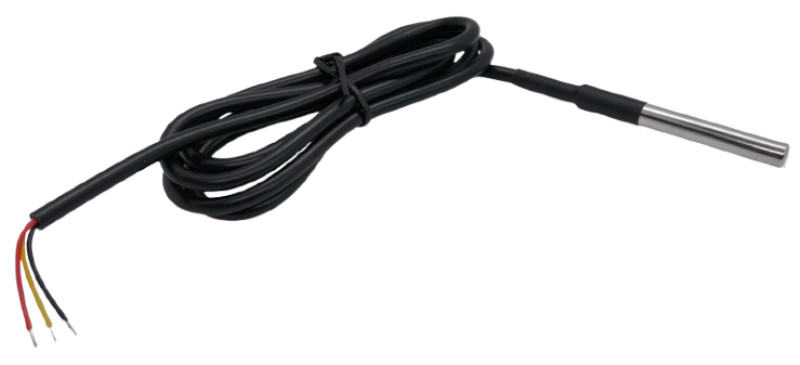
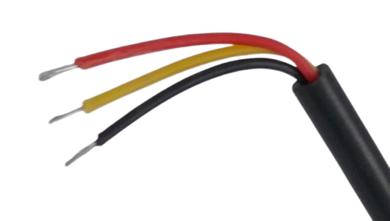
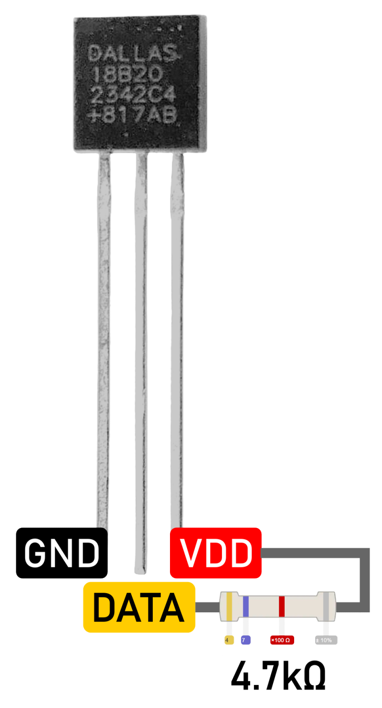
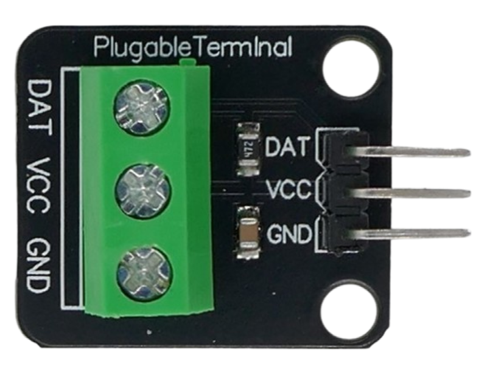
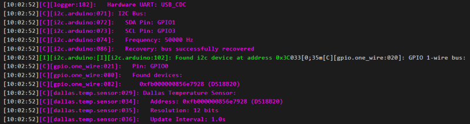
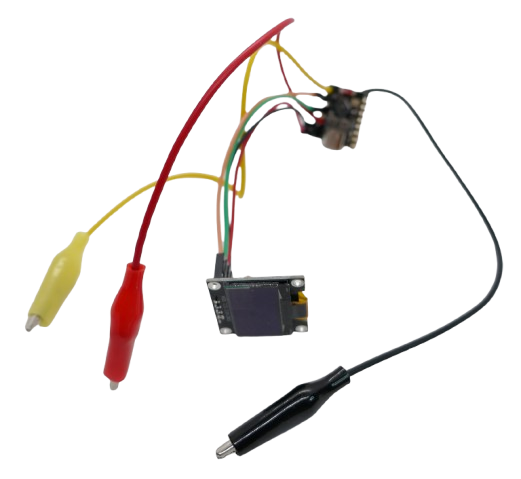
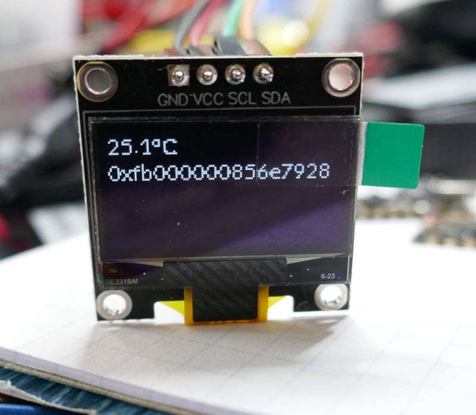
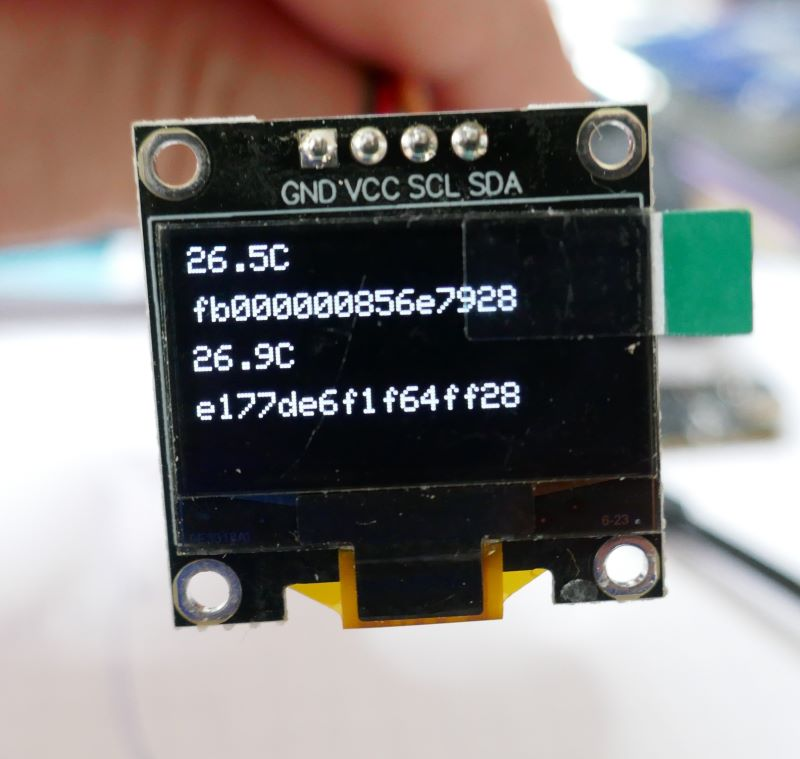

# Dallas One-Wire Temperature Sensor

> Affordable Industrial Temperature Sensors with One-Wire Bus for Monitoring Devices and Environments

## Overview

*Dallas* temperature sensors are affordable and easy-to-use digital sensors that communicate via a **One-Wire Bus**. Each sensor has a **unique hard-coded ID**, allowing multiple sensors to share the same data line while remaining individually addressable. This enables **efficient wiring**, as only a **single GPIO** is needed to communicate with multiple sensors.

The term *Dallas sensor* is still commonly used for this family of sensors, with the **DS18B20** being by far the most popular model.


The DS18B20 supports a **wide temperature range** from **-55°C to +125°C**. Its specified accuracy is **±0.5°C from -10°C to +85°C**, with somewhat lower accuracy toward the extremes of its operating range.

It is highly **energy-efficient**, consuming typically around **1mA** during an active temperature conversion, with a specified maximum of **1.5mA**. In standby, consumption drops into the microamp/sub-microamp range. This makes these sensors suitable for **battery-powered devices** and monitoring critical components.

Dallas sensors are available as ICs in several packages, most commonly the **three-pin TO-92 package**. In addition, many third-party manufacturers sell **waterproof stainless steel probes** containing a DS18B20 or compatible sensor.



> Sensors with a waterproof steel housing are more rugged but also have a much higher thermal mass. Their thermal reponse times can be much longer compared to sensors without such a heavy housing.


### Digital Sensor

Unlike analog temperature sensors, *Dallas* sensors output a **digital signal**, requiring a digital host such as a **microcontroller** for processing. This offers several advantages:

- **One-Wire Protocol:**  

  Dallas sensors use the **One-Wire** communication protocol, meaning they require only a **single data line** in addition to ground. Multiple sensors can be connected in **parallel** on the same bus, as each sensor has a **unique 64-bit serial number** for individual addressing.

- **Selectable Resolution:**  

  Popular models such as the *DS18B20*, *DS1822*, and *DS28EA00* support **adjustable resolution from 9 to 12 bits**. Lower resolutions provide **faster conversions**, while higher resolutions provide **finer temperature increments**.

  Resolution should not be confused with accuracy. For example, selecting 12-bit resolution on a DS18B20 provides temperature steps of **0.0625°C**, but this does not change its specified absolute accuracy of **±0.5°C from -10°C to +85°C**.

- **Digital Error Detection:**  

  The One-Wire protocol includes **CRC checksums** for validating transmitted data. Each sensor's 64-bit ROM address also contains a CRC byte, and the DS18B20 scratchpad data includes another CRC byte that can be used to detect communication errors.

### Conversion Time (Latency)

The **conversion time** is the delay between requesting a temperature measurement and completion of the internal temperature conversion. For the *DS18B20*, it depends on the selected **resolution**:

| Resolution | Temperature Step | Maximum Conversion Time |
|------------|------------------|-------------------------|
| 9-bit      | 0.5°C            | 93.75 ms                |
| 10-bit     | 0.25°C           | 187.5 ms                |
| 11-bit     | 0.125°C          | 375 ms                  |
| 12-bit     | 0.0625°C         | 750 ms                  |

For applications requiring **quick updates**, lower resolutions can therefore be useful.

> [!NOTE]
>
> Conversion time is not the same as **thermal response time**. Even if a digital conversion completes within 94ms, the sensor package itself first needs to reach the temperature of the object being measured. Probe construction, thermal mass, mounting, and thermal contact can therefore dominate the actual response time.


## Wiring

Each standard three-wire sensor has three connections:

| Pin  | Description                           | Typical Color |
|------|---------------------------------------|---------------|
| VCC  | **Power supply (3.0-5.5V)**          | Red           |
| GND  | **Ground**                            | Black         |
| DATA | **Digital data line (One-Wire Bus)** | Yellow        |

Waterproof steel-encased sensors are commonly **pre-wired** with red, black, and yellow leads.

> [!IMPORTANT]
>
> Wire colors on third-party probes are **not standardized**. Never rely solely on the colors when the supplier provides a different pinout.



The **TO-92 package** follows the pinout illustrated below (*viewed from the flat side* of the package):



> [!NOTE]  
>
> The image above also illustrates the placement of the **required external pull-up resistor**. Neither the **waterproof sensor versions** nor the **TO-92 packages** normally include this resistor.

There are **two possible wiring methods**:

| Method       | Description |
|--------------|-------------|
| **Normal Mode** | Connect **VCC** to power, **GND** to ground, and **DATA** to a GPIO of your microcontroller. |
| **Parasitic Mode** | Connect **GND** and **DATA**, and connect the standard DS18B20's **VCC/VDD pin to GND**. The sensor derives its operating power from the **DATA line**. |

### Typical Setup

In a standard setup, the *Dallas* sensor is connected to a power source (**VCC** to *3.3V* or *5V*, **GND** to ground), and the **DATA** line is connected to a GPIO.

The One-Wire DATA line uses an **open-drain interface** and therefore requires an **external pull-up resistor**. A value of approximately **4.7kΩ** is the standard choice.

> [!IMPORTANT]
>
> The external pull-up resistor is part of the electrical design of the One-Wire bus and should not be omitted, even when using only a single sensor. Internal GPIO pull-ups are typically much weaker and should not be relied upon as a substitute.

For a **3.3V microcontroller** such as an ESP32, connect the pull-up resistor between **3.3V and DATA**.

The resistor ensures that the One-Wire bus reliably returns to its **high idle state** after either the host or a sensor releases the line.

For convenience, simple breakout boards are available that include a **4.7kΩ pull-up resistor** and a screw terminal for easy sensor connections.




### Using Parasitic Mode

**Parasitic mode** allows a standard DS18B20 to operate using only **two external wires**: **GND** and **DATA**.

In this mode, the DS18B20's **VDD pin must be connected to GND**. The sensor draws power from **DATA** while the line is high and stores some of this energy in an internal capacitor to sustain operation while the bus is briefly pulled low.

> [!NOTE]
> Dedicated parasite-only variants such as the *DS18B20-PAR* differ physically and do not provide a normal VDD connection. The grounding requirement above refers to the standard DS18B20 when operated in parasite-power mode.

Parasitic operation requires two different forms of pull-up:

- The normal **approximately 4.7kΩ bus pull-up** establishes the normal DATA-high state.
- During a temperature conversion, the sensor can require as much as **1.5mA**, which the normal resistor may not be able to supply while maintaining sufficient voltage. A **strong pull-up** must therefore actively connect the bus to the supply rail during the conversion.

For the DS18B20, this strong pull-up must be enabled within **10µs** after issuing the conversion command and remain active for the duration of the conversion. This is typically implemented using a transistor or MOSFET rather than simply replacing the normal bus resistor with a much lower resistance.

While the strong pull-up is active, the bus is held high and cannot be used for normal One-Wire communication.

#### Potential issues with parasitic mode

- **Too many sensors:**  

  Multiple sensors may perform temperature conversions simultaneously after a broadcast command. The strong pull-up circuit must therefore be capable of supplying the **combined conversion current** of all parasite-powered devices.

- **Long cables:**  

  Long cables add **resistance and capacitance**, slowing signal edges and making it more difficult for the bus to meet One-Wire timing and voltage requirements.

- **Complex bus topology:**  

  Long branches and star-shaped wiring can cause reflections and communication problems. For larger installations, a mostly linear bus with short branches is generally preferable.

- **High temperatures:**  

  For the DS18B20, the manufacturer specifically advises against parasite-powered operation above **+100°C**, because increased leakage currents can make reliable communication difficult.

For critical applications, it is generally best to **avoid parasitic mode** and provide a dedicated power supply via **VCC**.


### 5V or 3.3V?

The DS18B20 operates from **3.0V to 5.5V**, making it suitable for both 3.3V and 5V systems.

With a **3.3V microcontroller** such as an *ESP32*, the simplest and safest configuration is:

- power the sensor from **3.3V**
- connect the **4.7kΩ pull-up resistor to 3.3V**
- connect DATA directly to the ESP32 GPIO

For long cables, powering the sensor itself from **5V** can provide additional supply-voltage margin. When using normal externally powered mode, a DS18B20 can be powered from 5V while its **DATA line is still pulled up to 3.3V**, since the DS18B20 accepts this as a valid logic-high level.

> [!WARNING]
>
> **ESP32 GPIOs are not 5V-tolerant.** Do not pull the DATA line directly to 5V when it is connected to an ESP32 GPIO.

If the One-Wire DATA bus itself needs to operate at **5V**, use an appropriate **bidirectional level shifter or One-Wire bus interface** between the bus and the 3.3V microcontroller.

Increasing the bus voltage alone does not solve all long-cable problems. Cable capacitance, resistance, bus topology, reflections, pull-up strength, and master timing all affect the maximum reliable bus length.


## Sensor ID

Each *Dallas* sensor has a unique internal **64-bit ID number** (ROM address). This allows multiple sensors to share the same **DATA** line while still being individually addressable.

If you are using **only one sensor**, its ID is not necessarily needed. The One-Wire protocol provides a *Skip ROM* command that allows the host to address the only device on the bus without knowing its ID.

When using **multiple sensors** on the same **DATA** line, their individual IDs provide a stable way to identify exactly which physical sensor produced a particular reading.

### Sensor ID Formats

The actual sensor ID is a 64-bit value consisting of 8 bytes:

* **Family Code (8 bits/1 Byte):**    

  * `0x28` **DS18B20** (most common type)

  * `0x10` **DS18S20** (older design)

  * `0x22` **DS1822**

  * `0x42` **DS28EA00**

* **Unique Identifier (48 bits/6 Bytes):**  

  A unique factory-programmed serial number.

* **CRC Checksum (8 bits/1 Byte):**

  *Cyclic Redundancy Check* checksum used to validate the family code and serial number.

On the actual One-Wire bus, the **family-code byte is transmitted first**, followed by the six serial-number bytes and finally the CRC byte.

Software may display these bytes differently. *ESPHome*, for example, represents the complete ROM code as a conventional 64-bit hexadecimal number, with the most significant byte on the left. As a result, the **CRC appears first and the family code last** in the displayed value.

For example:

`0xfb000000856e7928`

Here, the final `28` is the family code and identifies the sensor as a *DS18B20*.

* **Leading Zeroes:** when converting individual bytes to hexadecimal strings, always produce two hexadecimal digits per byte, including leading zeroes. Otherwise, zeroes inside the ID are lost and the resulting value may contain fewer than 16 hexadecimal digits.

  Do not simply pad an incorrectly converted result with zeroes at the beginning: this changes the byte positions rather than restoring the missing zeroes.


### Finding the Sensor ID

The unique 64-bit ROM ID normally **is not printed on the physical IC package**, even on genuine DS18B20 sensors. Package markings identify information such as the device type and manufacturing data, not the individual ROM ID.

The ID therefore needs to be read electronically from the sensor.

*ESPHome* [natively supports](https://esphome.io/components/sensor/dallas_temp.html) *Dallas* sensors. You can configure only the One-Wire bus and inspect the log output: ESPHome automatically scans the bus and reports the addresses of detected devices even before individual temperature sensors are configured.



In the example above, a *Dallas* sensor was found with the **64-bit ID**:

`0xfb000000856e7928`

Since the displayed ID ends with `28`, the device belongs to the `DS18B20` family.

Once identified, you can use this ID in your configuration and address this particular sensor directly.

> [!TIP]
> Using the fixed **64-bit address** is generally preferable when multiple permanent sensors are installed because the ID always remains associated with the same physical sensor. Some software, including ESPHome, can alternatively select sensors by their detected **index**, but index assignments can change when sensors are added, removed, or replaced.


## Coding

*Dallas* sensors are supported both by *C++ Arduino Libraries* and *ESPHome*:

* **ESPHome:**      

  Easy to configure and automatically handles most of the underlying One-Wire communication. ESPHome supports a variety of compatible microcontroller platforms.

* **C++ DallasTemperature Library:**    

  Provides granular control and dynamic access to sensor addresses and multiple connected devices. Supports a wide range of Arduino-compatible microcontrollers.


> [!IMPORTANT]
>
> Regardless of the software library used, the **external One-Wire pull-up resistor is an electrical requirement**. Do not rely on differences in software behavior to compensate for incorrect bus wiring.

To illustrate both approaches, I create a *Dallas Sensor Tester* device that can test unknown *Dallas* sensors and display their IDs and current temperature readings.

Here is the parts list:

* **Microcontroller:** any supported microcontroller will do. If you want to use *ESPHome*, make sure you use a [supported microcontroller](https://esphome.io/components/).

* **OLED Display:** a cheap *128x64* SSD1306-based monochrome OLED display to quickly display the found sensors. You can easily change the code to output to the serial interface and display the information in a terminal window instead.

* **Pullup Resistor:** a *4.7kΩ* resistor connected between **3.3V** and **DATA** when using a 3.3V microcontroller such as the ESP32-C3.




### Dallas Sensor Tester (ESPHome)


This *ESPHome configuration* uses [ESP32-C3 SuperMini](https://done.land/components/microcontroller/families/esp/esp32/developmentboards/esp32-c3/c3supermini/). Adjust the GPIOs to match other development boards. 

<details><summary>ESPHome Configuration</summary><br/>

```yaml
# GPIO   Usage
# =======================================
#  1     SDA I2C
#  3     SCL I2C
#  0     Dallas Sensor Input

one_wire:
  - platform: gpio
    pin: GPIO0
    id: one_wire_bus

sensor:
  - platform: dallas_temp
    one_wire_id: one_wire_bus
    name: "Dallas Sensor"
    id: dallas_sensor
    update_interval: 1s

# Enable I2C for OLED Display
i2c:
  sda: GPIO1
  scl: GPIO3
  scan: true  

# Configure the OLED Display
display:
  - platform: ssd1306_i2c
    model: "SSD1306 128x64"
    address: 0x3C
    update_interval: 1s
    lambda: |-
      int y_offset = 0;
      it.printf(0, y_offset, id(lato_12), "%.1f°C", id(dallas_sensor).state);
      y_offset += 14;

      // Get the sensor's unique address and display it
      std::string address = id(dallas_sensor).get_address_name();
      it.printf(0, y_offset, id(lato_12), "%s", address.c_str());

# Load Google Font (Lato)
font:
  - file: "gfonts://Lato"
    id: lato_12
    size: 12
```

</details>


> [!IMPORTANT]
>
> In 2024, *ESPHome* [fundamentally changed](https://esphome.io/components/sensor/dallas_temp.html) its *Dallas* sensor support. Starting with ESPHome 2024.6, the former `dallas` component was replaced by the generic `one_wire` bus and the `dallas_temp` sensor platform. Older configuration examples may therefore no longer work without adjustment.

Current versions of *ESPHome* can work with multiple sensors on the same One-Wire bus in two ways:

- **Address:** specify the unique 64-bit sensor address. This is the most reliable method because the identity remains tied to the physical sensor.

- **Index:** specify the sensor's zero-based `index`. This avoids manually entering addresses, but the index can change when sensors are added, removed, or replaced.

If there is only **one sensor on the bus**, neither an address nor an index needs to be specified.

ESPHome can also **scan the entire One-Wire bus and report all detected IDs in its log** without defining individual temperature sensors first.

The simple tester configuration above intentionally defines only a single anonymous sensor. It is therefore convenient for connecting and identifying **one unknown sensor at a time**.

Once you connect an unknown *Dallas* sensor to the device and power it on, it displays the current sensor temperature and its sensor ID.





### Dallas Sensor Tester (C++/platformio)

The same *Dallas sensor tester* functionality can be implemented using raw C++ and *PlatformIO*. This provides more direct access to the One-Wire bus and makes it straightforward to enumerate all connected sensors dynamically.


<details><summary>Here is the platformio.ini code</summary><br/>

```ini
[env:esp32-c3-devkitm-1]
platform = espressif32
board = esp32-c3-devkitm-1
board_build.mcu = esp32c3
framework = arduino

build_flags =
    -D ARDUINO_USB_MODE=1
    -D ARDUINO_USB_CDC_ON_BOOT=1

monitor_speed = 115200

lib_deps =
    paulstoffregen/OneWire @ ^2.3.8
    milesburton/DallasTemperature @ ^4.0.6
    adafruit/Adafruit SSD1306 @ ^2.5.17
    adafruit/Adafruit GFX Library @ ^1.12.6
```

</details>

This `platformio.ini` uses the [ESP32-C3 SuperMini](https://done.land/components/microcontroller/families/esp/esp32/developmentboards/esp32-c3/c3supermini/). Adjust the first group of lines to use other microcontroller boards.

#### Dependencies

The remaining lines in `platformio.ini` define the dependencies (external libraries) used by the code:

* **OneWire/DallasTemperature:** Support for the *Dallas* sensors and the underlying *One-Wire* data transmission protocol.

* **Adafruit:** Support for the [SSD1306 OLED display](https://done.land/components/humaninterface/display/oled/ssd1306/). The *Adafruit GFX* library provides the common graphics interface used by many Adafruit display drivers.

> [!TIP]
>
> The libraries are *automatically downloaded* by *PlatformIO* once you add them to the `lib_deps` key in `platformio.ini`. 

#### Source Code

Here is the *C++* source code for the *Dallas sensor tester device*:

<details><summary>C++ source code for Dallas</summary><br/>

```cpp
#include <Wire.h>
#include <OneWire.h>
#include <DallasTemperature.h>
#include <Adafruit_GFX.h>
#include <Adafruit_SSD1306.h>

// Pin definitions
#define ONE_WIRE_BUS 0  // GPIO0 to connect Dallas DATA pin
#define SDA_PIN 1       // OLED display
#define SCL_PIN 3       // OLED display

// Initialize OneWire instance and DallasTemperature library
OneWire oneWire(ONE_WIRE_BUS);
DallasTemperature sensors(&oneWire);

// Initialize the OLED display
#define SCREEN_WIDTH 128
#define SCREEN_HEIGHT 64
#define OLED_RESET -1
#define SSD1306_ADDRESS 0x3C

Adafruit_SSD1306 display(SCREEN_WIDTH, SCREEN_HEIGHT, &Wire, OLED_RESET);

void setup() {
  // Start serial communication
  Serial.begin(115200);

  // Initialize the OneWire and DallasTemperature libraries
  sensors.begin();

  // Initialize the I2C bus with custom SDA and SCL pins
  Wire.begin(SDA_PIN, SCL_PIN);

  // Initialize the OLED display
  if (!display.begin(SSD1306_SWITCHCAPVCC, SSD1306_ADDRESS)) {
    Serial.println(F("SSD1306 allocation failed"));
    while (true);
  }

  // Clear the display
  display.clearDisplay();

  // Set text properties for display
  display.setTextSize(1);
  display.setTextColor(SSD1306_WHITE);
  display.setCursor(0, 0);

  // Display a starting message
  display.println(F("Scanning for sensors..."));
  display.display();

  delay(2000);
}

void loop() {
  // Request temperature conversions
  sensors.requestTemperatures();

  // Display the found sensor data
  display.clearDisplay();
  display.setCursor(0, 0);

  DeviceAddress sensorAddress;
  int sensorCount = sensors.getDeviceCount();
  int y_offset = 0;

  if (sensorCount > 0) {
    for (int i = 0; i < sensorCount; i++) {
      if (sensors.getAddress(sensorAddress, i)) {
        float temperature = sensors.getTempC(sensorAddress);

        if (temperature == DEVICE_DISCONNECTED_C) {
          display.setCursor(0, y_offset);
          display.print("Disconnected");
          y_offset += 14;
        } else {
          display.setCursor(0, y_offset);
          display.printf("%.1fC", temperature);
          y_offset += 14;

          display.setCursor(0, y_offset);

          char address[17];

          // Format the sensor address as an ESPHome-style hexadecimal string
          for (uint8_t j = 0; j < 8; j++) {
            sprintf(address + j * 2, "%02x", sensorAddress[7 - j]);
          }

          display.print(address);
          y_offset += 14;
        }
      }
    }

    display.display();
  } else {
    display.println("No sensors found");
    display.display();
  }

  delay(5000);
}
```

</details>

This code is much more *low level* than the *ESPHome configuration* and requires more detail work, such as converting the binary sensor IDs to strings in the desired byte order.

However, it also provides direct access to the discovered devices, so the code can dynamically enumerate **all sensors detected on the bus**.

The small 128x64 OLED obviously cannot display an unlimited number of sensors at the same time. If many sensors are connected, add scrolling or pagination, or send the complete list to the serial interface instead.



Note how both sensor IDs in this example end with `28`, indicating that both connected *Dallas* sensors belong to the `DS18B20` family.

> [!IMPORTANT]
>
> A correctly sized **external pull-up resistor is required regardless of whether ESPHome or a C++ library is used**. If one software implementation appears to work without it, this should not be interpreted as reliable or specification-compliant operation.


## Common Error Readings

When experimenting with DS18B20 sensors, two unusual values are particularly useful for troubleshooting:

- **85°C:**  

  `85°C` is the DS18B20's power-up temperature-register value. Repeated or unexpected readings of exactly 85°C can therefore indicate that the sensor has reset, lost power, or that the software is reading the temperature register before a new conversion has completed.

- **-127°C:**  

  The popular *DallasTemperature* C++ library uses approximately `-127°C` as its `DEVICE_DISCONNECTED_C` error value. This is a software error indication rather than an actual DS18B20 measurement.


## Sensor Models

The most popular *Dallas* sensor model is the `DS18B20`, but other compatible models exist.

| **Model**     | ID ends with | **Temp Range**  | **Accuracy / Features** | **Remarks** |
|---------------|--------------|-----------------|-------------------------|-------------|
| **DS18B20**   | `28` | -55°C to +125°C | ±0.5°C from -10°C to +85°C, selectable 9-12 bit resolution | Most popular model; third-party waterproof probes widely available |
| **DS18S20**   | `10` | -55°C to +125°C | ±0.5°C from -10°C to +85°C, fixed 9-bit temperature register, 750ms conversion | Older design, but still available |
| **DS1822**    | `22` | -55°C to +125°C | ±2°C from -10°C to +85°C, selectable 9-12 bit resolution | Lower-cost, lower-accuracy alternative compatible with DS18B20 software |
| **DS28EA00**  | `42` | -40°C to +85°C  | Selectable 9-12 bit resolution, two programmable I/O pins, sequence-detection function | Designed especially for larger distributed sensor networks |

### ⚠️ Caveat: DS18S20

The *DS18S20* is an **older design** with a fixed **9-bit temperature register**. Unlike a DS18B20 configured for 9-bit operation, however, it does **not** provide the corresponding short conversion time.

- The *DS18S20* requires up to **750ms per conversion** despite its 9-bit temperature register.

- Its raw temperature value has **0.5°C increments**.

- Additional information in its `COUNT_REMAIN` and `COUNT_PER_C` registers can be used by software to calculate finer temperature resolution than the raw 9-bit value alone provides.

- Its specified accuracy of **±0.5°C from -10°C to +85°C** is comparable to the DS18B20 in that range, so its main disadvantage is not lower basic accuracy but its **fixed long conversion time and less convenient data format**.


## Package Types

Dallas temperature sensor ICs are available in several semiconductor packages. In DIY applications, however, the two forms encountered most frequently are the bare **TO-92 IC** and a third-party **stainless steel probe assembly** containing a DS18B20-compatible sensor.

### Common Packages

| **Package**                 | **Description**                                    | **Advantages**                                      | **Common Models**        |
|-----------------------------|----------------------------------------------------|-----------------------------------------------------|--------------------------|
| **TO-92**                   | Small, three-pin plastic IC package                | Compact, inexpensive, easy to integrate             | DS18B20, DS18S20, DS1822 |
| **Stainless Steel Probe**   | Third-party sealed metal enclosure with cable      | Robust, convenient for liquids and remote sensing   | Usually DS18B20 or compatible device |


> [!NOTE]
> Stainless steel probes are **not an official DS18B20 package type**. They are assemblies manufactured by third parties, and their internal sensor, cable pinout, sealing quality, and temperature rating can therefore vary considerably.


### TO-92 Package

A cost-effective option, often used for measuring **electronics temperature**. Its small size gives it relatively low thermal mass, but the plastic package and quality of the thermal contact determine how quickly it follows the temperature of the measured object.


- **Appearance:** Small black transistor-like package (similar in shape to a *2N2222*)

- **Size:** ~4.7mm x 4.0mm x 5.0mm (excluding leads)

- **Mounting Tips:**

  - For surface measurements, ensure **good direct thermal contact**.

  - Thermal paste can improve contact when the sensor is mechanically held against a surface.

  - **Thermally conductive adhesive or epoxy** can provide both thermal coupling and mechanical attachment.

  - **Thermal adhesive tape** can be convenient for attaching the sensor to a chassis, heatsink, battery cell, or other surface.

- **Disadvantages:**

  - Not inherently waterproof or mechanically protected

  - Exposed leads may require electrical insulation

  - Measured surface temperature can lag behind the actual component junction temperature


### Stainless Steel Probe (Waterproof)

Stainless steel probes are designed for **harsh or wet environments** and provide a convenient mechanically protected sensor assembly.


- **Appearance:** Sealed metal cylinder with a cable

- **Typical Sizes:** approximately 6mm diameter and 30-50mm length

- **Advantages:**

  - Mechanically robust

  - Convenient for liquids, pipes, outdoor installations, and remote temperature measurements

  - Cable and sensor are supplied as one finished assembly

- **Caveats:**

  - The metal housing adds **thermal mass**, so these probes can respond substantially more slowly than a bare TO-92 sensor

  - The actual waterproofing and temperature rating depend on the third-party manufacturer

  - Not well suited for direct PCB mounting

  - May be **overkill** when monitoring rapidly changing temperatures inside compact electronic devices

> [!IMPORTANT]
> Do not assume that a stainless steel probe responds faster simply because metal conducts heat better than plastic. The additional metal, potting compound, and air gaps inside the probe can substantially increase its **thermal time constant**. For fast protection applications, a small sensor with excellent direct thermal contact can be preferable.


> Tags: Temperature Sensor, Digital Temperature Sensor, Dallas, One-Wire, DS18B20, DS18S20, DS1822, DS28EA00, Parasite Power, Parasitic Power, Sensor ID, Conversion Time, Thermal Response Time, Stainless Steel Probe

[Visit Page on Website](https://done.land/components/data/sensor/temperature/dallas?764001031305251116) - created 2025-03-04 - last edited 2026-09-09
