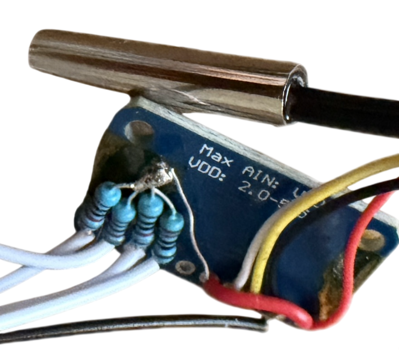
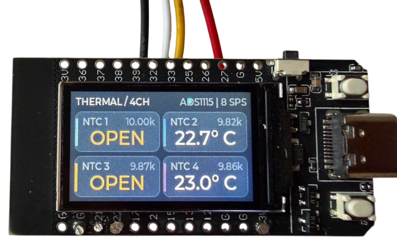
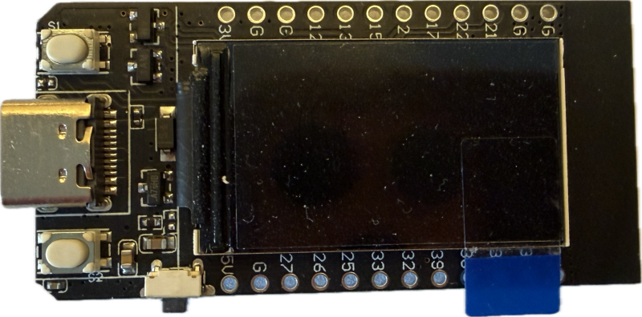
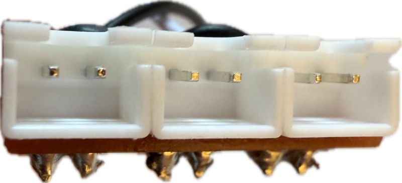
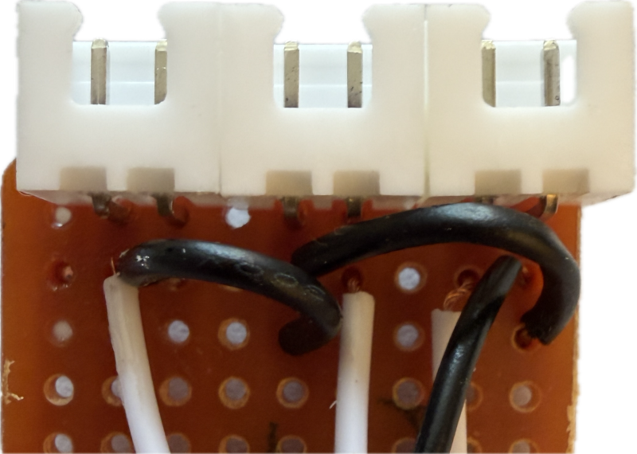
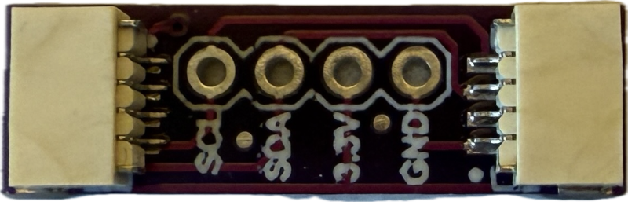
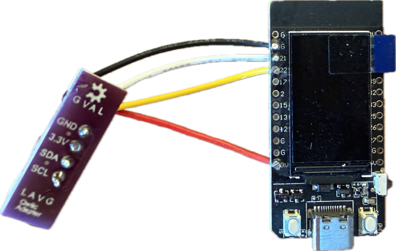
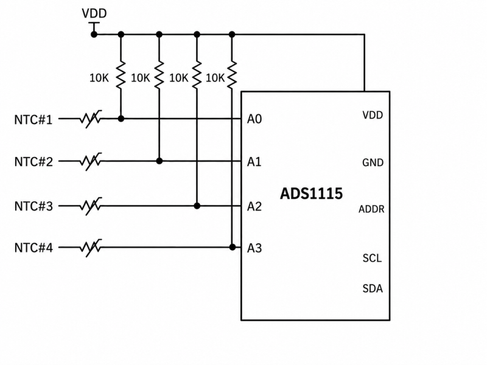
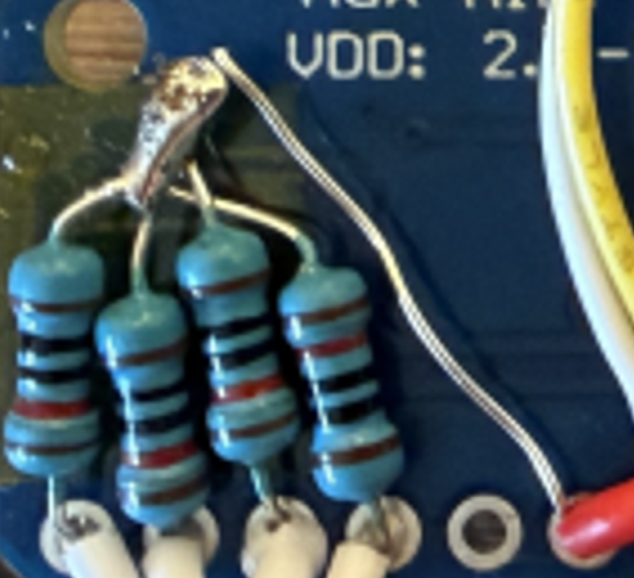
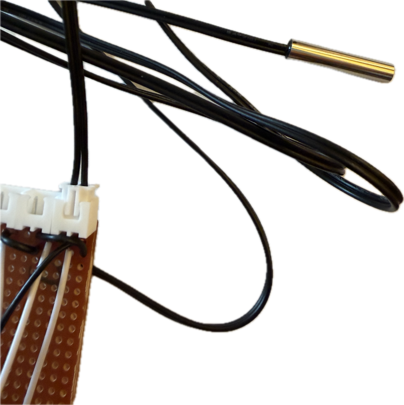

 
# ADS1115 4-Port I2C Temperature Sensor

> Versatile 4-Probe Temperature Sensor

Adding a NTC temperature sensor directly to a microcontroller adds complexity and occupies one precious GPIO per sensor.

A smarter approach uses a cost-efficient 4-channel ADS1115 board that handles up to four NTC probes and communicates through I2C - no additional GPIOs required.



Connecting a microcontroller to this 4-probe sensor is now very simple. All you need is a I2C interface where you can daisy-chain all your peripherals. No more fiddling with NTC sensors directly.





## Overview
In this project, I used a classic and cheap [Lilygo T-Display ESP32](https://done.land/components/microcontroller/families/esp/esp32/developmentboards/esp32s/t-display/) ESP32 dev board. It just serves as a testing device and can be replaced by any mcu that exposes an I2C interface.




The purpose of this project is to provide you with (a) insight into how to get started with NTC probes, and (b) hooking the NTC sensors up to a ADS1115 which then serves as a generic I2C 4-probe temperatur sensor.

From here, you can easily adapt. Use a T-Display board as I did, and run my firmware, or discard on-screen displays altogether and just utilize the temperature readings you get from the *ADS1115* via *I2C* in your own setup.

For example, your microcontroller could control MOSFETs to create temperature-controlled switches for heaters or air conditioning, or build your own temperature-controlled PWM fan. All of this is beyond the scope of this project. In this project, I solely focus on how to turn simple NTC probes into a I2C sensor device.


## Bill of Materials

This is what you need:

* 1x ADS1115 ADC breakout board    

  

* up to 4 NTC temperature probes    


* up to 4 resistors (one per probe, value depends on NTC probe)

The total cost of this should be less than five bucks when shopping wisely at AliExpress.

### Extras

If you want the probes to be detachable, add up to 4 male JST-XH 2.54 mm two-pole connectors (one per probe).



> [!TIP]
> While you can solder a female JST-XH 2.54 mm plug to the probes yourself, these probes are often available with a connector already in place.



## Picking NTC Type

I used 10K NTCs of type B3435, which are widely available and cover the typical temperature range nicely.

If you haven't purchased NTC sensors already, you may want to look at [B-Values](https://done.land/components/data/sensor/temperature/ntc/#beta-value-b-value) and pick a B-value best fitting your specific use case.

> [!NOTE]
> While you can use 100K NTC probes as well, or any other nominal resistance for that matter, 10K types are [best-suited for DIY projects](https://done.land/components/data/sensor/temperature/ntc/#ntc-types).

### Caveat: Stainless Steel Probes

I tested both simple unenclosed NTC sensors and waterproof stainless steel-enclosed variants. The differences in thermal response time were substantial.


If you want the sensor reading to follow temperature changes within seconds, use unenclosed "naked" sensors.

Use steel-enclosed NTCs only in applications where temperature changes gradually and slowly, or where a delay of several tens of seconds is acceptable.


Specifically, when I touched both sensors with my hand, the unenclosed probe responded immediately and reached approximately body temperature within seconds. The steel-enclosed probe responded much more slowly and took almost half a minute to approach the same temperature.

When I then removed the probes from my hand, the unenclosed probe again responded immediately and showed a rapidly decreasing temperature. The steel-enclosed probe retained the elevated temperature for some time and then cooled much more slowly, clearly illustrating the thermal mass of the enclosure: it takes time both to heat up and to cool down.


## Preparing Parts

I wanted to use Qwiic/JST-SH 1.0 mm connectors for I2C, so I first connected a Qwiic breakout board to the ESP32.



You do not need to do this and can use different connectors or direct wire connections as well. Qwiic, however, has become a de facto standard for I2C connections and makes prototyping with I2C peripherals particularly simple.


### 1. GPIOs

On the ESP32 board, I used these pins for I2C:

| GPIO | Description | Color |
| --- | --- | --- |
| 21 | SDA | white |
| 22 | SCL | yellow |
| GND | GND | black |
| VCC | 3.3V | red |




### 2. ADS1115

All components are added to the ADS1115 side to keep it modular. This way, the MCU just needs to expose I2C and has no other dependencies.


Here are the pin assignments for the ADS1115:

| Pin Label | Description | Color | Connect to ESP32 |
| --- | --- | --- | --- |
| `VDD` | 3.3V | red | `3V` |
| `GND` | GND | black | `G` |
| `SCL` | I2C Clock | yellow | `22` |
| `SDA` | I2C Data | white | `21` |
| ADDR | I2C Address, connected to VDD | red |
| ALRT | unconnected | | 
| A0 | first probe | white |
| A1 | second probe | white |
| A2 | third probe | white |
| A3 | fourth probe | white |

#### a) Exposing I2C Interface

I soldered a JST-SH 1.0 mm connector to pins `VDD`, `GND`, `SCL`, and `SDA`. Alternately, use different connectors or direct wire connections.

> [!IMPORTANT]
> I2C requires pull-up resistors on `SDA` and `SCL`. Most ADS1115 breakout boards already include them, but this should be verified for the particular board you are using.


#### b) Setting I2C Address

The `ADDR` pin determines the I2C address for the ADS1115 and should not be left floating. Here are the available assignments:

| `ADDR` | I²C address |
|---|---|
| `GND` | 0x48 |
| `VDD` | 0x49 |
| `SDA` | 0x4A |
| `SCL` | 0x4B |

For convenience, I chose to connect `ADDR` to `VDD` using one of the fixed resistor legs that are also connected to `VDD`, saving me an extra wire. 


#### c) Adding Fixed Resistors

You need one resistor per NTC probe. As a default, each resistor should match the NTC nominal resistance: if you chose 10K NTC probes, also use 10K resistors. 

You can always [optimize the resistor value](https://done.land/components/data/sensor/temperature/ntc/#improving-resolution) depending on the temperature range you are most interested in.


> [!TIP]
> Unless you use expensive precision resistors, measure their actual resistance with a multimeter **before** soldering them. Later, you can use these values in the firmware to improve accuracy. 




1. Solder both one resistor and one wire to each of the ADS1115 channel pins (`A0`, `A1`, `A2`, `A3`). 

    

2. Connect the other ends of all resistors together, and connect them to `VDD` (3.3V, positive rail).

In my example, I soldered one of the resistor legs to `ADDR`, then used a jumper wire to connect `ADDR` to `VDD`, setting the ADS1115 I2C address to `0x49` and connecting the fixed resistor side of the voltage dividers to `VDD` without extra wire.


## Connecting NTC Probes

Connect each NTC probe to one of the probe wires coming from the ADS1115 on one end, and to `GND` on the other end. Polarity does not matter.

Together with the fixed resistor connected to `VDD`, each NTC forms a voltage divider. As the NTC resistance changes with temperature, the voltage at the corresponding ADS1115 input changes as well.

If you want detachable probes, connect one of the wires coming from the ADS1115 to a JST-XH 2.54 mm male connector, and the other pin of the connector to `GND`:


You can then easily connect probes with a matching JST connector to one of these four ports.



## Firmware

I used PlatformIO as development environment. [Download the complete project here](materials/tdisplay_ntc_controller.zip).

### platformio.ini
This is the configuration I used:

````
[env:t-display]
platform = espressif32 @ 6.13.0
board = esp32dev
framework = arduino

monitor_speed = 115200
upload_speed = 921600

; Classic LilyGO/TTGO T-Display ESP32 with 16 MB flash
board_build.flash_size = 16MB
board_upload.flash_size = 16MB
board_build.partitions = partitions_16mb.csv

lib_deps =
    lvgl/lvgl@8.3.11
    bodmer/TFT_eSPI@2.5.43

build_flags =
    ; Configure LVGL globally through compiler defines.  This is intentional:
    ; it avoids lv_conf.h include-path differences between the application and
    ; LVGL's own C translation units under PlatformIO.
    -D LV_CONF_SKIP=1
    -D LV_COLOR_DEPTH=16
    -D LV_COLOR_16_SWAP=0
    -D LV_MEM_CUSTOM=0
    -D LV_MEM_SIZE=49152U
    -D LV_USE_LOG=0
    -D LV_FONT_MONTSERRAT_12=1
    -D LV_FONT_MONTSERRAT_14=1
    -D LV_FONT_MONTSERRAT_24=1

    ; TFT_eSPI configuration for the classic LilyGO/TTGO T-Display 135x240 ST7789V
    -D USER_SETUP_LOADED=1
    -D ST7789_DRIVER=1
    -D TFT_SDA_READ=1
    -D TFT_WIDTH=135
    -D TFT_HEIGHT=240
    -D CGRAM_OFFSET=1
    -D TFT_MOSI=19
    -D TFT_SCLK=18
    -D TFT_CS=5
    -D TFT_DC=16
    -D TFT_RST=23
    -D TFT_BL=4
    -D TFT_BACKLIGHT_ON=HIGH
    -D LOAD_GLCD=1
    -D LOAD_FONT2=1
    -D SPI_FREQUENCY=40000000
    -D SPI_READ_FREQUENCY=6000000
````

Here is the firmware I used for testing:

<details><summary>C++ Temperature Controller Firmware</summary><br/>

````cpp
#include <Arduino.h>
#include <Wire.h>
#include <TFT_eSPI.h>
#include <lvgl.h>
#include <math.h>

#include "config.h"

// -----------------------------------------------------------------------------
// Hardware
// -----------------------------------------------------------------------------

TFT_eSPI tft;

static lv_disp_draw_buf_t drawBuffer;
static lv_color_t drawPixels[Config::SCREEN_W * 20];

// -----------------------------------------------------------------------------
// ADS1115 register-level driver
// -----------------------------------------------------------------------------

namespace ADS1115 {

constexpr uint8_t REG_CONVERSION = 0x00;
constexpr uint8_t REG_CONFIG     = 0x01;

// PGA = +/-4.096 V -> 125 uV/LSB.
constexpr float LSB_VOLTS = 0.000125f;

// ADS1115 config bits used here:
// OS=1            start single conversion
// MUX=100..111    AIN0..AIN3 single-ended
// PGA=001         +/-4.096 V
// MODE=1          single-shot
// DR=000          8 samples/s (maximum internal oversampling/filtering)
// COMP_QUE=11     comparator disabled
constexpr uint16_t CONFIG_BASE =
    (1u << 15) |      // OS
    (1u << 9)  |      // PGA = +/-4.096 V
    (1u << 8)  |      // single-shot mode
    0x0003u;          // comparator disabled

bool writeRegister(uint8_t reg, uint16_t value) {
    Wire.beginTransmission(Config::ADS1115_ADDRESS);
    Wire.write(reg);
    Wire.write(static_cast<uint8_t>(value >> 8));
    Wire.write(static_cast<uint8_t>(value & 0xFF));
    return Wire.endTransmission() == 0;
}

bool readRegister(uint8_t reg, uint16_t &value) {
    Wire.beginTransmission(Config::ADS1115_ADDRESS);
    Wire.write(reg);
    if (Wire.endTransmission(false) != 0) {
        return false;
    }

    if (Wire.requestFrom(static_cast<int>(Config::ADS1115_ADDRESS), 2) != 2) {
        return false;
    }

    value = (static_cast<uint16_t>(Wire.read()) << 8) |
            static_cast<uint16_t>(Wire.read());
    return true;
}

bool probe() {
    Wire.beginTransmission(Config::ADS1115_ADDRESS);
    return Wire.endTransmission() == 0;
}

bool startSingleEnded(uint8_t channel) {
    if (channel > 3) return false;
    const uint16_t mux = static_cast<uint16_t>(0x04u + channel) << 12;
    return writeRegister(REG_CONFIG, CONFIG_BASE | mux);
}

bool conversionReady(bool &ready) {
    uint16_t cfg = 0;
    if (!readRegister(REG_CONFIG, cfg)) return false;
    ready = (cfg & 0x8000u) != 0;
    return true;
}

bool readConversion(int16_t &raw) {
    uint16_t value = 0;
    if (!readRegister(REG_CONVERSION, value)) return false;
    raw = static_cast<int16_t>(value);
    return true;
}

} // namespace ADS1115

// -----------------------------------------------------------------------------
// Temperature model
// -----------------------------------------------------------------------------

enum class ProbeState : uint8_t {
    Unknown,
    Valid,
    Open,
    Short,
    AdcError
};

struct ProbeReading {
    int16_t raw = 0;
    float voltage = NAN;
    float resistance = NAN;
    float temperature = NAN;
    float filteredTemperature = NAN;
    ProbeState state = ProbeState::Unknown;
};

static ProbeReading probes[4];

static void calculateProbe(uint8_t channel, int16_t raw) {
    ProbeReading &p = probes[channel];
    p.raw = raw;

    if (raw < 0) {
        p.state = ProbeState::AdcError;
        return;
    }

    p.voltage = static_cast<float>(raw) * ADS1115::LSB_VOLTS;

    // Fault detection leaves plenty of margin for the useful B3435 temperature range.
    if (p.voltage < Config::DIVIDER_VCC * 0.015f) {
        p.state = ProbeState::Short;
        return;
    }
    if (p.voltage > Config::DIVIDER_VCC * 0.985f) {
        p.state = ProbeState::Open;
        return;
    }

    const float denominator = Config::DIVIDER_VCC - p.voltage;
    if (denominator <= 0.0f) {
        p.state = ProbeState::Open;
        return;
    }

    // Fixed resistor -> VCC, NTC -> GND:
    // Vout = VCC * Rntc / (Rfixed + Rntc)
    p.resistance = Config::FIXED_R_OHM[channel] * p.voltage / denominator;

    if (!isfinite(p.resistance) || p.resistance <= 0.0f) {
        p.state = ProbeState::AdcError;
        return;
    }

    const float invT =
        (1.0f / Config::NTC_T0_K) +
        (logf(p.resistance / Config::NTC_R25_OHM) / Config::NTC_BETA_K);

    p.temperature = (1.0f / invT) - 273.15f;

    if (!isfinite(p.temperature)) {
        p.state = ProbeState::AdcError;
        return;
    }

    if (!isfinite(p.filteredTemperature)) {
        p.filteredTemperature = p.temperature;
    } else {
        p.filteredTemperature +=
            Config::EMA_ALPHA * (p.temperature - p.filteredTemperature);
    }

    p.state = ProbeState::Valid;
}

// -----------------------------------------------------------------------------
// LVGL display
// -----------------------------------------------------------------------------

static lv_obj_t *tempLabels[4] = {nullptr, nullptr, nullptr, nullptr};
static lv_obj_t *statusLabel = nullptr;
static lv_obj_t *statusDot = nullptr;

static const uint32_t accentColors[4] = {
    0x35D0BA,
    0x5EA2FF,
    0xFFB547,
    0xC77DFF
};

static void displayFlush(lv_disp_drv_t *disp,
                         const lv_area_t *area,
                         lv_color_t *colorP) {
    const uint32_t width = area->x2 - area->x1 + 1;
    const uint32_t height = area->y2 - area->y1 + 1;

    tft.startWrite();
    tft.setAddrWindow(area->x1, area->y1, width, height);
    tft.pushColors(reinterpret_cast<uint16_t *>(&colorP->full),
                   width * height,
                   true);
    tft.endWrite();

    lv_disp_flush_ready(disp);
}

static lv_obj_t *makeLabel(lv_obj_t *parent,
                           const char *text,
                           const lv_font_t *font,
                           uint32_t color) {
    lv_obj_t *label = lv_label_create(parent);
    lv_label_set_text(label, text);
    lv_obj_set_style_text_font(label, font, LV_PART_MAIN);
    lv_obj_set_style_text_color(label, lv_color_hex(color), LV_PART_MAIN);
    return label;
}

static void createCard(uint8_t channel, int x, int y) {
    lv_obj_t *card = lv_obj_create(lv_scr_act());
    lv_obj_remove_style_all(card);
    lv_obj_set_pos(card, x, y);
    lv_obj_set_size(card, 112, 50);
    lv_obj_clear_flag(card, LV_OBJ_FLAG_SCROLLABLE);

    lv_obj_set_style_bg_color(card, lv_color_hex(0x151A23), LV_PART_MAIN);
    lv_obj_set_style_bg_opa(card, LV_OPA_COVER, LV_PART_MAIN);
    lv_obj_set_style_radius(card, 9, LV_PART_MAIN);
    lv_obj_set_style_border_width(card, 1, LV_PART_MAIN);
    lv_obj_set_style_border_color(card, lv_color_hex(0x252C38), LV_PART_MAIN);

    lv_obj_t *accent = lv_obj_create(card);
    lv_obj_remove_style_all(accent);
    lv_obj_set_pos(accent, 0, 8);
    lv_obj_set_size(accent, 3, 34);
    lv_obj_set_style_bg_color(accent, lv_color_hex(accentColors[channel]), LV_PART_MAIN);
    lv_obj_set_style_bg_opa(accent, LV_OPA_COVER, LV_PART_MAIN);
    lv_obj_set_style_radius(accent, 3, LV_PART_MAIN);

    char channelText[8];
    snprintf(channelText, sizeof(channelText), "NTC %u", channel + 1);
    lv_obj_t *channelLabel = makeLabel(card, channelText, &lv_font_montserrat_12, 0x8D98AA);
    lv_obj_set_pos(channelLabel, 9, 4);

    char resistorText[12];
    snprintf(resistorText, sizeof(resistorText), "%.2fk", Config::FIXED_R_OHM[channel] / 1000.0f);
    lv_obj_t *rLabel = makeLabel(card, resistorText, &lv_font_montserrat_12, 0x566274);
    lv_obj_align(rLabel, LV_ALIGN_TOP_RIGHT, -6, 4);

    tempLabels[channel] = makeLabel(card, "--.-\xC2\xB0 C", &lv_font_montserrat_24, 0xF3F6FA);
    lv_obj_align(tempLabels[channel], LV_ALIGN_BOTTOM_MID, 0, -3);
}

static void createUi() {
    lv_obj_t *screen = lv_scr_act();
    lv_obj_set_style_bg_color(screen, lv_color_hex(0x0B0E14), LV_PART_MAIN);
    lv_obj_set_style_bg_opa(screen, LV_OPA_COVER, LV_PART_MAIN);
    lv_obj_clear_flag(screen, LV_OBJ_FLAG_SCROLLABLE);

    lv_obj_t *title = makeLabel(screen, "THERMAL / 4CH", &lv_font_montserrat_12, 0xD9E0EA);
    lv_obj_set_pos(title, 7, 5);

    statusDot = lv_obj_create(screen);
    lv_obj_remove_style_all(statusDot);
    lv_obj_set_size(statusDot, 6, 6);
    lv_obj_set_style_radius(statusDot, LV_RADIUS_CIRCLE, LV_PART_MAIN);
    lv_obj_set_style_bg_color(statusDot, lv_color_hex(0x5B6472), LV_PART_MAIN);
    lv_obj_set_style_bg_opa(statusDot, LV_OPA_COVER, LV_PART_MAIN);
    lv_obj_set_pos(statusDot, 155, 9);

    statusLabel = makeLabel(screen, "ADS1115 | 8 SPS", &lv_font_montserrat_12, 0x697487);
    lv_obj_align(statusLabel, LV_ALIGN_TOP_RIGHT, -6, 5);

    createCard(0, 6,   25);
    createCard(1, 122, 25);
    createCard(2, 6,   80);
    createCard(3, 122, 80);
}

static void setAdcUiState(bool online) {
    if (online) {
        lv_label_set_text(statusLabel, "ADS1115 | 8 SPS");
        lv_obj_set_style_text_color(statusLabel, lv_color_hex(0x697487), LV_PART_MAIN);
        lv_obj_set_style_bg_color(statusDot, lv_color_hex(0x35D0BA), LV_PART_MAIN);
    } else {
        lv_label_set_text(statusLabel, "ADS1115 OFFLINE");
        lv_obj_set_style_text_color(statusLabel, lv_color_hex(0xFF6B6B), LV_PART_MAIN);
        lv_obj_set_style_bg_color(statusDot, lv_color_hex(0xFF6B6B), LV_PART_MAIN);
    }
}

static void updateUi() {
    char text[24];

    for (uint8_t i = 0; i < 4; ++i) {
        switch (probes[i].state) {
            case ProbeState::Valid:
                snprintf(text, sizeof(text), "%.1f\xC2\xB0 C", probes[i].filteredTemperature);
                lv_obj_set_style_text_color(tempLabels[i], lv_color_hex(0xF3F6FA), LV_PART_MAIN);
                break;
            case ProbeState::Open:
                snprintf(text, sizeof(text), "OPEN");
                lv_obj_set_style_text_color(tempLabels[i], lv_color_hex(0xFFB547), LV_PART_MAIN);
                break;
            case ProbeState::Short:
                snprintf(text, sizeof(text), "SHORT");
                lv_obj_set_style_text_color(tempLabels[i], lv_color_hex(0xFF6B6B), LV_PART_MAIN);
                break;
            case ProbeState::AdcError:
                snprintf(text, sizeof(text), "ERROR");
                lv_obj_set_style_text_color(tempLabels[i], lv_color_hex(0xFF6B6B), LV_PART_MAIN);
                break;
            default:
                snprintf(text, sizeof(text), "--.-\xC2\xB0 C");
                lv_obj_set_style_text_color(tempLabels[i], lv_color_hex(0x6A7484), LV_PART_MAIN);
                break;
        }

        lv_label_set_text(tempLabels[i], text);
    }
}

// -----------------------------------------------------------------------------
// Non-blocking 4-channel acquisition state machine
// -----------------------------------------------------------------------------

static bool adsOnline = false;
static bool conversionRunning = false;
static uint8_t activeChannel = 0;
static uint32_t conversionStartedMs = 0;
static uint32_t lastAdsRetryMs = 0;

static void markAdsOffline() {
    adsOnline = false;
    conversionRunning = false;
    for (auto &p : probes) {
        p.state = ProbeState::AdcError;
    }
    setAdcUiState(false);
    updateUi();
}

static bool startChannel(uint8_t channel) {
    if (!ADS1115::startSingleEnded(channel)) {
        return false;
    }
    activeChannel = channel;
    conversionStartedMs = millis();
    conversionRunning = true;
    return true;
}

static void tryStartAds() {
    if (!ADS1115::probe()) {
        markAdsOffline();
        return;
    }

    adsOnline = true;
    setAdcUiState(true);
    if (!startChannel(0)) {
        markAdsOffline();
    }
}

static void serviceAds() {
    const uint32_t now = millis();

    if (!adsOnline) {
        if (now - lastAdsRetryMs >= 1000) {
            lastAdsRetryMs = now;
            tryStartAds();
        }
        return;
    }

    if (!conversionRunning) {
        if (!startChannel(activeChannel)) {
            markAdsOffline();
        }
        return;
    }

    // One 8-SPS conversion nominally takes 125 ms. Avoid needless I2C polling
    // until we are close to the end of the conversion.
    const uint32_t elapsed = now - conversionStartedMs;
    if (elapsed < 118) return;

    bool ready = false;
    if (!ADS1115::conversionReady(ready)) {
        markAdsOffline();
        return;
    }

    if (!ready) {
        if (elapsed > 180) {
            markAdsOffline();
        }
        return;
    }

    int16_t raw = 0;
    if (!ADS1115::readConversion(raw)) {
        markAdsOffline();
        return;
    }

    calculateProbe(activeChannel, raw);
    conversionRunning = false;

    if (activeChannel == 3) {
        // All four channels have now been refreshed. At 8 SPS this happens
        // approximately every 4 x 125 ms = 500 ms.
        updateUi();
        activeChannel = 0;
    } else {
        ++activeChannel;
    }

    if (!startChannel(activeChannel)) {
        markAdsOffline();
    }
}

// -----------------------------------------------------------------------------
// Arduino setup/loop
// -----------------------------------------------------------------------------

void setup() {
    Serial.begin(115200);
    delay(50);

    Wire.begin(Config::I2C_SDA, Config::I2C_SCL);
    Wire.setClock(Config::I2C_CLOCK_HZ);

    pinMode(TFT_BL, OUTPUT);
    digitalWrite(TFT_BL, LOW);

    tft.init();
    tft.setRotation(1); // 240 x 135 landscape
    tft.fillScreen(TFT_BLACK);
    digitalWrite(TFT_BL, TFT_BACKLIGHT_ON);

    lv_init();
    lv_disp_draw_buf_init(&drawBuffer, drawPixels, nullptr,
                          sizeof(drawPixels) / sizeof(drawPixels[0]));

    static lv_disp_drv_t displayDriver;
    lv_disp_drv_init(&displayDriver);
    displayDriver.hor_res = Config::SCREEN_W;
    displayDriver.ver_res = Config::SCREEN_H;
    displayDriver.flush_cb = displayFlush;
    displayDriver.draw_buf = &drawBuffer;
    lv_disp_drv_register(&displayDriver);

    createUi();
    updateUi();

    tryStartAds();
}

void loop() {
    static uint32_t lastLvTick = millis();
    const uint32_t now = millis();
    const uint32_t elapsed = now - lastLvTick;
    if (elapsed > 0) {
        lv_tick_inc(elapsed);
        lastLvTick = now;
    }

    serviceAds();
    lv_timer_handler();

    delay(2);
}
````

</details>

> Tags: NTC, ADS1115, Temperature Sensor, ESP32 temperature monitor, LilyGO T-Display, T-Display, I2C temperature sensor, Qwiic, JST-SH 1.0, JST-XH

[Visit Page on Website](https://done.land/components/data/sensor/temperature/ntc/ads11154-port?418714091710263254) - created 2026-09-09 - last edited 2026-09-09
