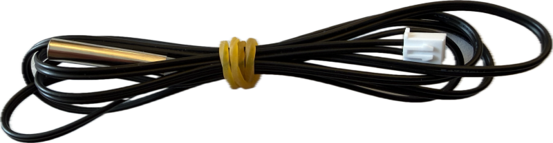
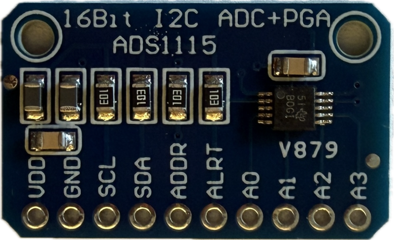
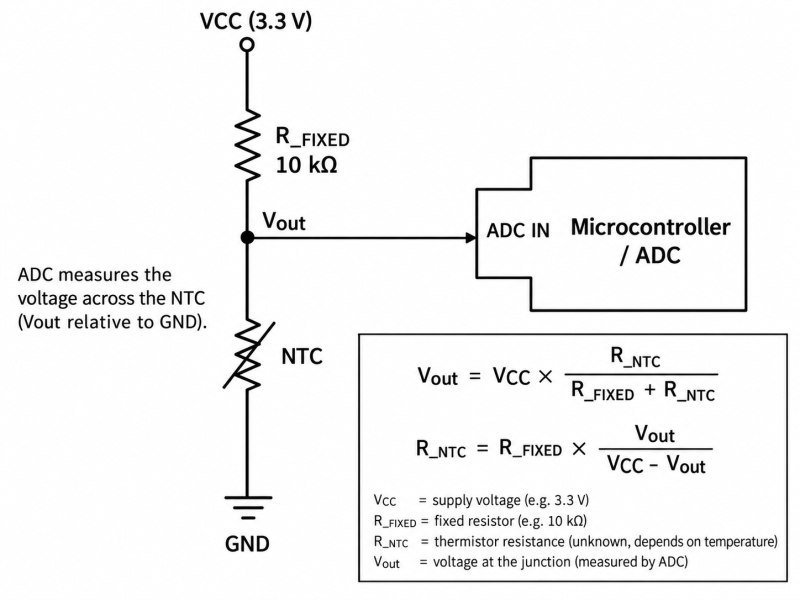
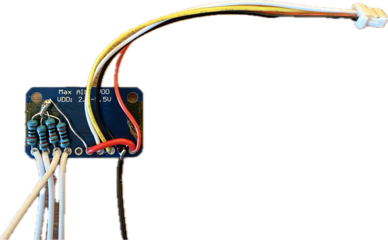

 
# NTC

> Using NTC Temperature Sensors For Monitoring Batteries and Devices

NTC (**Negative Temperature Coefficient**) thermistors are resistive temperature sensors whose resistance decreases as temperature rises.

PTC (**Positive Temperature Coefficient**) thermistors also change resistance with temperature, but in the opposite direction: Resistance **increases** with rising temperature. Some PTC types have a strongly nonlinear characteristic and are primarily used for protection rather than precise temperature measurement.

## Overview

NTCs are inexpensive, compact, and very sensitive, making them well suited for temperature monitoring, protection, and control applications.

Temperature is typically determined by measuring the thermistor resistance in a voltage divider and converting resistance to temperature. For MCU-based measurements, this requires an **analog-to-digital converter** (ADC). Most MCUs have one ADC with one or more input channels built-in, and there are affordable external ADCs like the **ADS1115**.

A voltage divider and ADC are not fundamentally required for every NTC application. For example, an NTC can also be connected to a comparator when only a temperature threshold needs to be detected.

### Accuracy

NTCs are nonlinear, and inexpensive generic sensors may have relatively large absolute tolerances. Precision NTCs, however, can provide excellent accuracy, especially when calibrated.

Temperature can be calculated using the sensor's Beta value, Steinhart–Hart coefficients, or preferably a manufacturer-provided resistance-temperature table when available. Accuracy also depends on the NTC tolerance, fixed resistor, ADC accuracy, thermal coupling, and calibration.

### NTC Types

When looking for a NTC, you should look at three key properties:

* **Beta Value:**

  Each NTC has a specific **Beta value** (for example **B3950**), which describes the slope of its resistance-temperature characteristic between two specified temperatures. A higher Beta value generally produces a steeper resistance change and therefore greater sensitivity over a given temperature range.

  The Beta value should not be interpreted as defining a particular operating temperature range. Instead, consider the complete resistance-temperature curve and choose a sensor that provides useful resistance changes in the temperature range you want to measure.

  For example, **B3435** is a common general-purpose choice, while **B4250** can provide a comparatively steep resistance-temperature curve and good sensitivity when monitoring higher temperatures, such as lithium cells in the **40–70 °C** range.

  The Beta value alone does not determine accuracy; thermistor tolerance, nominal resistance, the fixed resistor, ADC accuracy, calibration, and the mathematical conversion method also matter.

* **Nominal resistance:**

  NTCs have a nominal resistance, usually specified at **25 °C**. **10K** and **100K** are among the most common values. Together with the fixed resistor and supply voltage, this resistance determines the current flowing through the sensor.

  For most DIY projects, **10K** is a good default choice. It provides a relatively low source impedance, making the circuit less susceptible to electrical noise, ADC input leakage, and other imperfections, while still keeping current and self-heating low.

  **100K** NTCs reduce current consumption and self-heating further, which can be useful in battery-powered or very low-power devices. The higher impedance, however, makes the measurement more sensitive to noise, leakage currents, long wires, and ADC input characteristics.

  Measurement current causes some self-heating of the NTC. Excessive current can therefore make the sensor report a temperature slightly above that of the object being measured. For ordinary 10K and 100K voltage-divider circuits operated from typical MCU supply voltages, this effect is usually small, but it should be considered when high accuracy is required.

* **Housing:**

  NTCs are available both as **bare sensors** and enclosed in protective housings, for example waterproof stainless-steel probes.

  

  Any housing adds thermal mass and usually reduces thermal response speed, sometimes substantially. The thicker and heavier the housing, and the poorer its thermal contact with the measured object, the slower the sensor reacts.

  Encapsulated probes may therefore take **several seconds to minutes** to approach a new temperature, while small bare NTCs can react within **fractions of a second to a few seconds**. 
  
  For rapidly changing temperatures, use the smallest sensor with good thermal contact; use housed probes when mechanical protection, electrical insulation, or waterproofing is more important.

  
  

> [!TIP]
> Good thermal contact is particularly important when monitoring batteries, heatsinks, MOSFETs, or other components. A poorly attached sensor may respond much more slowly than the component itself, even if the electrical measurement is very accurate.

## How to use

NTCs are straight-forward to use but do require a few extra components:

### Clever: Use ADS1115 ADC
Most MCUs come with a built-in ADC, but it may be much simpler to use an affordable external ADC like *ADS1115*:

* works with any MCU
* supports up to four temperature probes
* does not require any additional GPIO (in addition to its I2C interface)

Here is a simple example using an *ADS1115* with the fixed-value resistors that connects to any MCU via I2C Interface (note the *QWIIC/JST 1.0* connector used here, visible on the top right). 

The four white wires on the bottom left go to four NTC probes, and the other end of the probe is connected to **GND**.

> [!TIP]
> Ironically, the internal precision voltage reference in an *ADS1115* is making this setup vulnerable to fluctuations in *VDD* because changes in the divider supply voltage do affect the measured result in the fixed-resistor part of the divider. Make sure you use a reasonably stable supply voltage. With an ADC built into your MCU, both the voltage divider and the ADC use VDD, so fluctuations cancel themselves out.

### Polarity

Electrically, you could place the NTC on either side of the voltage divider. For practical designs, however, always connect the NTC to **GND** and the fixed resistor to **VCC**:

If the NTC were connected to **VCC**, one conductor of the probe cable would carry the supply voltage directly. If that wire were damaged or touched a grounded chassis, shield, PCB ground, or another ground reference, it could create a **hard short-circuit of the VCC rail**.

This arrangement also makes sensor faults easy to detect in software: a disconnected or broken probe causes the ADC voltage to rise close to **VCC**, while a shorted probe produces a voltage close to **GND**.

### Voltage Divider

Since NTCs behave like resistors, in order to "read" them, you determine their resistance. This is typically done using a voltage divider.

#### Fixed Resistor Value

Each NTC has a nominal resistance, i.e. **10K** or **100K**. A fixed resistor with the same value as the nominal NTC resistance is a good general-purpose choice when measurements are centered around **25 °C**. 

#### Improving Resolution
If you are primarily interested in a specific temperature range, better ADC sensitivity can be obtained by choosing the fixed resistor approximately equal to the NTC resistance near the middle of that range. 

For example, a **10K** NTC may have a resistance of only around **3K** near **55 °C**, depending on its Beta value. For a dedicated **40–70 °C** monitor, a fixed resistor around **2.7–3.3K** can therefore make better use of the ADC range than a 10K resistor.

### ADC (Analog-to-Digital Converter)

To measure the NTC resistance, use an **ADC** and measure the voltage across the NTC. With the fixed resistor connected to VCC and the NTC connected to GND, calculate the NTC resistance as:

*R_NTC = R_FIXED × Vout / (VCC - Vout)*

The resistance can then be converted to temperature using the Beta equation:

*T = 1 / (1/T0 + ln(R_NTC/R0)/B)*

| Symbol | Description |
| --- | --- |
| T | **Output:** Calculated NTC result (temperature in Kelvin) |
| R0 | NTC resistance at the reference temperature T0, typically the nominal resistance, i.e. *10 kΩ* at *25 °C* |
| T0 | Reference temperature in Kelvin at which R0 is specified, typically *298.15 K* (*25 °C*) |
| B | NTC Beta value in Kelvin, i.e. *3950 K* for a *B3950* thermistor |
| R_NTC | **Input:** Measured or calculated resistance of the NTC at the unknown temperature *T* |
| ln | Natural logarithm |

For greater accuracy, in your calculation, use manufacturer-provided resistance-temperature tables or Steinhart–Hart coefficients instead of relying solely on the Beta equation.

## Beta Value (B-Value)

The **B value (Beta value)** describes the slope of the resistance-temperature characteristic of an NTC between two specified temperatures. Common NTCs typically have B values between about **3300 K and 4500 K**, with **B3435** and **B3950** being especially widespread.

* A higher B value generally gives a steeper resistance change with temperature and therefore greater sensitivity, but does not by itself mean better accuracy.

* Always note the specified temperature interval, such as **B25/50** or **B25/85**, because the Beta value is not perfectly constant over the entire temperature range.

| B value | Characteristics | Use cases |
|---|---|---|
| **B3380–3435** | Moderate resistance change with temperature; very common in general-purpose thermistors | General-purpose temperature measurement, environmental sensing, HVAC, battery monitoring |
| **B3950–3980** | Steeper response than B3435; extremely common and inexpensive | General electronics, 3D printers, battery packs, heatsinks, fan control; good all-round choice |
| **B4100–4200** | Comparatively steep resistance-temperature curve | Applications where greater resistance change per degree is useful, including thermal monitoring and protection |
| **B4250** | Steep resistance-temperature curve and high sensitivity | Useful where comparatively high sensitivity is desired, including battery, power electronics, MOSFET, and heatsink monitoring around **40–70 °C** |
| **B4400–4500** | Very steep resistance change; resistance becomes comparatively low at elevated temperatures | Applications emphasizing high sensitivity; divider resistor and ADC range should be selected carefully for the intended temperature range |

> Tags: Thermistor, NTC, PTC, NTC, Beta value, B-Value, B value, B3950, B3435, B4250, 10K NTC, 100K NTC, voltage divider, ADS1115, Steinhart-Hart, Temperature

[Visit Page on Website](https://done.land/components/data/sensor/temperature/ntc?640974091310265957) - created 2026-09-09 - last edited 2026-09-09
